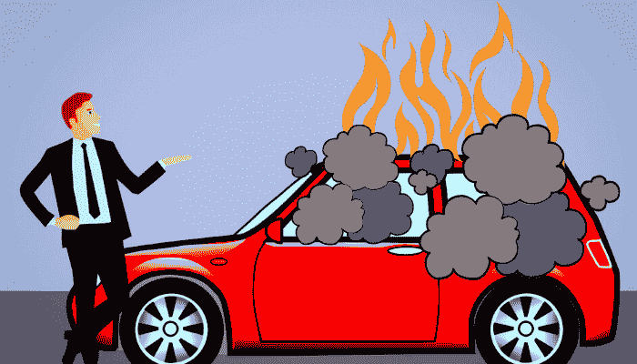
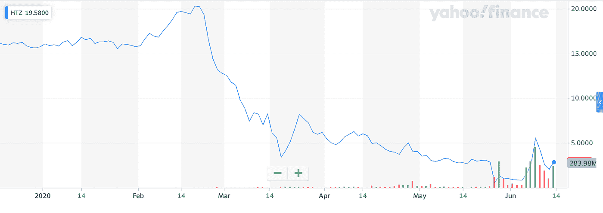
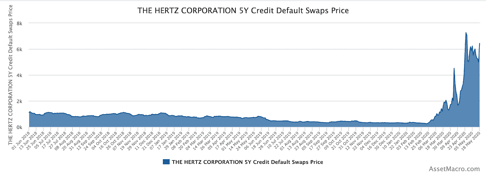

# 罗宾汉零售交易商受到了欺骗

> 原文：<https://medium.datadriveninvestor.com/robinhood-retail-traders-are-getting-shafted-29bab6887f0c?source=collection_archive---------7----------------------->

## 破产的公司…讽刺的赫兹。

A fire sale!

5 月 22 日，美国历史最悠久的汽车租赁公司之一赫兹[申请破产](https://www.zerohedge.com/markets/hertz-wins-court-approval-sell-worthless-stock-worlds-first-initial-bankruptcy-offering)。公司解雇了 16000 名员工，而首席执行官[用他的金色降落伞赚了 900 多万美元。](https://www.forbes.com/sites/jackkelly/2020/05/23/hertz-files-for-bankruptcy-after-16000-employees-were-let-go-and-ceo-made-over-9-million/#70585f372bca)

成立于 100 多年前的[1918 年](https://en.wikipedia.org/wiki/The_Hertz_Corporation)，赫兹是汽车租赁行业的主力，享有与[企业](https://www.businessinsider.com/hertz-bankruptcy-enterprise-amiable-jock-hiring-strategy-endures-2020-5)等公司同等的市场份额。然而，这家现已倒闭的汽车租赁公司在破产后发生了一系列离奇的事件，这个故事是无可匹敌的。

在宣布破产后，赫兹的股价飙升了 1400%，这种波动与健康市场的预期完全相反。破产公司通常会经历一个所谓的“[第 11 章](https://www.uscourts.gov/services-forms/bankruptcy/bankruptcy-basics/chapter-11-bankruptcy-basics)或“[第 7 章](https://www.uscourts.gov/services-forms/bankruptcy/bankruptcy-basics/chapter-7-bankruptcy-basics)”的过程，在此过程中，它们会发放一笔[债务人持有](https://www.investopedia.com/terms/d/debtorinpossessionfinancing.asp)贷款，这被视为*优先债务*。在有问题的公司用他们剩余的资本和资产偿还优先债务后，公司必须解决次级债务。最后，公司向所有股权(股票)股东支付清偿优先债务和次级债务后的剩余部分。

 [## 现金为王，比我们想象的更强大|数据驱动的投资者

### 2020 年 3 月 12 日，在川普总统宣布新冠肺炎进入国家紧急状态的前夕，纽约时报报道…

www.datadriveninvestor.com](https://www.datadriveninvestor.com/2020/03/26/cash-is-king-more-potent-than-we-think/) 

在这一点上，赫兹的股票实际上一文不值。这一现实对于理解该公司宣布破产后股价上涨 1400%的荒谬性至关重要。

# 首席执行官的黄金降落伞

赫兹在全球疫情中解雇了 16，000 名员工，这对罗宾汉平台上近 [160，000 名自豪的赫兹股票所有者](https://thenextweb.com/hardfork/2020/06/12/hertz-robinhood-bankrupt-pump-dump-shares-chapter-11-day-trading-billion/)来说应该是一个燃烧的红旗。这个数字比一个月前的 4 万人有所增加。散户交易者和经验丰富的机构专业人士(习惯于破产周期)之间的这种脱节从未如此严重。

赫兹不仅希望从股价飙升中获利，还希望尽公司所能继续从这场灾难中获利。赫兹试图通过从散户那里榨取利润来筹集超过 10 亿美元的资金。该公司的行为至少在理论上应该是公然违反道德的。法院和政府监管机构，如证券交易委员会，应该全力介入。然而，这一众所周知的首次破产发行(IBO)已经被特拉华州法官[正式批准](https://www.zerohedge.com/markets/hertz-wins-court-approval-sell-worthless-stock-worlds-first-initial-bankruptcy-offering)。

法官 Mary Walrath 裁定 Hertz 可以继续发行股票。如果该银行能够找到足够多的个人来完成购买订单，该公司将获得这笔交易的 3%。在散户投资者极度非理性繁荣的时期，一家公司向根本没有资格购买股票的个人出售根本无用的股票，这是前所未有的。

Retail traders pushing up the premium on worthless Hertz stock; Source: Yahoo! Finance

硬币的另一面是经验丰富的机构投资者，他们熟悉信用违约掉期等复杂工具。信用违约掉期是一种对冲债券发行人违约可能性的工具。例如，如果一个人购买了 Hertz 的五年期债券，购买者将获得定期利息支付。在五年期限结束时，购买者将收回本金。赫兹发行这种债券是基于这样一种假设，即在到期日，公司将有足够的资本偿还本金，外加定期支付的利息。

信用违约互换是债券的一种保险。如果 Hertz 违约(事实如此)，信用违约互换发行人将代替 Hertz 向债券持有人支付本金。在下面的图表中，你可以看到，在 2 月份，赫兹的信用违约掉期保持相对平稳。然后从 2 月 26 日左右开始，到 3 月，信用违约掉期飙升，直到该公司不可避免的违约。这些数据表明，持有更多优先债务的个人是如何明智地对冲潜在违约风险的。

相比之下，散户投资者等到宣布破产后才开始买入最低级的债券——股票。阿波罗全球管理公司，一家为投资者管理资金的公司，在赫兹破产前获得了过多的信用违约掉期，这相当于对冲了他们的赌注，甚至可能从中获得了巨大的利润。

如上所述，这表明了机构投资者心态与他们理解这些通常复杂的金融工具的能力和散户投资者之间的鲜明对比。后者不顾违约的消息和随后股价的暴跌，一窝蜂地哄抬股价。这绝不是一笔“逢低买入”的交易，这种暴跌是在赫兹的基本面消息非常负面的背景下发生的。这种脱节不是一个健康市场的迹象，它证明了央行干预全球股市的巴甫洛夫效应。时间会告诉这一离奇场景的结果，但有一点是肯定的——这为未来违约的公司打开了潘多拉的盒子。

暂时如此。

我们最初发表了这篇关于 heavyzen.co 的文章。想看更多这样的内容？查看 [*数据驱动型投资人*](https://www.datadriveninvestor.com/) *。*

**访问专家视图—** [**订阅 DDI 英特尔**](https://datadriveninvestor.com/ddi-intel)