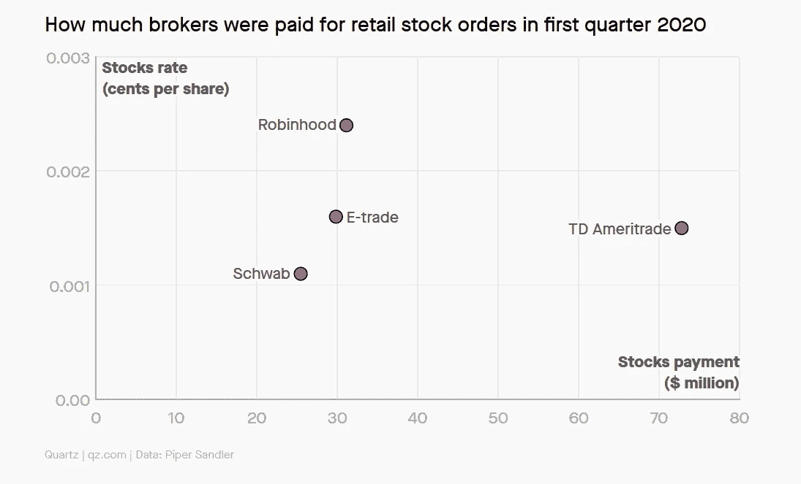
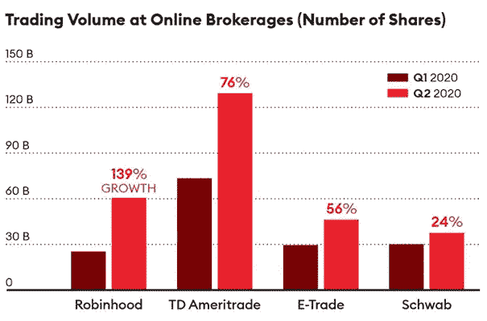
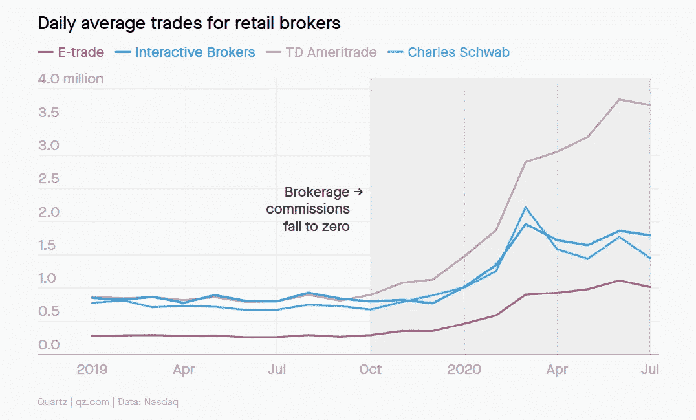

# Robinhood 出售客户的订单。那又怎样？

> 原文：<https://medium.datadriveninvestor.com/robinhood-sells-its-clients-orders-so-what-3d1d3fdf1fee?source=collection_archive---------13----------------------->

*Photo by* [*Steve Harvey*](https://unsplash.com/@trommelkopf?utm_source=unsplash&utm_medium=referral&utm_content=creditCopyText) *on* [*Unsplash*](https://unsplash.com/?utm_source=unsplash&utm_medium=referral&utm_content=creditCopyText)

当我喝着早晨的咖啡浏览新闻时，我注意到 70%左右的推荐文章是关于罗宾汉及其创纪录的收入。我决定浏览其中一些。我读得越多，就越对来自《福布斯》和其他所谓顶级出版物的文章感到困惑。

> ***“罗宾汉正在向做市商出售其用户的订单……”***
> 
> *“罗宾汉一点也没有让金融民主化…”*
> 
> *“罗宾汉是一个矛盾修饰法，而不是一个慈善团体…”*
> 
> *“他们在某些方面与敌人同床共枕……”*
> 
> ***“罗宾汉向全世界推销了一个帮助小人物的故事，这与其实际的商业模式正好相反……”***
> 
> “罗宾汉正在把这个小家伙卖给富有的市场经营者，他们非常精明。”

说真的，只有那些不熟悉当今金融市场基础设施的人才会觉得这令人不安。然而，如果你也是其中一员，并对这样的陈述感到十分惊讶，这并不完全是你的错。我们应该责备那些刚刚有了“发现”的记者关于一件已经知道了十多年的事情，今天却以如此耸人听闻的方式提出来。

称之为操纵系统或随便你怎么想，但事实是这就是如今经纪公司的运作方式。Robinhood 也不例外，也没什么不好。

让我问你一个问题。如果 Robinhood 给你带来免佣金的投资，你认为它是如何赚钱的？根据上面的引用，他们不是慈善机构。

有句话说，如果你不为产品付费，你就是产品。这也适用于这里，但这有关系吗？答案是否定的，原因如下…

# **一家经纪公司向做市商出售订单——让我大吃一惊！**

今天的金融市场基础设施是分层的。简而言之——有中间商和做市商在争夺你的订单数据。他们这样做是因为他们有复杂的硬件和软件基础设施(配置、高处理算法等。)允许他们发现并获得最佳的执行价格。有时甚至设计他们自己的 NBBO。

所以，你为你的订单所支付的，最终并不是执行的价格。自 2008 年金融危机爆发前，HFT 企业处于上升期以来，情况一直如此。

《福布斯》发表了一篇相当广泛的文章，标题为“ [*”罗宾汉的亿万富翁创始人、期权小子牛仔和以他们为食的华尔街大鳄*](https://www.forbes.com/sites/jeffkauflin/2020/08/19/the-inside-story-of-robinhoods-billionaire-founders-option-kid-cowboys-and-the-wall-street-sharks-that-feed-on-them/?fbclid=IwAR1tl9-IVLYV1cZBG_t2JygDuc4QZAjD1rkKG1twiKA530TOTLk5hkFrVt0#1866d18268dc) *的内幕。*“事实是，我从来没有幻想过他们的新闻质量，这篇文章也没有帮助。作者将 Robinhood 称为“数字赌场”，因为他们正在向华尔街“鲨鱼”出售用户的交易数据。

欢迎来到 21 世纪！你认为折扣经纪公司不会这么做吗？每个人都这样做，而且已经这样做了很多年。

查尔斯·施瓦布。

忠诚。

TD Ameritrade。

电子贸易。

你说吧。

这是一个市场漏洞，行业领先的公司已经利用了多年。罚款，诉讼，什么都没有改变。每个人都意识到了这一点，它仍然存在。

 [## 如何在不牺牲孩子或财务的情况下安全理智地离婚|数据驱动…

### 在美国，七月是以孩子为中心的离婚月。作为 cdfaⓡ的专业人士，我可以向你保证，从长远来看…

www.datadriveninvestor.com](https://www.datadriveninvestor.com/2020/07/28/how-to-divorce-safely-and-sanely-without-sacrificing-your-children-or-your-finances/) 

主要区别在于，根据一些估计，罗宾汉获利最多。以下是 QZ 对订单流销售收入规模的相对评估:

如果你想了解细节，找出问题的程度以及每个经纪公司如何从中受益，看看他们的 [606 文件](https://www.sec.gov/tm/faq-rule-606-regulation-nms)。这应该能让我们正确看待事情。

# 他们为什么要这么做？

简单的回答是因为他们可以，因为每个人都可以。

Robinhood 瞄准千禧一代和“忙碌”的时尚投资者有几个原因:

*   他们是进步的，不断寻找赚钱的方法。交易是一种流行的方式；
*   他们中的大多数人能够负担得起留出一部分薪水进行投资；
*   他们愿意利用父母无法获得的零股投资。

事实上，与一些记者类似，他们也缺乏市场机制如何真正运作的知识，这只是一个额外的好处。

在一个科技股飙升、比特币暴涨、大麻股崭露头角的世界里，FOMO 比以往任何时候都大。年轻人不想落在后面，他们的目标是拥抱股市上涨。

让我们面对现实吧。今天的交易不是以前只有大公司才能玩的复杂游戏。这是一种时尚，甚至对那些账户上只有几块钱的人来说也很容易获得。

罗宾汉是创造这一势头的一个重要原因，现在正当地利用这一势头。

一些人对该公司试图使金融民主化的虚伪声明感到恼火。理应如此。然而，尽管如此，我们可以说民主化更多的是让普通人获得无佣金投资。

当其他人收取 10 美元的交易费时，罗宾汉收取 0 美元。其他人有最低余额要求，罗宾汉没有。

事实上，该公司是 E-Trade、Schwab 和 TD Ameritrade 等低成本经纪公司开始提供免佣金投资的部分原因。这就是为什么它说它使交易领域变得公平。所以，不完全是该死的恶棍，是吗？

# 你能做什么？

问题是，你永远不知道你的订单在哪里、如何执行，也不知道它们是否卖给了任何人。你可以检查他们的文件，或者从你的经纪服务提供商那里获得这些信息，但不清楚这些信息的可靠性或结论性如何。

一家公司因误导投资者而受到处罚的事情并不是没有发生过。但最后，这只是罚款，他们有世界上所有的钱来支付。

所以，在这种情况下，你基本上有两个选择。

*   **选项 1** —通过免费服务提供商(即 Robinhood)进行交易，并将您的订单出售给做市商；
*   **选择 2**——支付佣金，并希望你的订单不会卖给做市商。

如果你认为游戏有缺陷，那是因为你是对的。但这就是当今市场的运作方式，对此你无能为力。老实说，这并不太痛苦。

最后，如果你是一个散户投资者，你很可能没有规模化交易。在这种情况下，你不应该担心你所购买的价值 100 美元的 TSLA 股票是否能获得一美分的更好价格。

然而，如果你是大规模投资者，事情就不一样了。

# 太阳底下没有新东西，但为什么现在才提出来呢？

现在越来越多的人开始深入挖掘，并奇迹般地发现事物在实践中是如何工作的，原因是罗宾汉正在吃掉一大块市场份额。

据《纽约时报》报道，在 2020 年的 Q1，普通客户账户中的每一美元，罗宾汉用户交易的股票是电子交易客户的 9 倍，是查尔斯·施瓦布客户的 40 倍。

成立 7 年来，Robinhood 的客户数量相当于嘉信理财近 50 年来吸引的客户数量，是 E-Trade 的两倍。

该公司标志着最大的增长，几乎是 TD Ameritrade 的两倍。

Source: Piper Sandler

以下是 QZ 对一些领先的零售经纪公司的日均交易量的估计。

你看不到罗宾汉，因为它的日均交易量为 430 万笔，高于所有其他公司。

我和罗宾汉没有任何关系。我甚至不用这个应用程序。然而，像许多记者在过去几周所做的那样发表声明是无知的，因为这已经是一个多年的问题了。生活在坑交易时代，不是谁的错。黄领带过时了，这种认识也过时了。

罗宾汉把自己描绘成为普通人的利益而战的反叛力量。从某种程度上来说，这是真的。该应用程序为您带来免费投资。这足以让年轻一代和正在崛起的一代中的大部分人接受它——这些人是几年前占领华尔街运动的核心。他们厌倦了银行“抢劫”他们，认为他们是“反对派”。罗宾汉是这一理念的缩影。它为投资者带来了一种独立的方式。至少是这么认为的。

> 事实是，如果你真的了解市场，你会知道交易时没有办法完全独立。你不可能得到最好的执行价格。但是谁在乎呢，当你可以在手机上交易的时候？

# **不会游泳就不要下水**

围绕这一切，另一个反对 Robinhood 的论点也被提出来——声称该应用程序促进了缺乏经验的用户之间的交易，这使他们赔钱。理由是该应用的游戏化原则、期权交易功能、微妙的信息、容忍活跃交易等。

批评家指出这些因素是新手投资者在罗宾汉身上赔钱的一个重要原因。他们的依据是大量用户报告称，他们在损失金钱之前并不知道他们将面临什么。

各种行业专业人士也支持这些指控。然而，你很少会看到理财顾问和理财经理批评商场里的欺诈促销。那是因为这与他们的业务无关。然而，一提到罗宾汉，金融顾问们就赶紧[宣布](https://www.cnbc.com/2020/08/21/robinhood-is-having-a-moment-users-should-be-careful.html)这是“赌博”这是可以理解的——这将逐步淘汰他们，或者至少迫使他们升级游戏。

平心而论，这一切听起来毫无意义。据 Robinhood 称，其用户的平均年龄为 31 岁，半数客户之前从未投资过。在那个年龄，你应该已经获得了适当的教育或建立了推理技能，帮助你理解交易是个人的责任。你不能责怪掉落的纸屑或充满表情符号的推送通知是你失去金钱交易选项的唯一原因。

> 在学会开车之前，你不会去买车。“对不起，撞了那个标志，警官！我不知道这东西只有在你踩下刹车时才会停下来。

最后，没有一个理性的人会因为一个设计精美的“交易选项”按钮或一个推送通知而拿辛苦赚来的钱冒险，对吗？

# **底线**

罗宾汉咄咄逼人的做法众所周知。2019 年，该公司被 FINRA 的[罚款。另一项可能高达 1020 万美元罚款的调查正在进行](https://www.finra.org/media-center/newsreleases/2019/finra-fines-robinhood-financial-llc-125-million-best-execution)[。](/Others argue that trading is cheaper than it has ever been, and say customers are getting better deals.)

虽然一些记者和分析师喜欢躲在借口和耸人听闻的标题后面，但其他人诚实地承认他们的罗宾汉焦虑。富达 2300 亿美元的明星经理威尔·丹诺夫[承认](https://www.bloomberg.com/news/articles/2020-09-17/even-fidelity-s-230-billion-star-danoff-has-robinhood-anxiety)尽管他的基金今年上涨了 21.0%，但他看到资金正在流出。根据丹诺夫的说法，原因在于人口结构的变化。

> “这是一个人口统计问题——我们需要吸引 Z 世代和年轻一代，幸运的是，我认为我们的应用程序非常好。但你知道，一个典型的 Z-er 一代可能不会对拥有一只共同基金感兴趣。
> 
> ——威尔·丹诺夫，富达康特拉基金副总裁兼投资组合经理

因此，如果罗宾汉在某种程度上迫使这些大公司做出改变，更好地为客户服务，那么就该表扬就表扬。

尽管存在缺陷，但事实是罗宾汉是如今交易比以往任何时候都便宜的主要原因。该公司有一个瞄准新一代并迎合其需求的战略，这就是它获得回报的原因。本文发表前几天，Robinhood 在最近一轮融资中完成了另一笔 6 . 6 亿美元的交易，估值达到 117 亿美元。

我们经常很快宣布一些事情是好是坏。然而，有时真相介于两者之间。

哦，虽然很诱人，但不要相信你应用程序上的大按钮让你在选项上全押的廉价借口。它坐得不对。

*本文不构成投资建议。这是仅供参考的一般信息。在任何司法管辖区内，它并不被视为对任何特定投资服务、产品、策略、计划、功能或其他目的的建议或推荐。*

## 访问专家视图— [订阅 DDI 英特尔](https://datadriveninvestor.com/ddi-intel)