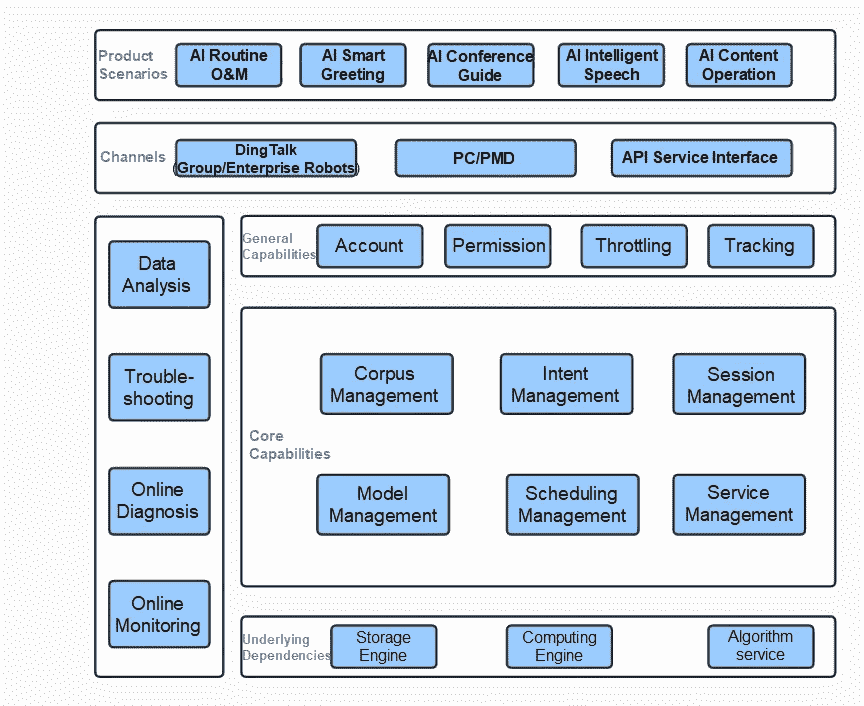
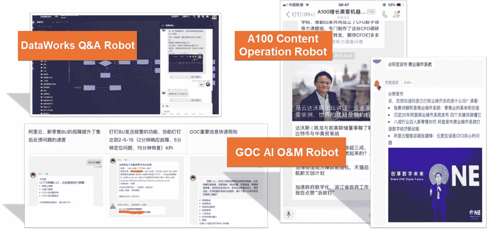
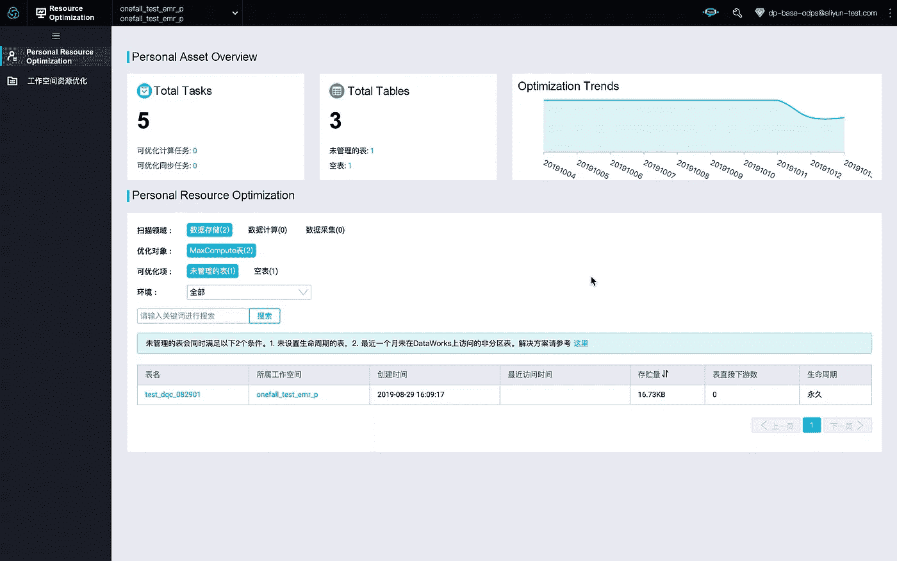

# 机器人工厂:用智能聊天机器人对抗冠状病毒和其他现实生活中的挑战

> 原文：<https://medium.datadriveninvestor.com/robot-factory-fighting-coronavirus-and-other-real-life-challenges-with-intelligent-chatbots-30a83e75b38a?source=collection_archive---------19----------------------->

为了应对疫情国家患者的激增，中国一线的临床医生为医疗保健提供者制定了一本抗击新冠肺炎的治疗方案手册。今天就访问 https://covid-19.alibabacloud.com/**获取您的副本吧！**

**作者崔亮(真水)**

*In the face of the sudden outbreak of the novel coronavirus in 2020, the 1.4 billion people of China are coming together to weather this difficult time. Alibaba knows that it must do its part. We are putting our advanced technology at the service of public health and safety. In DingTalk Groups, many people have interacted with the “Epidemic Prevention Elf” (防疫精灵), which provides important news from across the country in real time. It can answer various questions you may have, providing epidemic prevention knowledge, online consultations, information on confirmed cases near your community, and the location of clinics. Even more impressive, the Epidemic Prevention Elf robot went from an idea to operation on DingTalk in a single afternoon. It has already served at least 5 million DingTalk users. Our Robot Factory is what allowed us to achieve this seemingly impossible task. Robot Factory is a powerful incubation platform for intelligent chatbots. Its sophisticated natural language processing (NLP) algorithms and powerful Q&A capabilities make everything possible.*

# *什么是机器人工厂？*

*2016 年，世界进入聊天机器人时代，许多科技巨头发布了自己的聊天机器人产品，如苹果 Siri、微软萧冰、百度小度、阿里巴巴天猫精灵。聊天机器人的出现改变了人类与计算机的互动方式。从以计算机为中心的有序操作指令，我们现在已经采用了基于自然语言对话式人工智能的以用户为中心的方法。*

*机器人工厂是智能聊天机器人的孵化平台，它是对话式人工智能趋势的一部分。有了机器人工厂，任何人都可以在一分钟内构建一个专用的聊天机器人，而不必关心 NLP 技术的细节和编程问题。*

*下图是机器人工厂的整体架构。以下章节将详细描述机器人工厂的应用场景和核心能力。*

**

# *产品应用场景*

*机器人工厂主要有三个应用场景:问答、运营、O&M。*

# *AI +智能问答*

*问答是三种场景中最常见的。消费者总是会问很多关于商家产品的常见的、重复的问题，员工对自己公司的规章制度也是如此。在这种情况下，常见问题被提取并分类成问答对，然后由机器人工厂平台收集。然后，你可以设计一个问答机器人来帮助回答大部分问题，省时省力的同时降低人力成本。比如机器人工厂为 [Apsara 会议](https://www.alibabacloud.com/apsara-conference-2019?spm=a2c41.14175191.0.0)提供了一个会议引导机器人。*

* [## AI 将军是否已经超过了人类的智力容量？数据驱动的投资者

### 不仅在游戏中，而且在劳动力市场上，机器都比人类聪明。在今天的许多领域，使用…

www.datadriveninvestor.com](https://www.datadriveninvestor.com/2020/02/12/has-general-ai-exceeded-the-intellectual-capacity-of-humans/) 

# AI +内容场景

在操作场景中，机器人主要用于快速、精确地向所有用户发送消息。比如你跑了 100 个来自世界各地的业务群，你可以通过在机器人工厂设置相关消息内容和发送时间，及时与他们沟通。这消除了执行 100 次重复操作的需要，这是低效和耗时的。

# AI +套路 O&M

在 O&M 的场景中，机器人不仅能回答问题，还能执行命令。比如你在阿里云上购买了一台服务器，运行了一些任务。然后，你可以让机器人帮你查询任务的进度，检测异常，终止异常任务。O&M 过程如下:用户提问>机器人接收并理解命令>机器人调用服务(执行命令) >机器人向用户返回响应。

机器人还有很多其他可能的使用案例。例如，通过集成语音转文本技术，阿里云通信和菜鸟邮政共同开发了一款智能问候机器人。机器人可以用来管理问卷、回电话、在派遣现场服务人员时确认消费者是否在家，以及执行许多其他任务。通过使用机器人，公司每天可以比以前打更多的电话。

# 核心能力

现在，我想让你更多地了解机器人工厂能做什么。以下部分描述了 Robot Factory 的核心功能以及如何利用这些功能。

# 智能问答

智能对话机器人提供问答服务。这样的场景涉及两个概念:意图和实体。意图由用户输入、动作和响应组成。用户输入定义了用户的问题，响应定义了相应的答案。该动作是一个可选步骤，并根据机器人对用户意图的理解，定义了需要执行的一系列命令。实体从用户输入中提取结构化信息，有效地解决了大量相似意图匹配场景所带来的问题。例如，假设一个用户问“2020 年 3 月 8 日杭州天气如何？”在这种情况下，“杭州”可以提取为枚举实体，“2020 年 3 月 8 日”可以提取为常规实体。这个动作可以定义为调用一个服务来查询城市和时间的天气。最后，响应返回天气信息。

前面的例子反映了问答机器人在执行动作之前必须首先准确理解用户的意图。机器人工厂底层提供了完整的算法框架。在这个框架中，传统的机器学习算法与基于深度神经网络的 NLP 算法相结合。此外，该框架将离线特征提取模型的训练与在线实时预测相结合。为了提高意图匹配的准确性，该系统结合了基于纯文本的 FAQ 意图匹配和基于实体槽的意图匹配。这里我们就不详细探讨这个话题了。相反，它将在后面的一篇专门文章中详细介绍。

# 语料库管理

在某种程度上，聊天机器人的智能取决于它所理解的语料库的丰富程度。然而，大多数知识是在非结构化文本中积累的，而不是聊天机器人可以理解的问答格式。因此，我们需要找到一种方法，为新的聊天机器人快速建立一个具有智能问答功能的语料库。机器人工厂提供三种方法解决冷启动问题。对于单个机器人应用程序，可以通过语料库爬行(自动)、批量导入(手动)和预设意图(公共系统语料库)来丰富语料库。此外，可以在多个应用程序之间共享语料库(通过应用程序组装)。

## 语料库抓取

通过机器阅读和理解能力，语料库爬行自动从您现有的非结构化知识库或文档中提取信息，并将其转换为聊天机器人可以理解的问答对。语料库抓取不仅可以代替人工输入来快速丰富聊天机器人的语料库，还可以大大降低知识库与机器人工厂接口的迁移成本。目前机器人工厂平台上 80%的语料库都是通过语料库抓取产生的。也可以手动导入多个 Excel 或 JSON 格式的语料库文件，自动生成意图信息。

## 预设意图

预设意图功能允许机器人工厂将高频和常见场景下沉到平台层面，为平台上的所有机器人应用赋能，增强其问答能力。这里常见的场景有聊天、天气查询、考勤查询。然后，你只需要在平台上启用某些选项，让你的聊天机器人有能力回答这些问题。

## 语料库共享

语料库共享功能允许不同的聊天机器人重用语料库。比如银泰零售所有的会员手册都是一致的，但是不同的子公司门店有不同的促销活动。机器人工厂允许您基于通用语料库创建一个机器人，机器人 A，并基于不同的语料库创建其他机器人。然而，所有机器人都将共享机器人 a 的语料库。语料库共享提高了你的语料库的可重用性，允许你更专注于不同场景的区分。

# 在线编程

如前所述，意图由三部分组成:用户输入、动作和响应。动作定义了机器人理解用户意图后要执行的一系列命令。通常，该操作通过 HTTP 请求调用用户定义的服务。但是，用户经常会遇到以下问题:

1.  如果您已经有服务接口，您可能无法适应它们的格式，因为 Robot Factory 的特殊处理逻辑与服务逻辑紧密耦合。
2.  如果没有任何服务接口，就需要开发、部署、调试、发布一系列流程。这可能涉及机器、网络和环境方面的问题。而且，如果在线验证失败，还需要重复流程。
3.  在这种情况下，添加一些对时间敏感的临时函数会影响整个系统。

为了解决这些问题，机器人工厂与阿里云数据工厂的在线开发工具 App Studio 合作，开发了基于 App Studio 的在线服务开发集成开发环境(IDE)。这为用户提供了一个基于云的在线编程平台，帮助你连接下游服务，实现数据查询、命令执行、知识库搜索、内容推荐等功能。该平台为您提供了以下优势:

1.  灵活性:该平台支持在线编程、业务逻辑定制、安全性验证和其他功能，并且与业务系统本身是分离的。
2.  开放性:可以引入所需的 SDK 来支持 MaxCompute 和高速服务框架(HSF)等服务。
3.  简单性:内置的基本类和 API 有助于开发。
4.  及时性:该平台不依赖于任何发布系统，因此更改会实时生效。
5.  共享:平台支持协同编码和代码共享。
6.  调试:平台支持在线调试、服务测试等功能。

# 未来就在现在

经过阿里巴巴集团内部两年的发展和完善，机器人工厂已经孵化了超过 10，000 个机器人，服务了超过 440，000 个用户。连续两年参加 Apsara 大会，感受到了用户对智能机器人的强烈需求。所以，2020 年，我们正式发布了阿里云机器人工厂。如果你想定制一个聊天机器人来降低人力成本，提高工作效率，联系我们。

最后，我们为 DataWorks 准备了机器人工厂打造的一键问答机器人演示。更多信息，敬请关注即将发布的关于机器人工厂的文章。

在继续与全球爆发的疾病进行斗争的同时，阿里云将发挥自己的作用，并尽其所能帮助其他人与冠状病毒进行斗争。点击[*https://www . Alibaba cloud . com/campaign/supports-your-business-anytime*](https://www.alibabacloud.com/campaign/supports-your-business-anytime?spm=a2c41.14175191.0.0)，了解我们如何支持您的业务连续性

# 原始来源:

 [## 机器人工厂:用智能聊天机器人对抗冠状病毒和其他现实生活中的挑战

### 阿里巴巴云 2020 年 3 月 19 日 183 为应对疫情国家激增的患者，临床从业者…

www.alibabacloud.com](https://www.alibabacloud.com/blog/596011?spm=a2c41.14175191.0.0)*