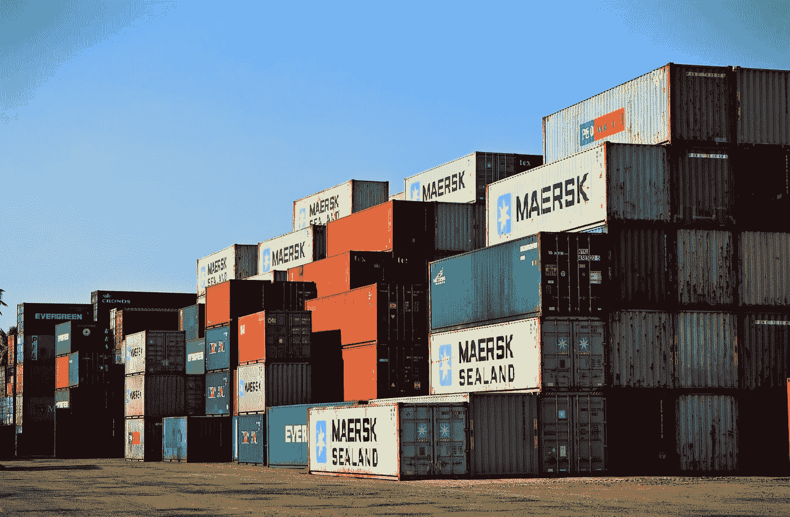
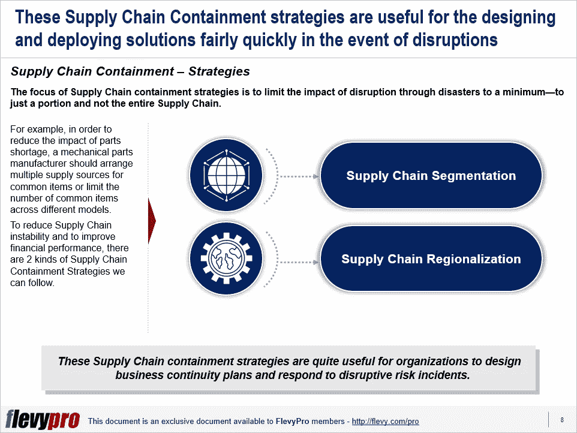

# 稳健的供应链战略，以遏制自然灾害造成的中断

> 原文：<https://medium.datadriveninvestor.com/robust-supply-chain-strategies-to-contain-disruption-caused-through-natural-disasters-3d9d139708da?source=collection_archive---------6----------------------->

供应链经常被人类无法控制的灾难破坏。在过去十年中，海啸和洪水等自然灾害严重影响了从汽车到技术、旅游到货运的主要行业，并暴露了全球供应链机制的关键弱点。现在，我们正在经历一场前所未有的全球性破坏，新冠肺炎。

依赖单一来源供应商、通用零件和集中库存的组织更容易受到中断风险的影响。在大多数情况下，管理层意识到自己有责任通过确保采取措施来防止供应链中断，这些措施包括保存更多库存、提高分散设施的生产能力以及选择多种来源。但这些措施对供应链成本效率有负面影响。

然而，辨别代价高昂的供应链中断的影响是一回事，采取行动避免这种情况或减轻其不良影响是另一回事。管理供应链风险需要仔细评估这些措施对供应链成本效率和底线的影响。在新冠肺炎疫情期间，[供应链管理](https://flevy.com/business-toolkit/supply-chain-management)也必须涉及这种形式的[风险管理](https://flevy.com/business-toolkit/risk-management)，这一点变得比以往任何时候都更加清晰。

供应链效率需要提高组织的财务绩效，并专注于改善我们管理供应和需求的方式。需求波动或供应延迟是相互独立的，通常可以通过在正确的地方保持适当的库存水平、更好的计划和实施以及提高供应链成本效率来解决。

# 供应链遏制

供应链是复杂的运作，包括在多个地点采购、制造或储存的许多产品或商品。这些复杂性会降低效率，导致延迟、操作暂停，并增加中断的风险。控制复杂性带来了更高的成本效率和更低的风险。

[供应链控制](https://flevy.com/browse/flevypro/supply-chain-containment-strategies-4388)确保由内部因素或自然灾害导致的供应链中断被控制在供应链的一部分内。从短期来看，整个组织的单一供应链似乎具有成本效益，但即使是一个小问题也可能引发灾难。

# 供应链遏制策略

[供应链遏制战略](https://flevy.com/browse/flevypro/supply-chain-containment-strategies-4388)有助于组织在自然灾害造成中断的情况下快速设计和部署解决方案。目标是将灾难造成的中断影响降至最低——仅限于一部分而非整个供应链。

例如，为了减少零件短缺的影响，机械零件制造商应该为通用项目安排多个供应源，或者限制不同型号的通用项目数量。为了减少供应链的不稳定性并提高财务绩效，组织可以使用以下遏制策略:

1.  **供应链细分**
2.  **供应链区域化**

# 供应链分割

供应链细分的基础是数量、产品多样性和需求不确定性。具有高需求不确定性的高利润低产量产品保证了供应链的灵活性，其产能集中于总需求。在高成本地区制造一切不利于利润率。从欧洲采购响应性供应商是一种仅适用于时尚高端产品的模式。对于快速流动、低利润的基本产品，从多个低成本供应商处采购是明智的。在细分市场少、产品种类多、单个产品销量低、需求不确定性高的情况下，集中化有利于实现合理的绩效水平。在销售量较高、需求不确定性较小和细分市场较多的情况下，分散化是合适的，有助于更好地响应当地市场并降低中断风险。例如，公用事业公司利用低成本的燃煤电厂来应对可预测的需求，而利用高成本的燃气和燃油电厂来应对不确定的高峰需求。

# 供应链区域化

供应链区域化有助于减少区域内工厂失去供应的影响。例如，在 2011 年海啸事件中，日本汽车制造商因全球零部件短缺而受到严重打击，因为这些零部件中的大部分只能从受海啸影响地区的储存和配送设施中获得。如果他们在分散的区域供应链中运作，物流中心分散在不同的地点，他们就可以有效地控制中断的影响。

供应链区域化降低了分销成本，同时也降低了全球供应链的风险。在低燃料和运输成本时期，全球供应链通过将生产设在成本最低的地方来最大限度地降低成本。随着运输成本的上升，全球供应链可能会被区域供应链取代。在多个地点储存相同库存的区域化供应链看起来很浪费，但在其中一个物流中心遭遇灾难的情况下，这种供应链会更加稳健。

有兴趣了解更多关于[供应链细分和区域化](https://flevy.com/browse/flevypro/supply-chain-containment-strategies-4388)的信息吗？你可以在 [Flevy 文档市场](https://flevy.com/browse)的这里[下载一个关于**供应链遏制战略**的可编辑幻灯片。](https://flevy.com/browse/flevypro/supply-chain-containment-strategies-4388)

## 你在这个框架中找到价值了吗？

您可以从 [FlevyPro 库](https://flevy.com/pro/library)下载关于这个和数百个类似业务框架的深入介绍。 [FlevyPro](https://flevy.com/pro) 受到 1000 名管理顾问和企业高管的信任和使用。有些人不得不说:

> “我的 FlevyPro 订阅为我提供了当今市场上最受欢迎的框架和平台。它们不仅增加了我现有的咨询和辅导产品和服务，还让我跟上了最新的趋势，为我的实践激发了新产品和服务，并以其他解决方案的一小部分时间和金钱教育了我。我强烈推荐 FlevyPro 给任何认真对待成功的顾问。”

–战略商业建筑师事务所创始人比尔·布兰森

> “作为一家利基战略咨询公司，Flevy 和 FlevyPro 框架和文件是一个持续的参考，有助于我们为客户构建我们的调查结果和建议，并提高他们的清晰度、力度和视觉效果。对我们来说，这是增加我们影响力和价值的宝贵资源。”

–Cynertia Consulting 的咨询区域经理 David Coloma

> “作为一个小企业主，FlevyPro 提供的资源材料已被证明是非常宝贵的。根据我们的项目事件和客户要求按需搜索材料的能力对我来说很棒，并证明对我的客户非常有益。重要的是，能够针对特定目的轻松编辑和定制材料有助于我们进行演示、知识共享和工具包开发，这是整个计划宣传材料的一部分。虽然 FlevyPro 包含任何咨询、项目或交付公司都必须拥有的资源材料，但它是小公司或独立顾问工具箱中必不可少的一部分。”

–变革战略(英国)董事总经理迈克尔·达夫

> “作为一名独立的成长顾问，FlevyPro 对我来说是一个很好的资源，可以访问大量的演示知识库来支持我与客户的合作。就投资回报而言，我从下载的第一个演示文稿中获得的价值是我订阅费用的好几倍！这些资料的质量让我能够打出超出自己体重的水平，这就像是用很小一部分开销就能获得四大咨询公司的资源一样。”

–Roderick Cameron，SGFE 有限公司的创始合伙人

> “我每个月都会浏览几次 FlevyPro，寻找与我面临的工作挑战相关的演示文稿(我是一名顾问)。当主题需要时，我会进一步探索，并从 Flevy 市场购买。在所有场合，我都阅读它们，分析它们。我采纳与我的工作最相关和最适用的想法；当然，所有这些都转化为我和我的客户的利益。"

量子 SFE 公司首席执行官奥马尔·埃尔南·蒙特斯·帕拉

在 [**管理和企业咨询**](https://app.ddichat.com/category/management-and-corporate-consulting) **:** 中安排一个 DDIChat 会话

 [## 专家-管理和企业咨询- DDIChat

### DDIChat 允许个人和企业直接与主题专家交流。它使咨询变得快速…

app.ddichat.com](https://app.ddichat.com/category/management-and-corporate-consulting) 

在这里申请成为 DDIChat 专家[。
与 DDI 合作:](https://app.ddichat.com/expertsignup)[https://datadriveninvestor.com/collaborate](https://datadriveninvestor.com/collaborate)
点击此处订阅 DDIntel [。](https://ddintel.datadriveninvestor.com/)