# 罗克韦尔自动化投资报告

> 原文：<https://medium.datadriveninvestor.com/rockwell-automation-investment-report-62be67f1799a?source=collection_archive---------9----------------------->

## 提供对罗克韦尔自动化公司的财务结构、业务布局和内在价值的洞察。

***编辑:*** *斯科特·e·扬克教授(康奈尔大学查尔斯·戴森应用经济与管理学院副教授)、佩雷·巴雷斯(康奈尔大学学生)、王翰(康奈尔大学学生)*

***财务分析& DCF 估值 Excel 文件:***[*https://drive . Google . com/drive/folders/1 pngpmq _ 7m wljbal 43 rncrshauiezya？usp =共享*](https://drive.google.com/drive/folders/1pNGPMNq_7M5wljBal43RNCrSHAuIezya?usp=sharing)

# 目录

*   [执行摘要](#cd4a)
*   [公司治理](#3096)
*   [财务分析](#1f20)
*   [贴现现金流估值:基本面分析](#cb68)
*   [可比公司估值](#552b)
*   [估价总结及结论](#529a)

# 行动纲要

多年来，罗克韦尔自动化公司及其行业同行一直处于工业控制产品制造(NAICS 335314)创新变革的前沿。因为有了像罗克韦尔这样的公司，企业已经能够以更高的效率和有效性来简化他们的制造过程。

这家美国公司成立于 1928 年，总部位于威斯康星州密尔沃基市，主要经营以下领域:建筑和软件以及控制产品和解决方案；它专门分销集成到商业企业工业运营中的软件、硬件和通信组件。罗克韦尔的业务遍及 100 多个国家，约有 23，000 名员工。

 [## 2020 年最佳短期投资选择精选资源|数据驱动型投资者

### 投资是增加你净财富的一个好方法。如果你通过遵循一个严格的…

www.datadriveninvestor.com](https://www.datadriveninvestor.com/2020/03/28/handpicked-resources-for-the-best-short-term-investment-options-of-2020/) 

## 竞争格局-

该公司的主要竞争对手来自不同的国际地区，每个地区都拥有广泛的资源。一些主要的参与者包括西门子(德国)、ABB(瑞士)和欧姆龙(日本)。工业控制产品制造业的主要价值驱动因素如下:

*   **能源价格:**工业控制工具供应商强烈依赖制造业和/或资源型企业。当工业生产和商品价格上升时，该行业的需求就会增加。因此，原油价格飙升预示着经济衰退的可能性降低，这应该意味着生产需求增加，销售收入也相应增加。
*   **技术创新:**随着技术的发展，行业环境及其各自的商业模式变得越来越复杂，因为需要更先进的特性和功能。最近，云计算技术和物联网软件(用于动态接收反馈和监控客户工业流程中的主要瓶颈)是高需求产品的两个例子。因此，始终保留可靠的技术，这将提供数据安全性和运营效率，对于确保市场竞争优势至关重要。

## 增长潜力-

该行业的整体增长潜力相对较低，因为它目前正处于其产品生命周期的成熟期。它的表现有时也是不确定的，因为需求极其不稳定，对宏观经济条件的变化非常敏感，特别是与商品价格和激烈的价格竞争有关的变化。最近的经济冲击是新冠肺炎疫情和沙特与俄国之间的原油供应价格战。此外，像汽车制造商和炼油公司这样的大客户可以对罗克韦尔自动化这样的公司施加很高的议价能力，因为它们的公司规模很大。这无疑降低了该行业决定其增长轨迹的能力。

然而，在仍在工业化并经历高水平国内生产总值增长率(有些甚至达到两位数)的新兴市场中，可以发现尚未开发的增长潜力。因此，这些领域对工业控制的需求将成为增长的主要驱动力。然而，向这些地区进行地理扩张的机会将会带来更多的竞争者。在 Rockwell 的案例中，由于低廉的劳动力和运营成本，来自新兴经济体的竞争公司通常具有较低的成本结构。

如下图所示，行业预测显示年复合增长率低于 2%。这些年来的增长率似乎也有很大程度的偏离。

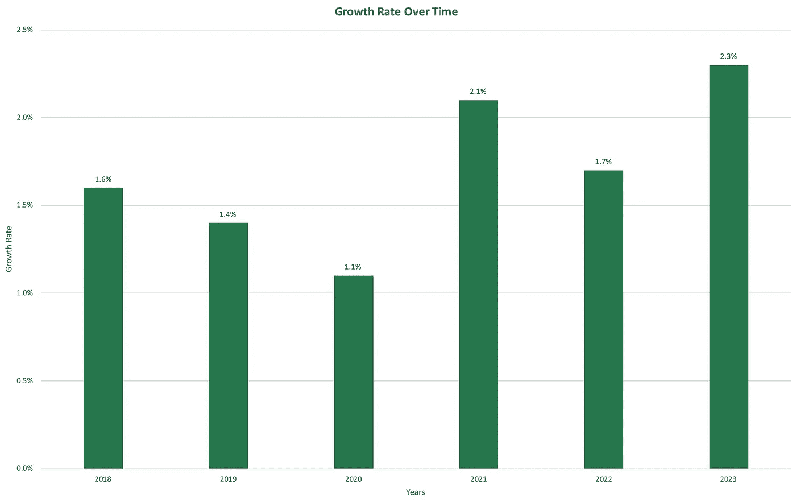

话说回来，尽管存在上述风险，罗克韦尔自动化在历史上一直成功地保持着稳定的增长率。这可以归因于他们在工厂自动化部门的大量投资，这在某些行业和新兴市场中被证明是至关重要的。此外，罗克韦尔在发达市场已经有了稳固的地位，这得益于其持续改进运营和产品的总体战略。这是通过研究和开发来提高他们解决复杂和动态工业过程的技术能力而实现的。

在 2017 年第四季度，罗克韦尔的主要竞争对手之一艾默生电气公司多次出价收购该公司，从 2017 年 8 月的每股 200 美元到 2017 年 12 月的每股 225 美元不等。这相对于罗克韦尔当时的股价有 22%的溢价，这表明了该公司的吸引力和扩大规模的潜力，即使是在一个成熟和低增长的行业中。

## 投资论文-

考虑到公司的整体业绩和竞争优势、良好的公司治理结构、财务比率、可比估值和贴现现金流，建议在中短期内出售韩国股票。

虽然对罗克韦尔公司治理的分析肯定表明运营效率很高，但现金流量折现法的估值却表明并非如此；报告指出，当前证券的价值被高估，并估计该行业的增长将会放缓。

然而，从长远来看，也应考虑到新兴市场仍有高增长潜力的事实，因为这可能转化为更高的需求、更多的进入者和更大的经济波动风险。这可能会导致公司和整个行业的表现导致波动率上升，这意味着更高的风险，但也意味着更高的回报。

# 公司治理

罗克韦尔自动化的所有权拥有各种各样的机构投资者，从投资经理到养老基金。一些主要股票持有者是主要基金，如先锋集团(9.81%)、贝莱德(4.99%)和 SSGA 基金管理公司(4.10%)。

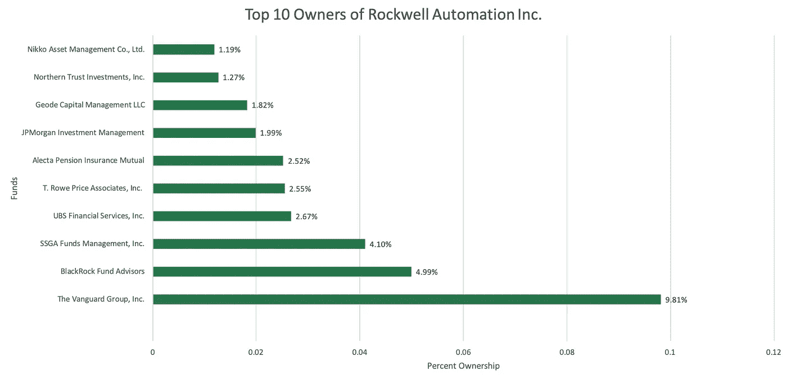

董事会由 10 名成员组成:首席执行官兼董事长 Blake D. Moret 和其他九名独立董事，他们过去在各个制造行业都有丰富的经验。除了首席执行官，这些人监督三个不同的委员会。它们是:

*   **公司治理:**由三名独立董事管理，目的是确保董事会始终按照股东的最大利益行事，并在必要时更换董事会成员。
*   **审计:**由四名独立董事管理，旨在防止会计和财务领域的不道德或非法行为。
*   **薪酬:**由四位独立董事管理，为管理层和董事会的所有成员制定薪酬计划。在 2019 财年，对这些个人的支付约为 730 万美元，其中首席执行官获得了 230 万美元。在每次年度股东大会上，都会选出四名董事会成员来监督委员会，并由股东投票决定薪酬方案。此外，每个季度都会召开收益电话会议，讨论短期业绩。

董事会席位的任期最长为三年，并接受股东进行的定期绩效评估。如果在股东投票过程中达到 80%的绝对多数，它们可以在任何时候被取消，章程可以被修订。

此外，罗克韦尔有四个主要的激进投资者，他们持有高达 610，000 股(占总流通股的 0.53%)。尽管这些积极分子有代理干预的历史，特别是 GAMCO 投资者有 132 人，罗克韦尔自动化在最近的历史中没有经历过任何代理竞争。

基于该公司的公司治理结构和股东积极性的缺乏，可以确定股东的价值肯定是最大化的。此外，让九名独立董事在董事会任职可以确保透明度，防止委托代理问题的发生。因此，罗克韦尔自动化的管理和所有权优先事项显然符合长期盈利能力。

# 财务分析

计算和分析一系列财务比率，以确定罗克韦尔自动化的财务健康状况。

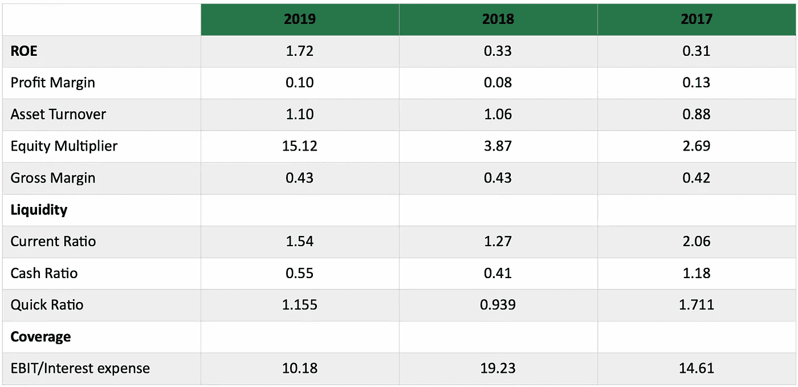

首先要分析的是净资产收益率。这衡量的是一家公司的利润相对于其账面净值的多少。罗克韦尔的净资产收益率在过去三个财年中有所增加，从 2018 年到 2019 年有了明显的增长。这是公司盈利的积极信号。

接下来，将 ROE 分解为资产周转率、权益乘数和毛利率可以展示 ROE 变化背后的因素。可以看出，权益乘数比率的大幅提高是净资产收益率值背后的主要驱动力。这也标志着该公司账面上的资产极有可能是债务融资的，这对于提高 ROE 具有双重效果。

盈利能力方面，毛利率三年不变。

在流动性比率部分，有一个混合趋势。从 2017 年到最近一个财年，这三个比率都呈“v”形趋势。从 2017 年到 2018 年，流动性比率下降，这意味着罗克韦尔在满足他们当时的需求方面会有更多的困难。然而，从 2018 年到 2019 年，三个流动性比率都有所增加，表明公司满足需求的能力出现了有利的逆转。

覆盖率衡量一家公司满足其融资费用的能力。在这种情况下，EBIT/利息费用比率衡量公司支付债券利息费用的能力。较高的比率表明支付这些费用的能力较强。不幸的是，随着时间的推移，罗克韦尔自动化的覆盖率已经下降，这表明其支付融资费用的能力正在下降。

# 贴现现金流估值:基本面分析

## 自由现金流预测-

为了真实评估罗克韦尔自动化的内在价值，我们进行了现金流贴现(DCF)评估。在这个过程中考虑了某些因素。

在预测罗克韦尔自动化未来五年的销售数字时，最初确定了这些时间段的增长率。为了应对这一任务，公司过去三个财政年度增长率的平均值被指定为未来五年的短期增长率。此外，由于当前糟糕的经济环境，我们假设新冠肺炎对罗克韦尔的影响将持续两年。因此，影响值(1-3)被分配给这几年，从公司的短期增长率中分离出来。五年预测后，长期增长率被指定为过去五年美国国内生产总值的平均增长率，因为该公司已经是一个成熟的、发展良好的公司。

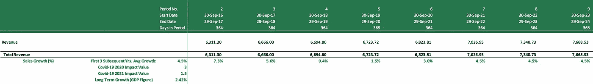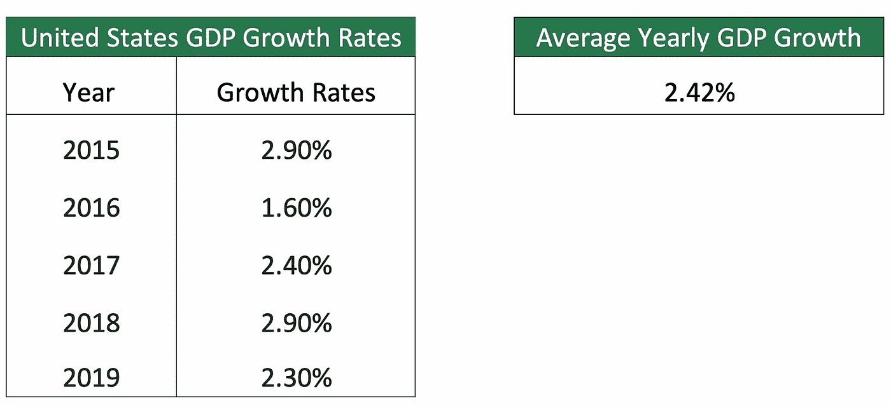

接下来，通过使用关键经营项目在销售额中的平均历史份额或平均年增长率来预测这些项目。这导致了自由现金流部分，随后是终值，它代表了前面提到的长期永续增长率。

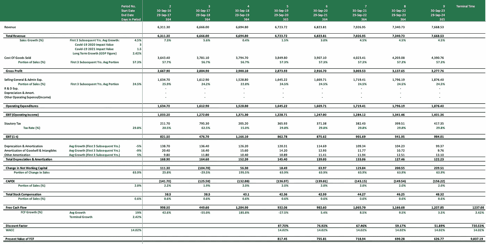

## 加权平均资本成本(WACC)

贴现率是将自由现金流数字转换成现值的必要条件。因此，必须评估由权益成本(Ke)和债务成本(Kd)组成的加权平均资本成本。虽然权益成本的计算需要β值、预期市场回报和无风险利率，但债务成本需要到期收益率(YTM)、违约率和违约损失。

对于 beta，使用 S&P 市场的超额月度股票收益数据对公司过去五年的超额月度股票收益数据进行回归分析。这导致贝塔系数为 1.44。此外，预期市场回报是在对 S&P 指数过去两年的回报进行平均后确定的。

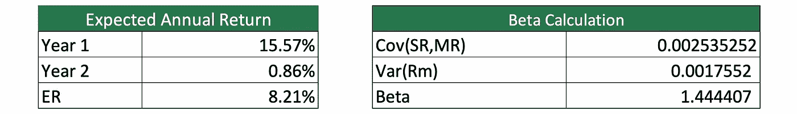

参考到期收益率(YTM)，选择了 2.62%的前瞻性无风险利率。YTM 值是罗克韦尔自动化各种债券的平均收益率的结果。

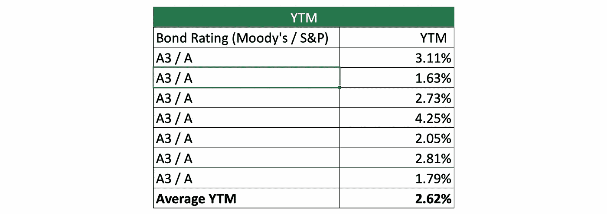

通过β、无风险利率和预期市场收益率的值，可以使用资本资产定价模型计算权益成本:**预期收益率=无风险利率+(β×****市场风险溢价)**，得出 10.70%。

这一过程现在转向了债务成本。已经建立 YTM 的，参照穆迪的债券评级/违约率图表确定违约率；它指出 A3 债券的违约可能性为 0.20%(极不可能)。参照穆迪违约损失率表，违约损失率设定为 60%。债务成本最终可以通过以下公式计算:**债务成本=到期收益率—(违约率×违约损失)**。

为了最终确定 WACC 的价值，剩下需要的因素是股权的市场价值和债务的市场价值。股权的市场价值是罗克韦尔稀释后的流通股和当前股价的乘积。债务的市场价值是长期债务和长期债务的流动部分的相加。

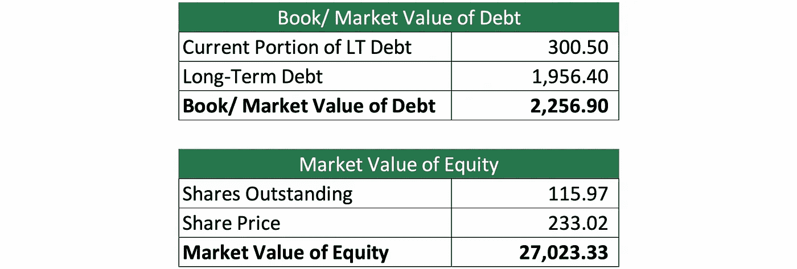

然后可以计算出 WACC:

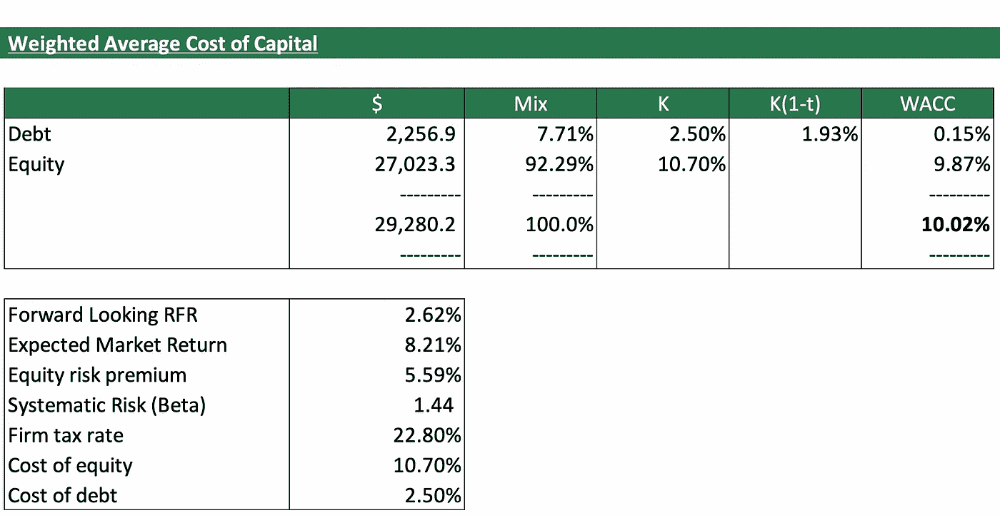

## 公司内在价值-

确定了贴现因子 WACC 后，使用 WACC 因子对预测的自由现金流进行贴现，以得出其现值。它们的总和代表企业的净现值(NPV ),减去现金，加上总债务的 NPV 将得出企业价值。然后除以发行在外的总股份，得到罗克韦尔自动化内在股票价值的预测，即每股 154.24 美元。

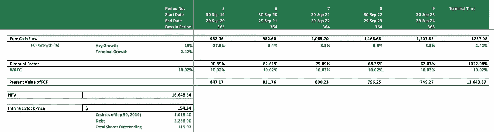

通过改变参数进行敏感性分析:对 WACC 的敏感性和对长期增长率的敏感性。由此可见，股票价格随 WACC 的变化比随增长率的变化波动更大。这是意料之中的，因为 WACC 是贴现该公司大部分预测现金流的主要贡献因素。

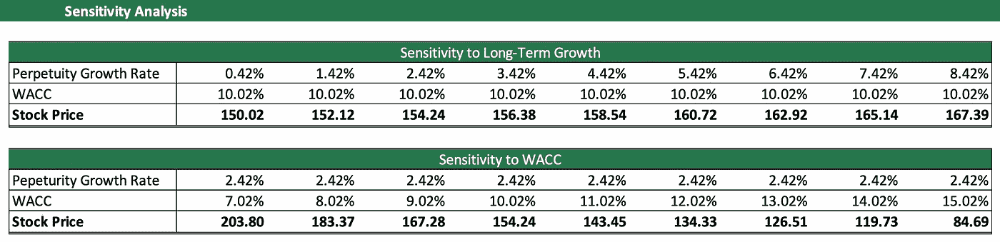

# 可比公司估值

对罗克韦尔自动化及其竞争对手进行了类似的评估。分析了各种财务比率，包括之前**财务分析**部分中的比率。三家类似的公司被用来与罗克韦尔自动化进行比较:德国工业制造公司西门子(Siemens)，另一家分销工业软件的德国公司 SAP SE，以及美国物流和 IT 服务企业施耐德电气(Schneider Electric)。

## 行业中位数-

要比较的第一组比率是股本回报率、流动性和覆盖率指标。

Rockwell Automation Financial Ratios

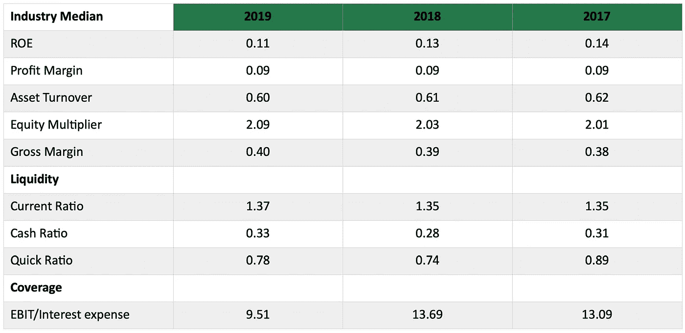

当查看股本回报率的行业中位数时，罗克韦尔以 1.72 远远超过 0.11 的中位数。这种差异可以归因于前面提到的高权益乘数比率，这再次证实了罗克韦尔的资产是由债务融资驱动的。

此外，罗克韦尔还拥有比行业更高的流动性和覆盖率。这表明，尽管该公司有更多的资产由债务融资，但它在满足需求和融资成本方面比竞争对手做得更好。

下面的图表显示了罗克韦尔与其他公司相比的优势。

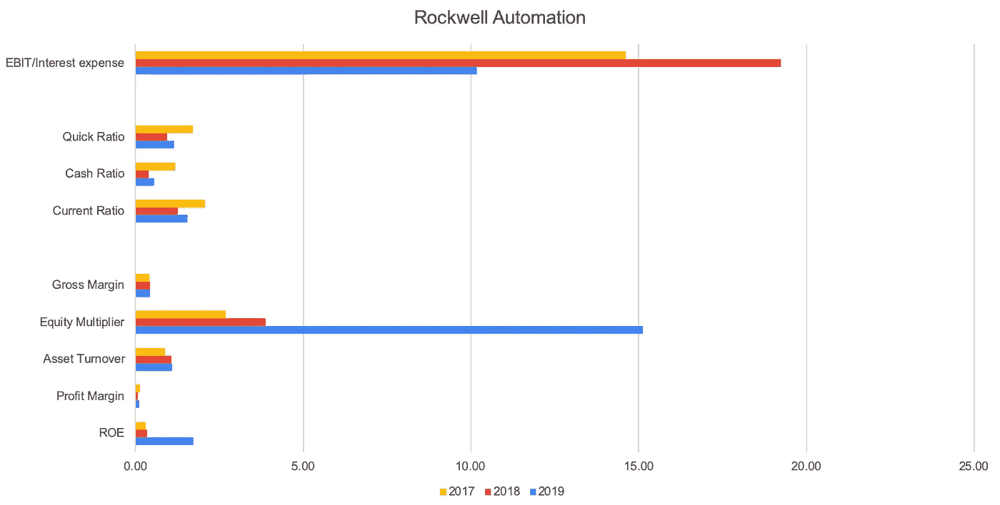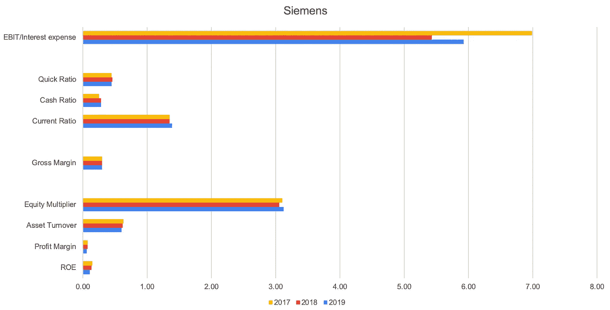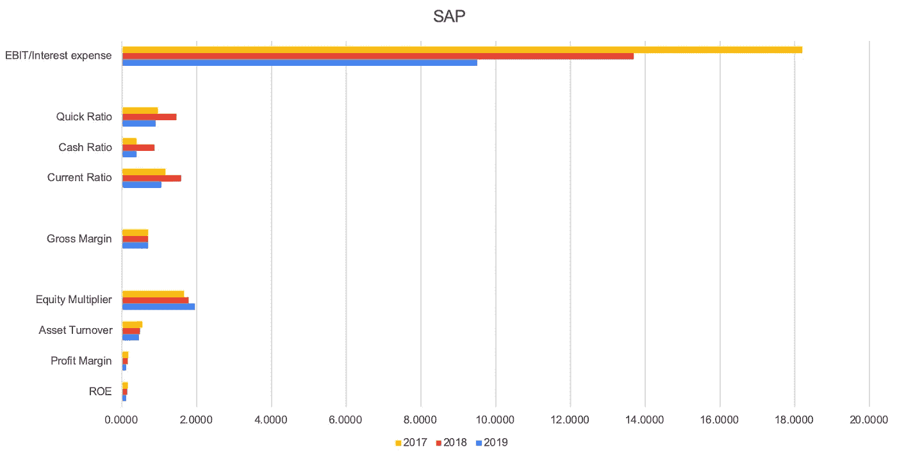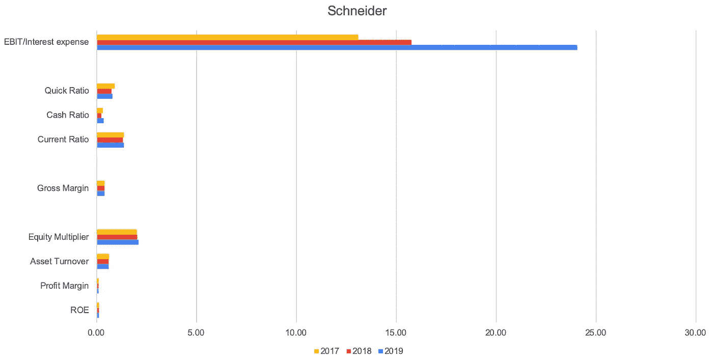

下一组比率:价格/权益、价格/账面价值、企业价值/销售额、企业价值/ EBITDA 和企业价值/ EBIT 用作进一步的比较。

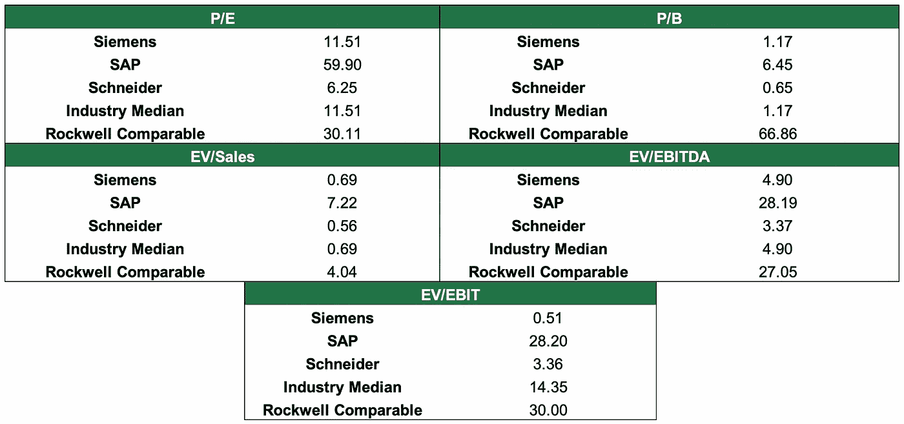

从图表中可以看出，Rockwell Comparable 的市盈率比行业中值高得多，这是股票价格被高估的另一个迹象，或者投资者可能愿意根据其他定性因素(如预期的未来增长率)为该公司支付更高的价格。

然而，罗克韦尔的市净率低于行业中值，这可能导致投资者认为资产负债表上的资产被夸大了。

此外，罗克韦尔的电动汽车/EBIT 比行业中值低得多，一些因素可能在这里起作用。企业价值被债务和市值推高；鉴于罗克韦尔的股份比竞争对手少，这可能是它低于行业中位数的原因。低的 EV/EBIT 比率通常是有吸引力的，因为这可能意味着一家公司在给定的运营量下更有利可图

当比较电动汽车与 EBIDTA 的比率时，情况也是如此，电动汽车与 EBIT 的比率非常接近；唯一的区别是，前者包括折旧和摊销，这已被添加回 EBIT。EV/EBIDTA 也可以更好地衡量运营收入。由于罗克韦尔的 EV/EBIDTA 比低于竞争对手，这再次表明该公司的高盈利能力。

最后，罗克韦尔的电动汽车/销售比率高于大多数竞争对手。这可能反映了投资者对未来销售增长信心的积极迹象。也就是说，与同行业相比，该公司的人均销售额或收入也相对较高。因此，这对公司的未来前景是个好兆头。话说回来，高倍数也可能是估值过高的信号。

## 行业趋势

最近，制造业出现了大幅下滑，软件行业也出现了更为微妙的下滑。虽然所有四家可比公司都参与了相同的行业(工业制造，涉足软件)，但那些在这两个领域都有专长的公司能够更好地抵御市场上更多样化的不利变化。

罗克韦尔也更多地在软件行业投资和生产产品。因此，这应该是其当前估值和未来收益预测将优于行业的一个原因。此外，值得注意的是，远在新冠肺炎危机之前，工业制造业作为一个整体近年来一直处于困境。虽然罗克韦尔目前可能是行业领导者，并超越其同行，但毫无疑问，它目前正在遭受痛苦，并将在未来一段时间内继续如此。

# 估价总结和结论

DCF 模型显示，罗克韦尔自动化的股票估值远低于市场价格:每股 154.24 美元。然而，截至 2020 年 8 月 19 日，韩国的价值一直徘徊在 233.02 美元/股左右。这是证券可能定价过高的一种表现形式。

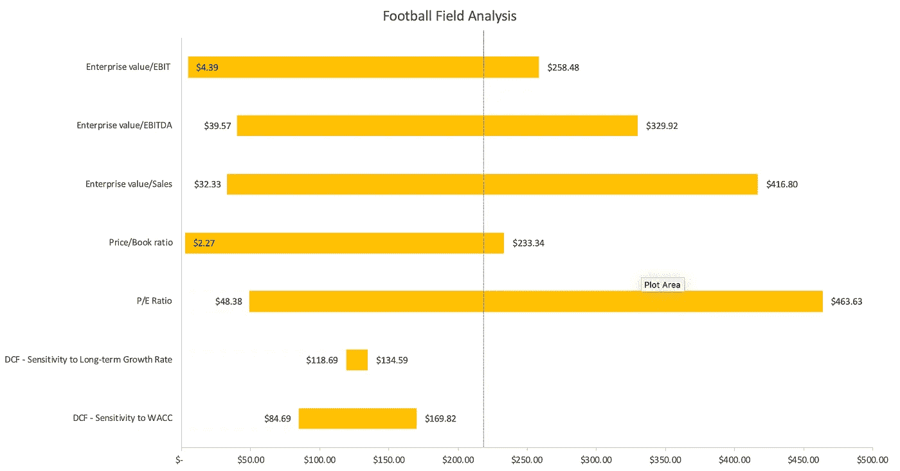

相对于同行，韩国的市场价格是最贵的。这凸显了一个事实，即投资者对罗克韦尔的估值高于可比公司，或者在另一种情况下，其内在股票价值被高估了。举个例子，如前所述，罗克韦尔的市盈率为 31.42，远高于行业中值 11.51。此外，罗克韦尔的市净率以 66.86 领先于整个行业，这是市场愿意支付高于其硬资产的大溢价的另一个迹象。这可以从过去三年流动比率的下降看出。

作为工业自动化领域的行业领导者，罗克韦尔的财务健康状况在当前的经济环境中也受到了打击，或者说在新冠肺炎危机期间缺乏经济环境。进入 2020 年，工业自动化市场已经疲软，现在随着制造工厂的关闭和长期衰退的威胁，罗克韦尔的销售增长预计将下降。此外，Rockwell 的 has 管理层表示:“虽然我们第二季度的销售保持良好，但我们预计，随着新冠肺炎影响更多国家和经济体，我们将在一段时间内面临许多服务行业的需求下降。因此，我们正在采取先发制人的措施，使公司的成本结构与这种环境保持一致。”这可能解释了罗克韦尔在市场上被高估的原因，因为它能够在最近一个季度显示出强劲的销售数据。

**进入专家视角—** [**订阅 DDI 英特尔**](https://datadriveninvestor.com/ddi-intel)