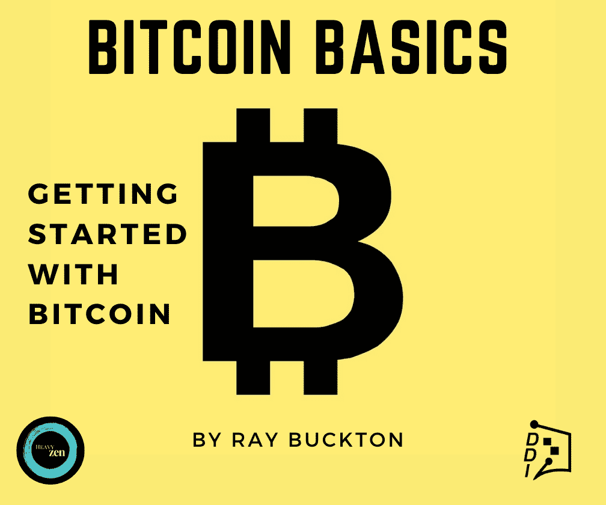

# 卷轴开始摇晃。全球技术分裂，5G 得到推动

> 原文：<https://medium.datadriveninvestor.com/rocky-start-for-reels-global-tech-splinters-5g-gets-a-boost-33f9dc14662a?source=collection_archive---------12----------------------->

## **DDI 技术通讯，8 月 13 日一周**

# 家政

您知道《数据驱动的投资者》是 Medium 在数据科学、区块链和企业家精神方面的顶级出版物之一吗？不仅如此，我们还拥有每月 80 万到 100 万的读者群。

没有你我们也不会成功。

但我们只是触及了表面。数据驱动的投资者不仅仅是一份出版物。

**正在进行的项目:**

1.  **DDI 专家聊天程序:**一个协作市场，人们可以在这里与能够解决他们问题的专家聊天。你是专家吗？为你的时间和努力获得报酬！报名已经开始，[**跳上**](https://datadriveninvestor.com/expertchatregistration) **。**
2.  **【绝密】**想要提示？我们想奖励你的最佳表现。增加价值，获得价值，才有意义。

想在你的专业领域树立权威吗？我们需要你的帮助来揭示人们从别处得不到的洞察力。作为回报，我们将在我们的时事通讯中突出显示最佳投稿。

您可以使用 [**提交链接**](https://datadriveninvestor.com/mainsubmission) 将您的原创文章提交到我们的主站点。

*(注:如果你喜欢这首曲子，请考虑转发给朋友。如果有人给你发了这个片段，你可以* [*订阅 DDI 简讯*](https://www.datadriveninvestor.com/about/) *这样你就不会错过任何一个节拍。)*

抓住上一期的加密货币[**【here】**](https://medium.com/datadriveninvestor/aaaand-its-gone-706f05f8b254)以及所有关于市场和经济的[**【here】**](https://medium.com/datadriveninvestor/the-last-dance-trump-deletes-tiktok-f436edac2c76)。

# DDI 编写器亮点

每周我们都会为读者带来一些从 DDI 社区精选的故事。想让你的故事成为特色吗？[在这里提交你最好的](https://datadriveninvestor.com/mainsubmission)。

抬头:你可能在想，“为什么这些有一半是关于区块链的？”嗯，我们在最近一期的时事通讯中分享了这一期的所有技术聚焦文章，犯了一个错误。区块链仍然算作技术，所以我们这周把它们调换了一下。没什么大不了的！

## 来自你的智慧

你的脸是新的货币。

“接下来我们可能会看到隐私营销的兴起，在这种营销中，企业形象建立在无录音设备区的承诺之上。”

[——诺贝特·比德日茨基](https://www.datadriveninvestor.com/author/norbertbiedrzycki/)

[国会如何盲目地看待科技公司的未来](https://www.datadriveninvestor.com/2020/08/12/how-congress-blindly-sees-the-future-of-tech-companies/)

"技术颠覆将一点一点地摧毁国会."

[-努诺·法比奥](https://www.datadriveninvestor.com/author/nuno-fabiao/)

[卫生技术的任务](https://www.datadriveninvestor.com/2020/08/12/how-new-health-technology-makes-us-live-past-100-years/)

"你可以活到 100 岁以上，这是有保证的。"

[-马特奥·梅利查尔](https://www.datadriveninvestor.com/author/fitbudd/)

[这么说一家大型风投基金正在投资你的初创公司？4 实际考虑事项](https://www.datadriveninvestor.com/2020/08/09/so-a-big-vc-fund-is-investing-in-your-startup-4-practical-considerations/)

“如果你与一家大型风投公司签约，首先就他们将如何决定领导下一轮投资进行公开对话。”

[-阿米特·加尔格](https://www.datadriveninvestor.com/author/amit-garg/)

[资本市场治理 101](https://www.datadriveninvestor.com/2020/08/06/capital-markets-governance-101/)

“由于 DLT 的交易有防止重复支出的内在保护，区块链的结算本质上比传统市场更便宜、更快捷。”

[-斯特凡·里维尔](https://www.datadriveninvestor.com/author/sreverre/)

## 编辑推荐

[人工智能、区块链和智能合约:为什么我们都需要拥抱创新](https://www.datadriveninvestor.com/2020/08/03/ai-blockchain-and-smart-contracts-why-we-all-need-to-embrace-innovation/)

*   为什么要为自己不用的东西买单？很简单。但是 Emile NicLeold 和区块链提出的未来是:为什么要为有益于网络的东西付费呢？“区块链有可能彻底改变公司竞争和利益相关者合作的方式。”

[什么是以太扫描？](https://medium.com/datadriveninvestor/what-is-etherscan-a86fd59336de)

*   当谈到区块链时，我们听到很多关于可追溯性的说法，而 Etherscan 使之成为现实。以太扫描允许用户输入交易识别号，并实时查看他们的交易情况，而不是隐藏在不透明的代码后面。Kevin Gabeci 解释了这个系统是如何工作的，以及为什么它可能是数字金融的未来。

[华尔街和区块链不太可能的联姻](https://medium.com/datadriveninvestor/the-unlikely-marriage-between-wall-street-and-blockchain-df067453ebb8)

*   中央集权的坏人对抗赛博朋克自由战士。这就是我们都知道并喜欢的故事，不是吗？现实往往比我们和他们更复杂，不管是好是坏，华尔街已经做了很多工作来推进分布式金融的事业。厚脸皮的蒂米解释了为什么闪光的东西不都是金子，以及为什么华尔街的金融象牙塔可能是区块链迄今为止最大的怪异之处。

[拜占庭将军利用区块链解决问题](https://medium.com/datadriveninvestor/the-byzantine-generals-problem-solution-using-the-blockchain-31eb5318f37f)

*   亲近你的朋友，亲近你的敌人。当谈到拜占庭的一般问题时，这句格言更是如此，这是一个四方线索游戏，需要一个潜在的有问题的通往胜利的数学旋风。文斯·塔宝拉概述了如何利用区块链的创新技术来解决这种玩世不恭的侦探游戏。

[不买比特币](https://medium.com/datadriveninvestor/do-not-buy-bitcoin-75da73226530)

*   说真的。电视上的人说的。当然，他可能在 1 美元、1000 美元和 10000 美元的时候说过(可以说最后一个是对的)，但不要这么做。亚历山大·斯维特斯基半开玩笑地概述了彼得·希夫越来越老套的观点:“所有闪光的东西都是骗局。”虽然新奇、微妙，但比特币似乎不会很快消失，不管你喜欢它还是讨厌它。

# 在新闻报道中出现

## 小玩意儿

在[三星 2020 年开箱活动](https://www.theverge.com/2020/8/5/21350066/samsung-galaxy-unpacked-note-20-event-biggest-announcements-products-recap)上，该公司发布了 Galaxy Note 20 和 Note 20 Ultra、Galaxy Tab S7 平板电脑、Galaxy Watch 3、 [Galaxy Buds Live](https://www.theverge.com/circuitbreaker/2020/8/12/21365607/samsung-galaxy-buds-live-bean-ifixit-teardown-repairability-reliability) 和 Galaxy Z Fold 2。

此外，谷歌发布了其最新智能手机 Pixel 4a。

当我们谈到智能手机的话题时，中国电信巨头华为[在 2020 年 Q2 的全球智能手机出货量](https://www.canalys.com/newsroom/Canalys-huawei-samsung-worldwide-smartphone-market-q2-2020?ctid=1556-cb84e807dadce45a2ddfd54ba3bb8dfb&utm_source=morning_brew)超过其任何竞争对手。然而，美国的制裁正在[对该公司获取制造智能手机的处理器芯片施加压力](https://apnews.com/270e93e985733a4d086c06a01375cea0?utm_source=morning_brew)。这一顺风发生在美国于 2019 年取消华为对美国硬件和软件的访问之后。

## 取代抖音

Instagram [推出了](https://www.theverge.com/2020/8/5/21354117/instagram-reels-tiktok-vine-short-videos-stories-explore-music-effects-filters)作为抖音的直接竞争对手，Reels。它与其竞争对手相似，但也有所不同(增强现实)。到目前为止，评论褒贬不一，如果不是彻头彻尾的丑陋的话。

## 到无限和更远的地方！

SpaceX 使用该公司可重复使用的猎鹰 9 号火箭，成功将 57 颗 Starlink 卫星[送入轨道](https://www.space.com/spacex-starlink-launch-rocket-landing.html?utm_source=morning_brew)。迄今为止，该公司已经成功在其巨型星座中增加了 595 颗 Starlink 卫星。

此外，SpaceX 与联合发射联盟(United Launch Alliance)一起获得了数十亿美元的五角大楼火箭合同。美国国家航空航天局这些天肯定有点嫉妒。

# 不断变化的景观

## 没有浪费空间

一个著名的购物中心房地产集团，西蒙房地产集团，正在与亚马逊商谈在 T2 建立亚马逊配送中心的事宜。虽然 COVID 粉碎了复兴垂死的购物中心文化的任何希望，但亚马逊的目标是将柠檬变成柠檬水。

这些空间甚至可能成为亚马逊杂货配送服务的枢纽。不甘落后，沃尔玛[正与 Instacart](https://www.cnbc.com/2020/08/11/walmart-and-instacart-partner-in-fight-against-amazons-whole-foods.html?utm_source=morning_brew) 联手，提供当天送达服务，挑战亚马逊的市场份额。

## 美国 5G 技术的发展

美国政府计划在 2021 年将 3.5GHz 频谱从军用转向消费 5G。3.5GHz 是 5G 网络的理想选择，5G 网络对于发展物联网、智能城市、自动驾驶汽车、超快的移动互联网速度等至关重要。

5G 的发展将对人工智能的进步至关重要，根据美国人口普查局最近的一项研究，只有大约 9%的公司利用了人工智能。

# 隐私和言论自由

## 清洁网络

美国国务院发布了一份保护美国公民和公司敏感信息的五部分计划。这个被称为“清洁网络”的项目，新闻声明没有把中国共产党(CCP)放在聚光灯下。

30 多个国家已经承诺实施该计划，但实施是一个持续的过程。

在抖音事件之后，一些人认为互联网将不可避免地分裂成两部分(美国和中国)，甚至可能是三部分(欧盟)。

## 他们在看。

隐私是件大事。然而，你那张漂亮脸蛋的快照是可以赚大钱的。如今，面部识别是一个极具争议的问题。美国的一些地区，如俄勒冈州的波特兰市，已经完全禁止了这项技术。

面部识别初创公司 clear view AI[聘请了美国第一修正案专家 Floyd Abrams](https://www.nytimes.com/2020/08/11/technology/clearview-floyd-abrams.html?campaign_id=158&emc=edit_ot_20200811&instance_id=21171&nl=on-tech-with-shira-ovide&regi_id=140505160&segment_id=35771&te=1&user_id=58d1c8bb0d1d48a07ab9a6c11fb95e34) ，挑战对该公司违反隐私法的多项指控。

Clearview AI 从互联网上收集图像，然后向执法机构出售数据库的访问权限。该公司的应用程序匹配相似的图片，并在网上搜索相似的照片。人们不喜欢公司未经他们允许就出售他们的面部照片。艾布拉姆斯将以言论自由为由在法庭上为 Clearview AI 辩护。

## 说到言论自由，

脸书报告称，其人工智能[检测到了 2020 年 Q2 平台上删除的 2250 万个仇恨言论中的 95%。然而，许多人认为这还不够，称该公司需要更积极地检测和消除仇恨和误导的内容。](https://venturebeat.com/2020/08/11/facebook-claims-it-proactively-detected-95-of-hate-speech-removed-in-q2-2020/)

## 最大的威胁

波士顿动力让你夜不能寐？可能有一个更迫在眉睫的威胁会加剧你的失眠。一组专家比较了 18 种不同类别的人工智能威胁，发现深度假货是[人类很快需要应对的最重大威胁](https://www.inverse.com/innovation/deep-fakes-biggest-ai-threat)。

## 抖音传奇继续

**抖音计划** [**起诉**](https://www.npr.org/2020/08/08/900394707/tiktok-to-sue-trump-administration-over-ban-as-soon-as-tuesday?utm_source=morning_brew) **美国政府**以回应川普总统禁止该公司在美国运营的行政命令。

微软正在与字节跳动就收购其海外抖音业务进行谈判，特朗普只允许一个多月的时间来达成交易。

《华尔街日报》还发现，抖音绕过了谷歌安卓操作系统的隐私功能，从数百万移动设备上收集跟踪数据。此外，用户无法选择退出。

特朗普的决定对中国来说不是好消息。如果美国命令苹果在全球范围内移除微信，来自中国[的 iPhone 年出货量可能会下降 25%-30%](https://www.bloomberg.com/news/articles/2020-08-12/hon-hai-beats-profit-estimates-after-pandemic-spurs-apple-demand?sref=KkPzpZvz&utm_source=morning_brew) 。这种冲击将进一步加速工厂从中国向全球其他成本效益高的地区转移。

# 比特币到底是什么？

比特币被一些人誉为“数字黄金”，被另一些人誉为“纯粹的货币”，对许多人来说，它意味着许多东西。 [**比特币基础知识:比特币入门**](https://www.amazon.com/dp/B08FBP9W4Y) 将帮助你开启比特币之旅。

这本书将帮助你对构成比特币的**基本概念**感到舒适，无论你是寻求被告知还是准备好亲自参与**比特币。**了解比特币网络的关键特征**，解释如何将比特币从一个人转移到另一个人，深入研究**比特币的历史**，等等。**

# 其他新闻

**央行瞄准神奇的互联网货币|** 中国人民银行正在中国几个主要城市测试其新的数字货币。官员们希望在数字支付领域抢走阿里巴巴和腾讯的一些风头。他们的目标是简化数字支付和银行间结算。

**非常特效|***狮子王* (2019 电影)与电影制作的未来有什么关系？[很多](https://www.forbes.com/sites/solrogers/2020/01/29/virtual-production-and-the-future-of-filmmakingan-interview-with-ben-grossman-magnopus/#4c3de6ce75d4)。本·格罗斯曼是 AR/VR 公司 Magnopus 的获奖视觉效果策划人，他让我大吃一惊。

电影是用 Unreal 和 Unity 等游戏引擎以及虚拟和增强现实制作的，允许电影导演在虚拟场景中行走。本的这句话让我陷入了一个深深的兔子洞:

“你可以捡起一棵树，把它搬走。你可以抓住阳光，改变光线。你可以成为一个角色，做出不一样的表演。”

# 观看表演

我们在 [Alpha Trades](https://twitter.com/the_alphatrades) 的朋友一周都在深入研究市场、密码和经济。通过最近的剧集找到你的优势:

[**2020 年 8 月美股观察名单| EVER、XLE、XLK、CRM、PXD、CYBR**](https://youtu.be/c6KE1IFv5CU)

[**如何为下一轮牛市构建加密组合**](https://youtu.be/TH0Bocil8xs)

[订阅 Alpha Trades Discord 服务器](https://bit.ly/2KJ1oor)学习技术分析以及如何投资获利。询问 2 天的高级会员试用！

# 放弃

数据驱动投资者(DDI)提供的信息不用于做出任何金融决策，也不是购买、持有和/或出售特定证券或金融工具的请求或建议。

Alpha Trades，LLC 提供的信息不用于制定任何财务决策，也不是购买、持有和/或出售特定证券或金融工具的请求或建议。

访问 Alpha Trades 的完整服务条款:[https://bit.ly/3faVeeV](https://bit.ly/3faVeeV)