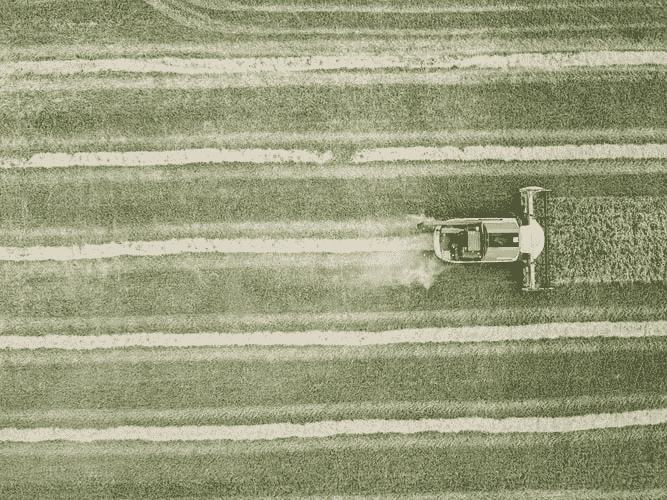

# 人工智能在农业领域的作用

> 原文：<https://medium.datadriveninvestor.com/role-of-artificial-intelligence-in-agriculture-sector-2c936ed6581a?source=collection_archive---------8----------------------->

人工智能正在为不同的领域提供支持，以增强功能、生产力和效率。人工智能的解决方案有助于克服每个领域的传统挑战。农业领域的人工智能不仅帮助农民提高效率，还帮助减少对环境的影响。农业领域在其运作中强烈和自由地接受人工智能，以改善总体结果。通过使用人工智能技术，我们可以帮助保持我们的大气健康。如今，大多数农业初创公司都在采用人工智能方法来提高农业生产的效率。根据市场研究结果，预计到 2025 年底，全球人工智能(AI)在农业领域的市场规模将达到 15.5 亿美元。通过使用人工智能方法，我们可以很容易地检测到作物的疾病，或者我们可以很容易地预测气候变化，并迅速做出反应。通过利用人工智能的努力，农业企业正在处理农业数据，以减少不利的结果。

Photo by [Luke Thornton](https://unsplash.com/@lukethornton) from Unsplash

**人工智能在农业中的优势**

通过在农业中利用人工智能，农民可以从温度、风速、太阳辐射和悬浮等数据中获得有意义的见解。对过去值的数据分析提供了对期望结果的更好的比较。人工智能在农业领域的应用是一件好事，它不会夺走农民的工作，它会给农民更多的便利来获得想要的结果。

人工智能为基本作物的生产、收获和销售提供了更有效的方法。

人工智能的部署有助于检测作物的疾病，并提高健康作物生产的潜力。

人工智能的发展为农业更有效的经营打开了大门。

人工智能方法正被用于自动机器调整，以预测天气和作物疾病或识别害虫。

人工智能可以改善作物管理实践，从而帮助大多数技术企业投资于对农业领域有用的人工智能算法。

 [## 人工智能让我们回归人情味|数据驱动的投资者

### “疫情迫使我们在一夜之间对世界进行数字化改造，”首席技术官 Guibert Englebienne 说

www.datadriveninvestor.com](https://www.datadriveninvestor.com/2020/10/13/artificial-intelligence-brings-us-back-to-the-human-touch/) 

人工智能的解决方案具有很高的潜力来解决农民面临的繁琐挑战，如识别作物疾病，确定水果的大小和害虫注射。

人工智能技术极大地改善了问题，也为控制问题所需的特定行动提供了补救措施。人工智能的结构是监控信息以找到大量的解决方案。让我们来探索人工智能是如何在农业领域中被利用，以最小的成本获得更好的结果。通过部署人工智能，我们可以轻松识别作物疾病，准确率高达 98%。人工智能通过调节光线来帮助农民监控水果和蔬菜，以加快生产。

**预报天气数据。**

Photo from Google Images

高级形式的人工智能是农民的帮手。农民可以随时更新与天气相关的数据。天气预报数据有助于农民增加产量和利润，而不会危及作物。对人工智能软件生成的数据进行分析，将有助于农民通过理解和学习人工智能来采取预防措施。通过部署这样的人工智能解决方案，它将有助于提前做出明智的决定。

**监测作物和土壤健康**

Photo by [Łukasz Nieścioruk](https://unsplash.com/@luki90pl) from Unsplash

利用人工智能是进行或监测作物最大缺陷的有组织的方法，我们还可以发现土壤中养分的缺乏。我们可以使用计算机视觉技术来捕捉作物的照片，并使用这些照片应用深度学习算法来找出作物疾病。这些人工智能软件在理解土壤缺陷、植物病虫害方面令人鼓舞。

**减少农药使用**

农民可以通过部署计算机视觉、机器人和机器学习技术，利用人工智能来管理杂草。根据收集的数据，农民可以很容易地识别杂草，并通过检查农民可以确定哪些杂草的叶子需要喷洒农药。这种方法不仅能帮助农民降低使用化学药品的成本，还能帮助农民提前发现疾病。这些化学物质对农作物没有好处，所以人工智能将减少杀虫剂的使用量，不会对农作物产生更多的影响。

**人工智能农业机器人**

人工智能农业机器人帮助农民找到更系统的方法来保护他们的作物免受杂草侵害。这也有助于克服劳动力挑战。与人类劳动力相比，人工智能机器人在农业中可以收获大量作物，速度更快。通过给计算机视觉供电，有助于监控杂草并喷洒它们。因此，人工智能正在帮助农民找到更系统的方法来保护他们的作物免受杂草的侵害。

**结论**

如今，人工智能技术被用于解决行业问题。人工智能被应用于金融、交通、医疗和农业等领域。人工智能是农民的帮手，可以监控他们的作物，而无需监督每一片叶子。许多初创企业都期待人工智能在农业领域的发展。人工智能正在重新考虑农业的传统方法。人工智能在农业领域的未来在提供先进方法的彻底变革方面遥遥领先。

## 访问专家视图— [订阅 DDI 英特尔](https://datadriveninvestor.com/ddi-intel)