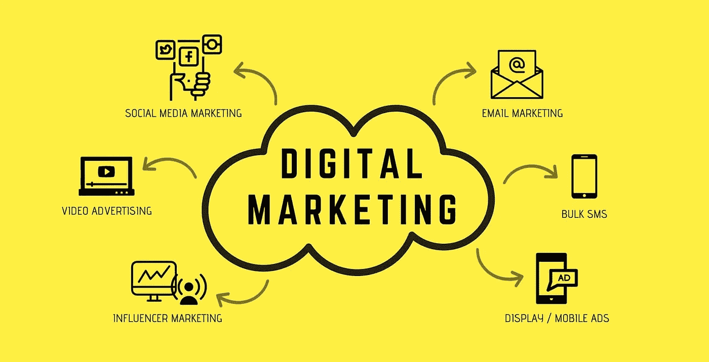

# 数据科学在 2020 年数字营销中的作用

> 原文：<https://medium.datadriveninvestor.com/role-of-data-science-in-digital-marketing-in-2020-68839ac695f9?source=collection_archive---------11----------------------->

## 为推动更好行动的数字记分

到 2019 年底，预计将有 6.27 亿印度互联网用户:这显示了数据科学在数字营销方面的力量。

你有没有在网上搜索过太阳镜，然后经常通过社交媒体和不同的网站找到相关的商业广告，或者自动收到类似商品的广告邮件？

你知道 YouTube 是如何在你的主屏幕上显示你喜欢的所有视频的吗？

或者，你有没有想过，当你和你最亲密的朋友聊天时，键盘会向你建议你需要在句子中使用的特定单词？

总的来说，这些就是我们所说的“数据科学应用”…

数据科学这个术语的使用越来越正常，但是，它到底是什么意思呢？在数字营销中执行数据科学的实用方法有哪些？营销数据科学模式有哪些？

## 什么是数据科学？

数据科学是不同策略的组合，目标是从原始数据中发现隐藏的模式，并通过分析解决复杂的问题，主要用于做出决策和预测。

数据科学中使用的一些策略包括人工智能、概率模型、统计学习、数据挖掘、数据库、信息设计、可视化、漏洞演示、模式识别和学习、编程等。

 [## 将定义 2020 年就业前景的五大数据科学和机器学习趋势|数据驱动…

### 数据科学和 ML 是 2019 年最受关注的趋势之一，毫无疑问，它们将继续发展…

www.datadriveninvestor.com](https://www.datadriveninvestor.com/2020/02/19/five-data-science-and-machine-learning-trends-that-will-define-job-prospects-in-2020/) 

## 什么是数字营销？

数字营销是利用互联网、手机、社交媒体、网络搜索工具和不同的渠道来接触客户。一些营销专家认为，与传统营销相比，数字营销是一项全新的事业，需要另一种接近客户的方法和更好的方式来观察客户的行为。

[***关于数字营销你需要知道的一切！***](https://www.abtalks.online/2020/05/digital-marketing.html)

## 数字营销中的数据科学

随着数据科学在数字世界的出现，可以得出更深刻的营销经验。数据科学的强度是巨大的，更好的数字营销有助于营销人员成功地利用数据策略来提高营销知识，更好地理解客户，并管理社交媒体上的客户互动。

有趣的是，你可以实现规模经济，理解你的目标市场，并以类似的方式工作。从脸书开始，它收集关于你与个人的社会互动的见解。下面是亚马逊，它正在用数据科学改变电子贸易。乘着便利，优步为客户提供最好的服务。

美国银行对利用数据来提升客户体验很感兴趣。现在，放松一下，因为 Airbnb 会让您住得更舒适。最后，Spotify 出现了，它正在改革音乐流媒体。

## 数据科学在市场营销中的应用

对于营销人员来说，由新进步引领的惊人数据是一座金矿。万一这些数据可以被精确地准备和分析，它可以传达有启发性的见解，广告商可以用它来锁定目标客户。尽管如此，解码巨大的数据块是一项艰巨的任务。这是数据科学可以大有帮助的地方。

数据科学可以用来改善不同的营销区域，包括内容营销、**SEO、客户响应和参与、持续营销和数据驱动的营销工作。**

# **数据科学在数字营销中的主要应用:**

****

*****剖析受众/客户*****

**有各种各样的分析工具可以在网上跟踪购买者的行为，并允许你收集关于客户兴趣和活动的各种数据。搜索引擎和您访问过的各种网站都会将所有收集到的数据保存在您的“客户档案”中。**

*****改善营销预算*****

**任何营销人员的主要目标都是从他们的分布式支出计划中获得最大的投资回报，然而实现这一目标总是棘手而乏味的，事情通常不会像预期的那样发展。**

**数据科学家可以构建一个支出模型，通过分析营销人员的支出和获取数据来帮助更好地利用支出。这种支出模式可以帮助营销人员在渠道、区域和活动中传播他们的财务计划，以改进他们的关键衡量指标。**

*****辨别右声道*****

**通过利用时间安排模型，数据科学家可以思考和识别不同渠道中看到的提升类型。这可能是非常有利的，因为它向营销人员精确地显示了哪个渠道和媒介正在传递合法的回报，并且给营销人员带来了满意的提升。**

*****构建数据驱动的内容营销策略*****

**数据科学使得内容营销人员能够通过他们最喜欢的渠道，在消费者正在消费内容的时候，将最理想的内容传达给他们。此外，人工智能可以帮助处理所有数据，并将其置于数字营销的环境中。**

*****情绪分析*****

**组织可以利用数据科学来更好地理解他们的客户信念、感受和心态。此外，他们还可以监控客户对营销活动的反应，以及他们是否参与了他们的业务。**

*****社交媒体营销*****

**目前的客户通过社交媒体系统异常活跃。数据科学可以用来告诉营销人员哪些线索正在调查他们的社交媒体页面，他们点击了哪些内容，等等。有了这样的认识，他们可以计划一个适当的在线网络参与战略。**

## **结论**

**显然，这表明您的数据和记录存在于组织中，他们正在利用数据科学来更好地了解您。**

**最后，我想说的是，如果你的手机是联网的，保持更新的冲动是非常强烈的。因此，在技术利用你之前，尝试并确保你利用了技术。**