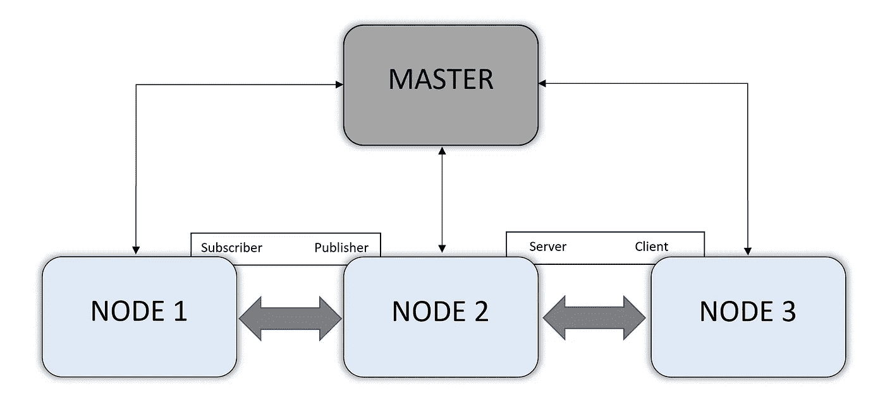
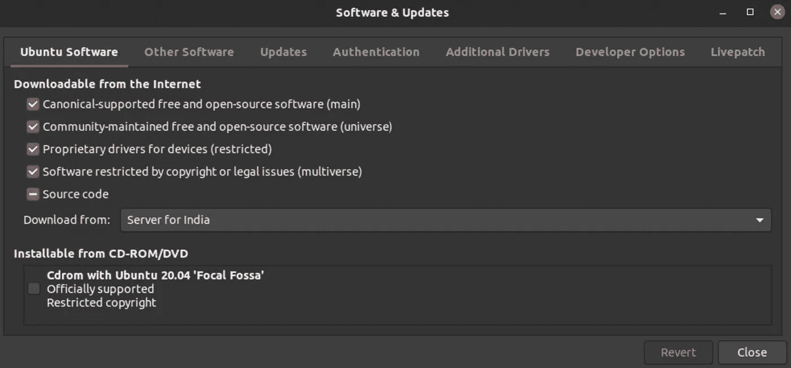

# 机器人操作系统入门

> 原文：<https://medium.datadriveninvestor.com/ros-setup-beginner-2cac74d9a6b6?source=collection_archive---------4----------------------->


Photo by [Lenin Estrada](https://unsplash.com/@lenin33?utm_source=medium&utm_medium=referral) on [Unsplash](https://unsplash.com?utm_source=medium&utm_medium=referral)

**什么是 ROS？** 机器人操作系统(Robot Operating System)或者更通俗地称为 ROS，是一个开源的、为你的机器人设计的元操作系统。ROS 系统基于发布者和订户的概念工作，典型的 ROS 系统具有许多独立的节点，这些节点或者从其他节点收集信息，或者发布由外部源接收的信息。为了执行这样的任务，ROS 有各种各样的特性，比如消息传递、低级设备控制、包管理等等。ROS 还拥有模拟工具，可以在 2D 虚拟测试您的算法，或者将您的传感器输入映射到多维可视化工具中。

**为什么是 ROS？？掌握 ROS 是一项艰巨的任务，但是一旦你熟悉了 ROS 的概念和功能，构建用其他方法可能无法实现的复杂系统就会变得非常方便。ROS 看起来很吸引人的另一个原因是它的灵活性，如果你的整个系统都在一台电脑上，那就没有必要了。有可能在机器人上有一个 raspberry pi，发布一些传感器数据，一台计算机订阅它，一个平板电脑控制机器人的运动。ROS 包或项目可以用任何语言编写，主要是 C++或 Python。作为一个元操作系统，ROS 独立于用于构建软件包的编程语言。
ROS 是一种行业标准工具，具有驱动程序和对大多数商业传感器的[支持](http://wiki.ros.org/Sensors)。**

**一般概念** 在 ROS 中，节点不能直接向其他节点索取数据。所有节点必须首先与主节点通信。主节点保存发布者/服务器的名称和它们正在发布的消息的类型，因此每当节点需要任何数据时，它必须首先与主节点通信，然后主节点基于由需要数据的节点给出的消息类型和发布/服务器节点的名称，将该特定节点定向到发布所需数据的节点。



在 ROS 中，节点之间有两种关系:
**1。**出版者和订阅者
把这想象成你每月订阅的杂志，一旦你订阅了这项服务，你每个月都会收到杂志，直到你停止这项服务。
发布者和订阅者以相同的方式工作，在上图中，将节点 2 视为发布来自温度传感器的数据的 raspberry pi，而节点 1 需要该数据，因此首先，它必须与主节点通信，并共享其所需的消息类型和发布者节点名称。然后，主节点将节点指向发布节点，在我们的例子中是节点 2。现在，一旦建立了节点之间的关系，节点 1 将继续接收数据，直到服务终止。

**2。**服务器和客户端
想象一下，如果你在绘制一年中每天的温度。为了绘制每日温度图，您只需要每天读取一次温度。在这种情况下，您将使用服务器和客户端。
服务器和客户端的工作方式与发布者和订阅者相同，唯一的区别在于，在这种情况下，客户端不会获得连续的数据，而是在客户端请求数据时获得服务器的值/读数。
在上图中，将节点 2 视为一个从传感器获取温度数据的 raspberry pi。现在，每当节点 3 请求数据时，节点 2 都会发送它在该特定实例中拥有的数据。因此，要绘制每日温度图，客户端每天只需请求一次数据。

现在让我们讨论 ROS 的基础知识，即安装和设置你的工作空间。

> 我运行的是安装在虚拟机 VirtualBox 上的 Ubuntu 20.04，内存为 6GB。

**让我们开始吧……**

# 安装 ROS:

第一步是确定要安装的 ROS 版本。写这篇博客的时候， [ROS Noetic Ninjemys](http://wiki.ros.org/Distributions) 是推荐给 Ubuntu 20.04 的 LTS(长期支持)版本。然而，当你发现这个博客的时候，它的最新版本可能已经更新或改变了。因此，根据您的系统配置找到合适的版本始终是一个好的做法。

一旦确定了要安装的版本。下一步是在终端中运行安装命令。

我将在 [ROS Noetic Ninjemys](http://wiki.ros.org/Distributions) 上安装，稍后将创建一个工作区。

> 如果你运行的是不同版本的 Ubuntu(Ubuntu 18.04)并且需要另一个版本的 ROS (melodic)，那么你只需要在安装时修改一行代码，如步骤 4 所述。

**步骤 1:** Ubuntu 库应该配置为允许“受限”、“宇宙”和“多元宇宙”。
这可以在您系统中的软件&更新应用程序中完成。



**步骤 2:** 设置您的系统接受来自 ROS 的包裹。

这可以通过在终端中简单地执行以下命令来完成。

```
sudo sh -c 'echo "deb [http://packages.ros.org/ros/ubuntu](http://packages.ros.org/ros/ubuntu) $(lsb_release -sc) main" > /etc/apt/sources.list.d/ros-latest.list'
```

**步骤 3:** 设置按键。

```
sudo apt-key adv --keyserver 'hkp://keyserver.ubuntu.com:80' --recv-key C1CF6E31E6BADE8868B172B4F42ED6FBAB17C654
```

如果密钥服务器存在连接问题，请执行以下操作

```
sudo apt-key adv --keyserver 'hkp://pgp.mit.edu:80' --recv-key C1CF6E31E6BADE8868B172B4F42ED6FBAB17C654
```

或者，您可以使用 curl 代替 apt-key，如果您使用代理服务器，这可能会有所帮助。

```
curl -sSL 'http://keyserver.ubuntu.com/pks/lookup?op=get&search=0xC1CF6E31E6BADE8868B172B4F42ED6FBAB17C654' | sudo apt-key add -
```

**第四步:**安装。

检查是否有新的软件包或更新总是一个好的做法。

这可以通过跑步来完成

```
sudo apt update
```

我建议安装完整的桌面版本，因为它有所有需要的模拟工具。但是，您也可以安装其他版本。

完整桌面版可以通过执行以下命令来安装

```
sudo apt install ros-noetic-desktop-full
```

> 要安装 ROS Melodic Morenia，请执行以下代码，而不是上面的代码

```
sudo apt install ros-melodic-desktop-full
```

要查明软件包是否已经安装，您可以执行以下命令来查找已安装的软件包

```
apt search ros-noetic
```

> 对于 ROS Melodic Morenia，执行以下代码代替上面的代码

```
apt search ros-melodic
```

**第五步:**设置环境。

如果每次创建一个新的 shell 时，所有的 ROS 变量都自动添加到 bash 会话中，这将非常方便。这可以通过编辑。bashrc”文件并添加“setup.bash”的位置。

首先，确保您在终端的主目录中，然后访问。bashrc '文件来编辑它

```
cd 
gedit .bashrc
```

现在在文件的末尾添加以下几行。另外，不要忘记保存更改。

```
source /opt/ros/noetic/setup.bash
```

> 恭喜你！！
> 你已经安装了 ROS 和所有必要的操作包。
> 现在您需要一个工作空间来创建您的项目。

# 创建工作空间:

ROS 已经有一个默认的工作空间，您可以在其中创建您的项目。但是在默认工作区中工作并不方便，通常情况下，您应该创建另一个工作区来管理您的所有项目。

您可以通过执行以下命令进入默认工作区

```
roscd
```

现在，我们将创建一个[柳絮工作空间](http://wiki.ros.org/catkin/conceptual_overview)。

在终端中执行以下命令。

```
cd
mkdir -p ~/catkin_ws/src
cd ~/catkin_ws/
catkin_make
```

这里我们制作一个名为‘柳絮 _ ws’的目录，然后用‘柳絮 _ make’编译它。

现在您的工作区已经准备好开发包(项目)了。要使此工作区成为您的默认工作区，您必须再次编辑。bashrc 的文件。

打开。bashrc '文件，方法是执行以下命令

```
cd 
gedit .bashrc
```

现在，在文件末尾用您的用户名替换 USER_NAME 后，添加以下代码并保存它

```
source /home/USER_NAME/catkin_ws/devel/setup.bash
```

现在打开一个新的终端，执行‘roscd’，你会发现默认的工作空间现在变成了‘柳絮 _ ws’。现在，您可以在“柳絮 _ws”的“src”文件夹中创建包。

最后，您的 ROS 设置完成了，您的工作空间也准备好了。

感谢你的阅读，希望这篇文章能帮助你开始使用 ROS。

*领英:*[linkedin.com/in/prerit-gupta-89028b162](https://www.linkedin.com/in/prerit-gupta-89028b162)