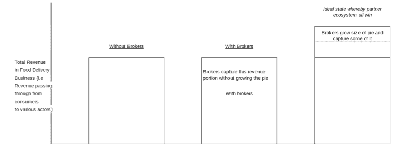
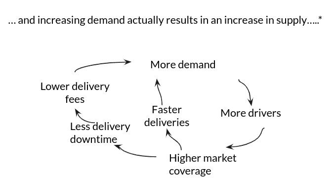

# 粗糙骑手:在线交付做市商，商业模式和寿命

> 原文：<https://medium.datadriveninvestor.com/rough-riders-online-delivery-market-makers-business-models-longevity-b9171159fbd2?source=collection_archive---------9----------------------->

> *停止，放弃，关闭，开店*
> 
> *哦，不*
> 
> *拉夫·赖德就是这样滚的*
> 
> *停止，放弃，关闭，开店*
> 
> 哦，不
> 
> *拉夫赖德就是这样滚的*
> 
> *—DMX 粗糙的莱德斯歌词*

对于网络送餐的做市商来说，路肯定不平坦。至少，人们可以假定，开店——并保持营业——是一件昂贵的事情。事实上，在最近的财报电话会议上，优步宣布 Eats 的收入为 8.19 亿美元，增长 53%，按不变汇率计算为 56%，但仍亏损 29 亿美元(诚然，比 2019 年亏损的 85 亿美元要好)。它在湾区的竞争对手 Doordash 并没有发现自己的情况有所好转，因为他们在 2020 年第一季度损失了近 3.98 亿美元。

 [## 为新冠肺炎转变 IT 中断的业务环境|数据驱动的投资者

### 持续的新冠肺炎危机严重扰乱了各行各业，首席信息官们不仅开始预测危机的影响…

www.datadriveninvestor.com](https://www.datadriveninvestor.com/2020/05/19/transforming-it-for-the-covid-19-disrupted-business-context/) 

那么，快递业务的可行性如何？他们真的应该停止、放弃、关闭他们的生意…或者加倍努力来维持商店的营业吗？

确实很难理解为什么投资者不断向在线公司砸钱，试图在实体店和饥饿的客户之间建立数字桥梁，而利润似乎远远超过了地平线。让我们剖析一下这是为什么。为此，我们可能需要首先投入到生态系统中。演员和他们的内在关系并不明显复杂，因为即使是像我这样的市场新手也可以描绘出它的主要组成部分(*起首部分*向我在 Stratechery 的朋友倾斜，他们应该得到最初描绘这幅风景的荣誉):

*图一:食品配送市场动态的演变。*

画布的背景:在这些在线平台融入生态系统之前，生产商会将商品分销给加工商，然后加工商再将商品大量转交给批发商。这些演员将直接分配给杂货商和/或餐馆，在那里包装和展示为妈妈和爸爸们打开了消费这些商品的大门。支持将资金分配给在线市场背后的参与者的风险资本投资假说如下:消费者愿意为他们喜欢的食物和膳食被送到的便利而付费。毕竟，消费者会不愿意为了一个小时不去当地餐馆的时间而付钱吗？该假设进一步假设，做市商将增加价值，因为他们将成为增加可自由支配的消费者支出的渠道，这反过来将积极影响杂货店/餐馆/分销商等的底线。消费者会为在网上购买他们通常会在外面吃的食物的便利而付费，所以当他们开始订购时，这种习惯会转变成一种更一致的习惯。因此，做市商将能够从杂货商和餐馆老板那里分一杯羹，因为这些活跃参与者的收入提升将显著增加，足以保证从创造供需(因此做市)中分得一杯羹。

获得客户并保持他们的忠诚度被证明是困难的，因为转换成本很低，而且服务本身会随着时间的推移变得商品化。由于这些服务的区别并不源于软件栈(我们稍后将回到这一点)，这种区别必须来自那些没有动机忠于平台的人。这些包括:快递员(你的快递越多，你每小时可以做的快递就越多，收入就越多)和餐馆/杂货店。是的，有人可能会认为交付体验可以使平台与众不同，但由于这种体验是由人交付的，我认为这强化了人力资本是差异化杠杆的观点。从另一个角度来看，生态系统中不同参与者签约的工人数量而非质量是衡量做市商区别的标准。此外，为了激励快递员和消费者，做市商不得不在他们身上花很多钱，希望获得供应和需求，从而产生高的终身客户价值(获得消费者的成本将是一次，因为他们可能会保持忠诚)。这并没有发生。首先，从 Uber Eats 到 Postmates 的转换成本几乎为零。这类似于同时为 Lyft 和优步工作的司机:当他们开车四处搭车时，没有什么能阻止他们打开这两个应用程序。其次，做市商没有做大众所周知的馅饼；他们没有推动足够的粮食收入增长，使他们和他们的粮食合作伙伴都能获利。这也没有给他们的快递合作伙伴带来更多的红利。正如现在著名的 Travis vs Kamel 的争论所表明的那样，优步要增加收入就必须增加司机的数量——同样的事情也会发生在优步外卖快递的供应上。这样做增加了快递员的数量，但供应的增加导致他们可以收取的费用下降(因此挑战了下面的良性/恶性循环)。是的，费用会下降，但这也意味着分配给司机的收入会下降:他们将不得不工作更多的时间，但不一定更多。

*图片二:右边是 Stratechery 的模型，描述了供应动态的良性(或恶性)循环，左边是馅饼问题的图解..随着做市商无法做大馅饼以保证他们的份额，同时剥夺快递员的时薪，这是不是毫无意义地发展业务的麻烦？*

鉴于这种残酷的未来，目前的玩家如何努力维持下去？遵循麦肯锡扭转利润的黄金法则:如果利润等于收入减去成本，并且不能影响收入，那么就削减成本。在供应链中寻找协同作用，以降低销售成本，并最大限度地提高每单位销售收入。做市商们完全遵循这一点。他们首先寻求与其他公司合并(见优步试图收购 Grubhub，截至 7 月 6 日，他们成功收购 Postmates ),以减少竞争对手的数量。或者，他们希望结束与剩余竞争对手的价格战。这两种情况都伤害了消费者，因为有限的选择创造了买方垄断(市场标记从他们的食品经销商/杂货店/餐馆老板那里争夺定价权，因为他们是唯一的分销渠道)和垄断(他们然后为消费者设定价格，最大化他们的盈余而不是他们的顾客)。而且，他们可以剥夺那些一开始就没有赚大钱的快递合作伙伴的权利——随着市场行情缩水或取消他们的奖金，他们现在会赚得更少。当然，他们可以解雇自己的员工(在过去的 18 个月里，优步不止一次地大规模裁员)。

这并不意味着盈利是不可能的:正如中国唯一的做市商所证明的那样，调整商业模式可能会带来长期的生存能力。Meithuan，中国的 Uber Eats，本质上调整了他们的商业模式，以最大限度地提高其移动应用程序每个用户的平均收入，而不是专注于最大限度地降低每个用户的平均交易规模。首先，Meithuan 向在其应用程序中放置广告的餐厅收取费用，并为更好的位置提取溢价(AdSense for mobile anyone？).诚然，由于美团平台的庞大规模，这种模式带来了丰硕的成果。相比之下，中国的在线食品配送市场估计为 400 亿美元，而美国目前为 220 亿美元。此外，美团每月收取会员费，以换取每次递送的价格优势(我们在美国见过这种模式:优质递送时间的优质服务)；这与更频繁的交付订单以及每个订单的平均价值正相关。Meithuan 不仅采纳了麦肯锡的建议，降低了等式的成本部分，还提高了另一边的收入部分。利润，崛起！没那么快——还有几个问题:随着商业模式的演变，快递员会发生什么变化，Meithuan 会通过削减他们的部分利润来奖励他们吗？可能不会，因为如果他们的任务是最大化股东的回报，而不是股东的利益，他们就没有动力。如果快递员知道他们没有得到他们应得的那份馅饼，这是可持续的吗？中国的政治经济与美国不同，所以快递员可能没有美国那么多的自由，所以从这个用例中吸取经验可能有其局限性。这最终是我的观点:为了让我们向中国同行学习，环境必须改变——打个比喻，我们把苹果比作橙子。

尽管如此，让我们尝试逆向思维，假设我们可以从中国的案例中进行推断，并承认魔鬼的论点:一旦美国市场达到与中国相当的规模，商业模式的这种调整可能会导致做市商的盈利寿命延长。这种讨论还得出结论，食品交付的增长将持续下去，因为新的规范导致越来越沉默的消费者留在室内，等待他们的食品被送到——供应链中的所有合作伙伴都将受益，因为更多的需求意味着更多的报酬。即使我们像前面提到的那样扩展我们的假设，这个论点仍然像一把钉子不稳的椅子一样摇摆不定。请允许我逐一击破。首先——不能保证更频繁地运送食物的新趋势会长期持续下去。随着需求的增加，做市商可能会接受这一信号，提高他们的收费，这可能会适得其反——毕竟，这项服务仍然是一种奢侈品。尽管从过去二十年的趋势来看，中产阶级正在萎缩(不平等指数上升)，但富人无法弥补日益衰落的中产阶级的支出。第二个问题:加州将快递员归类为雇员的法律将对底线造成如此大的冲击，以至于任何需求的增加都无法弥补流入做市商底线的成本飙升。激烈的诉讼只会导致钱被点着——更多不可持续的成本。第三，支持广告商业模式的移动应用中的展示次数不能保证创造可持续的长期收入流。最具可持续性的广告业务，谷歌，在他们的搜索业务中拥有相对的技术优势，因为他们能够将意图转化为符合人们需求的产品或商品。他们是主动搜索，但登录 postmates 的用户是被动浏览；Uber Eats of the world 更有可能预测偏好和/或意图的方式是投资于人工智能能力，以预测用户想要什么，这依赖于通过合并用户行为数据拼凑起来的丰富用户档案(这种策略越来越受到公众舆论的厌恶)。无论如何，这需要在工程师和技术开发上的投资，这将花费更多的钱，而且不一定能很快盈利。所有这三个挂钩都被敲了，因此亏损领先的企业小跑。

可悲的是，投资于技术是在线快递业务做市商的唯一出路:专注于软件，而不是改变商业模式，以使快递业务可持续发展。我们只要看看过去就能预测未来。早在 19 世纪，驿马快信代理通信。这不是一个可持续的业务，因为它被密集的资本需求(马匹和马车)和劳动力成本(快递)所拖累。最终，电报取代了驿马快信。交割做市商死了，做市商万岁！covid 展示的是遥远的想法——无人机、自动送餐的小型车辆——越来越比科幻小说更现实。亚马逊寻求收购自动驾驶 Zook 是朝着正确方向前进的标志:专注于改善产品体验以更快更快地提供服务将对底线产生更大的影响。自动驾驶汽车和无人机将对底线产生影响，因为随着技术的出现，交付成本大幅下降。正如我们已经看到的，人力资本同时是企业最大的区别和最大的负债。完全切断它的未来证明业务。这也是为什么风投公司不断把钱投给这些做市商——希望他们能在短期内获得用户，并省去中间商(courriers ),以实现长期利润最大化。

*图三:回到未来——在软件堆栈上创新可以保障企业的盈利能力。*

抛开对股东至上心态的愤世嫉俗的看法，随着自动驾驶汽车和送货车辆的引入，对投资者最好的东西和对消费者和生态系统合作伙伴有利的东西之间的错位只会扩大。那些依靠额外收入——或者说唯一收入——运送食物的快递员会怎么样？他们现在会成为确保无人机和/或机器人始终正常运行的机械师吗？由资本主义机器领导的创造性破坏认为，新技术会围绕创新创造新的就业机会，尽管我是乐观主义者，但这种转变不会一帆风顺。即使政府真的推出了大型资助项目，如全民基本收入、就业保障、基础设施更新投资等，需要数百万辛勤工作的人，这些政策也需要一段时间才能通过两极分化的立法机构。短期内，做市商将继续烧钱，他们的合作伙伴可能不会更富裕。那些粗野的骑手，他们就是这样滚的。

— —

1-[https://investor . Uber . com/news-events/news/press-release-details/2020/优步-公布 2020 年第一季度业绩/](https://investor.uber.com/news-events/news/press-release-details/2020/Uber-Announces-Results-for-First-Quarter-2020/)

2-[https://investor . lyft . com/news-releases/news-release-details/lyft-announced-first-quarter-results](https://investor.lyft.com/news-releases/news-release-details/lyft-announces-first-quarter-results)

3-【https://techcrunch.com/2020/05/18/more-uber-layoffs/ 

4-[https://www . the information . com/articles/meituans-turnaround-holds-lessons-for-Uber](https://www.theinformation.com/articles/meituans-turnaround-holds-lessons-for-uber)

5-[https://www . the information . com/articles/meituans-turnaround-holds-lessons-for-Uber](https://www.theinformation.com/articles/meituans-turnaround-holds-lessons-for-uber)

6-我的论点假设美国收入分配的钟形曲线已经向左倾斜——这意味着，虽然年收入超过 184，000 美元的前 10%的美国人更有可能在送货上花钱，而且更经常地花钱，但负担不起这种奢侈品的 90%的美国人会更多地减少与第 10%的人外出就餐有关的增长。

**访问专家视图—** [**订阅 DDI 英特尔**](https://datadriveninvestor.com/ddi-intel)