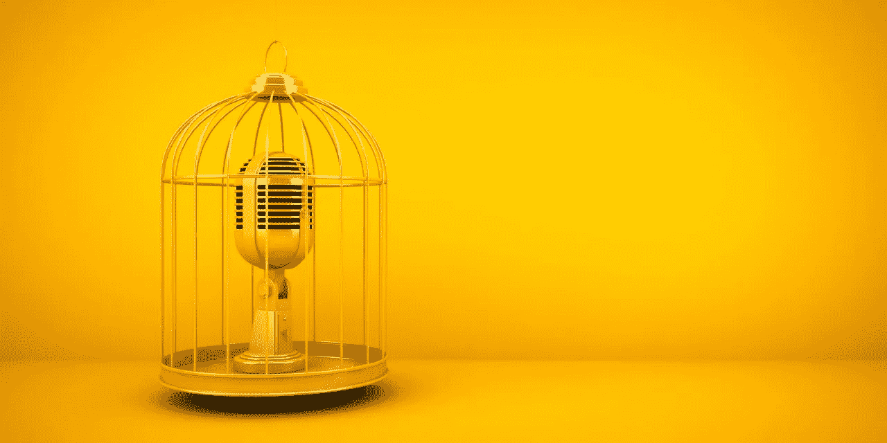
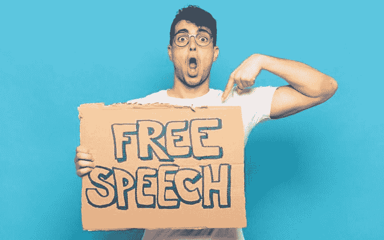
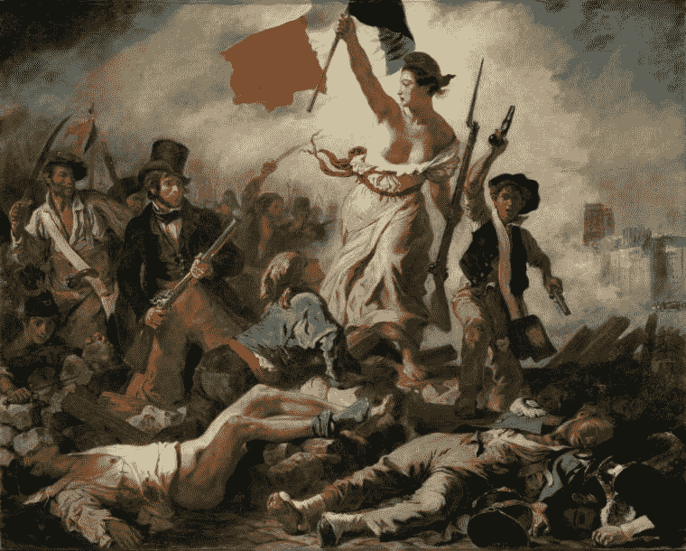

# 要打破的规则。互联网让你匿名

> 原文：<https://medium.datadriveninvestor.com/rules-to-break-a-code-for-living-your-life-your-way-part-1-cancel-culture-a8475fc2996?source=collection_archive---------33----------------------->

Photo by @freepik via freepik.com

理查德·坦普勒所著的《打破规则——以自己的方式生活的个人准则》一书揭示了所有那些来自老师、父母和朋友的善意的规则和忠告，这些规则和忠告不知何故已经在我们心中根深蒂固。问题是，这些规则中有许多往往是不正确的，但它们对我们的生活有着重大影响。我们不应该盲目地接受别人为我们制定的规则，而应该学会质疑它们，独立思考，并更灵活地做出判断。这篇文章是我决定写的一系列文章的第一篇，为你提供一些打破规则的选择，今天的问题是互联网是否让你匿名，为什么言论自由如此重要，以及*取消文化*如何在这些天成为一件事。

# 打破规则:互联网让你匿名。

Photo by @freepik via freepik.com

公认的规则是互联网让你匿名。理查德·坦普勒不同意。他说，独自一人坐在你的卧室里，看着你的电脑，觉得没人能看到你，这太容易了。你像面具一样使用你的电脑，除了你的电脑没有隐藏你的真实身份。你可能会对你的社交网页或电子邮件感到某种程度的超然，但阅读它们的人非常清楚这些文字或图片直接来自你。所以，你必须为你在网上说的和做的负责。如果你不愿当着某人的面说什么，也不要对脸书说。考虑你发布的图片或者你发送的邮件的语气。如果你不想在网下做或说，那就不要在网上做或说。如果有疑问，不要这样做。

# 新规则:互联网不会让你匿名，但它可以让你成为英雄或傻瓜。

> 社交媒体让你对不尊重他人和不被打脸感到太舒服了。—迈克·泰森

这些天有很多关于*取消文化*的讨论，维基百科将取消文化定义为一种现代形式的排斥，即某人被赶出社交媒体或职业圈，无论是在社交媒体上还是在现实世界中，或者两者都有。那些受到这种排斥的人据说被取消，即在文化上被阻止拥有一个突出的公共平台或职业。

一方面，我们有些人纵容、鼓励并参与*取消文化，*这些人倾向于将自己视为民权活动家，并将他们的活动浪漫化为某种激进但必要的公民正义形式。另一方面，我们有被取消的受害者，因为一个错误的词、帖子、推文、图片或声明(顺便说一下，这完全属于法律的职权范围)，他们可以看到他们的整个生活和生计被摧毁。

> 美国宪法第一修正案保护言论、宗教和新闻自由。在联合王国，1998 年《人权法》第 10 条保护言论自由:“每个人都有言论自由的权利；此项权利包括持有主张的自由，以及接受和传递消息和思想的自由，不受公共当局的干涉，也不受国界限制，不论是口头的、书写的、印刷的、采取艺术形式的或通过他所选择的任何其他媒介。”

# 优越规则:言论自由是所有个人不可剥夺的基本权利

Photo by @freepik via freepik.com

一切形式和表现的言论自由是所有个人不可剥夺的基本权利。此外，这是一个民主社会存在的不可或缺的要求。与此同时，人们也普遍认识到，言论自由不是一项绝对的权利，每个民主国家都制定了一些限制言论自由的制度。对言论自由的任何限制首先必须由法律规定，其次，必须是为了保护合法和压倒一切的利益。例如，言论自由的常见限制或界限涉及诽谤、中伤、淫秽、色情、机密信息、侵犯版权、商业秘密等。

*取消文化*是对思想、表达和言论自由的直接冒犯。这个想法是责备、羞辱和摧毁目标。没有规则，没有行为准则。这是一个开放的季节，它的运作超出了土地法的管辖范围。你不能真的把它描述为一场运动，因为它既没有领导人也没有成员，那些参加它的人也不稳定，但这是一种在政治舞台上经常被用来排斥持不同政见者的做法。不清楚目标是纠正具体的错误和不公正，还是大声反对和谴责一个不可信的制度，并呼吁建立一个更公平的制度，还是仅仅为了运动和羞辱和摧毁目标的快感。

你是谴责还是宽恕*取消文化*取决于你，这可能是一些激烈辩论的主题，但对我来说，*取消文化*完全是关于我们如何交流和对待彼此。仅仅因为某人对某个特定主题的观点就想毁掉他的生活和生计，这种做法太过分了；这表明了缺乏体面，太多的不容忍，最重要的是，媒体的力量惊人的过度。如今，仅仅因为以下原因而被去平台化、审查、禁止进入你的社交媒体并不罕见；媒体公司授予自己审查的最终权力，这远远超出了国家法律允许的范围。想一两分钟，让它深入人心。

# 因果报应法则

French Revolution. Eugene Delacroix

但是要小心，因为钟摆总是向两个方向摆动；你可能是今天取消文化的肇事者，明天成为目标。一个生动的例子是始于 1787 年的法国大革命，这是一场反对君主制的民粹主义运动。起义的高潮是路易十六和他的妻子玛丽·安托瓦内特被斩首。

马克西米连·罗伯斯庇尔是法国历史上这一时期的一个有争议的人物。他以律师起家，成为政治家和法国大革命的革命人物，积极参与反抗法国君主制；他在帮助建立一个基于自由、平等和博爱原则的新共和国方面发挥了积极作用。但是现在我们都知道，*权力会腐败，而且绝对会腐败。*

罗伯斯庇尔变得如此痴迷于“*不惜一切代价捍卫*革命思想的想法，以至于他自己成为了一个无情而血腥的独裁者，将自己的意志强加于所有人，并对近 17000 名“*持不同政见者的屠杀和公开处决负有直接责任。罗伯斯庇尔有一句名言:“没有恐怖的美德是无能的”。法国历史上的这段黑暗时期被称为恐怖统治时期。*

最终，一群勇敢的灵魂决定适可而止，恐惧和杀戮必须停止；所以，他们决定让罗伯斯庇尔尝尝他自己的药。他们自作主张逮捕了罗伯斯庇尔和他的犯罪同伙，并在处决路易十六和玛丽·安托瓦内特的同一台断头台上公开处决/取消了他们。这次最后的处决结束了恐怖统治。

Joanne Reed The Author
Author of “This Is Your Quest”. You can’t buy happiness but you can buy books. Your mission, should you wish to accept it is to experience happiness