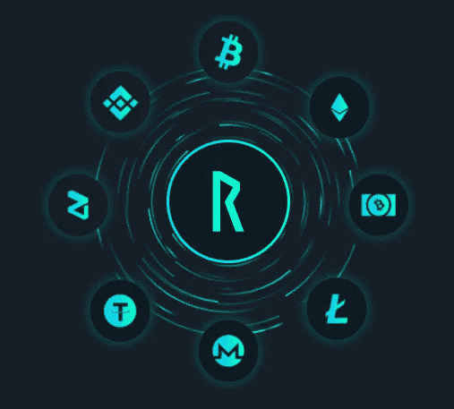

# 符文:通往阿斯加德克斯之路

> 原文：<https://medium.datadriveninvestor.com/rune-the-road-to-asgardex-bb469887ab6?source=collection_archive---------3----------------------->

我最初是在 2019 年 12 月的一条推文中以一种相当熟悉的方式听说 Rune 的，这条推文的内容是:“嘿，Twitter，把你最喜欢的替代硬币卖给我。”研究了几个建议后，Rune 脱颖而出。为什么？来自分散交易所的跨链交易的承诺。地毯拉拉队还没有成为我们日常生活的一部分，5 分钟的研究就足以让我赚到一些辛苦赚来的谢克尔。

Source: Thorchain.org

快进到不到一年的时间，我看到 Rune 从 0.08 美元涨到一美元多，然后又回落到现在的 0.49 美元。更重要的是，Chaosnet 以一种成功而令人兴奋的方式推出。在这段时间里，这个团队一直在继续努力，我的信心也越来越大。

**为什么这种信心增强了**？独特的词汇组学(这是我最喜欢的流行词，我坚持使用它)。我不打算讨论符文本身的奖励分配，因为我不认为这是驱动我兴趣的根本。那简直是锦上添花。

 [## 完美的加密交易策略|数据驱动的投资者

### 如果你在交易游戏中已经有一段时间了，你可能听说过“支点”和“VWAP”前者听起来像…

www.datadriveninvestor.com](https://www.datadriveninvestor.com/2020/08/31/the-perfect-crypto-trading-strategy/) 

每个 dex 都有流动性池，但 Thorchain 的运作方式略有不同。Rune 是 LP 和 Thorchain 生命线中必需的合作伙伴，如果/当/随着平台扩展，会产生有保证的需求。简单来说，符文是 Asgardex 运作的根本。我从这个功能中看到了多种好处 **:**

1)随着网络内**流动性**的增长，提供商将需要用他们选择的硬币来押注 Rune。收益率目前非常有吸引力，超过 60%的 APY，我不担心随着基金上限的解除，更多的价值将进入网络。

2)假设我们正在进入牛市阶段，市场价值的普遍上涨将带动 Rune 上涨。这是流动性池工作方式的一个巨大副作用；我很乐意参与其中。

3)确保网络安全的节点运营商需要将 Rune 绑定到网络，这进一步增加了在竞争激烈的战场上的需求，在这个战场上，节点运营商必须毫不夸张地提高他们的赌注才能留在游戏中。

自 Chaosnet 推出以来，一些小问题很快得到了解决，网络也不断发展壮大。本地比特币的推出似乎指日可待，如果成功完成，将是一个突破性的壮举。就我个人而言，我很高兴有一天我可以不通过交易所直接用代币兑换 BTC。我欢迎这一创新。

如果这还不够，社区充满热情，不断致力于新的发展，以使用户体验更好。在符文价格快速上涨期间，雷神 Gif 推文也有一些相当令人兴奋的东西(插入符文游侠推文)。

这是一个项目，我很高兴持有，参与，看着它发展到跨链 dex，这是注定的。我们在 Asgardex 见。

## 访问专家视图— [订阅 DDI 英特尔](https://datadriveninvestor.com/ddi-intel)