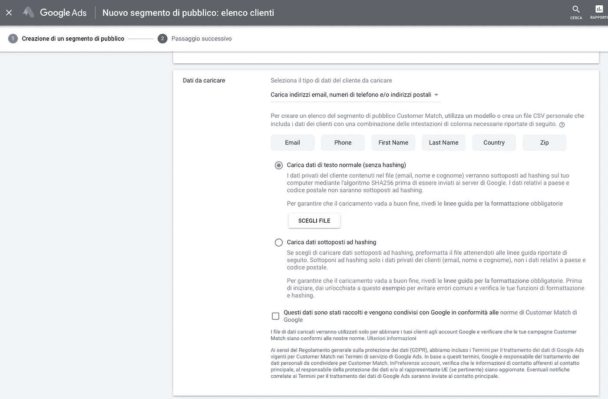

# 借助高级客户细分开展更好的营销活动

> 原文：<https://medium.datadriveninvestor.com/running-better-marketing-campaigns-w-advanced-customer-segmentations-5c55a9f90ba?source=collection_archive---------14----------------------->

# 营销不能在孤岛中运作。

当团队中的工作开始时，它与产品、客户支持、销售和运营团队一起发展，并成为业务的核心。

原因是营销仍然是至关重要的，因为在漏斗的任何阶段的影响增加销售，吸引新客户，产生潜在客户，提高品牌知名度和整体客户满意度。

营销活动总是从一个商业目标开始:提高品牌知名度，增加新的线索，增加应用程序的下载量，或者接触更多的受众，以促进电子商务销售。

您目前是如何实现这些目标的？

在接下来的步骤中，我将向**解释吸引更多**和更多客户来**提升您的电子商务收入的流程。**

# 1.开始导出您的谷歌分析数据

从我们现有的数据出发，能够截取最符合我们业务的公众是非常重要的。在本指南中，我将考虑通过谷歌分析跟踪生成的数据。

一旦你阅读了本指南[你就可以收集所有被追踪的数据，以创建 RFM 分析来了解你的客户群。由于这种算法，您可以根据分位数计算，根据客户的购买行为创建一个简单的客户细分。本文允许您轻松地生成集群化，这要归功于附在页面底部的表格，您可以在其中找到所有可以使用的计算。](https://alexgenovese.it/blog/customer-journey-segmentation-using-google-analytics-and-gsheets/)

您可以丰富您的数据[，为每个客户会话创建一个唯一的 **UserID** ，并在提示时关联其电子邮件( **ClientID** )](https://alexgenovese.it/blog/blending-data-using-google-analytics-and-google-data-studio/) ，以便提取所有交易和客户数据，从而创建客户群并绘制其客户旅程。

**请注意，您的隐私政策符合实际的国际 GDPR 法律。**

例如，当您创建这些与定制目标相关联的定制维度( [UserID](https://alexgenovese.it/blog/blending-data-using-google-analytics-and-google-data-studio/) 和 C [lientID](https://alexgenovese.it/blog/blending-data-using-google-analytics-and-google-data-studio/) )时，会生成以下数据。

在大查询中导出数据或简单地在您的 Google Sheet 上导出数据，可以将它们与其他 Google Analytics insights 集成，**作为主键**引用这些自定义字段。

以下链接用于使用谷歌工具在谷歌分析上查询数据，以评估哪种维度和指标的组合可能更有趣。

继续下一步，即 RFM 分析，需要导出算法的所有必填字段:

https://ga-dev-tools.appspot.com/query-explorer/?**谷歌工具** — *交易信息*
[开始日期=2020-09-01 &结束日期=昨天&指标= ga % 3a users % 2 CGA % 3a transactions % 2 CGA % 3a transaction revue&维度= ga % 3 transaction id % 2 CGA % 3 date&排序= ga % 3 date](https://ga-dev-tools.appspot.com/query-explorer/?start-date=2020-09-01&end-date=yesterday&metrics=ga%3Ausers%2Cga%3Atransactions%2Cga%3AtransactionRevenue&dimensions=ga%3AtransactionId%2Cga%3Adate&sort=ga%3Adate)

如果正确地创建了 ClientID 维度，还可以导出 customer email 列，一次性获得所有信息。

# 增强谷歌分析中的数据

一旦您从 CRM、电子商务或其他渠道导出这些数据，您就可以导入**交易 ID 以及我们客户的购买产品和人口统计信息，**以增强和丰富您的客户档案和订单洞察力。

点击此链接进入关于此主题的官方 [Google 指南](https://support.google.com/analytics/answer/3191589?hl=en)，继续导入这些信息。

# 1.1 一次性导出您的电子商务数据

您可以使用 SQL 查询或 ETL 工具导出您的电子商务数据，清理并规范化所有值，然后将它们放入 Google Sheet 中。

如果你有一个 Prestashop，你可以使用 SQL 查询工具，内置在电子商务的订单表中。

如果您有 Shopify 或 Magento 2，您可以使用它们的本地 API 将它们连接到 Integromat，以便导出所有订单数据。

# 1.2 使用 GA4 在大查询中导出 Google Analytics 数据

升级到新的 GA4，以便轻松地将您的数据集成/导出到大查询**中，从而像使用 360 版本**一样对其进行操作和规范化。

这种方式有点复杂，但你可以深入你的数据分析，并提取任何你需要的专业人士。

例如，您可以了解每笔交易的所有相关**信息，了解哪些产品是最常购买的**、**哪些产品是最常一起购买的**在特定的集群中，或者也是为单个客户购买的。

# 2.使用 RFM 创建客户细分

在 Google Sheet 中报告您的数据，您应该能够很容易地获得一个类似于下图的表格，从中您可以实际了解哪些是您的最佳客户，哪些是您应该更加关注的客户，以及其他客户。

是的，我知道，以这种方式阅读客户见解并不是一件容易的事情…这就是为什么在接下来的一点中，我将向您展示如何在 Data Studio 仪表板中展示他们。

# 3.Data Studio 仪表板

由于有了这款产品，我们可以读取之前导出的所有见解，并应用过滤器来深入探索细分市场。

打开 Data Studio 并点击:

*   “新建/报告”,并从顶部菜单选择“添加数据”,这将打开一个可以集成许多其他来源的模型。
*   选择 Google 工作表，然后选择您在上一步中工作的工作表和您的 RFM 所在的选项卡。

为了让您的工作更轻松，在链接下方，您会发现一个现成的 Google Studio 仪表盘。

由于几乎所有可用图表中都有数据过滤器属性，因此可以检查单个客户或集群，以了解有关以下方面的有用和重要信息:

*   每个集群和客户的 AOV
*   每个集群和客户的 LTV
*   客户群是如何构成的
*   我亏损的主要领域是什么

如果您的数据包含单笔交易中购买的产品的信息，您可以分析一些对您的活动更有用的见解，了解客户的购买行为，以便在脸书创建**特设传送带，例如**。您可以提取一些信息:

*   每个细分市场中购买最多的产品
*   与其他产品一起购买的最常见产品

使用下一节中所示的过滤功能，可以导出每个细分市场，以用于营销活动或营销自动化流程。

# 4.在营销广告活动中使用数据

我将只讨论两个渠道，我认为这是大多数专业人士/企业主最常用的渠道。

# 4.1 脸书广告

出口冠军或忠诚的部分，你可以创造一个 LAL 观众，以获得新的观众有这些特点，并有可能对你的商品感兴趣。

通过选择我们最感兴趣的集群，我们可以随后导出它们:

数据导出到 CSV 后，您必须清理并准备好导入到脸书，并与默认 CSV 列合并，其中包括几个未使用的字段，在本例中，应删除这些字段，保留数据中的字段。

# 4.2 谷歌广告

类似地，您可以导入一个客户列表，如下所示，在 Google Client Center(如果可用的话)或 Google Ads 帐户中共享该资产。

在这里，我们有两种方法:

*   在谷歌广告中创造 LAL 受众；
*   在 Google Analytics 中创建自定义受众。

第一个选项更简单也更准确，因为第二个选项主要取决于收集的信息量和采样集:**如果您保留默认选项，那么您将获得较低的采样。**

你可以使用标签管理器，在谷歌分析标签中修改它，如下所示，添加值为 **100** 的 **siteSpeedSampleRate** 。

# 4.2.1 在谷歌广告中创造 LAL 受众

登录您的 Ads 帐户，点击:

*   工具和设置，然后在“共享库”点击“管理观众群”；
*   您将进入受众分群部分，使用左侧的+按钮，选择“客户列表”；
*   下面您可以看到从 Data Studio 加载导出的 CSV 时应该查看的屏幕。

# 4.2.2 在 Google Analytics 中创建自定义受众

登录您的 Google Analytics 帐户，进入“受众”部分，在此视图顶部，访问专门面向受众的部分。

在那里，你可以根据人口统计数据创建一个新的集群，选择你的客户群的具体信息或从谷歌分析中获得的数据。

> ***PRO TIPS*** *—在本文的第二点，您可以从 Google Analytics 导出所有人口统计数据，在创建 RFM 分析时，添加这些信息并在 Data Studio 中表示它们。*

根据您的客户行为和购买数据，您必须在“增强型电子商务”选项卡中选择如下内容:

**注意—** 子集是抽样的，请注意此桶中的总用户数，因为根据您选择的过滤器，它可能不会太大或不适合为 Google 广告活动创建类似的受众。

一旦您保存了该部分，您需要通过点击以下链接使其可用:

将会打开一个页面，您可以**输入搜索的日期**和**订阅的持续时间**:这些参数表明数据样本必须有多相关——这是您的选择。

选择这些设置后，为该细分市场选择一个名称，并选择要共享的帐户广告。

按照上一点的前两个步骤，您将在表格中看到 Google 正在创造的新受众群，这些受众群将很快在您的**营销活动中推出，并增加 roa:)**

# 开始制定一个能产生新的持续收入流的增长计划。预约电话，进行免费评估。