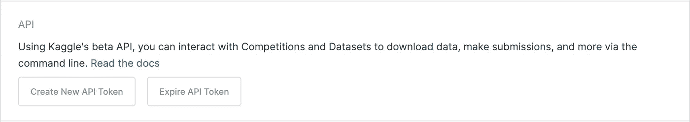
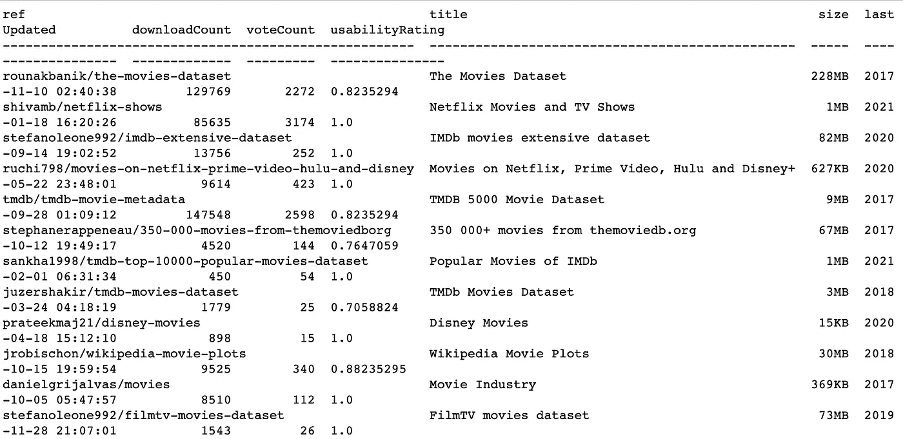
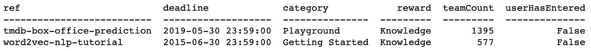

# 运行 Kaggle API

> 原文：<https://medium.datadriveninvestor.com/running-the-kaggle-api-69d048705185?source=collection_archive---------9----------------------->

简单的方法


Photo by [Campaign Creators](https://unsplash.com/@campaign_creators?utm_source=medium&utm_medium=referral) on [Unsplash](https://unsplash.com?utm_source=medium&utm_medium=referral)

我们年轻的数据科学家经常需要新的项目来帮助我们的专业投资组合。找出项目内容的最简单方法之一是搜索存放数据集的网站。虽然 Kaggle 被认为是查找数据的一种简单方法，但它是一个很好的地方。Kaggle 经常有正在进行的比赛，你肯定可以使用他们的数据。但是还有更多。Kaggle 拥有成千上万的数据集，这些数据集不一定是为了数据科学竞赛而上传的。

当您找到梦想中的数据集时，您需要下载它，然后将下载的文件夹移动到项目文件夹中。这无论如何都不难，但是如果你不把你的数据科学项目文件夹放在你的桌面上，这肯定会有点烦人。

我最近才想到的一个解决方法是看看 Kaggle 是否有一个 API 可以直接将数据集下载到您的项目中。快速搜索和… *当然，Kaggle 有一个 API，这是一个为数据科学家制作的网站。*另一个搜索，我进入了[官方 API GitHub](https://github.com/Kaggle/kaggle-api) ，它通过命令行引导你完成连接。这对我来说不是最简单的，所以我在 YouTube 上找到了一个来自用户[决策森林](https://www.youtube.com/watch?v=gkEbaMgvLs8)的令人难以置信的教程，它要简单得多，包括直接从你的 Jupyter 笔记本上安装 Kaggle API。

我将带您从 Jupyter 笔记本上，按照 Decision Forest 的方式安装 API。

使用 Jupyter 打开您想要存放新项目的文件夹。

在代码单元 install Kaggle 中键入以下命令:

```
!pip install Kaggle
```

然后你想做一个 Kaggle 文件夹，一般是隐藏的(。kaggle)，最好是在你的用户文件夹里，这样就不会被埋没了。

```
!mkdir ~/.kaggle
```

接下来，您希望登录 Kaggle 网站获取一个 API 令牌。点击右上角的个人资料，然后选择“帐户”。

向下滚动你的帐户设置到一个标有“API”的框，如下所示。



单击“创建新的 API 令牌”并按照提示下载。json 文件添加到您的用户文件夹。

现在您已经下载了 API 令牌，再次打开 Jupyter 笔记本，在新的单元格中键入以下命令来移动。json 文件到隐藏的 Kaggle 文件夹中:

```
!cp /Users/<your user name>/kaggle.json /Users/<your user name>/.kaggle/kaggle.json
```

如果你想仔细检查你的。json API 令牌进入隐藏文件夹，只需将目录更改为。kaggle 文件夹和列出其中文件的命令:

```
!cd /Users/<your user name>/.kaggle && ls
```

现在你应该连接上了！

如果你打开 [Kaggle API 链接](https://github.com/Kaggle/kaggle-api)，你可以看到 Kaggle 的命令向你展示数据集、比赛或者内核。例如，搜索数据集如下所示:

```
!kaggle datasets list -s "movies"
```



假设您想要下载出现在我们的电影数据集搜索中的第一行。您希望通过在如下命令中复制“ref”地址来指定要下载的数据集:

```
!kaggle datasets download -d rounakbanik/the-movies-dataset
```

如果成功，您将看到下载正在进行！

如果你想看竞争数据集，像这样搜索:

```
!kaggle competitions list -s 'movies'
```



要下载其中一个竞争数据集，请在另一个 Jupyter 单元格中键入并运行以下命令，再次使用 ref:

```
!kaggle competitions download -c tmdb-box-office-prediction
```

如果你返回一个错误，我建议用“kaggle api”搜索错误代码，因为各种事情都有可能发生。例如，当我第一次尝试运行 API 时，我收到了一个“403 禁止错误”。快速搜索后，我发现我只需在下载前接受比赛规则。

就是这样！简单对吗？！所有的荣誉都归于[决策森林](https://www.youtube.com/channel/UCHz35rvIKf2CMqj7oiMv9WQ)制作了一个很棒的视频——跟随他吧！

我希望你能够连接，如果出现任何问题，请随时留下评论，我可以尝试帮助你！

干杯，

奥林