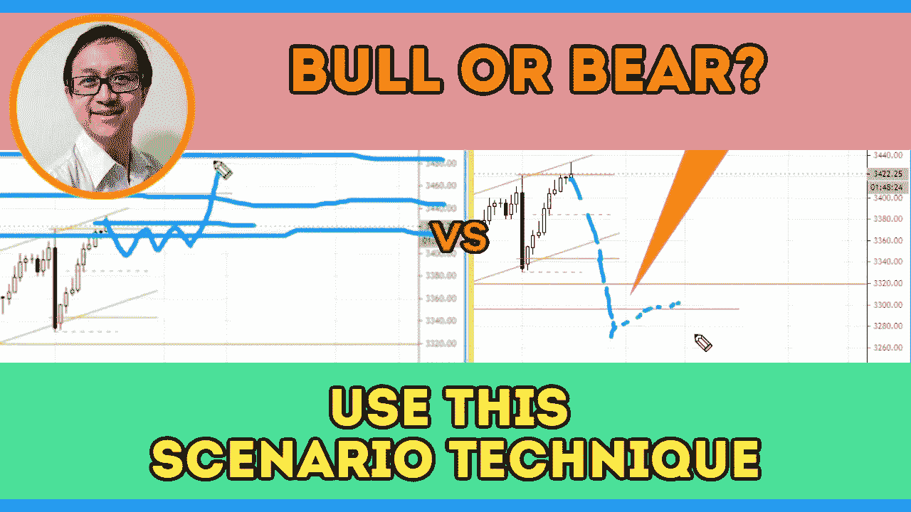

# 如何用这种情景技巧判断股市走向(没人告诉你)

> 原文：<https://medium.datadriveninvestor.com/s-p-500-bearish-vs-bullish-market-where-is-the-stock-market-heading-b397cd3824df?source=collection_archive---------32----------------------->

在市场展望部分，你会发现股票市场的潜在走向和**牛市和熊市的可能情景，以及如何寻找确认**。

观看视频，了解 2020 年 10 月 8 日交易时段标准普尔 500 指数期货的**每日市场分析。在这段视频中，我将向大家展示上一个交易日的市场回顾和三分钟内的交易回顾(包括进场、出场和背后的原理)。展望未来，我将涵盖偏见，要注意的关键水平，我稍后的交易计划。**

## 时间戳

*   [1:06](https://www.youtube.com/watch?v=4xgk6VKtg4U&t=66s) 市场回顾
*   [5:00](https://www.youtube.com/watch?v=4xgk6VKtg4U&t=300s) 行业回顾
*   [5:30](https://www.youtube.com/watch?v=4xgk6VKtg4U&t=330s) 滚圆底部
*   [7:59](https://www.youtube.com/watch?v=4xgk6VKtg4U&t=479s) 突破、回调、反转
*   [11:05](https://www.youtube.com/watch?v=4xgk6VKtg4U&t=665s) 当前市场前景
*   威科夫堆积结构
*   [14:00](https://www.youtube.com/watch?v=4xgk6VKtg4U&t=840s) 牛市的确认
*   [15:15](https://www.youtube.com/watch?v=4xgk6VKtg4U&t=915s) 阻力为目标
*   [16:15](https://www.youtube.com/watch?v=4xgk6VKtg4U&t=975s) 熊市的确认

如果你还没有看我在上一次会议中的[每日市场分析视频](https://www.youtube.com/watch?v=7DT0Va75zTg)，以便更好地了解市场回顾和交易回顾。

**偏向** —中性(日内交易)；看涨(长期)

**关键水平** —阻力:3420–3450；支持:3380、3300–3320、3200–3230

**潜在设置** —在关键级别寻找潜在反转。

# 资源

**每周市场展望&最佳交易建议**直达您的收件箱:[https://www.tradeprecise.com/](https://www.tradeprecise.com/)

**专业免费**制图平台:创建账户→【www.TradingView.com 

**非美国居民？** ( **马来西亚、新加坡**、澳大利亚、新西兰、欧洲等……):[点击此处，存款 2000 新加坡元](https://ji.hn/sgtiger)即可获得**免费股票(价值 100 美元++ &老虎经纪**的欢迎礼物)

美国居民？[点击此处，当您存入 1500 美元](https://ji.hn/ustradeup)时，就有机会在 TradeUP 上获得一份**免费的 AMZN 股票(价值 3000++美元** ) & **欢迎礼物**

**无限制访问媒体文章** —加入以下:[https://priceactiontrading.medium.com/membership](https://priceactiontrading.medium.com/membership)

# 进一步阅读

 [## 大头针，快照，TWTR 跑赢市场-准备暴涨？

### 上周，当市场正在调整时，大多数股票都受到了重创。然而，大头针，快照和 TWTR…

medium.datadriveninvestor.com](/pins-snap-twtr-outperform-market-ready-to-skyrocket-ef8dddb6c025)  [## 市场修正，泡沫还是崩盘？标准普尔 500 价格行为分析

### 标准普尔 500 期货(es)昨日因供应激增下跌 2.5%，跌破上行通道。这是正常的…

medium.datadriveninvestor.com](/market-correction-bubble-or-crash-s-p-500-price-action-analysis-6f26e6698dbc)  [## 凯西·伍德警告市场即将调整——标准普尔 500 价格走势分析

### 在 2020 年 12 月 18 日对彭博的采访中，方舟投资公司的首席执行官兼首席信息官凯西·伍德警告说…

medium.datadriveninvestor.com](/cathie-wood-warns-market-correction-soon-price-action-analysis-on-s-p-500-7e621e013310) 

Photo by Author — Ming Jong Tey

Photo by Author — Ming Jong Tey

披露:如果您点击本文中的链接进行购买或开立账户，并将所需金额存入推荐的经纪人账户，我们将免费为您赚取佣金。

免责声明:本演示中的信息仅用于教育目的，不应作为投资建议。