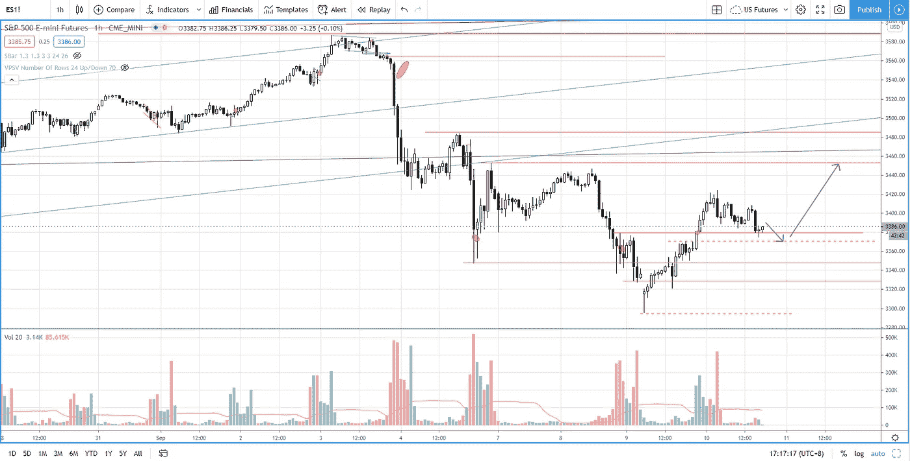

# 胜率高的突围策略(没人告诉你)

> 原文：<https://medium.datadriveninvestor.com/s-p-500-breakout-strategy-with-high-winning-rate-4c525eca7000?source=collection_archive---------9----------------------->

在回顾部分，你会发现如何交易突破，以增加你的成功概率，背后的逻辑是为什么它会起作用。

观看视频，了解 2020 年 9 月 10 日交易时段标准普尔 500 指数期货的**每日市场分析。在这段视频中，我将向您展示上一个交易日的市场回顾，以及三分钟时间内的交易回顾(包括进场、出场及其背后的原理)。展望未来，我将涵盖偏见，要注意的关键水平，我稍后的交易计划。**

## 时间戳

[0:53](https://www.youtube.com/watch?v=9a6H_u42pgY&t=53s)H1 每日时段最后一个交易日的市场回顾。

[3:45](https://www.youtube.com/watch?v=9a6H_u42pgY&t=225s) 交易回顾——基于高胜率突破策略的多头进场及其成功原因

[12:40](https://www.youtube.com/watch?v=9a6H_u42pgY&t=760s) 分析当前的市场状况，我的交易计划和情景分析

如果你还没有看我的[每日市场分析视频](https://youtu.be/d774cNXcRHU)，为了更好地了解市场回顾和交易回顾。

**偏向** —中性(日内交易)；看涨(长期)

**关键点位** —阻力:3380、3450；支持:3375–3380、3300、3230

**潜在设置** —在关键级别寻找潜在反转。

# 资源

**每周市场展望&最佳交易建议**直达您的收件箱:[https://www.tradeprecise.com/](https://www.tradeprecise.com/)

**职业免费**制图平台:创建账户→[www.TradingView.com](https://bit.ly/2U2Femd)

**非美国居民？** ( **马来西亚、新加坡**、澳大利亚、新西兰、欧洲等……):[点击此处，存款 2000 新加坡元](https://ji.hn/sgtiger)即可获得**免费股票(价值 100++美元&老虎经纪**的欢迎礼物)

美国居民？[点击此处，当您存入 1500 美元](https://ji.hn/ustradeup)时，就有机会在 TradeUP 上获得一份**免费的 AMZN 股票(价值 3000++美元** ) & **欢迎礼物**

**无限制访问媒体文章** —加入以下:【https://priceactiontrading.medium.com/membership】T2

# 进一步阅读

 [## 比特币即将突破历史新高？玛拉，暴动开始了吗？

### 自一个月前以来，随着供应量的增加，比特币的反应是从峰值下跌 26%。然而，有一个…

medium.datadriveninvestor.com](/bitcoin-poised-to-breakout-to-all-time-high-mara-riot-set-to-jump-bb9bb82b32ec)  [## 凯西·伍德警告市场即将调整——标准普尔 500 价格走势分析

### 在 2020 年 12 月 18 日对彭博的采访中，方舟投资公司的首席执行官兼首席信息官凯西·伍德警告说…

medium.datadriveninvestor.com](/cathie-wood-warns-market-correction-soon-price-action-analysis-on-s-p-500-7e621e013310)  [## 麦当劳、SBUX、百胜将从威科夫的积累中突围

### 自 2021 年 2 月中旬行业轮动以来，餐馆和酒吧行业一直表现出很强的弹性

medium.datadriveninvestor.com](/mcd-sbux-yum-set-to-breakout-from-wyckoff-accumulation-1ebbe5f8e7b) 

Photo by Author — Ming Jong Tey

Photo by Author — Ming Jong Tey

披露:如果您点击本文中的链接进行购买或开立账户，并将所需金额存入推荐的经纪人账户，我们将免费为您赚取佣金。

免责声明:本演示中的信息仅用于教育目的，不应作为投资建议。