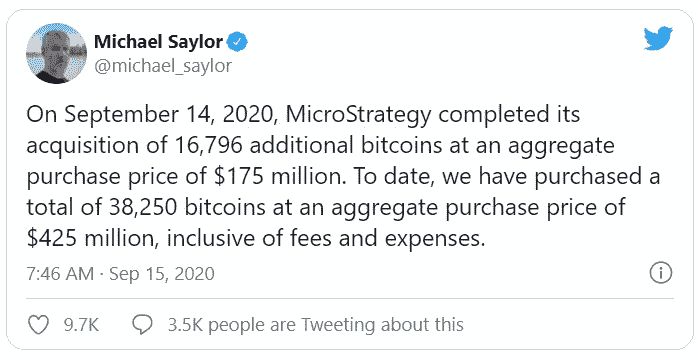
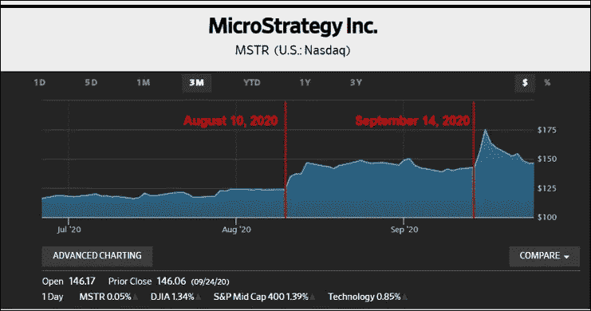
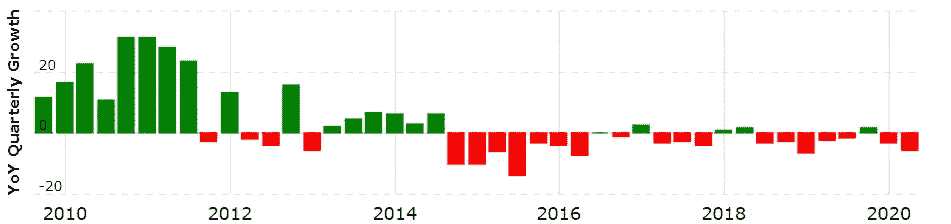
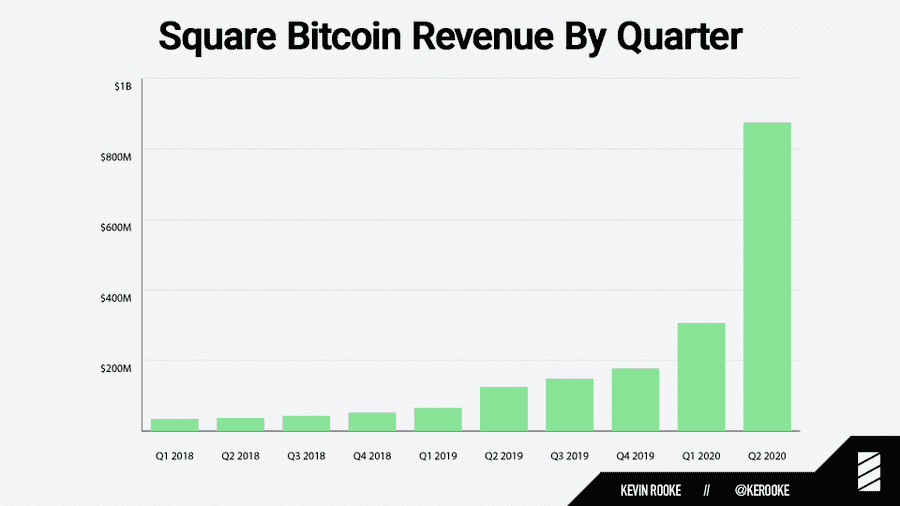
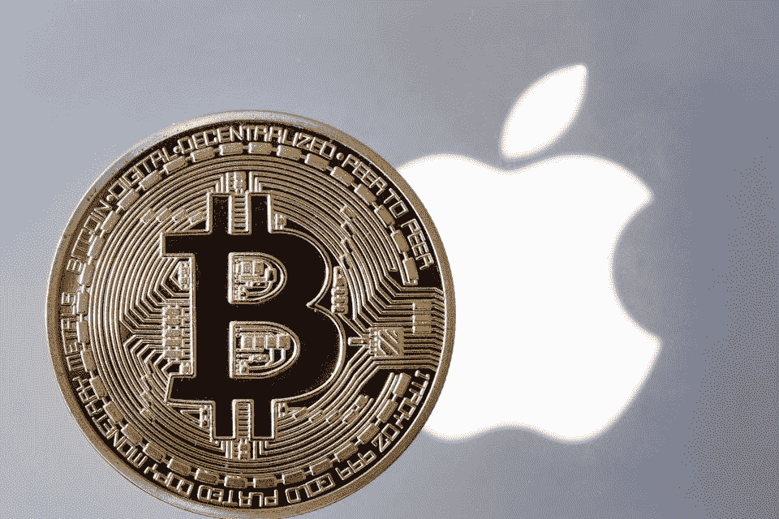
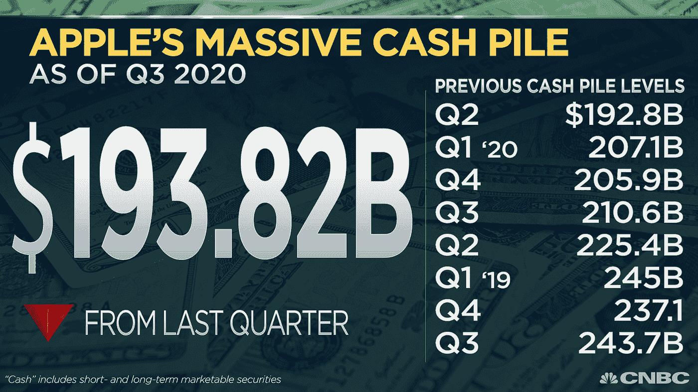
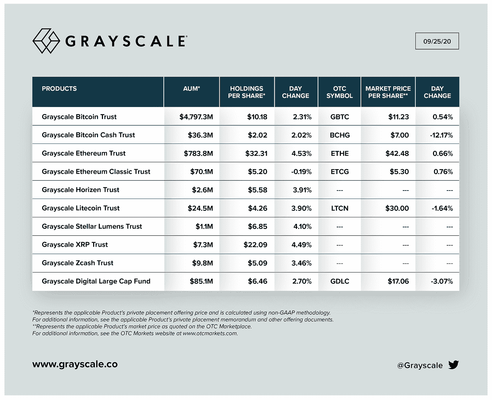

# 标准普尔 500 公司购买比特币？这位先驱者提供了一条道路

> 原文：<https://medium.datadriveninvestor.com/s-p-500-companies-to-buy-bitcoin-this-pioneer-provides-a-pathway-df5283dfdeec?source=collection_archive---------7----------------------->

## MicroStrategy 是第一家将比特币作为储备资产加入其资产负债表的上市公司。其他人会效仿吗？以下是为什么这可能不是最后一次的原因。

Source: [MicroStrategy](https://www.linkedin.com/company/microstrategy)

对于那些不迷恋比特币的人来说，一家公司可能会购买比特币的想法似乎很荒谬。MicroStrategy 的首席执行官迈克尔·塞勒(Michael Saylor)最近透露，他们已经将更多的比特币添加到他们的储备中，将他们的分配增加到 38，250 个比特币。很明显，微观战略有一个宏观战略。更重要的是，MicroStrategy 引发了一张多米诺骨牌，可能会为其他公司提供一个先例。

Twitter @[michael_saylor](https://twitter.com/michael_saylor/status/1305850568531947520?s=20)

**MicroStrategy 及其 CEO 拥抱比特币**

这家商业智能和分析公司为阿迪达斯(Adidas)和可口可乐(Coca-Cola)等客户提供服务，它在 8 月份首次披露了首次比特币购买。2020 年是灾难性的一年，MicroStrategy 决定转向。MicroStrategy 没有眼睁睁看着他们的现金储备被通胀侵蚀，而是购买了比特币。

闪回到 2019 年 7 月，Saylor 将 Voice.com 域出售给了 EOS(市值第 14 大的加密货币)背后的组织 Block.one。他最终以 3000 万美元的价格将 Voice.com 卖出，比 Block.one 最初的出价 15 万美元高出了一大截。一旦得知 Block.one 的身份，这促使 Saylor 跳进了加密货币兔子洞。

**孤注一掷提振股价？**

> “……适当的货币政策可能会在一段时间内将通货膨胀率控制在 2%以上。”——杰罗姆·鲍威尔，美联储主席|来源:[美联储](https://www.federalreserve.gov/newsevents/speech/powell20200827a.htm)

8/10/2020 = The day before Saylor confirmed 1st BTC purchase | 9/14/2020 =The day before the 2nd BTC purchase confirmation | Image Source: [WSJ](https://www.wsj.com/market-data/quotes/MSTR/)

2017 年 12 月，在加密泡沫的字面高潮期间，长岛冰茶公司更名为龙区块链公司(LBCC)。这导致该股飙升近 300%。这一明显的推高股票的尝试最终导致了纳斯达克股票交易所的退市，美国证券交易委员会(SEC)的传票，以及美国联邦调查局(FBI)对涉嫌内幕交易的逮捕令。

MicroStrategy quarterly growth illustrates a decline | Source: [Macrotrends](https://www.macrotrends.net/stocks/charts/MSTR/microstrategy/revenue)

MicroStrategy 是不是在尝试拉一个长长的区块链公司类型的泵？这很有可能是为了支撑一个收入稳步下降的业务(见上文)，也是一位长期首席执行官的最后一次努力。该公司的股价当然受益于购买比特币的消息。然而，出于以下原因，MicroStrategy 表现出了相反的动机(来自 LBCC ):

*   与 2017 年的宣传相比，当公众和主流兴趣高涨时，MicroStrategy 进行了收购。
*   很明显，Saylor 坚信比特币，坚定不移，而不是仅仅把它作为捕捉瞬间的机会。
*   正如美联储主席 Jerome Powell 所指出的，高于正常水平的通货膨胀即将出现(见上文引文)。

 [## 自白——我绝对不爱比特币|数据驱动投资者

### 这是真的，我已经写了几篇关于比特币和加密货币的文章，它们可能会在明年或…

www.datadriveninvestor.com](https://www.datadriveninvestor.com/2020/09/15/confessions-i-absolutely-dont-love-bitcoin/) 

**为什么其他公司会效仿**

> “……比特币或另一种加密货币变得非常有吸引力，无论是长期的‘我想为我的钱提供一个安全的避风港’，还是短期的投机性押注”——George Ball，Sanders Morris Harris 前首席执行官兼现任首席执行官|来源:[路透社](https://www.reuters.com/video/watch/idRCV008LQI?s=09)

具有讽刺意味的是，曾经[怀疑比特币寿命](https://twitter.com/michael_saylor/status/413478389329428480?s=20)的塞勒，在对比特币有了更深入的了解后，现在态度发生了 180 度的转变。就像塞勒最初被解雇一样，过去采取这种立场的公司可能会逐渐改变态度。这种更广泛的情绪转变正变得越来越明显。

随着通胀加剧，其他公司可能会求助于比特币等替代资产。随着 MicroStrategy 前所未有的举动，它可能有助于减轻比特币风险太大而无法触及的看法，从而吸引公司至少考虑它。

正如保诚集团前首席执行官乔治·鲍尔在上面的引用中所描述的，比特币的吸引力越来越大。首席执行官们的认可可能会激增，特别是如果比特币继续经受住时间的考验——提供超过任何其他资产类别的回报率。

在 Anthony Pompliano 的“The Pomp Podcast”[第 385 集](https://youtu.be/WrR95PFYDFQ)中，Saylor 还提到他的董事会中有一半人现在拥有比特币。尽管这可能不是大多数董事会的特征，但在未来几年，其他公司拥有比特币的高管和董事会成员的数量可能会增长。

**S & P 对比特币感兴趣的公司:Square 等？**

Square’s Bitcoin Revenue Growth | Source: [@Kerooke](https://twitter.com/kerooke/status/1290796717848354818?s=20)

Twitter 和 Square 的首席执行官杰克·多西是比特币的超级冠军。事实上，多尔西认为比特币最终将成为互联网的原生货币。他的公司 Square 一直致力于通过提供比特币来推动人们的接受，并且 Square 的[比特币收入](https://news.bitcoin.com/square-cash-app-bitcoin-revenue-surges-600-875-million-q2-profit-up-711/)出现了爆炸性增长。Square 并不是唯一一家关注比特币和加密货币的公司——想想这个:

*   7 月，Visa 发表了“[推进我们的数字货币方法](https://usa.visa.com/visa-everywhere/blog/bdp/2020/07/21/advancing-our-approach-1595302085970.html)”的博客文章，承认比特币，并解释了它如何与加密公司(包括比特币基地和 Fold)合作，将数字货币钱包与 Visa 网络集成。
*   7 月，万事达卡还宣布扩大其[加密货币计划](https://investor.mastercard.com/investor-news/investor-news-details/2020/Mastercard-Accelerates-Crypto-Card-Partner-Program-Making-it-Easier-for-Consumers-to-Hold-and-Activate-Cryptocurrencies/default.aspx)，使合作伙伴更容易发行加密支付卡。
*   据[消息人士](https://www.coindesk.com/paypal-venmo-to-roll-out-crypto-buying-and-selling)称，PayPal 将致力于提供 PayPal 和 Venmo 的加密货币买卖服务。
*   脸书仍致力于推出 Libra 区块链，这将支持多种货币支持的 Libra 储备。

尽管这些发展并不直接等同于将比特币加入资产负债表，但至少它表明了加密行业的增长和创新意愿。更广泛的接受可能会让变革推动者说服他们的组织扣动扳机，就像 MicroStrategy 所做的那样。然而，来自股东和董事会的批准不太可能像对 MicroStrategy 那样顺利，因为 Saylor 用他的 MSTR 股票掌握了 72%的投票权。

Source: [Forbes](https://www.forbes.com/sites/billybambrough/2019/08/04/blow-to-bitcoin-as-iphone-maker-apple-reveals-sudden-swerve/#2ad3b1e3608e)

此外，像苹果这样的公司以前已经实现了超过 2 万亿美元的市值。从这个角度来看，比特币必须将其目前(大约)2000 亿美元的市值增加 10 倍，才能达到 2 万亿美元。苹果拥有高达 1938.2 亿美元的现金储备(见下文)，仅这一项就足以与比特币匹敌。目前，加密资产类别可能太小，需要更高的市值，才能获得最大上市公司的合法资产负债表调查。

Source: [CNBC](https://twitter.com/CNBCnow/status/1288935740823437312?s=20)

此外，特别是在苹果公司的案例中，它多年来并没有表现出对加密行业的友好。这也是在比特币基地首席执行官 Brian Armstrong 审查之后，即[苹果已经审查了 iOS 比特币基地应用中的](https://news.bitcoin.com/apple-censors-cryptocurrency-defi-coinbase-app/)功能。考虑到这一点，苹果在这个时候认真考虑购买比特币似乎不太可能。

**比特币基地密码交易所上市**

7 月，有传言称[比特币基地打算在今年晚些时候或 2021 年上市。然而，任何事情都没有得到官方证实，也没有向美国证券交易委员会备案。另一个以加密保管服务闻名的加密竞争者 may 也可能是最终的上市前景。gray 管理着令人印象深刻的 58 亿美元资产(AUM)。随着加密应用的增加，基于加密的上市公司的比例增加可能会成为一种趋势。](https://www.reuters.com/article/us-coinbase-ipo-exclusive/exclusive-crypto-exchange-coinbase-readies-landmark-stock-market-listing-sources-say-idUSKBN24A21W)

$5.8 Billion Assets Under Management (AUM) Source: @[Grayscale](https://twitter.com/Grayscale/status/1309592840415195136?s=20)

像比特币基地和灰度这样的加密公司(如果上市的话)可能会更容易接受将多余的现金转换成比特币，甚至像以太坊这样的其他密码。这些公司最熟悉密码领域，非常清楚如何管理密码的风险，并将准备好最大限度地利用其武库中的密码。

【MicroStrategy 的下一步是什么

无论好坏，MicroStrategy 的未来将在很大程度上与比特币的价格升值或贬值交织在一起。如果比特币繁荣，MicroStrategy 可能会被誉为一家具有巨大远见的公司，它在没有人愿意的情况下承担了这一风险。如果比特币不符合它的账单，这可能会变成一个不幸的案例研究，研究应该避免的事情。有时候命运偏爱勇敢者——历史将决定 MicroStrategy 的勇敢是否会得到回报。

## 访问专家视图— [订阅 DDI 英特尔](https://datadriveninvestor.com/ddi-intel)