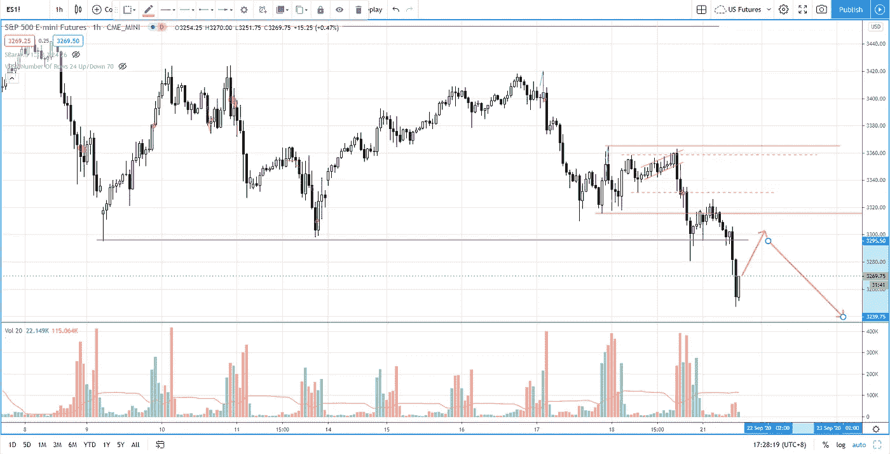

# 用成交量差价分析识别市场弱势(不要再猜了)

> 原文：<https://medium.datadriveninvestor.com/s-p-500-failure-to-lift-up-with-more-weakness-ahead-eef9052dcd93?source=collection_archive---------26----------------------->

在这段视频中，你将了解如何使用成交量价差分析来发现市场疲软，因为我们正处于拐点。

观看视频，了解 2020 年 9 月 21 日交易时段标准普尔 500 指数期货的**每日市场分析。在这段视频中，我将向您展示上一个交易日的市场回顾，以及三分钟内可能进行的交易回顾(包括进场、出场及其背后的原理)。展望未来，我将涵盖偏见，要注意的关键水平，我稍后的交易计划。**

## 时间戳

*   [0:55](https://www.youtube.com/watch?v=KD50Yf9EMnY&t=55s) 昨日市场回顾
*   [3:00](https://www.youtube.com/watch?v=KD50Yf9EMnY&t=180s) 贸易回顾
*   [6:38](https://www.youtube.com/watch?v=KD50Yf9EMnY&t=398s) 冲正交易分录
*   [8:25](https://www.youtube.com/watch?v=KD50Yf9EMnY&t=505s) 分线交易进场
*   [8:48](https://www.youtube.com/watch?v=KD50Yf9EMnY&t=528s) 时间停止交易管理
*   当前的市场状况
*   [15:33](https://www.youtube.com/watch?v=KD50Yf9EMnY&t=933s) 交易计划
*   纳斯达克、道琼斯、俄罗斯 2000 指数

如果你还没有看我在上一期的[每日市场分析视频](https://youtu.be/YumibLioD6w)，以便更好地了解市场回顾和交易回顾。

**偏向** —做空(日内交易)；看涨(长期)

**关键点位** —阻力:3280–3300，3300–3320，3360–3380，3425，3450；支持:3200-3230

**潜在设置** —在关键级别寻找潜在反转。

# 资源

**每周市场展望&最佳交易建议**直达您的收件箱:[https://www.tradeprecise.com/](https://www.tradeprecise.com/)

**专业免费**制图平台:创建账户→[www.TradingView.com](https://bit.ly/2U2Femd)

**非美国居民？** ( **、新加波**、澳洲、纽西兰、欧洲等……):[点击此处，存款 2000 新币](https://ji.hn/sgtiger)即可获得**免费股票(价值 100++ &美元)老虎经纪公司的欢迎礼物**

美国居民？[点击此处，当您存入 1500 美元](https://ji.hn/ustradeup)时，就有机会在 TradeUP 上获得一份**免费的 AMZN 股票(价值 3000++美元** ) & **欢迎礼物**

**无限制访问媒体文章** —加入以下:[https://priceactiontrading.medium.com/membership](https://priceactiontrading.medium.com/membership)

# 进一步阅读

 [## 乘着这些受益于经济复苏的工业股票的强劲趋势——GLDD、MTZ、NOA…

### 尽管纳斯达克出现抛售，道琼斯指数却创下新高。工业股票领涨市场，因为它们是…

medium.datadriveninvestor.com](/riding-the-strong-trend-of-these-industrial-stocks-benefit-from-economy-recovery-gldd-mtz-noa-dafb63ff5a2a)  [## 部门轮换基金流入家具行业-瑞士联邦理工学院，霍夫，腿，TPX

### 虽然纳斯达克和标准普尔 500 已经调整了两个多星期，但家具板块已经走强，而且…

medium.datadriveninvestor.com](/sector-rotation-fund-flows-into-furniture-industry-eth-hoft-leg-tpx-de725bc791d5)  [## 这些银行股逆势而上——建行、凯德、EBC、TBBK、ISBC

### 过去两周，金融板块尤其是银行股跑赢大盘。当纳斯达克领先的时候…

medium.datadriveninvestor.com](/these-banking-stocks-buck-the-trend-ccb-cade-ebc-tbbk-isbc-d95c608692f0) 

Photo by Author — Ming Jong Tey

Photo by Author — Ming Jong Tey

披露:如果您点击本文中的链接进行购买或开立账户，并将所需金额存入推荐的经纪人账户，我们将免费为您赚取佣金。

免责声明:本演示中的信息仅用于教育目的，不应作为投资建议。