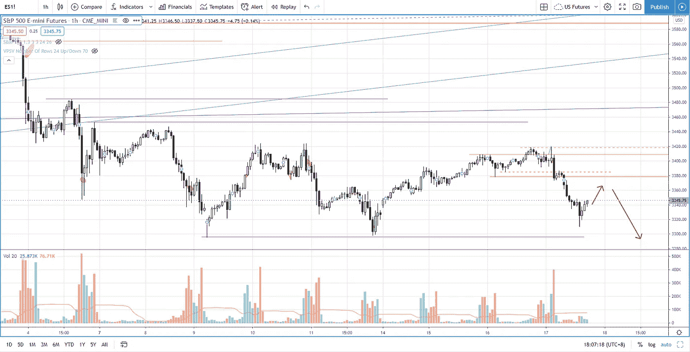

# 在你看这个之前，不要开始交易上升的楔形形态

> 原文：<https://medium.datadriveninvestor.com/s-p-500-how-to-trade-the-rising-wedge-pattern-with-high-winning-rate-aaf38c9e6fd6?source=collection_archive---------25----------------------->

发现上升楔形形态很容易，但许多交易者仍然在努力从高胜率的形态中获利。

观看视频，了解 2020 年 9 月 17 日交易时段标准普尔 500 指数期货的**每日市场分析。在这段视频中，我将向您展示上一个交易日的市场回顾，以及三分钟内可能进行的交易回顾(包括进场、出场及其背后的原理)。展望未来，我将涵盖偏见，要注意的关键水平，我稍后的交易计划。**

## 时间戳

*   [1:00](https://www.youtube.com/watch?v=jfSvCwFYxzI&t=60s) 昨日市场回顾
*   [2:08](https://www.youtube.com/watch?v=jfSvCwFYxzI&t=128s) 隐藏推力或假突破
*   [5:00](https://www.youtube.com/watch?v=jfSvCwFYxzI&t=300s) 交易上升楔形形态的交易回顾
*   [7:30](https://www.youtube.com/watch?v=jfSvCwFYxzI&t=450s) 弱势突破迹象重新测试
*   [8:20](https://www.youtube.com/watch?v=jfSvCwFYxzI&t=500s) 推力缩短
*   [9:20](https://www.youtube.com/watch?v=jfSvCwFYxzI&t=560s) 汇流:动量、阻力和体积
*   [10:35](https://www.youtube.com/watch?v=jfSvCwFYxzI&t=635s) 弱势、后备、突破迹象
*   当前的市场状况

如果你还没有看我在上一期的[每日市场分析视频](https://youtu.be/UkmrXzQUJ9o)，以便更好地了解市场回顾和交易回顾。

**偏向** —中性(日内交易)；看涨(长期)

**关键点位** —阻力:3380、3425、3450；支持:3300，3230

**潜在设置** —在关键级别寻找潜在反转。

# 资源

**每周市场展望&最佳交易建议**直达您的收件箱:[https://www.tradeprecise.com/](https://www.tradeprecise.com/)

**专业免费**制图平台:创建账户→[www.TradingView.com](https://bit.ly/2U2Femd)

**非美国居民？** ( **、新加波**、澳洲、纽西兰、欧洲等……):[点击此处，存款 2000 新币](https://ji.hn/sgtiger)即可获得**免费股票(价值 100++ &美元)老虎经纪公司的欢迎礼物**

美国居民？[点击此处，当您存入 1500 美元](https://ji.hn/ustradeup)时，就有机会在 TradeUP 上获得一份**免费的 AMZN 股票(价值 3000++美元** ) & **欢迎礼物**

**无限制访问媒体文章** —加入以下:[https://priceactiontrading.medium.com/membership](https://priceactiontrading.medium.com/membership)

# 进一步阅读

 [## 标准普尔 500 日交易中的趋势交易策略(有效)

### 通过以下两个步骤，了解如何使用这种趋势交易策略在标准普尔 500 期货日交易中获利…

medium.datadriveninvestor.com](/a-trend-trading-strategy-that-works-in-s-p-500-day-trading-3294e0aa837f)  [## 凯西·伍德警告市场即将调整——标准普尔 500 价格走势分析

### 在 2020 年 12 月 18 日对彭博的采访中，方舟投资公司的首席执行官兼首席信息官凯西·伍德警告说…

medium.datadriveninvestor.com](/cathie-wood-warns-market-correction-soon-price-action-analysis-on-s-p-500-7e621e013310)  [## 乘着这些受益于经济复苏的工业股票的强劲趋势——GLDD、MTZ、NOA…

### 尽管纳斯达克出现抛售，道琼斯指数却创下新高。工业股票领涨市场，因为它们是…

medium.datadriveninvestor.com](/riding-the-strong-trend-of-these-industrial-stocks-benefit-from-economy-recovery-gldd-mtz-noa-dafb63ff5a2a) 

披露:如果您点击本文中的链接进行购买或开立账户，并将所需金额存入推荐的经纪人账户，我们将免费为您赚取佣金。

免责声明:本演示中的信息仅用于教育目的，不应作为投资建议。