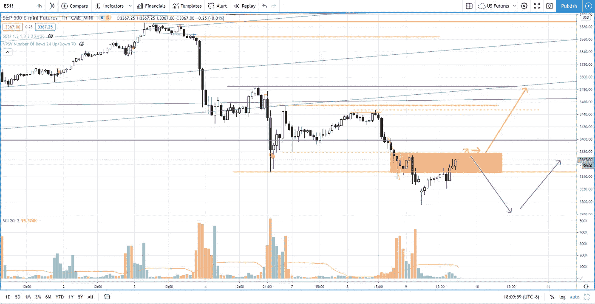
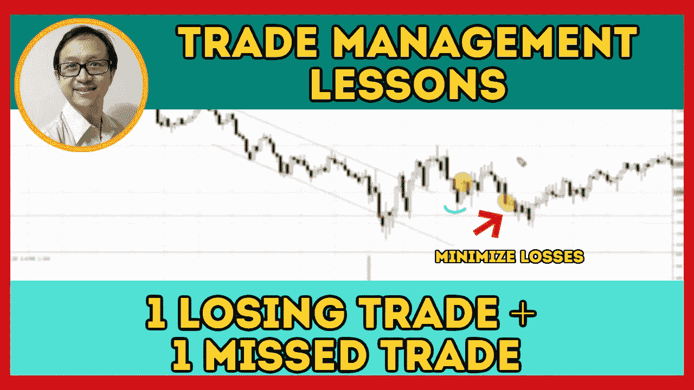

# 交易管理课程:亏损的交易加上错过的交易

> 原文：<https://medium.datadriveninvestor.com/s-p-500-level-to-watch-out-for-bull-908d08c814f7?source=collection_archive---------25----------------------->

在交易回顾部分找出我的亏损交易和错过的交易。

观看视频，了解 2020 年 9 月 9 日交易时段标准普尔 500 指数期货的**每日市场分析。在这段视频中，我将向您展示上一个交易日的市场回顾，以及三分钟时间内的交易回顾(包括进场、出场及其背后的原理)。此外，我将详细阐述如何解决当前抛售期间的高市场波动性和市场前景。展望未来，我将涵盖偏见，要注意的关键水平，我稍后的交易计划。**

如果你还没有看我的[每日市场分析视频](https://youtu.be/WyPJtGseTmE)，为了更好地了解市场回顾和交易回顾。

**偏向** —中性(日内交易)；看涨(长期)

**关键关卡** —阻力:3375，3400；支持:3230

**潜在设置** —在关键级别寻找潜在反转。

# 资源

**每周市场展望&最佳交易建议**直达您的收件箱:[https://www.tradeprecise.com/](https://www.tradeprecise.com/)

**专业免费**制图平台:创建账户→[www.TradingView.com](https://bit.ly/2U2Femd)

**非美国居民？** ( **马来西亚、新加坡**、澳洲、纽西兰、欧洲等……):[点击此处，当您存入新币 2000 元](https://ji.hn/sgtiger)时，即可获得**免费股票(价值 100 美元++ &老虎经纪的欢迎礼物**

美国居民？[点击此处，当您存入 1500 美元](https://ji.hn/ustradeup)时，就有机会在 TradeUP 上获得一份**免费的 AMZN 股票(价值 3000++美元** ) & **欢迎礼物**

**从媒体获取无限文章** —加入以下:[https://priceactiontrading.medium.com/membership](https://priceactiontrading.medium.com/membership)

# 进一步阅读

 [## 凯西·伍德警告市场即将调整——标准普尔 500 价格走势分析

### 在 2020 年 12 月 18 日对彭博的采访中，方舟投资公司的首席执行官兼首席信息官凯西·伍德警告说…

medium.datadriveninvestor.com](/cathie-wood-warns-market-correction-soon-price-action-analysis-on-s-p-500-7e621e013310)  [## 确定供需区是波动交易的阻力和支撑

### 在这段视频中，我将告诉你如何识别供求区域，作为摆动的支撑位和阻力位…

priceactiontrading.medium.com](https://priceactiontrading.medium.com/identifying-supply-demand-zone-as-resistance-support-for-swing-trading-7ed373d81137)  [## 趋势反转交易策略(有效)——标准普尔 500 日交易

### 了解如何使用这种有利可图的趋势反转交易策略，以最小的风险抓住底部。

medium.datadriveninvestor.com](/a-trend-reversal-trading-strategy-that-works-s-p-500-day-trading-193443c731d2) 

Photo by Author — Ming Jong Tey

Photo by Author — Ming Jong Tey

披露:如果您点击本文中的链接进行购买或开立账户，并将所需金额存入推荐的经纪人账户，我们将免费为您赚取佣金。

免责声明:本演示中的信息仅用于教育目的，不应作为投资建议。