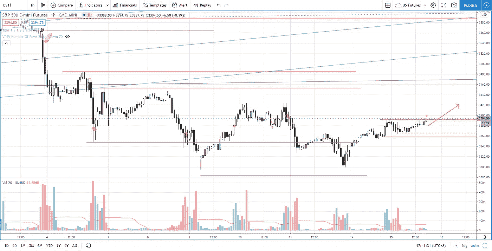

# 利润最大化的简单交易管理策略(有效)

> 原文：<https://medium.datadriveninvestor.com/s-p-500-simple-trade-management-strategy-to-maximize-profit-5f63411ceb79?source=collection_archive---------22----------------------->

了解如何采用简单而有效的交易管理策略来实现利润最大化，以及它为什么有效。

观看视频，了解 2020 年 9 月 15 日交易时段标准普尔 500 指数期货的**每日市场分析。在这段视频中，我将向您展示上一个交易日的市场回顾，以及三分钟时间内的交易回顾(包括进场、出场及其背后的原理)。展望未来，我将涵盖偏见，要注意的关键水平，我稍后的交易计划。**

## 时间戳

*   [1:23](https://www.youtube.com/watch?v=IEcj2NH53sk&t=83s) 昨日市场回顾
*   [3:40](https://www.youtube.com/watch?v=IEcj2NH53sk&t=220s) 贸易回顾
*   [7:50](https://www.youtube.com/watch?v=IEcj2NH53sk&t=470s) 努力与结果对比输入
*   [9:04](https://www.youtube.com/watch?v=IEcj2NH53sk&t=544s) 退出的努力与结果
*   [10:00](https://www.youtube.com/watch?v=IEcj2NH53sk&t=600s) 贸易管理
*   [15:00](https://www.youtube.com/watch?v=IEcj2NH53sk&t=900s) 当前市场状况

如果你还没有看我在上一期的[每日市场分析视频](https://youtu.be/gvgbURQYqvA)，以便更好地了解市场回顾和交易回顾。

**偏向** —中性(日内交易)；看涨(长期)

**关键点位** —阻力:3380、3425、3450；支持:3350–3360、3300、3230

**潜在设置** —在关键级别寻找潜在反转。

# 资源

**每周市场展望&最佳交易建议**直达您的收件箱:[https://www.tradeprecise.com/](https://www.tradeprecise.com/)

**职业免费**制图平台:创建账户→[www.TradingView.com](https://bit.ly/2U2Femd)

**非美国居民？** ( **马来西亚、新加坡**、澳大利亚、新西兰、欧洲等):[点击此处，存款 2000 新加坡元](https://ji.hn/sgtiger)即可获得**免费股票(价值 100++美元&老虎经纪**的欢迎礼物)

美国居民？[点击此处，存款 1500 美元](https://ji.hn/ustradeup)，就有机会在 TradeUP 获得**份免费的 AMZN(价值 3000++** ) & **份欢迎礼物**

**从媒体获取无限文章** —加入以下:[https://priceactiontrading.medium.com/membership](https://priceactiontrading.medium.com/membership)

# 进一步阅读

 [## 比特币即将突破历史新高？玛拉，暴动开始了吗？

### 自一个月前以来，随着供应量的增加，比特币的反应是从峰值下跌 26%。然而，有一个…

medium.datadriveninvestor.com](/bitcoin-poised-to-breakout-to-all-time-high-mara-riot-set-to-jump-bb9bb82b32ec)  [## 部门轮换基金流入家具行业-瑞士联邦理工学院，霍夫，腿，TPX

### 虽然纳斯达克和标准普尔 500 已经调整了两个多星期，但家具板块已经走强，而且…

medium.datadriveninvestor.com](/sector-rotation-fund-flows-into-furniture-industry-eth-hoft-leg-tpx-de725bc791d5)  [## 市场修正，泡沫还是崩盘？标准普尔 500 价格行为分析

### 标准普尔 500 期货(es)昨日因供应激增下跌 2.5%，跌破上行通道。这是正常的…

medium.datadriveninvestor.com](/market-correction-bubble-or-crash-s-p-500-price-action-analysis-6f26e6698dbc) 

Photo by Author — Ming Jong Tey

Photo by Author — Ming Jong Tey

披露:如果您点击本文中的链接进行购买或开立账户，并将所需金额存入推荐的经纪人账户，我们将免费为您赚取佣金。

免责声明:本演示中的信息仅用于教育目的，不应作为投资建议。