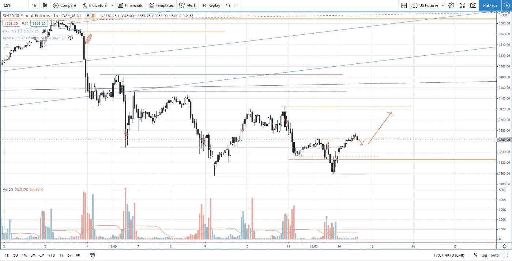

# 如何使用成交量差价分析来确认反向交易(像专业人士一样)

> 原文：<https://medium.datadriveninvestor.com/s-p-500-using-volume-spread-analysis-to-qualify-reversal-trade-53f95182457c?source=collection_archive---------6----------------------->

您将在交易回顾部分了解如何使用交易量价差分析来验证冲销交易，以便您只交易有效的冲销。

观看视频，了解 2020 年 9 月 14 日交易时段标准普尔 500 指数期货的**每日市场分析。在这段视频中，我将向您展示上一个交易日的市场回顾，以及三分钟时间内的交易回顾(包括进场、出场及其背后的原理)。展望未来，我将涵盖偏见，要注意的关键水平，我稍后的交易计划。**

## 时间戳

*   [1:03](https://www.youtube.com/watch?v=gvgbURQYqvA&t=63s) 昨日市场回顾
*   [5:20](https://www.youtube.com/watch?v=gvgbURQYqvA&t=320s) 贸易回顾
*   [10:03](https://www.youtube.com/watch?v=gvgbURQYqvA&t=603s) 交易资格的成交量差价分析
*   [16:00](https://www.youtube.com/watch?v=gvgbURQYqvA&t=960s) 当前市场状况

如果你还没有看我的[每日市场分析视频](https://youtu.be/PcNN7zAFPnk)，为了更好地了解市场回顾和交易回顾。

**偏向** —中性(日内交易)；看涨(长期)

**关键点位** —阻力:3380、3425、3450；支持:3300，3230

**潜在设置** —在关键级别寻找潜在反转。

# 资源

**每周市场展望&最佳交易建议**直达您的收件箱:[https://www.tradeprecise.com/](https://www.tradeprecise.com/)

**职业免费**制图平台:创建账户→[www.TradingView.com](https://bit.ly/2U2Femd)

**非美国居民？** ( **马来西亚、新加坡**、澳大利亚、新西兰、欧洲等……):[点击此处，当您存入新币 2000 元](https://ji.hn/sgtiger)时，即可获得**免费股票(价值 100++ &美元)老虎经纪**的欢迎礼物

美国居民？[点击此处，当您存入 1500 美元](https://ji.hn/ustradeup)时，就有机会在 TradeUP 上获得一份**免费的 AMZN 股票(价值 3000++美元** ) & **欢迎礼物**

**无限制访问媒体文章** —加入以下:【https://priceactiontrading.medium.com/membership】T2

# 进一步阅读

 [## 比特币即将突破历史新高？玛拉，暴动开始了吗？

### 自一个月前以来，随着供应量的增加，比特币的反应是从峰值下跌 26%。然而，有一个…

medium.datadriveninvestor.com](/bitcoin-poised-to-breakout-to-all-time-high-mara-riot-set-to-jump-bb9bb82b32ec)  [## 部门轮换基金流入家具行业-瑞士联邦理工学院，霍夫，腿，TPX

### 虽然纳斯达克和标准普尔 500 已经调整了两个多星期，但家具板块已经走强，而且…

medium.datadriveninvestor.com](/sector-rotation-fund-flows-into-furniture-industry-eth-hoft-leg-tpx-de725bc791d5)  [## 凯西·伍德警告市场即将调整——标准普尔 500 价格走势分析

### 在 2020 年 12 月 18 日对彭博的采访中，方舟投资公司的首席执行官兼首席信息官凯西·伍德警告说…

medium.datadriveninvestor.com](/cathie-wood-warns-market-correction-soon-price-action-analysis-on-s-p-500-7e621e013310) 

Photo by Author — Ming Jong Tey

Photo by Author — Ming Jong Tey

披露:如果您点击本文中的链接进行购买或开立账户，并将所需金额存入推荐的经纪人账户，我们将免费为您赚取佣金。

免责声明:本演示中的信息仅用于教育目的，不应作为投资建议。