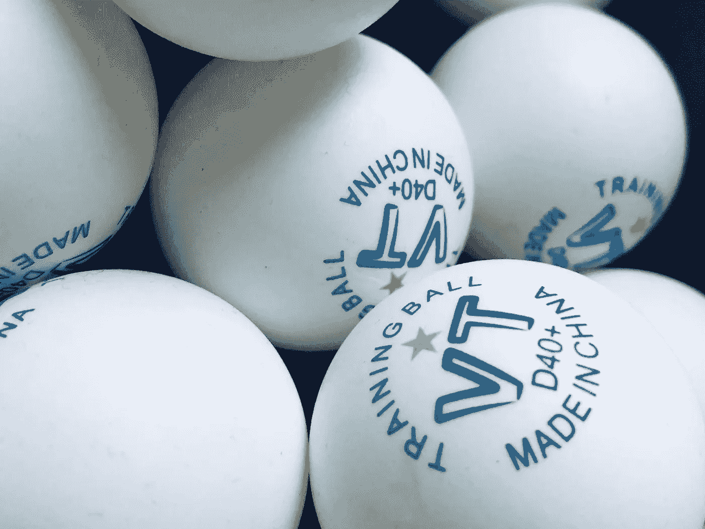
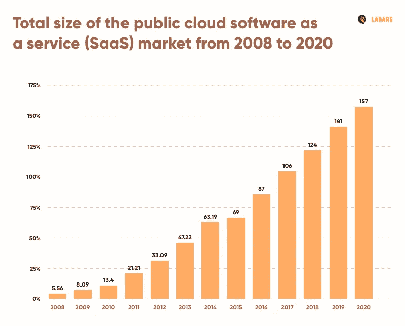
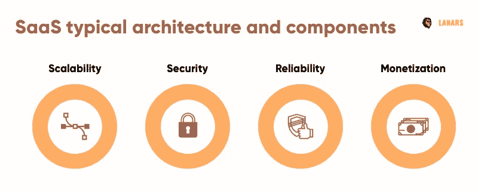
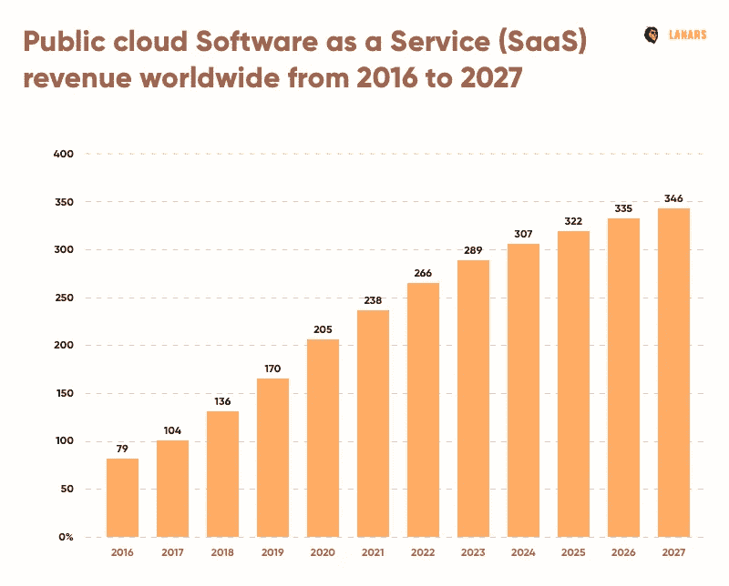
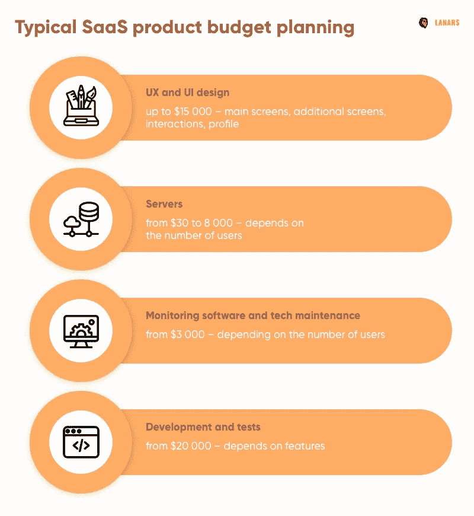

# SaaS 应用开发:如何在 SaaS 创业

> 原文：<https://medium.datadriveninvestor.com/saas-application-development-how-to-start-a-saas-business-671ea2e4692b?source=collection_archive---------2----------------------->

WIX、Slack、MailChimp、Zoom 和 Dropbox。软件即服务(SaaS)业务是一种数字化开发的方法，目前势头正盛。据预测，到 2022 年底，超过 80%的移动创业公司将使用它。

> Saas 的核心思想是为公司提供开发和维护产品的工具，而无需从头开始构建定制的技术框架。

根据这个概念，人们可以使用基于云的存储和技术，用很少的预算构建基于 SaaS 的应用程序。

随着 SaaS 成为 2020 年[利润极高的商业区](https://financesonline.com/saas-trends/)，如何创建一个能够克服竞争挑战并保持可靠性的软件即服务的问题正在提上日程。

我们的文章将帮助你理解为什么 SaaS 被认为是成本有效的、敏捷的和高度可及的。对于程序员和初创公司来说，SaaS 等现成系统的优势也将变得显而易见。

# 清单:在构建 SaaS 应用程序之前

SaaS 企业背后的理念是优化客户资源。这种方法有助于初创公司和企业保持成本效益，无需投资任何资金来开发定制技术解决方案。

> 通常，SaaS 供应商不仅为用户提供现成的解决方案，还不断升级技术，维护工具，并为客户提供全天候支持。

如何在 SaaS 创业？像任何其他创业公司一样，考虑到你未来的产品和企业，你应该明确支柱点。目标受众需求、盈利模式、推广机制、预算和技术——被认为是增加或减少你成功机会的最关键问题。要了解更多，请阅读我们的博客文章[如何创业](https://lanars.com/../blog/how-to-start-a-startup-make-a-business-step-by-step)。

第二，Saas 应用程序开发有其技术细节，这极大地影响了您的预算和团队需求:

*   *单租户或多租户架构(第二种更便宜，而第一种更安全)*
*   *保证数据的安全性(更高的安全级别更昂贵，可能会限制合作伙伴的可扩展性选项)*
*   *特征的数量*
*   *服务升级频率*
*   *使用 API 与其他服务集成(* [高达 90%的 SaaS 解决方案](https://greenice.net/goto/https://www.mulesoft.com/mulesoftthinkstrategies-study-finds-integration-major-obstacle-saas-vendor-success)是集成的)
*   *货币化概念(订阅、一次性支付、定制套餐)*

有关 SaaS 技术的最佳实践(以 Google tools、Adobe、Shopify 或微软为例)表明，在 SaaS 业务中成为受欢迎的和有利可图的行之有效的方法是投入时间和精力了解目标受众的需求，同时开发和测试全新的技术。与此同时，市场上出现了制造利基 SaaS 产品的趋势。

我们建议您至少采取三个步骤来解决您的发现项目阶段问题。如果您想了解更多信息，请访问“什么是[移动应用开发生命周期](https://lanars.com/../blog/app-development-process-from-idea-to-app-maintenance)”一文。

***第一步。研究市场***

人工智能(AI)，利基导向战略，增加移动应用的利润只是你需要了解更多的一些要点。也有可能在 2020 年，我们会看到一种全新的技术与机器学习、增强现实和虚拟现实相关联。

科技趋势和利基创新是 SaaS 为企业服务所依赖的东西。我们建议你深入了解一下科技界正在发生的事情，或者聘请一名利基专家。

***第二步。了解你的目标客户***

你不能向一个你一无所知的人推销任何东西，尤其是在谈论像 SaaS 这样竞争激烈的领域时。

这个问题需要单独讨论，但是，我们建议你开发一个目标受众的画像，列出他们的需求和恐惧，从要做的工作的角度来定义你的产品，最后，找出什么样的货币化方法适合你。关于这个话题的更多信息— [我现在有一个应用程序的想法](https://lanars.com/../blog/i-have-an-idea-for-an-app-now-what)。

***第三步。客户如何使用你的 SaaS 产品***

继续你的市场和目标受众研究，并确定与类似的 SaaS 供应商相比，你有什么竞争优势。然后，试着定义在什么情况下你的产品可以被你的潜在客户方便地使用。

考虑预计的用户旅程，以及一些事情会阻碍他们的情况。将来与你的开发者、UX 和 UI 设计师分享问题。

# 技术和 SaaS 建筑

SaaS 方法基于创新技术。或多或少，公司和私人团体使用基于云的服务外包他们的技术任务。

> 一家 SaaS 开发公司必须持续投资于研究和技术实验，跟踪创新，优化资源，并监控用户需求以保持竞争力。

SaaS 产品有几个主要特点。这将取决于你的产品类型，市场研究，甚至是你的开发预算。拉纳尔斯还为客户建造 SaaS。在上面找到我们的建议:

*   ***【编程语言(Python)***

显然，云 SaaS 需要一种强大而简单的编程语言来满足当今的开发需求。有时，公司会选择内部开发人员最熟悉的编程语言。在各种语言选项中做出选择也是事实。

虽然 JavaScript 和 SQL 是最受欢迎的通用语言，但 Python 对于 SaaS 来说是个不错的选择，因为它具有可读性和灵活性。

*   ***数据库(MongoDB)***

面向文档的安全数据库是 SaaS 产品的必备组件。这种类型的数据库与关系型数据库的区别在于，它体积小，能够保持数据的独立性，并能灵活地使用数据。您可以使用现代编程语言(如 Python)来支持数据库。

具有自动分片特性的 MongoDB 可以成为您的主要数据库，因为它是可伸缩的，并且在不同的任务中表现出良好的性能(速度)。这意味着在扩大业务规模时，你不会失去技术潜力。

*   ***【rabbit MQ】***

通信协议也称为排队系统或消息队列(MSMQ)技术，帮助应用程序与第三方(包括 API 和服务器)合作接收和发送消息。它是产品基础设施的支柱。消息队列系统存储系统消息，并在可能时传输它们。

RabbitMQ 的主要优点是它的可伸缩性和健壮性，我们建议您将它用于 SaaS 目的。该系统是开源的，可以免费安装，并且可以与各种操作系统和编程语言交互运行。

*   ***云计算服务和 CDN (AWS)***

SaaS 开发平台的核心元素是一个云计算服务，其任务是支持您构建的所有功能。根据您选择的服务，您的扩展能力、升级载体和您的工作领域会有所不同。2020 年，一个很好的选择是尝试 AWS(亚马逊网络服务)——迄今为止最灵活、最完整的平台。在它的帮助下，您可以托管和运行您的产品，测试和开发。

AWS 具有高性能比率，并与弹性计算云(EC2)集成作为其本机元素。AWS EC2 架构可帮助您达到可调整的计算能力，并可扩展您的技术资源。您还可以选择 EC2 服务器的位置。在完成开发工作之前，内容交付网络(CDN)是您必须选择的另一个要素。CDN 是为你的产品内容服务的工具。

查看我们博客中的另一篇文章，熟悉其他技术问题——[为全周期 Web 应用程序开发选择技术堆栈。](https://medium.com/front-end-weekly/choosing-a-tech-stack-for-full-cycle-web-application-development-db5b336c7997)

# SaaS 发展的挑战

SaaS 的商业理念是销售数字服务，而不是产品。对于今天的用户来说，在没有能力不断更新产品软件的情况下购买物理介质上的程序听起来像是无稽之谈。SaaS 方法对于开发者和用户来说都是一个很好的选择。

一种常见的商业模式是订阅。用户在互联网上购买云服务的访问权限，并在线(主要)和离线使用它，而不必购买额外的硬件资源。这就是为什么 SaaS 开发商需要找到解决方案，解决如何保持服务的可持续性和竞争力，安全地存储数据，并降低可能导致客户数据损坏的系统故障风险。

SaaS 软件开发有 4 个挑战，您应该在早期阶段考虑:

**挑战一。可扩展性**

如果您的技术堆栈不可扩展，您的企业就无法发展。这对 SaaS 的初创公司(随着客户数量的增加，性能可能会下降)和 SaaS 的客户(如果云服务因过载而关闭，他们的业务将无法继续运营)都适用。

虽然垂直发展是现代数字企业的一种趋势，但仍然存在与目标受众规模相关的问题。如果你的 SaaS 产品是一个利基产品，你可能没有足够的客户来支付你的业务维护费用。

**挑战二。安全性**

作为供应商，您必须向客户保证数据隐私。由于云服务安全性差，银行信息、个人数据、商业秘密等等可能会泄露。在这些情况下，你不仅会失去你的生意，还会被处以巨额罚款。

**挑战三。可靠性**

AWS SaaS 架构被认为是最可靠的云软件维护平台。但是，该系统运行的物理服务器所处的地理位置可能会受到损坏(服务器可能会着火、受潮、被炸毁或只是由于人为因素而受损)。

> AWS 会保护其硬件并安全地备份所有信息，这是一个巨大的优势。

AWS 还可以防止您的网站和产品因过载而关闭。服务提供商为您提供资源押金(电涌保护)，并允许您通过从一个计划切换到另一个计划来轻松扩展服务器潜力。

另一个问题是信任。SaaS 工具降低了安全感，因为客户需要将他们有价值的数据存储在其他地方(而不是他们自己的硬盘上)。通过建立一个品牌，努力建立一个正面的声誉，你可能会赢得很多客户。

Logo、UI、企业色彩、早期人群营销推广活动都会有帮助。然而，这总是很难让人相信你是一个年轻的创业公司。

挑战四。货币化问题(太贵还是太便宜？)

人们使用 SaaS 产品的原因是他们的成本效益。企业和私人用户并不总是拥有(或愿意花费)从零开始建立定制数字服务的资源。SaaS 方法帮助用户在典型解决方案适用的领域分担技术开发成本。

同时，提供商的服务不能太贵，因为没有人能负担得起。你应该仔细研究你的目标受众，了解他们愿意为你的产品花多少钱。第二，你需要开发一个可持续的盈利模式，将产品升级和维护定期计入用户的账单。提前想好定价。

# 如何建立一个 SaaS 企业？货币化模式

在比较适用于该业务领域的货币化概念时，SaaS 架构可能看起来更清晰。分析 MailChimp、Salesforce、Twilio 或 SurveyMonkey 等云服务，你可能会注意到有很多方法可以稳定 SaaS 业务。

考虑项目时间表、预算和营销预期来选择您的模型。在这里，我们为您提供最常见的货币化概念。请记住，许多成功的企业试图将它们结合起来，以避免巨大的金融风险。

*   **免费服务，含广告**

你的应用会接触到很多用户，因为它是免费的。有一个很好的方法来测试你的营销假设，并进行实时营销调查。

同时，应用内广告是将你的产品货币化的最简单的方法(应用内服务供应商也根据 SaaS 的概念工作)。另一个优势是——你将立即获得收入。然而，应用内广告可能会让 UX 看起来更穷。

*   **免费增值模式**

如何建立一个能够提供收入流的 saas 业务？免费向用户提供基本功能，然后向他们提供额外收费的高级功能。

> 市场上的大多数应用程序都是免费增值的，可以根据订阅计划购买它们的全部或扩展功能。

免费增值应用吸引用户是因为它们对许多人来说是可访问的，然而，很难决定一个功能应该付费还是免费。

*   **订阅计划**

如果你的目标是满足高端用户的需求，如何在 SaaS 创业？建立服务订阅系统，为客户提供受时间而非功能限制的服务。

*   **一次性购买**

考虑到您的 Saas 环境应该经常自动升级，一次性付款方式并不那么受欢迎。为了使付费应用程序可持续发展，你需要不断增加你的客户数量，以及为你的产品设定非常高的价格。

这种模式还有一个弱点——不是每个人都愿意购买他们无法首先测试的产品。改善你的公司形象，减少这些异议。免费试用期也可能是你的一个选择。

更多赚钱技巧点击此处— [如何让你的应用赚钱](https://lanars.com/../blog/how-you-can-monetize-your-app-idea)博客文章。

# 创建一个 SaaS 应用程序需要多少成本？

开发成本取决于很多因素。功能和集成的数量、设计和架构的复杂性、目标市场和项目时间表是最关键的问题。此外，还有开发国家等因素(美国和乌克兰的应用程序开发成本差异超过每小时 100 美元)。

> 最后，还有营销策略，它可以是廉价且精心策划的，也可以是昂贵且盲目扩张的。

一般来说，SaaS 应用开发预算有几个部分:业务分析、设计、编程、服务器、软件监控和维护、客户支持和推广。如果预算有限，任务外包是降低成本的一种流行方式。从我们的博客文章[如何雇佣专门的开发团队](https://lanars.com/../blog/how-to-hire-dedicated-developers)中了解如何做到这一点。

**UX 和用户界面设计(基于市场调研)** *高达 15，000 美元——主屏幕、附加屏幕、交互、个人资料*

即使是 SaaS 的企业也需要有清晰和吸引人的界面。为了想出一个适合你的需求，设计师必须进行研究或从市场研究团队那里获得。使用在发现项目阶段创建的指南:目标受众描述(需求和品味)、功能列表、货币化策略。

定义设计的主要目标，并使用最佳实践来丰富您的项目。不要忘记你的服务应该是可扩展的，所以创建一个设计代码并定义你的业务的视觉基调或声音是一个好主意。

**服务器** *从 30 美元到 8000 美元不等——取决于用户数量*

通常，一家 SaaS 开发公司将大部分资金用于托管(服务器)。随着客户数量的增加，您也应该增加您的服务器潜力。

**监控软件和技术维护** *起价 3，000 美元—取决于用户数量*

为了增加产品的可靠性，你需要不断地跟踪它是如何工作的。整合强大的监控软件，如果出现问题，它会让你知道。用户越多，监控系统所需的资源就越多。

另一个问题是技术维护。当出现警报时，应该有程序员可以解决问题。这项服务也可以外包。详情— [IT 外包利弊](https://lanars.com/blog/it-outsourcing-advantages-and-disadvantages)。

**开发和测试** *起价 20，000 美元—取决于特性*

在这里，我们主要讨论如何构建 SaaS 应用程序，并开始赢得你的第一批客户。如果不了解 SaaS 的具体情况和你的产品特性，原型构建、MVP 开发、QA、部署和根据用户反馈升级产品是很难计算的。受众的预期规模也很重要(更多的人意味着更多的资源)。有关开发团队角色的更多信息，请点击此处— [应用开发流程](https://lanars.com/blog/app-development-process-from-idea-to-app-maintenance)。

此外，留出大约 10%的开发预算用于营销。品牌，内容营销活动，反馈研究策略和其他应该仔细规划，并在实际开发之前很久就开始。

# 结论

SaaS 发展平台是 2020 年要考虑的一个商业领域。今年，SaaS 市场的规模预计将达到 1570 亿美元，并将成为全球近一半(41%)数字业务的重要组成部分。尽管 SaaS 市场竞争激烈，但它也可能会发生变化。

> 人工智能和机器学习的发展，区块链技术和移动优先的方法将在不久的将来塑造这个领域，但仍然有你的创新云服务创业的空间。

那些想外包 SaaS 开发的人需要注意考虑最终产品的某些技术问题:编程语言、数据库、排队系统和服务器细节。你会发现很难找到有纯粹 SaaS 经验的数字工程师，这就是为什么你需要至少一些技术堆栈经验，以便在全球人才极中选择正确的专家。

2020 年，在 LANARS 的技术支持下在 SaaS 创业。

[联系我们](https://lanars.com)获取高级咨询。

*最初发表于*[T5【https://lanars.com】](https://lanars.com/blog/saas-application-development)*。*