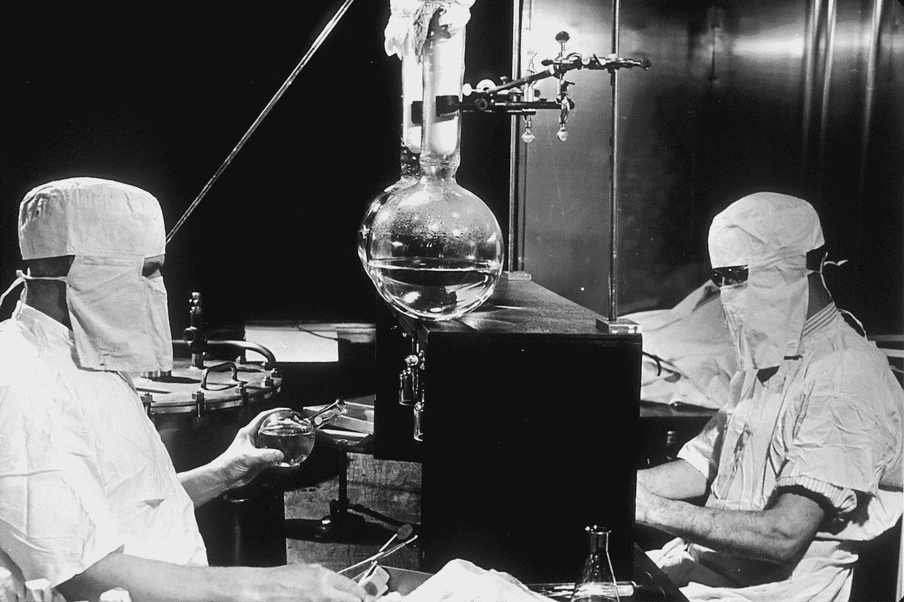
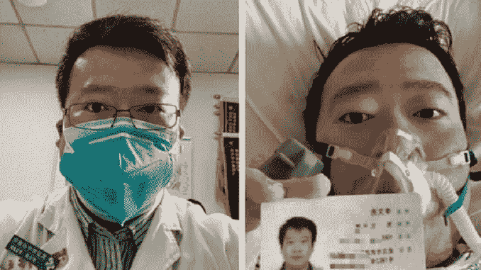
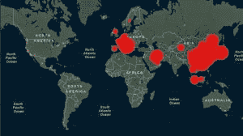

# 安全港(新冠肺炎·疫情战胜恐惧的故事)

> 原文：<https://medium.datadriveninvestor.com/safe-haven-a-covid-19-pandemic-story-to-combat-fear-d8e18fcb784d?source=collection_archive---------4----------------------->

## 约翰·坎贝尔博士在 2020 年 3 月 6 日说:“我们必须从被动转为主动来阻止新冠肺炎。”

## 随着大数据的到来，我们正在进入一个新的理解领域——可预测性(人工智能机器驱动)和智能手机提供的实时数据。未来以新的方式成为焦点，并带来恐惧。

Photo by [National Cancer Institute](https://unsplash.com/@nci?utm_source=medium&utm_medium=referral) on [Unsplash](https://unsplash.com?utm_source=medium&utm_medium=referral)

当我在 16 岁儿子的棒球训练中见到他时，我没有拥抱他。我撞了一下拳头，提醒他我们需要在公共场合经常练习公共距离(我离婚了，渴望抓住每一个机会拥抱我的男孩)。这是我面对新冠肺炎·疫情恐惧的一种方式。

 [## EndCoronavirus.org

### 我们的团队由 4000 多名志愿者组成，包括科学家、工程师、医生和无数积极的…

www.endcoronavirus.org](https://www.endcoronavirus.org/home) 

一些人称即将到来的疫情为“T2 冠状病毒:2020 年的黑天鹅”事件。估计范围从严重到全球范围的大灾难。我写了关于这个话题的第一篇文章，[2020 年 1 月 26 日](https://medium.com/@wayneboatwright/2019-ncov-wuhan-coronavirus-social-media-inoculation-578d50bfe306)，并且思考即将到来的全球疫情已经有一段时间了。这是我的精神避风港，我在这里思考# [新冠肺炎](https://gisanddata.maps.arcgis.com/apps/opsdashboard/index.html#/bda7594740fd40299423467b48e9ecf6) # [冠状病毒](https://medium.com/age-of-awareness/flatten-the-curve-a-covid-19-pandemic-story-prison-predicts-the-future-749f363ebde6) # [疫情](https://medium.com/age-of-awareness/time-shift-a-covid-19-pandemic-story-9f35e1f22e2e)以及它产生的恐惧。

> 我们正处于一场数字化的灾难中。甚至在旧金山，人们已经储备了食物，几乎成了闭门不出的人，等待着病毒式的世界末日。 [***新冠肺炎(武汉冠状病毒)—社交媒体接种***](https://medium.com/@wayneboatwright/2019-ncov-wuhan-coronavirus-social-media-inoculation-578d50bfe306)***—2020 年 1 月 26 日***

F *首先，如果阅读不是你的事情(但理智是)，听听* [*山姆·哈里斯与尼古拉斯·克里斯塔基斯*](https://samharris.org/podcasts/190-respond-coronavirus/) *关于冠状病毒疫情的谈话(对社会的影响，主动与被动的学校关闭，社区传播，冠状病毒与流感之间的错误比较，社会距离的必要性，疫情的时间轴)。对我们社区来说，关键是要“T9”[*拉平疫情曲线*](https://medium.com/age-of-awareness/flatten-the-curve-a-covid-19-pandemic-story-prison-predicts-the-future-749f363ebde6) *【从而降低我们医疗体系可能失灵的风险。**

 [## 有意义播客# 190——我们应该如何应对冠状病毒？山姆·哈里斯

### 山姆·哈里斯采访了尼古拉斯·克里斯塔基斯，谈论冠状病毒疫情。他们讨论了对社会可能产生的影响…

samharris.org](https://samharris.org/podcasts/190-respond-coronavirus/) 

师师**何惧**

和所有人类一样，为了战胜恐惧/直觉，我使用理性的叙述。没有理由，大自然完全愚弄了我们。它使用直觉。一种错误的认知，这是我们问题的根源。大脑是一个制造感觉的机器，当它没有替代叙事时，它依赖直觉。

理性是人类最高的生存工具。没有它，你必须依赖那些使用它的人。有了它，你就成了交易者，既不索取也不给予。让直觉的情感道德数学来指导我们的道德和政治决策会导致反常的结果。看看[新冠肺炎](https://www.cdc.gov/coronavirus/2019-ncov/about/index.html) ( [武汉](https://en.wikipedia.org/wiki/Wuhan)冠状病毒会发生什么。

至 **阅读更多关于理由>恐惧，前往** [***新冠肺炎(武汉冠状病毒)—社交媒体接种***](https://medium.com/@wayneboatwright/2019-ncov-wuhan-coronavirus-social-media-inoculation-578d50bfe306) **。**

 [## 2019-nCoV 新冠肺炎(武汉冠状病毒)-社交媒体接种

### “这是一场空前的灾难，”我在北京的朋友说。[2020 年 1 月 25 日晚上 8 点 42 分]

medium.com](https://medium.com/@wayneboatwright/2019-ncov-wuhan-coronavirus-social-media-inoculation-578d50bfe306) 

H

> 一个结果是:正如望远镜/显微镜让人们更好地认识到物理和生物世界的有序性，人工智能更广泛的模式发现将让人们更好地认识到世界是一个大的生态系统，相互作用和复杂性 [*昆廷·哈代*](https://twitter.com/qhardy/status/1235585658019667970) *谷歌*

听着，不管你的理智告诉你什么，恐惧都会让它短路。

> “当人们害怕时，没有人能让他们相信他们是安全的……许多人在害怕时根本听不到事实。” [*道格·利维*](https://medium.com/@sfdoug)*[*沟通冠状病毒:埃博拉等突发事件的教训*](https://medium.com/@sfdoug/communicating-about-coronavirus-lessons-from-ebola-and-other-emergencies-f2a2c50c834)*

*我们可以从现在的新冠肺炎·疫情身上看到这种模式转变的影响。虽然新的“望远镜/显微镜”让人类看到了新冠肺炎疫情的到来，但我们不愿意相信我们隐喻的眼睛。*

*我们对这些图像的反应的心理学术语叫做 [*可识别受害者效应*](https://en.wikipedia.org/wiki/Identifiable_victim_effect) 。当我们看到秃顶的 10 岁癌症患者或油浸的鸟时，我们会感到震惊。我们都分享了这些电子增强的死亡和毁灭图像的情感冲击。电子媒体使全球范围的社会意识共享成为可能，这是负罪感的原因，并迫使社会采取行动——通常是以不可预测的方式。*

*到到**阅读更多关于我们的新现实作品阅读** [***【时移(一个新冠肺炎疫情的故事)***](https://medium.com/age-of-awareness/time-shift-a-covid-19-pandemic-story-9f35e1f22e2e) **。***

* [## 时间转移(新冠肺炎·疫情的故事)

### 约翰·坎贝尔博士在 2020 年 3 月 6 日说:“我们必须从被动行动转为主动行动来阻止新冠肺炎。”

medium.com](https://medium.com/age-of-awareness/time-shift-a-covid-19-pandemic-story-9f35e1f22e2e) 

事实的奇怪反转是，我们的恐惧来自一个新的地方。就像新冠肺炎一样，我们对这种恐惧没有免疫力，它控制着我们。

> “为了现实地评估现代和未来的前景，我们必须认识到我们的数字媒体控制着我们，我们已经失去了自我判断的能力。”[*情感移情*](https://lesley.edu/article/the-psychology-of-emotional-and-cognitive-empathy) *已经取代了* [*认知移情*](https://www.goodreads.com/book/show/29100194-against-empathy) *而我们把全人类穿成了我们的皮肤。*韦恩·博特赖特在[数字焦虑](https://medium.com/@wayneboatwright/digital-anxiety-4355e1f39a6a)

> …[I]如果一项新技术将我们外部的一种或多种感官扩展到社会世界，那么在这种特定的文化中，我们所有感官之间的新比例就会出现。这类似于在旋律中加入新的音符。在任何文化中，当感觉比率发生变化时，之前看起来清晰的东西可能会突然变得不透明，而之前模糊或不透明的东西会变得半透明。[古腾堡星系](https://www.amazon.com/Gutenberg-Galaxy-Marshall-McLuhan/dp/144261269X) 1962 年，第 41 页。

虽然[启蒙运动](https://en.wikipedia.org/wiki/Age_of_Enlightenment)给了我们科学和经验事实，但我们的数字媒体现在控制着我们对现实的感知。正如源于口头文化的神话一样，在我们的数字时代，所有的意义都是同时存在的。

> 因为我的想法不是“灯泡”,而是螺旋吊灯，需要时间和阅读造成的精神空白才能被别人看到(好吧，至少我自己),所以我写了《避风港》,作为我在新冠肺炎八周思考的总结。

与此同时，通过个人故事显微镜看到的这些数据确实令人震惊。

Dr. Li Wenliang by [Racket Friday Media](https://ratchetfridaymedia.com/chinese-doctor-li-wenliang-died-caronavirus/)

这种奇怪的感知反转是这样的:我们都觉得自己可能是[李文博士](https://en.wikipedia.org/wiki/Li_Wenliang)(鉴于社交媒体非常个人化的本质)。我们的数字文化“已经将我们的中枢神经系统本身扩展成一个全球性的拥抱[和]**已经取代了[*认知共情*](https://www.goodreads.com/book/show/29100194-against-empathy) 并且我们把全人类当做自己的皮肤*。数字焦虑:我们的数字时代是一个焦虑的时代:为什么我们感觉如此糟糕？***

**此外，大数据的出现为我们提供了一架望远镜，以非常高的可预测性展示未来(因为我们现在可以应用数学并实时估计概率，例如新冠肺炎·疫情)。这个[时移](https://medium.com/age-of-awareness/time-shift-a-covid-19-pandemic-story-9f35e1f22e2e)到一个被构建为被动而非主动的社会，是我们恐惧/焦虑的另一个来源。**

**我们必须找到一种方法来重新发现我们冷静的理性——我们需要一个理性的叙述。**

**为了理解这些新的数字力量，我们需要隐喻工具。通过将数字媒体描述为我们感官的技术延伸，我们可以研究它的影响。**

> **“一个结论是:正如望远镜/显微镜使人们更好地认识到物理和生物世界是有序的，人工智能更广泛的模式发现将使人们更好地认识到世界是一个大型生态系统，相互作用和复杂性。”[*昆汀·哈代*](https://twitter.com/qhardy/status/1235585658019667970) *谷歌***

> **随着大数据的出现，我们正在进入一个新的理解领域——由实时数据驱动的可预测性(人工智能机器驱动)。未来以新的方式成为焦点。相应地，我们的文明，必须从被动的转变为主动的。[时移(新冠肺炎·疫情的故事)](https://medium.com/age-of-awareness/time-shift-a-covid-19-pandemic-story-9f35e1f22e2e)**

**就像望远镜聚焦遥远的恒星一样，大数据模型告诉我们，新冠肺炎是一个疫情，很可能在未来几年感染大多数人类。许多人不希望相信这一点，或者误解了时间范围(2019 年 12 月的中国相当于 2020 年 2 月的韩国和意大利，美国相当于 2020 年 3 月)。**

> **与此同时，通过个人故事显微镜看到的这些数据确实令人震惊。**

**如果 **你想做点什么，读读** [***压平曲线(一个新冠肺炎疫情的故事)监狱预测未来***](https://medium.com/age-of-awareness/flatten-the-curve-a-covid-19-pandemic-story-prison-predicts-the-future-749f363ebde6)**

** [## 压平曲线(新冠肺炎·疫情的故事)监狱预测未来

### 我们必须“拉平曲线”,否则将面临灾难。

medium.com](https://medium.com/age-of-awareness/flatten-the-curve-a-covid-19-pandemic-story-prison-predicts-the-future-749f363ebde6) 

这场非常真实的危机需要合作，更重要的是，需要“拉平危机的曲线”，这样更脆弱的人才能过得更好，我们的基础设施在任何时候都不会受到太大压力。如果我们能够减缓疾病的传播速度——使其曲线变平——即使最终患病的人数相同，也会有许多人获救，因为每个人都不会一下子出现在医院。另外，如果我们能 ***使曲线*** 变平，就有更多的时间来开发疫苗或找到有帮助的抗病毒药物。

GREAT 每日实时更新

我们有新的工具，我们必须学会使用。我每天关注的新冠肺炎包括我最喜欢的新冠肺炎·疫情(显微镜)专家:

[Dr. John Campbell](https://www.youtube.com/channel/UCF9IOB2TExg3QIBupFtBDxg)

 [## 英国教育家使用 YouTube 治疗冠状病毒神话的恐慌

### 只有一种可能性比冠状病毒成为世界范围的健康危机更糟糕:神话和…

www.forbes.com](https://www.forbes.com/sites/johnscottlewinski/2020/02/07/uk-doctor-uses-youtube-to-treat-panic-of-coronavirus-myths/#29d48d422c51) 

在约翰霍普金斯直播仪表板上跟踪冠状病毒的爆发
——来自五个来源的实时感染和死亡数据(望远镜)。

Best dash-board for COVID-19 by CSSE at Johns Hopkins

互动地图是约翰霍普金斯大学系统科学与工程中心的作品，它显示了全球各地确诊的新冠肺炎病例数和死亡总数。积极的一面是，地图还显示了从疾病中康复的人数。

> “…至关重要的是，我们所能做的任何事情*使疫情曲线变平*都有助于每个人。这是什么意思？这意味着，如果我们能够减缓传播速度，使我们的卫生系统不至于不堪重负，我们的情况就会好得多。” [*卡尔 T 博格斯特伦*](https://twitter.com/CT_Bergstrom) *，生物学教授*[*@ UW*](http://twitter.com/UW)*2020 年 3 月 6 日。*

我在做什么？

作为共同的存在，我们必须学会在这个新的现实中一起工作。这不是羞辱，也不仅仅是告诉别人他们应该做什么(不情愿地)，而是采取一种新的社会距离模式。当我在 16 岁儿子的棒球训练中见到他时，我没有拥抱他。我撞了一下拳头，提醒他我们需要在公共场合经常练习公共距离(我离婚了，渴望抓住每一个机会拥抱我的男孩)。

作为社区成员，我们必须树立良好做法的榜样，以便提醒其他人也采用这些做法。

观看[约翰·坎贝尔博士的](https://www.youtube.com/channel/UCF9IOB2TExg3QIBupFtBDxg)每日更新，了解最新消息。

***理性再一次成为人类最高的生存工具。没有它，你必须依赖那些使用它的人。你可以自由地祈祷、希望、愿望、渴望或恐惧，但无法摆脱这样一个事实，即这些都不会改变“外面”的事情。只有在理性的指引下，有目的的行动才能让我们活下去，其他的都不行，运气不行，心血来潮不行，祈祷不行，机会不行，甚至我们最强烈的欲望也不行。***

*Li Wenliang (Chinese: 李文亮; 12 October 1986–7 February 2020) was a Chinese ophthalmologist at Wuhan Central Hospital who on 30 December 2019 warned fellow colleagues about a possible outbreak of an illness that resembled severe acute respiratory syndrome (SARS), later acknowledged as COVID-19, on WeChat. He became a whistleblower when his warnings were later shared publicly. On 3 January 2020, Wuhan police summoned and admonished him for “making false comments on the Internet”. Li returned to work, later contracted the virus from an infected patient and died from the disease on 7 February 2020, aged 33\.* [Wikipedia](https://en.wikipedia.org/wiki/Li_Wenliang)

如果你喜欢这篇文章，并想不受任何限制地阅读更多这样的文章，为什么不考虑通过使用下面我的推荐链接成为一个中等会员(如果你还不是一个)？

 [## 通过我的推荐链接加入 Medium-Wayne boat Wright

### 作为一个媒体会员，你的会员费的一部分会给你阅读的作家，你可以完全接触到每一个故事…

wayneboatwright.medium.com](https://wayneboatwright.medium.com/membership) 

我从你的月费中得到一部分，不需要额外的费用，这将对我作为一个作家起到很大的支持作用。

# 我之前关于这个发展中的疫情的作品

 [## 时间转移(新冠肺炎·疫情的故事)

### 约翰·坎贝尔博士在 2020 年 3 月 6 日说:“我们必须从被动行动转为主动行动来阻止新冠肺炎。”

medium.com](https://medium.com/age-of-awareness/time-shift-a-covid-19-pandemic-story-9f35e1f22e2e)  [## 压平曲线(新冠肺炎·疫情的故事)监狱预测未来

### 我们必须“拉平曲线”,否则将面临灾难。

medium.com](https://medium.com/age-of-awareness/flatten-the-curve-a-covid-19-pandemic-story-prison-predicts-the-future-749f363ebde6)  [## 2019-nCoV 新冠肺炎(武汉冠状病毒)-社交媒体接种

### “这是一场空前的灾难，”我在北京的朋友说。[2020 年 1 月 25 日晚上 8 点 42 分]

medium.com](https://medium.com/@wayneboatwright/2019-ncov-wuhan-coronavirus-social-media-inoculation-578d50bfe306)***