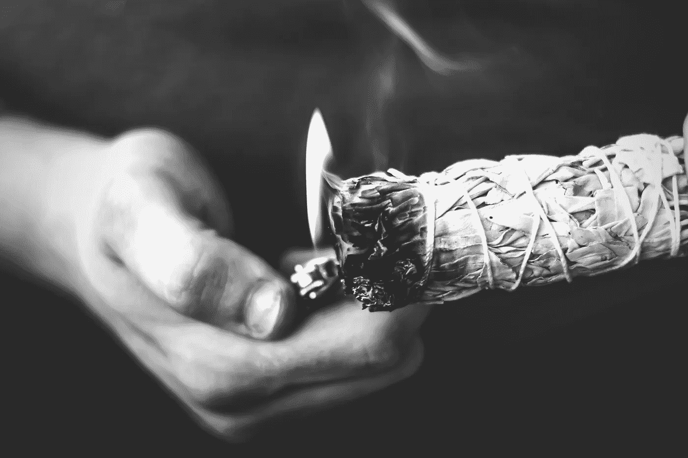
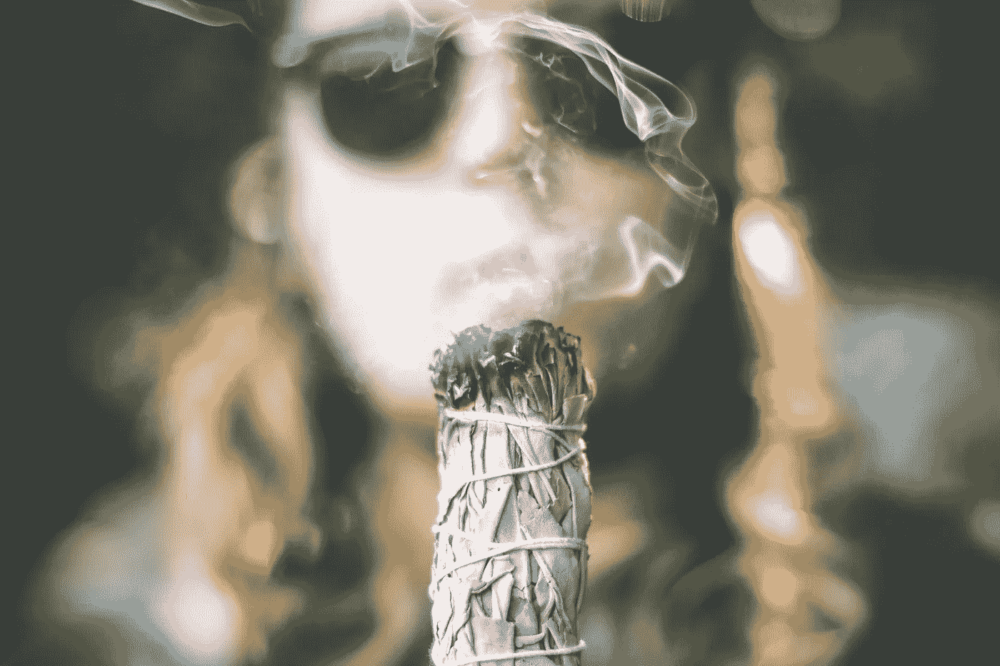

# 鼠尾草涂抹:如何鼠尾草只是任何东西

> 原文：<https://medium.datadriveninvestor.com/sage-smudging-how-to-sage-a-house-6901897be4c6?source=collection_archive---------1----------------------->

## 生活

让光明进来，迎来黑暗

Image by Brittany Colette for Unsplash

坏运气没什么好惹的。不管你信不信，我们都经历过。紧张情绪一直在蔓延，压力似乎弥漫在你家里的空气中。也许你感到紧张不安，与伴侣的争吵也空前高涨。你感觉陷入困境，疲惫不堪，被一种无法解释的无精打采所困扰。是时候澄清事实了。是时候贤者了。

**下垂和晕染有什么区别？**

近年来，越来越多的人倾向于用其他方法来照顾自己的健康。今天，我们不仅要考虑饮食和身体健康，还要考虑精神和精力健康。

下沉是通过燃烧药草来净化一个区域或物体的负面能量的过程。

**草药是我们的朋友。**

虽然有许多变种，白鼠尾草是最受欢迎的，也是我个人的选择。我碰巧喜欢鼠尾草的味道，但它并不适合所有人。如果你喜欢更甜的气味，尝试燃烧带有更深泥土气味的 palo santo 棒。Palo santo 除了具有清洁功能外，还有丰富的药用历史。Palo santo 主要生长在阿根廷、玻利维亚、巴拉圭和巴西的部分地区。所以，它被认为是相当奇特的。我喜欢 palo santo，虽然我确实试图更倾向于鼠尾草，因为 palo santo 最近被添加到[濒危物种国际贸易公约(CITES)](https://www.cites.org/eng/app/index.php) 名单中，其中包括没有特别濒临灭绝的物种……但由于受欢迎程度的提高，受到控制，以防止它变得濒危或灭绝。

在西方文化中，涂抹已经成为下垂的同义词。很多时候，它被视为同一件事，然而，值得一提的是，该术语实际上是挪用自美洲土著传统。在部落仪式中，燃烧包括鼠尾草在内的草药被用作仪式领导者导航精神领域的神圣元素。在这种情况下，鼠尾草没有被用作清除能量的手段。

> "我是在蝴蝶家族的故乡长大的."黛安·瓦科斯基，晕染

Image by Brittany Colette for Unsplash

**什么可以下垂？**

简短的回答是…任何事情。下垂可以用来清理家里或车里的空间，就像它可以用来清理你自己的光环一样容易。

 [## 定义新冠肺炎时代的“生活”|数据驱动的投资者

### 我和妻子即将进行一个月的自我隔离，以避免感染冠状病毒。我们都 70 多了…

www.datadriveninvestor.com](https://www.datadriveninvestor.com/2020/04/23/defining-life-in-the-time-of-covid-19/) 

**有人能圣人吗？**

绝对的！但是请记住，就像其他事情一样，做这件事仍然有正确和错误的方法。让我们好好干吧！以下是你需要遵循的步骤，为你开辟一个新的空间。

**超级简单！**

1.  收拾好你的物品，确保打开几扇窗户或门。如果你的车下垂，摇下几扇窗户。当你净化时，负面能量需要一个地方来逃离。你也不想把自己闷在烟雾中。你需要捆好的或松散的干燥的白色鼠尾草叶、一个大鲍鱼壳和一个打火机或火柴。我更喜欢鲍鱼壳，因为与玻璃或陶瓷不同，它们不会在燃烧的鼠尾草的热量下破裂或粉碎。请记住，当你走的时候，需要重新点燃贤者是正常的。
2.  大声说出你的意图。有一个意图是下垂过程的一个重要部分。考虑你试图从空间中释放什么。如果你也想写下一个简短的咒语也没关系。可以简单到几句话。例如，“请净化这个空间的所有负面，释放黑暗，只欢迎光的一面。让这个空间充满爱和温暖。”
3.  如果你正在净化自己的光环，你可以选择静静地思考积极的肯定。闭上眼睛，想象自己被柔和美丽的白光覆盖。想象你的胳膊和腿变得没有重量，沉重的思想开始消失在远方。想象纯白色的光充满你的每一寸，给你注入孩童般的快乐。每个人的肯定会略有不同，因为我们都是独一无二的。想象一下你想如何看待自己。毕竟……感知是现实的十分之九。
4.  一旦你准备好开始，把鼠尾草放在你的壳里，点燃叶子束的末端或几片叶子。一旦火焰开始燃烧，给它几秒钟的时间让它真正升温…然后轻轻吹灭火焰，促使烟雾翻腾。
5.  开始在你的前门下垂，继续顺时针方向行走，让烟雾飘散。让烟雾充满每个房间或空间的角落是很重要的。进入所有阴暗的角落和缝隙。此外，一定要让烟通过每个通向外面的窗户和门。当你在空间行走时，大声重复你的咒语。记住，你本质上是在推出负面能量。目标是最终到达起点，你的前门。通过这种方式，你可以将消极的情绪驱逐出去，让它无处可去。
6.  安全第一！慢慢来没关系。不要着急，要注意任何燃烧的余烬可能会从你的鲍鱼壳里飘出来。你肯定不想引起任何火灾。
7.  完成后，将鼠尾草擦入贝壳或沙子中熄灭。不要用水。这将使将来重新点火变得更加困难。
8.  坐下来享受宁静。事后感到鸡皮疙瘩或有点头晕并不罕见。“这就像是给你的精神按了一个刷新键，”黛博拉·哈内坎普说，她是纽约一家另类健康公司 [Mama Medicine](https://www.mamamedicine.nyc/) 的创始人。

我通常喜欢一周清洗一次，但一般人可能只需要一个月清洗一次。作为一个狂热的中世纪古董家具和装饰品收藏家，我发现引入古董似乎总是会很快耗尽我空间的能量。我也一定会珍藏每一件进入我家的新古董。

不服气？

你内心的怀疑者想要一些事实证据吗？我不怪你。对于年轻一代来说，这种做法似乎是一个未知的领域。但事实上，这是古代文明的常识。

准备好大吃一惊了吗？以下是一些与燃烧鼠尾草有关的有趣事实。

一项 [2014 年的研究](https://www.scielo.br/scielo.php?script=sci_arttext&pid=S0102-695X2014000500591)将药用植物和焦虑联系起来，表明白鼠尾草有着缓解抑郁、焦虑和情绪障碍的良好记录。燃烧鼠尾草的做法已经被萨满、治疗师和精神向导使用了几个世纪…可能更久。事实上，某些种类的鼠尾草含有侧柏酮。侧柏酮具有轻度精神活性，可以解释为什么如此多的文化在传统仪式中使用它作为提高直觉的手段。

所以，现在你可能在想也许你应该尝试一下。绝对的！除了一些陈腐的负面能量，你还能失去什么？从我在这里分享的圣人智慧中取一个例子，澄清事实！

**注册** [***生活漫游者简讯***](https://www.livingwanderfully.com/) **更多类似这样的精彩内容每个月都会直接发送到你的收件箱。**

**如果你喜欢这篇文章，你可能也会喜欢:**

 [## 走向整体健康的 10 个步骤，不会让你倾家荡产

### 一个更健康的你

medium.com](https://medium.com/the-eclectic/10-steps-towards-holistic-health-that-wont-break-the-bank-4da04d405086)  [## 冥想救了我的命

### 我是如何在放手的同时学会掌控的

medium.com](https://medium.com/@LivingWanderfully/meditation-saved-my-life-ff044db8695e) 

我叫杰米·戈洛。我是一名作家、艺术家和生活的爱好者，受到创作群体的集体经历和故事的激励。我的使命是阐明和保护对人类来说意味着什么的美丽的复杂性。在 Instagram、脸书和 Twitter 上关注我。