# 使用 Prophet 进行销售预测

> 原文：<https://medium.datadriveninvestor.com/sales-forecast-using-prophet-99bf9ad93fbc?source=collection_archive---------1----------------------->

用脸书的预言家预测未来的销售。


在这个项目中，我们的目标是使用一家英国零售商提供的数据来展示我们如何利用数据科学解决方案来获得相对于其他企业的竞争优势。

此外，这让我们对公司本身有了更多的了解，帮助我们更好地了解顾客、他们的习惯、产品等等。

本项目所用的数据可以在[**这里找到**](https://www.kaggle.com/carrie1/ecommerce-data/kernels) 。

这个项目分为三个部分。在这里，我们将研究:

*   **分析一段时间内的销售情况，以及使用 Prophet 进行销售预测。**
*   [**RFM 客户细分用 K-Means**](https://medium.com/@rafaelnduarte/rfm-customer-segmentation-using-k-means-6fa5f72604c)
*   [**用 NLP 了解你的客户**](https://medium.com/@rafaelnduarte/understanding-your-customers-with-nlp-929771ae2d0b)

我们开始吧！

# 从这篇文章中可以期待什么？

在这里，我将尝试简化项目的步骤，以便交付一个以结果为中心的方法。如果你想检查代码和整个项目，请查看这个 [**链接**](https://colab.research.google.com/drive/1jHJ0T7nWFHE1tH9Xh2xMNbjoL8vhls9q) 。

# 数据

如前所述，我们使用的是一家英国零售商的数据，可在 Kaggle 上获得。它包含了 2010 年到 2011 年的销售数据。尽管它不是最新的数据集，但它完成了工作，因为它帮助我们表明，即使只有 8 个功能，我们也可以创造巨大的价值。

[](https://www.datadriveninvestor.com/2019/01/23/which-is-more-promising-data-science-or-software-engineering/) [## 数据科学和软件工程哪个更有前途？数据驱动的投资者

### 大约一个月前，当我坐在咖啡馆里为一个客户开发网站时，我发现了这个女人…

www.datadriveninvestor.com](https://www.datadriveninvestor.com/2019/01/23/which-is-more-promising-data-science-or-software-engineering/) 

# 我们有什么数据？

*   `InvoiceDate` -购买的日期和时间。
*   `InvoiceNo` -发票识别号。
*   `StockCode` -产品的库存代码。
*   `Description` -产品的简要描述。
*   `Quantity` -购买的物品数量。
*   `UnitPrice` -给定产品的单位价格，单位为英镑。
*   `CurtomerID` -进行购买的客户的 ID。
*   `Country` -购买的国家。

# 探索性数据分析

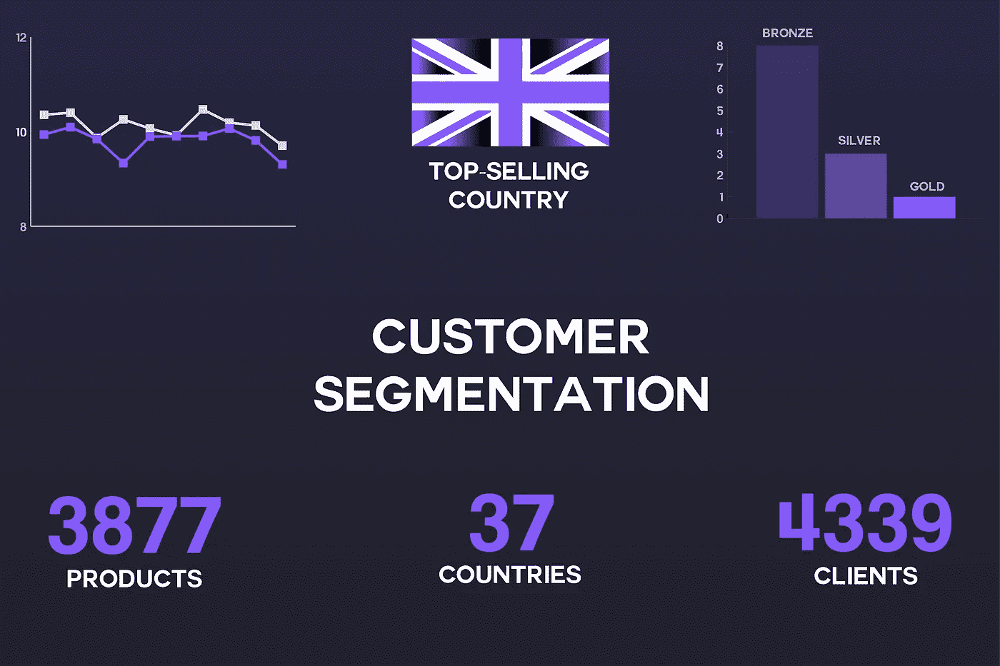

为了使这篇文章更容易、更快地阅读，我不会在这里介绍关于数据清理、特征创建、准备和选择的所有细节，而是侧重于所研究的准备数据的最重要的方面和结果。

## 统计分布亮点

`Price`

*   最低价格是 0，00，这意味着商店赠送一些物品。
*   产品均价 3，11。
*   最贵的单品要 8.142，75。
*   即使有昂贵的物品，但大多数都很便宜。

`Quantity`

*   平均值实际上高于第 75 百分位，这表明大多数购买量都较大。数据来源说这家商店迎合批发商。即使这可以解释它，他们不是唯一的客户类型，因为平均不值得批发。

`AmountSpent`

*   在这方面，再次看到这种消费模式实际上是廉价的，真的很有趣。当然，我们还没有全部订单的数据，但人们不会在这些商品上花很多钱。

# 畅销产品和国家

同样，这一部分在我的另一篇文章 的 [**中进行了充分的讨论，其中涵盖了使用 **NLP** 来更好地了解我们的客户。在这里，你会看到一些最有趣的发现。**](https://medium.com/@rafaelnduarte/understanding-your-customers-with-nlp-929771ae2d0b)

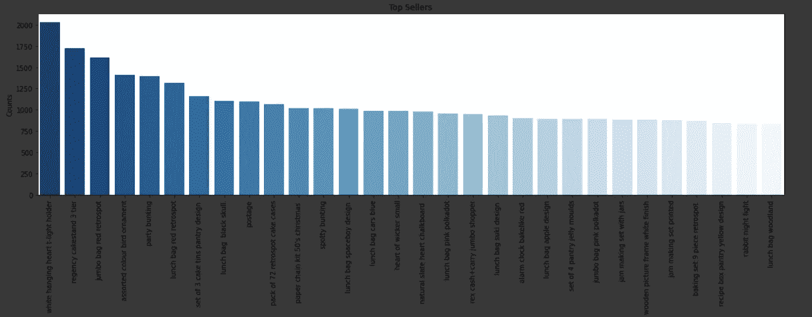

Top-Selling Products

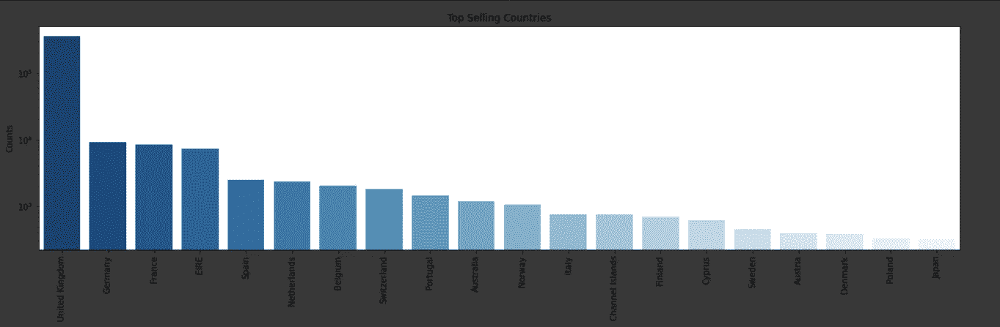

Top-Selling Countries

## 分类特征的统计分布

*   这家公司向全球 37 个不同的国家销售产品。
*   同样，唯一发票号的数量与行数的对比表明，大多数发票都有很多产品，这再次强化了批发商的想法。
*   作为一家总部位于英国的公司，它在英国的销量最大是有道理的。
*   他们有将近 4000 种不同的产品。

# 结论

由于我们将致力于这项业务的不同方面，提供不同类型的分析，这不应是一个广泛的分析，而是对数据集的概述。

[**在这里**](https://medium.com/@rafaelnduarte/understanding-your-customers-with-nlp-929771ae2d0b) 我们可以看一看一些基本的 **NLP** 探索，以便更好地了解产品和市场。

# 时间序列探索


正如您在分析开始时看到的，我们在这里处理的是**时间序列**。

时间序列是在一段固定的时间内记录的观察序列。

这是一件大事，因为我们及时衡量一切。在这种情况下，我们谈论的是一段时间内的销售额。

# 真正的商业应用

我们使用的数据集来自一家英国零售商一段时间的销售额。在现实世界中，他们会将这些数据用于:

*   分析以前的时期，看看哪里出了问题(**毕**)
*   使用这些数据对未来进行预测(**数据科学**)

好的。但是这些预测有用吗？它们能保证什么吗？

它们不能保证任何事情，特别是因为我们没有分析外部因素，比如天气、灾难、火灾等等。然而，它们可以成为可靠的信息来源，有助于:

*   股票
*   新产品、销售等的商业策略。
*   营销

还有很多。

# 为机器学习准备数据

我们需要为勘探准备数据。同样，要查看所有细节，请查看代码为 的 [**完整项目。**](https://colab.research.google.com/drive/1jHJ0T7nWFHE1tH9Xh2xMNbjoL8vhls9q)

为了使用 **Prophet** ，脸书的时间序列机器学习模型，我们需要以非常特定的格式保存数据。

这是一个非常健壮且使用起来相当简单的模型，当对正确的数据进行操作时，它的功能足够强大，即使很少甚至没有调整也能产生良好的结果。

**平稳时间序列**

当对时间序列进行预测时，人们通常会担心它们是否是平稳的。例如，与 **ARIMA** 合作，拥有**固定**系列是**必不可少的**。

你会发现项目使用 **Prophet** 的例子，甚至没有检查时间序列是否平稳。在这里，我们将首先对它进行处理，然后检查它是否是静止的，如果不是，我们将使它如此，然后再次训练模型以比较结果。

## 与先知一起工作

Prophet 需要一种非常特殊的数据框架来工作。我们需要的是:

*   日期列为`ds`。
*   值列为`y`。

让我们这样做吧。

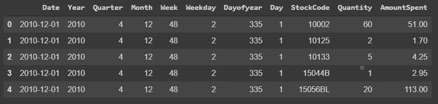

Data as is

此外，在将数据放入 Prophet 需要的格式之前，我将数据分组为每日数据，而不是每小时的原始格式。

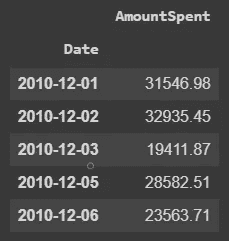

Daily Data


Daily Data ready for Prophet

## 静态测试

如前所述，我们将分析使用 **Prophet** 处理**静态**时间序列的影响。

首先，让我们使用 [**增强的 Dickey-Fuller**](https://en.wikipedia.org/wiki/Augmented_Dickey%E2%80%93Fuller_test)**测试(ADF)来检查我们的数据是否平稳。**

```
**from** **statsmodels.tsa.stattools** **import** adfuller
*# extracting values*
X = df_ts.y

*# apply ADF and print results*
result = adfuller(X)
print('Augmented Dickey–Fuller')
print('Statistical Test: **{:.4f}**'.format(result[0]))
print('P Value: **{:.10f}**'.format(result[1]))
print('Critical Values:')
**for** key, value **in** result[4].items():
	print('**\t{}**: **{:.4f}**'.format(key, value))
```

**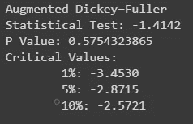**

**答对了。我们的 P 值是 0.57，这意味着我们的时间序列是**而不是**平稳的。**

**让我们看看 Prophet 是如何处理我们的基线的。**

# **用预言家做预测**

******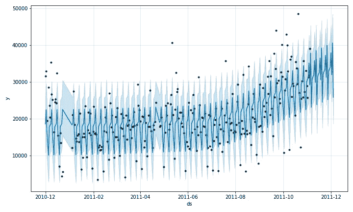**

**Non-stationary Forecast**

**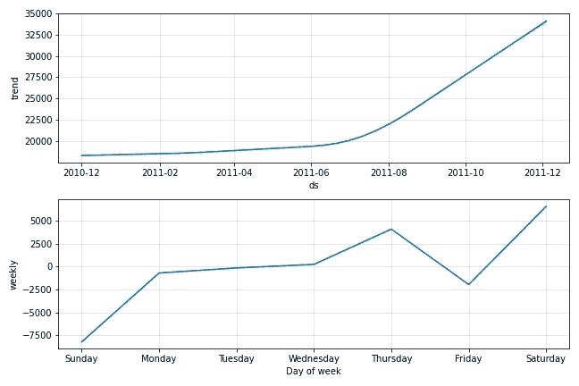**

**Non-stationary Components**

**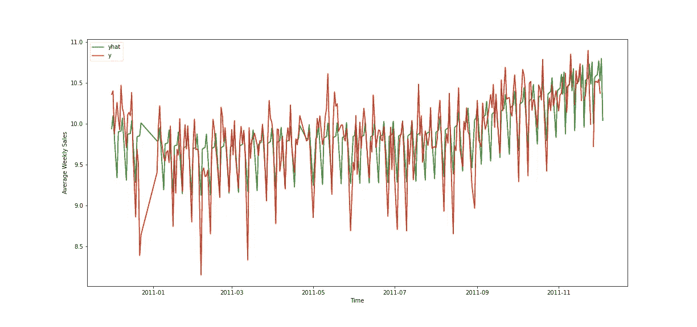**

**Visualizing the predictions over the actual values**

**所有这些看起来都很棒，但是，我们怎么知道我们的预测是否准确呢？**

**这里，我们使用 to 指标进行评估:**

*   **[**平均绝对百分比误差**](https://en.wikipedia.org/wiki/Mean_absolute_percentage_error) —我们的预测值与实际值相差多少百分比。**
*   **[**平均绝对误差**](https://en.wikipedia.org/wiki/Mean_absolute_error) —预测值与实际值之间的绝对误差值。**

**在计算了 MAPE 和梅之后，我们得到了这些结果:**

*   **MAPE:18.31**
*   **美:6253.81**

# **平稳时间序列**

**这是一个相当大的错误。我们不能把它作为可靠的信息来源。**

**我们可以做的一件事是尝试改进我们的结果，让我们的时间序列平稳，然后看看它会怎样。**

**我们将通过使用一种叫做**差分**的技术来做到这一点。你可以在这里 了解更多关于这个方法的 [**。**](https://machinelearningmastery.com/remove-trends-seasonality-difference-transform-python/)**

**转换我们的数据并重新训练模型后，让我们检查结果:**

**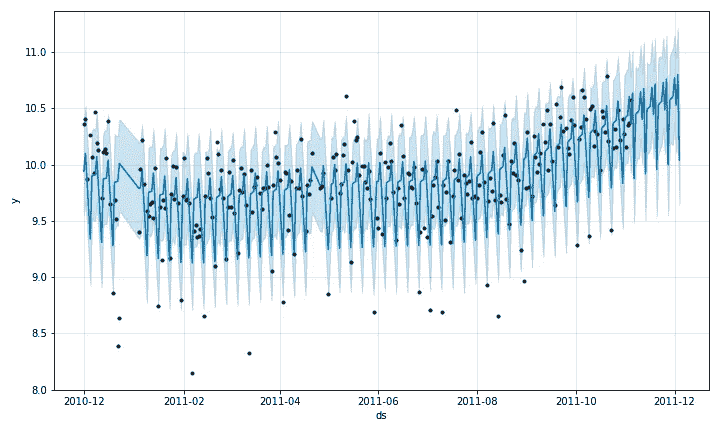**

**Stationary Forecast**

**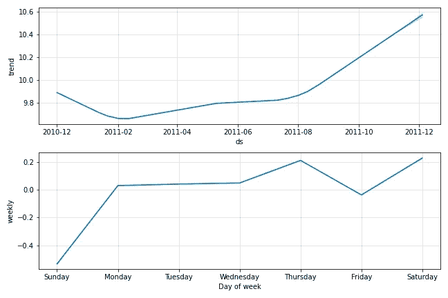**

**Stationary Components**

**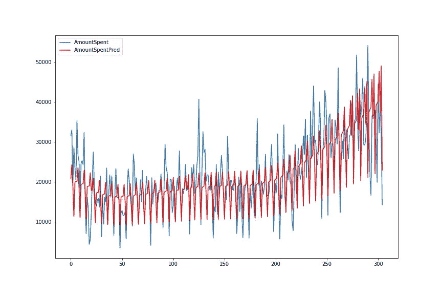**

**Visualizing the predictions over the actual values**

**我们可以看到图表之间的一些差异，但真正的差异来自结果。在使用平稳时间序列进行预测后，我们获得了以下结果。**

*   ****MAPE** : 1.85**
*   **平均相对误差 : 0.19**

# **结论**

**平均绝对百分比误差小于 2%，平均绝对误差约为 0.19，可以说我们已经创建了一个可以成为可靠信息源的模型。**

**由此可见，对平稳数据进行预测是多么强大。**

**同样重要的是，我们没有在模型中使用任何调整，这可以改善非平稳数据的结果。**

**我们可以看到，我们的数据往往低估了销售额，这并不坏，因为企业需要为最坏的情况做准备。**

**如果我们想要更乐观的预测，我们可以使用`yhat_upper`而不是`yhat`。**

**对于更保守的预测，我们可以使用`yhat_lower`。**

# **谢谢大家！**

**感谢您的时间和关注。我希望这是一个信息丰富和有趣的项目。如果您有任何问题或任何类型的反馈，请随时在 [**LinkedIn**](https://www.linkedin.com/in/rafael-n-duarte/) 上联系我，并在 [**GitHub**](https://github.com/rafaelnduarte/portfolio) 上查看我的其他项目。**

****