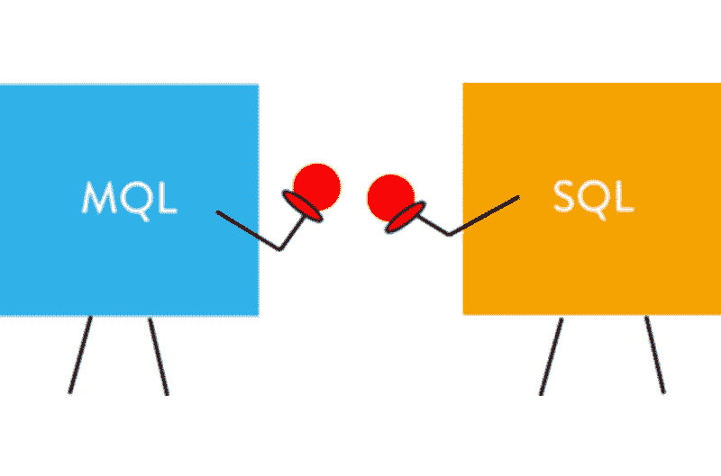

# 销售理论部分:营销合格销售线索与销售合格销售线索

> 原文：<https://medium.datadriveninvestor.com/sales-theory-part-marketing-qualified-leads-vs-sales-qualified-leads-504b180de4c2?source=collection_archive---------8----------------------->

你是否曾经觉得你没有产生足够的销售线索？你正在做一切需要做的事情，但你不只是得到它，你不能只是填满你的销售漏斗，或者也许你能够填满你的销售漏斗，但你的转化率很低。这有多令人沮丧。好吧，在这种困境中你并不孤单；每个销售人员和营销人员都面临这种情况，直到他们能够了解营销合格领导(MQL)和销售合格领导(SQL)之间的区别。然而，在我们深入了解他们的区别之前，我们必须从零开始，了解什么是领导，或者谁是领导。

 [## 数据科学和软件工程哪个更有前途？数据驱动的投资者

### 大约一个月前，当我坐在咖啡馆里为一个客户开发网站时，我发现了这个女人…

www.datadriveninvestor.com](https://www.datadriveninvestor.com/2019/01/23/which-is-more-promising-data-science-or-software-engineering/) 

领导是以这样或那样的方式对你公司的产品或服务表现出兴趣的人。那么，销售线索是如何表现出兴趣的，或者说销售线索是如何产生的呢？

通常，销售线索是通过收集信息产生的，这些信息通常来自潜在客户。每条线索都是不同的，所以你应该能够指出他们在销售漏斗中的位置。当您能够确定您的销售线索在其销售旅程中的位置时，您将能够用更少的销售线索创造更多的收入。

这些是为什么:

*1。* *并不是所有产生的销售线索都是现成的，或者都适合您的产品。*

*2。这意味着你的销售团队已经投入了大量的精力和时间在尘土中寻找金子，而不是专注于他们最擅长的事情:销售。*

*3。如果你决定增加潜在客户的数量，你的销售团队可能会达成更多的交易，这正是你想要的，但他们也会发现更多的污点。*

*4。通过迫使你的销售团队不断寻找机会，你总是会降低他们的工作效率。*

为了提高你的销售团队的效率和业绩，你应该给他们更少、更高质量的销售线索。这不是数量的问题，而是销售线索的质量问题。那么，如何识别黄金线索呢？这一切都始于了解他们的差异。

这些理论和术语对于成为一名更好的销售人员非常重要，所以让我们来讨论一下理论术语，比如 *MQL* 和 *SQL。*

***MQL vs SQL***

如前所述，作为营销人员或销售人员，了解您的销售线索在销售过程中的位置对于达成好交易非常重要。当你得到你的线索，特别是那些你可能归类在高克拉黄金的线索后，兴奋是必然的。因此，您可能想立即将您的销售线索直接发送到销售部门，而没有为该阶段做好适当的心理准备。坚持一下！在帮助您的销售线索完成销售之旅的过程中，您需要采取更重要的步骤，如果您知道 MQL 和 SQL 之间的区别，您就可以做到这一点。让我们把它全部分解。

*MQL* 是更有可能成为客户的潜在客户。基于某些特定行为或通常通过闭环报告传达的线索情报，他们比其他潜在客户对您的产品更感兴趣。您可以通过查看销售线索表现出的某些行为来跟踪这一点，例如他们访问您的网站的频率、内容提供下载量等。

请注意，MQL 不保证购买您的产品或服务；然而，尽早识别它们将有助于你筛选污垢。这意味着销售和营销团队将只关注符合收入标准的销售线索。简而言之，MQL 是一个潜在客户，虽然他们还不太可能从你这里购买，但是他们会对被培养做出反应。

下一阶段是 *SQL* 。合格的销售线索在其购买者之旅中走得更远。他们现在是潜在客户。虽然 MQL 还不准备购买，但 SQL 已经进入了他们的购买周期。他们有一些问题，并准备好与您的销售部门进行一对一的互动。这通常是他们与营销团队互动的结果。一旦你知道如何区分这两者，你现在可以参与所谓的线索评分，例如，给那些访问过高价值页面(销售指南)，填写高价值表格(直接销售演示请求)或多次浏览过你的网站的人更高的分数。线索评分对于强化您的收入循环至关重要，它允许您根据他们提供的信息以及他们如何参与您的网站来评估每个线索。您从销售线索中收集的信息将使您能够根据偏好程度来锁定每个销售线索。

但是，销售线索评分只有在销售和营销团队通力合作的情况下才能成功。当销售和营销整合为一个收入周期时，它们会显著提高营销投资回报率、销售生产率和增长。因此，销售和营销团队必须通力合作，牢记相同的创收目标，同时相互问责。这是一个双赢的局面。

***CRM***

CRM 是客户关系管理的简称。这是一个系统或策略，用于管理客户的互动，照顾现在和未来的客户，优化和系统化的关系。

*HubSpot CRM*

HubSpot CRM 是想要进入 CRM 的小公司的完美选择，基本上是因为它几乎是免费的。根据 HubSpot 的说法，使用 CRM 永远是免费的，即使你不付钱给 HubSpot 的客户。另一个好消息是，除了它是免费的，它还包括创建一个无限用户的线索培育工作流程。这意味着使用 HubSpot CRM，您可以轻松地设置您的销售线索培育工作流程，以有效地将您的营销合格销售线索转变为销售合格销售线索！

HubSpot CRM 使您能够通过您的营销平台创建销售线索，在提供有用内容的登录页面上进行转换。它允许您创建和存储多达一百万个联系人，也可以分配无限的用户。这都是在无缝美观的界面中进行的。

您的营销工作流程应该是一个您遵循的记录流程，并且应该包含来自营销和销售团队的输入。您的流程应包括以下任何或所有组件:

*   *自动电子邮件*
*   *个人邮件*
*   *教育内容*
*   *行动要求*

营销团队成员的潜在电话对您的培养过程非常有益。此外，确保你的营销人员有脚本问题要问，他们应该认识到他们只是打电话来了解更多的潜在客户和倾听。不要打电话告诉他们你公司的所有产品。