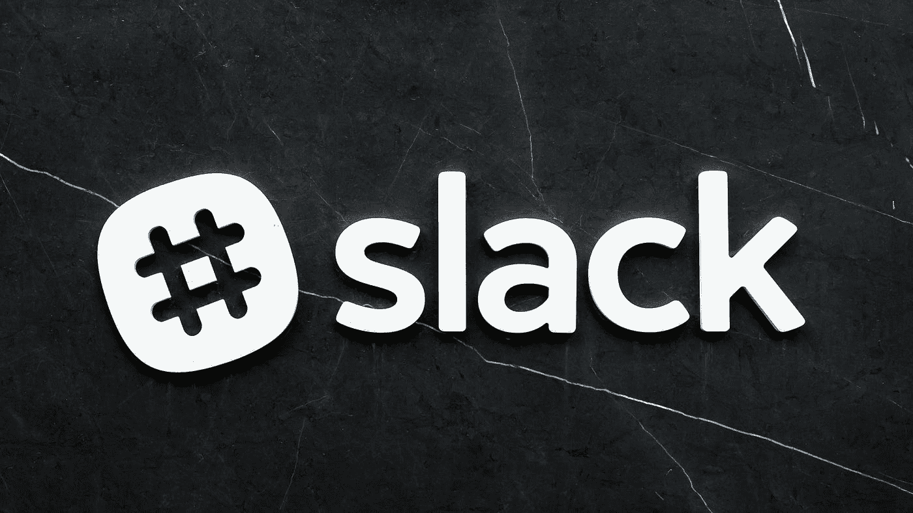

# Salesforce 在超级网络星期二以 277 亿美元收购 Slack

> 原文：<https://medium.datadriveninvestor.com/salesforce-buys-slack-for-27-7-billion-on-mega-cyber-tuesday-5a713d61c4ca?source=collection_archive---------28----------------------->

## Salesforce 刚刚签署了收购 Slack 的最终协议

Photo by [Scott Webb](https://unsplash.com/@scottwebb?utm_source=medium&utm_medium=referral) on [Unsplash](https://unsplash.com?utm_source=medium&utm_medium=referral)

Salesforce 签署了一份 [*最终协议*](https://investor.salesforce.com/press-releases/press-release-details/2020/Salesforce-Signs-Definitive-Agreement-to-Acquire-Slack/default.aspx) 收购 Slack，证实了这些传言是完全可信的，今天，12 月 1 日，在三藩市可以看到白烟。

> 根据协议条款，每股 Slack 股票，Slack 股东将获得 26.79 美元的现金和 0.0776 股 Salesforce 普通股，根据 Salesforce 普通股在 2020 年 11 月 30 日的收盘价，代表约 277 亿美元的企业价值。

即使这一大交易场景在过去几天变得可行，我记得我在[的《福布斯》杂志](https://www.forbes.com/sites/davidjeans/2020/11/30/salesforce-slack-acquisition-marc-benioff/?sh=7382b7b811de)上看过一篇文章，文章提到“今年第二季度末，马克·贝尼奥夫坚持认为现在不是 Salesforce 收购公司的好时机。”

> Salesforce 首席执行官兼董事长在 8 月份的财报电话会议上对投资者表示:“我们在 M&A 的环境并不好。”。“这不是我们现在计划的一部分。我们没有看到。我们非常重视我们的业务。”

然而，即使是蓬勃发展的独角兽也可能落入基于云的客户关系管理(CRM)平台的羽翼之下，如 Salesforce。一家在 2020 年跻身全球最受赞赏公司前十名的*大型科技公司*《财富》杂志*排名第十的*

# *天作之合*

*Salesforce 董事长兼首席执行官马克·贝尼奥夫(Marc Benioff)提到了这笔交易，并继续阐述了在后新冠肺炎·疫情时代，两家公司的未来可能会如何:*

> *Salesforce 和 Slack 将共同塑造企业软件的未来，并改变所有人在全数字化、随处工作的世界中的工作方式。一旦交易完成，我很高兴欢迎 Slack 加入 Salesforce Ohana。"*

# *交易如何影响真实的人*

*作为排名第一的 CRM，salesforce 知道“Slack 如何将人员、数据和工具聚集在一起，以便团队可以在任何地方协作并完成工作。Slack Connect 扩展了 Slack 的优势，使公司员工和所有外部合作伙伴(从供应商到客户)之间能够进行沟通和协作。”*

*根据一项员工满意度调查，Salesforce 在《财富》杂志(Fortune)评选的 T2 100 家最适合工作的公司中排名第六。因此，CRM 巨头的目标是在 2021 年快速进入前 3 名，在希尔顿的带领下击败 Workday #5 和 Cisco #4。*

> *在这个云软件巨头，惊人的 52%的新员工来自现有员工的推荐。这是一个重点，因为员工每成功推荐一名员工，就能获得 2000 美元的现金奖励。(去年员工集资 700 万美元！)招聘人员必须在七个工作日内审查并联系这些候选人，该公司甚至有一个应用程序可以让员工看到潜在雇员的状态。2018 年，Salesforce 开设了技术的道德和人道使用办公室。*

*新闻稿强调了这一主题:“Slack 将改变人们在 Salesforce 中就客户信息以及来自所有其他业务应用程序和系统的信息进行沟通、协作和采取行动的方式，从而提高工作效率，做出更明智、更快速的决策，并创造互联的客户体验。”*

# *交易详情*

*他们计划在 sales force 2022 财年的第二季度完成交易，前提是获得 Slack 股东的批准。*

*Salesforce 将采用股票和现金相结合的方式收购 Slack。CRM 巨头计划“用 Salesforce 资产负债表上的新债务和现金组合来为交易对价的现金部分提供资金。”*

# *最后的想法*

*新冠肺炎疫情危机改变了游戏规则，而在线*大科技*正在充分利用我们的新现实。*

*今天早些时候，我们听说根据 Adobe Inc Analytics 的数据，网络星期一的在线销售额攀升至 108 亿美元，创下美国电子商务记录。*

*网络空间是一个无冠状病毒区，人们正在充分利用它。然而，即使是最神奇的*独角兽*也不是*尖端科技*的对手。*

**

*Rui Carneiro 毕业于波尔图大学艺术与人文学院。专门从事战略沟通和自我发展的教师和生活教练。*

> *我们可以通过 [LinkedIn](https://www.linkedin.com/in/rui-carneiro-52537b173/) 或 [Twitter](https://twitter.com/Editor_RnH) 分享更多见解。感谢你穿越迷宫。感谢您的反馈。*