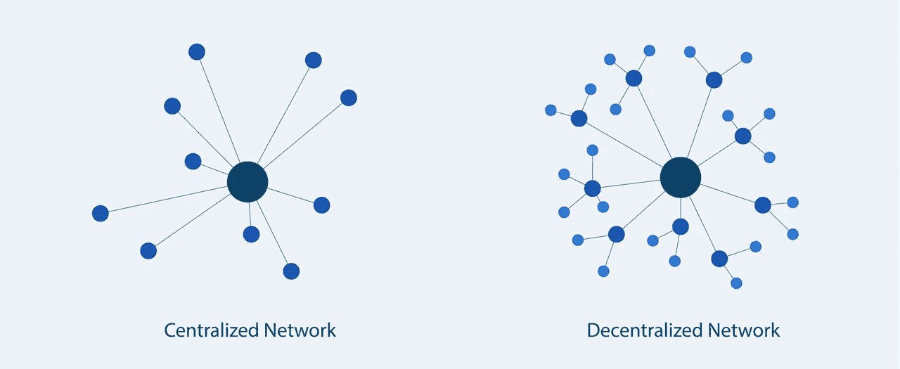

# 拯救 Web 2.0 和 Web 3.0 平台，创建完美的 Web。

> 原文：<https://medium.datadriveninvestor.com/salvaging-web-2-0-and-web-3-0-platforms-to-create-the-perfect-web-5f3c60622e05?source=collection_archive---------19----------------------->

嘿，让我猜猜，你从 Steem，Hive 或类似平台转移到 publish0x，Medium 或 theCapital？或者反过来。

抱歉，网络逃犯！

就我个人而言，我已经找到了某种程度的平衡，并且我一直在努力适应这两种网络平台。是的，我明白你的意思，也清楚地理解在两个平台和它们所提供的东西之间寻找平衡的感觉。

对于迁移到 Steem 和 Hive 这样的去中心化网络平台的人来说，你可能有一个内容或整个博客被以一种非常难以忍受的方式审查，你最终决定冲出整个设置，迁移到一个你再也不用担心这个的平台。

相比之下，对于一些退出分散平台并进入集中平台的人来说；不管怎样，集中化还是更好。嗯，虽然我不完全同意这一点，但也说这是错误的就太草率了。

## 什么是 Web 2.0？

Web 2.0 是一个协作性和参与性的网络平台。也被称为“社交网络”，web 2.0 平台允许用户在网络上进行社交活动，如生成自己的内容。与内容和内容创作者的互动构成了社交网络/社交媒体概念的主要部分。

Web 2.0 平台是一个相对较老的概念，只要稍加思考，人们就能说出一些提供互动服务的平台…Youtube、Medium、Blogspot，这个列表是详尽的。

Web 2.0 平台托管在一个服务器上，由一个 Web 服务器控制平台上的活动。这种控制是无限的，并且跨越平台的几乎每个方面，例如内容生成、平台上的信息分发、个人简档创建和个人简档细节。这些平台的所有者拥有对平台的完全控制权。

## 什么是 Web 3.0？

Web 3.0 是一个新兴的概念，一个用来描述分散式 Web 平台的术语。Web 3.0 平台希望重新定义 Web 的后端。去中心化媒体技术专注于在社交平台上给用户分配平等的权利。它的算法改进了网络在服务器端的工作方式，试图为用户提供平等的权利。但是，前端被保留下来，因为核心概念保持不变。web 3.0 平台的前端与 web 2.0 平台有着明显的相似性。web 3.0 革命由区块链技术引领/推动。

在一个去中心化的网络平台中，每个用户就像是一个庄园中一个用栅栏围起来的建筑，另一个普通的栅栏保护着整个庄园。这描绘了一个独立的平台，其中用户不受管理员和其他用户的审查(在一定程度上),因为每个配置文件在平台上以不同的方式托管。与集中式平台相比，分散式网络平台提供了一个分散的治理系统，其中每个成员都可以切实控制自己的活动。

 [## 区块链投票和美国选举|数据驱动的投资者

### 在不到 70 天的时间里，这个世界上最古老的民主国家将以前所未有的方式面临最大的摊牌…

www.datadriveninvestor.com](https://www.datadriveninvestor.com/2020/08/26/blockchain-voting-and-the-american-elections/) 

## 两个世界的分别？

Web 2.0 平台继续沉迷于这些平台的管理员的集中化和内容审查(通过删除/禁止内容或用户帐户)。这些平台上内容创作者的投诉持续上升。

另一方面，新兴的 web 3.0 平台以其不变性和去中心化让用户欣喜不已。这些平台上的内容创作者可以放心，他们制作的内容是安全的，他们辛辛苦苦建立的账户也是安全的。

然而，web 3.0 平台也有一些缺点。作为一个新兴的概念，它们还没有获得 web 2.0 平台所享有的关注度。在这里支持任何一方都是可以的，我们自然被期望坚持满足我们渴望的东西。

[来源](https://smartassets.one/centralized-vs-decentralized-p2p-exchange-velareum/)

## 通过协同使用 Web 2.0 和 Web 3.0 平台实现“完美网络”。

作为这两个“看起来”不同并且似乎相互对立的世界的一部分，重要的是要注意这两个平台的核心概念之间的相似性，以及两者之间的相互作用如何以及为什么可以成为实现完美互联网的一种方式。

无论是集权还是分权，你肯定对两者都有所喜爱。不管这有多“琐碎”,没有它你对网络的定义是不完美的。你只是决定继续做“更好的邪恶”。好消息是，你可以做得更好。

我们对网络的使用是无限的。(目前)对于使用哪种网页设计没有限制。“综合疗法”可能是解决办法。两个都可以用为什么要用一个？
嗯，你可以这么做…

有目的地使用 Web 2.0 和 Web 3.0 平台

所以，你在想你需要从集中式平台转移，或者从分散式平台转移到集中式平台。我在想你两样都需要！是的，你知道。集权与分权，对立但不完全矛盾；至少不是我们通常看到的那样。当我们希望一个成功地取代另一个，或一个粉碎另一个，并停止其进展；我们梦想中的互联网实际上是两者的混合体。

在 web 2.0 平台上审查的内容通常是有争议的。渴望去中心化平台的大部分内容创作者已经以某种方式成为 web 2.0 审查的受害者。虽然 Steem 和 hive 等分散平台也表现出一定程度的集中化，但有一点可以肯定的是，发布在这些平台上的内容不能(轻易)被删除。

将“可审查”的内容传输到 web 3.0 平台给了它在 web 2.0 平台上所缺乏的安全性。在这种情况下，Web 3.0 服务于一个非常重要的目的，它的审查阻力开始发挥作用。你可能会想，‘如果每个内容创建者都采用这种方式，web 3.0 平台可能会获得另一种不同的形象’；嗯，可能是这种情况，但这为 web 3.0 平台创造了一个独特的用例…这是一个非常重要的用例。

激励方案

我们对“回报”的定位在合理的范围内有所不同。对一些人来说，找乐子是一种有益的工具。对于非常有形的其他人来说，“得到报酬是唯一的回报”。嗯，这两种取向在它们自己的意义上是非常正确的，但是它们在不同的环境中茁壮成长。许多 web 2.0 平台没有向用户提供直接的激励，用户必须找到替代方式，从平台上共享的内容中获取收入。

[来源](https://mykaarma.com/incentivization-teamwork-the-keys-to-increased-profits/)

即使是直接奖励的 web 2.0 平台在如何奖励这些平台上的用户方面也不同于当前的 web 3.0 平台。作为一个内容创作者，在选择或放弃这些平台之前，你应该考虑奖励方案的选择。
你希望得到怎样的回报？更好的问题是，你对奖励的定义是什么？这是不确定的，你对这两个问题的答案；但肯定的是，这些平台中的一个满足了它。在它生活的地方捕捉乐趣，在提供奖励的地方获得奖励。你可能想选择一方，但是，你也有选择双方的自由。

理想的组织水平。

不同的人，不同的目的，不同的平台。人们也天生偏好集中式的设置，理由是这种平台通常比分散式平台更有组织性。在 web 2.0 平台上，有毒内容很容易被删除，不健康的行为也可以被轻松遏制。这在一定程度上是事实，但是，中央权力机构在集中式 web 中滥用权力玷污了 web 2.0 平台的形象，而 web 2.0 平台是 web 3.0 革命的主要原因。

web 2.0 平台提供的自由，web 3.0 平台提供的限制；挑选和选择。对我来说，两者兼而有之。自由可能是有毒的，但后者也是如此。感受这两者当然是最好的体验。

总之，无论是集中式、分散式还是分布式，这些平台都不一定意味着彼此的末日。设计上的差异带来了机遇，如果有效利用，可能会迎来一个完美互联网的时代。采用这种解决方案的内容创建者和他们的观众将不得不更少地遭受困扰互联网上内容共享的主要问题。

*本文首发于* [*语音*](https://app.voice.com/post/@dzoelx/cryptowriter-salvaging-web-20-and-web-30-platforms-to-create-the-perfect-web-1601320157-1) *为密码作者*

## 访问专家视图— [订阅 DDI 英特尔](https://datadriveninvestor.com/ddi-intel)