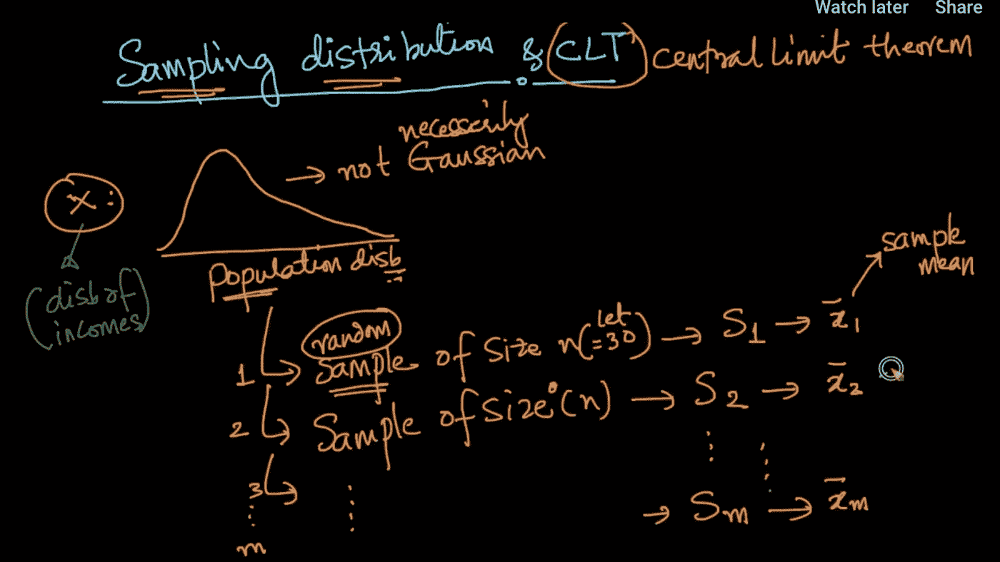
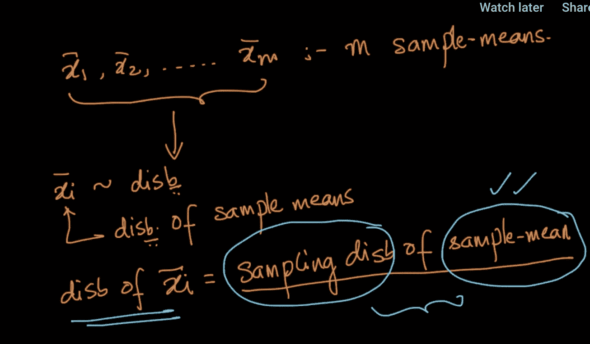
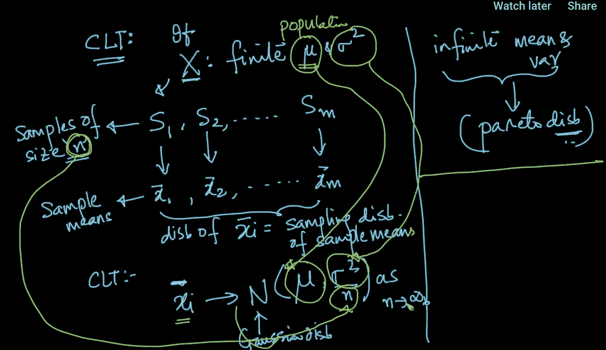
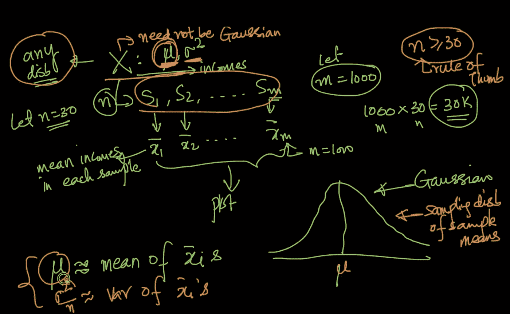

# 抽样分布&中心极限定理

> 原文：<https://medium.datadriveninvestor.com/sampling-distribution-central-limit-theorem-5d818367ec9?source=collection_archive---------6----------------------->

什么是样本分布？

假设我们有一个分布 x(不一定是高斯分布&图像中给出的不是高斯分布，因为它不是对称的)。现在，让我们假设我们从总体 s1，s2，s3 到 sm .等中(这些是相互独立的)随机选取 m 个大小为 n 的样本。并且这些样本的平均值是 x_bar1、x_bar2、x_bar3 到 x_barm。等等(记住这些是样本平均值，而不是总体平均值)。

这些样本均值也有分布，因为我们可以计算这些均值的 PDF，所以，我们将得到样本均值的抽样分布。

**中心极限定理:**

如果 x 分布具有有限的均值和方差(总体)(有一些分布具有无限的均值和方差，如帕累托分布，对于这些分布，CLT 将不起作用)。现在我们开始采样 s1，s2，.等等，从 x 中随机抽取(假设这些样本是大小为 n 的样本)，之前我们也有这些样本的样本均值&样本均值的抽样分布。CLT 表示，x_i_bar(样本均值的采样分布)分布为均值μ和方差σ(与 x 的总体μ和σ相同)的高斯/正态分布乘以 n 的平方，因为 n 趋于无穷大。

 [## 数据科学和软件工程哪个更有前途？数据驱动的投资者

### 大约一个月前，当我坐在咖啡馆里为一个客户开发网站时，我发现了这个女人…

www.datadriveninvestor.com](https://www.datadriveninvestor.com/2019/01/23/which-is-more-promising-data-science-or-software-engineering/) 

理论上，如果 n 趋于无穷大，但作为一个经验法则，我们可以认为样本均值的高斯分布是高斯的。

