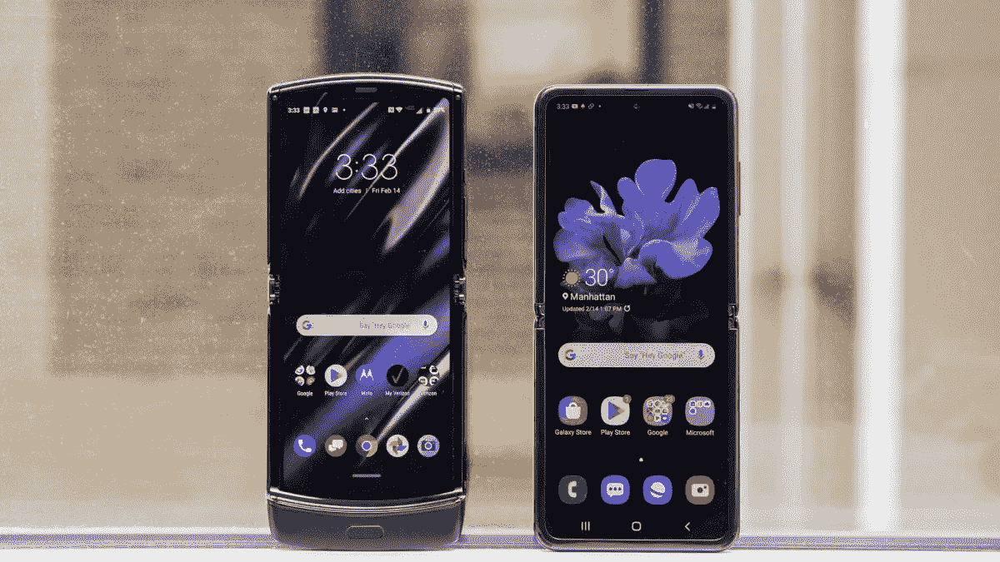
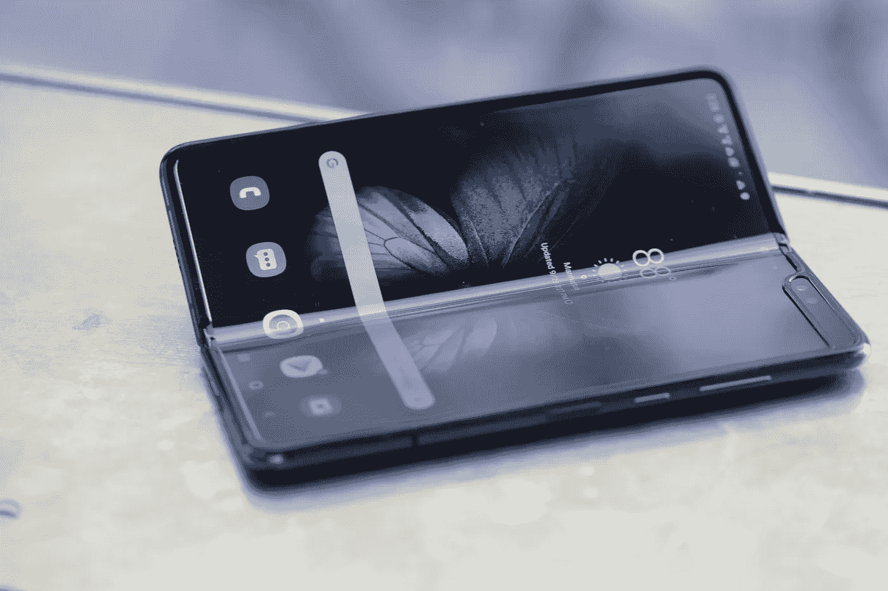
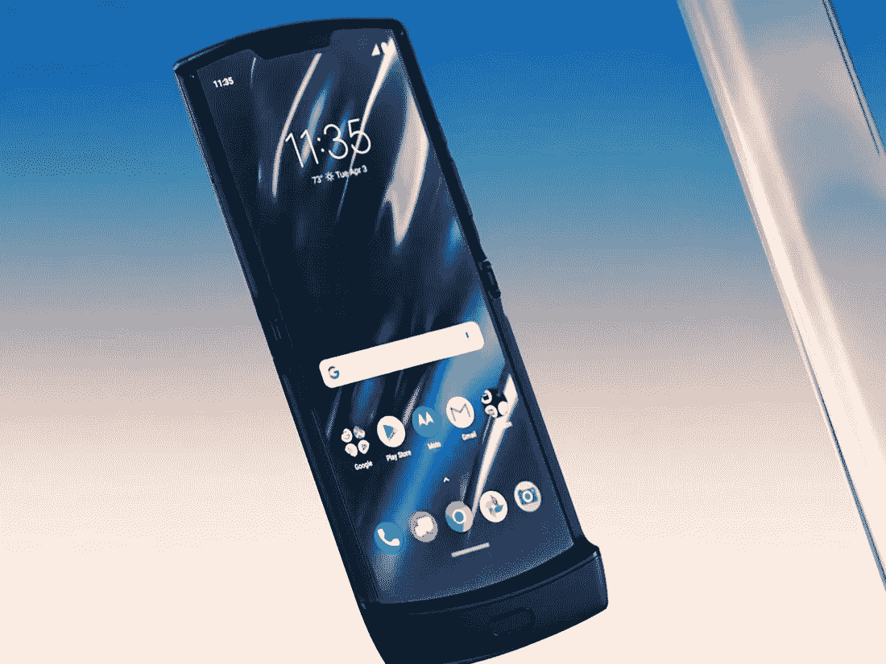
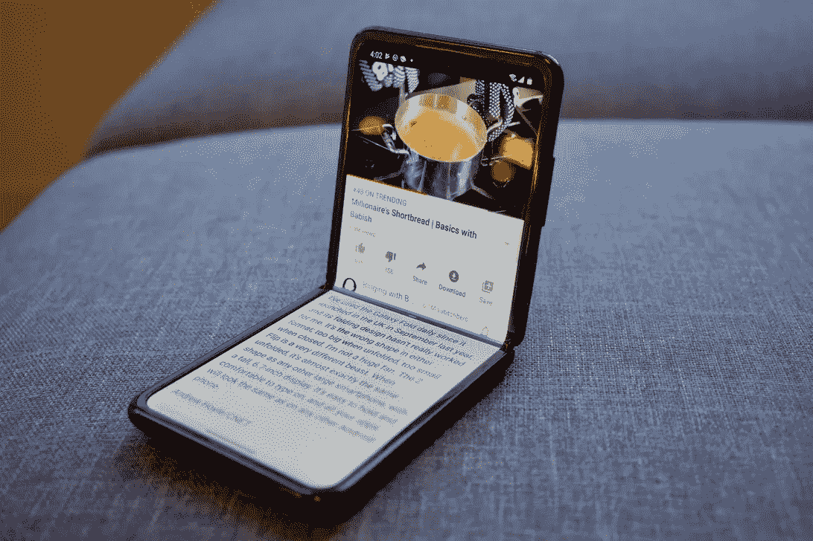

# 三星甩开苹果

> 原文：<https://medium.datadriveninvestor.com/samsung-flips-off-apple-9f473aa22a46?source=collection_archive---------18----------------------->

## 智能手机制造商三星刚刚发布了 Galaxy Z Flip，这款智能手机可以折叠成口袋大小的正方形。

On the left: The Moto Razr; on the right: the new Samsung Galaxy Z Flip

***由*** [***安东尼·布隆伯格***](https://www.anthonyblumberg.com/)

在多年看着时尚零售商拒绝女性增加口袋的要求后，三星终于对此采取了行动。最近在旧金山举行的 Galaxy Unpacked 活动上，这家智能手机制造商发布了新款 Galaxy Z 翻盖手机。

Samsung’s first attempt at a folding phone: the Samsung Fold

它看起来与陷入困境的星系折叠有很大不同，折叠起来很像新的摩托罗拉·拉兹。这显然是一款完整的手机，配有 6.7 英寸的有机发光二极管显示屏，当它关闭时，可以折叠并收缩成一个小得多的正方形。三星计划在 2 月 14 日推出 Galaxy Z Flip，售价 1380 美元。

The Moto Razr

把它想象成一部微型手机，可以放进口袋或包里，像普通翻盖手机一样可以折叠起来。Galaxy Z Flip 还包括一个智能的 1.1 英寸有机发光二极管盖显示屏，当设备关闭时，它会高亮显示通知，一旦再次打开它，你可以点击它们直接进入应用程序。您甚至可以将这款翻盖显示屏用作相机的取景器。

Galaxy Z Flip 重 183 克，采用骁龙 855 Plus 处理器，8GB 内存和 256GB 存储空间。

三星表示，它在 6.7 英寸的显示屏上使用了超薄玻璃，这种玻璃可以折叠，可以折叠 20 万次。它被称为“Infinity Flex Display”，包括三星专有的可弯曲超薄玻璃(UTG)。

三星还制造了一个三挡铰链，当它支撑起来时，你可以分别使用两半屏幕。它的工作方式很像笔记本电脑，有一个双凸轮机构，可以在一定角度范围内保持打开。

这个想法是，你可以把手机放在一个平面上，用显示屏顶部显示的相机和屏幕下半部分的控件来自拍。

 [## 幸福的算法？

### 从一开始，我们就认为技术正在使我们的生活变得更好、更快、更容易和更实用。社交媒体…

www.datadriveninvestor.com](https://www.datadriveninvestor.com/2019/03/08/an-algorithm-for-happiness/) 

Galaxy Z Flip 的铰链“防止灰尘进入内部”，三星开发了特殊的纤维来阻挡灰尘。

没有摄像头的可折叠手机就不是智能手机，三星正在包括三个摄像头。在前面，有一个 1000 万像素的 f/2.4 自拍相机，在后面，有一个 1200 万像素的超宽和一个普通的 1200 万像素广角相机的双摄像头系统。后置摄像头系统包括利用三星的夜间模式拍摄夜间超延时视频或弱光拍摄的能力。

> [像这样的消费电子覆盖面？查看我的博客了解更多！](https://www.anthonyblumberg.com/)

不过，Galaxy Z Flip 的真正承诺是软件体验。6.7 英寸的显示屏将自动分成两个 4 英寸的屏幕，三星称之为“灵活模式”。三星与谷歌密切合作，设计了 Flex mode，这是一种为查看图像或 YouTube 视频而设计的定制用户界面。

三星还在 Galaxy Z Flip 上启用了多任务处理，支持多活动窗口，因此你可以拖放多个应用程序，显示在显示屏的上半部分和下半部分。

The Samnsung Galaxy Z Fold with its two screens in use.

令人惊讶的是，三星计划于 2 月 14 日在美国和韩国发布这款新的 Galaxy Z Flip，有紫色和黑色两种版本，售价为 1380 美元。金色版本将很快推出。

它还展示了一系列新的耳塞和装有 5G 兼容性和高科技摄像头的手机。但是回到重要的事情上来。

# 第二次有魅力吗？

去年，在两次推迟和一次失败的发布后，三星推出了第一款 Galaxy Fold，这是一款小型平板设备，可以热狗折叠成普通大小的智能手机。这款手机对 50 万份订单反应平平。

三星回到绘图板，推出了 1380 美元的 Z Flip。折叠显示屏适用于 200，000 次关闭，可以分成两个独立的屏幕。

# 三星感觉不好的地方

全球经济放缓，智能手机市场拥挤，韩国与日本的贸易争端，以及中国品牌的竞争，所有这些都影响了 2019 年的利润。

作为世界上最大的智能手机制造商，三星正在防御，同时试图通过高端手机和 5G 技术超越竞争对手。

根据 Counterpoint research 的数据，截至去年第三季度，华为在全球智能手机市场的份额为 21%，但华为(18%)正在稳步上升，苹果(12%)正在组建自己的 Animoji 大军。

苹果预计要到 2020 年底才会发布 5G 手机，而华为去年发布了八款。

上个月，三星任命了一名新的智能手机主管，并提升了网络设备业务主管。

华为也在半导体市场挑战三星。截至 2018 年，芯片占三星利润的 75%左右，但 2019 年第四季度，芯片销售放缓导致净利润下降近 40%。

# 底线:

三星希望 5G 手机和其他新设备将帮助它在 2020 年保持领先地位。只有时间会证明…

这篇文章最初发表在我的博客上。查看更多消费电子、金融和技术报道！

**> >** [**苹果在 2019 年以超过 1000 万只手表的销量超过整个瑞士钟表业**](https://www.anthonyblumberg.com/blog/apple-outsells-the-entire-swiss-watch-industry-in-2019-by-more-than-10-million-watches)

**> >** [**苹果:1.4 万亿美元的公司还能增长多少？**](https://www.anthonyblumberg.com/blog/apple-how-much-more-can-a-14-trillion-company-grow)

**> >** [**那么特斯拉到底有多大？**](https://www.anthonyblumberg.com/blog/so-how-big-really-is-tesla)