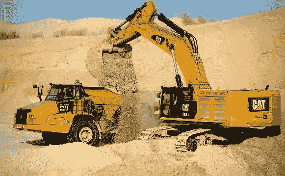

# 乌干达的采砂投资机会:Olina Waaka？

> 原文：<https://medium.datadriveninvestor.com/sand-mining-investment-opportunity-in-uganda-olina-waaka-bd467eb74af5?source=collection_archive---------2----------------------->

Photo credit: Permian Basin Oil & Gas

大约三周前，我的 LinkedIn 网络上的一位先生在访问了我的 LinkedIn 简介并看到我的专业背景和我目前的工作后，问我开始采沙需要什么以及有哪些融资机会。

我猜他也看到了我写的一些关于商业、投资和金融的文章，以及关于创业资金的想法或观点。我笑了，因为；(I)我看到了内容生成的机会，以及(I)我看到了商业的机会。所以我决定先关注前者。

你看，在这些街道上，咨询给你成为思想领袖所需的专业知识。当手头有挑战时，你不得不努力、更快、更有效地思考，为客户想出解决方案。免得下次被你打个措手不及。

所以，在过去的几周里，我在脸书上发帖询问任何可能对采砂感兴趣的人。不幸的是，除了 WhatsApp 的一位亲密联系人，我没有得到任何反馈。然后，我开始了艰苦的研究，并设法在能源和矿产部找到了一些联系人，我给他们发了电子邮件。但是到目前为止，我还没有得到任何回应，包括环保主义者——国家环境管理局(NEMA)和国土部。

然而，我后来联系了地质调查和矿产部，他们向我提供了一些关于采砂行业法规和政策的信息。

**关于采砂业**

沙子是仅次于水的第二大消耗资源。

在乌干达，几十年前，由于建筑和基础设施发展行业对原材料的需求不断增加，采沙成为重要的商业活动。但在此之前，它是非正式的休闲业务，规模非常小或手工水平。

乌干达政府通过议会修订了 2001 年采矿政策和 2003 年采矿法，制定了 2004 年采矿条例，将沙子归类为类似铜或金的矿物。沙子或硅砂、murram、粘土花岗岩现在都是矿物，在开发这种资源之前必须了解监管政策。

随着政府和私人建设项目数量的增加，由于大型企业的过度开采，该国的砂矿床开始被过度开采并处于减少的边缘，在此之前几乎没有监管噪音。道路项目，如北部旁路、Mpigi-Mityana 路、坎帕拉-Masaka 路、Kiira 和恩德培的私人庄园和公寓等。

乌干达的主要采砂区曾经是 Ggaba、Busaabala、Portbell、Garuga、Nkumba、Heritage、Entebbe、Lwemwedde，甚至 Katosi-mu Kono；但是目前有争议的 Lwera-Masaka(仍然在 L. Victoria)是这个领域几乎所有大小采沙者的热点。

在乌干达(主要是在 Lwera)开采沙子的著名公司包括芒果树集团、Hong Hi Jeng Cai、Zhongs Industires Ltd、Hesaduo 公司、门廊矿业公司、Lwera Swamp、Aqua World、Tesco Industries、Sim Construction、Capital Estates、DMW 乌干达有限公司、Freedom Multi-Company、Lukaaya Sand Dealers、Ark Uganda(Pastor Kakande)等。但是有些被阻止了。

你会注意到，其中一些公司是中国人所有的。此外，上述许多公司已经或正在卷入与政府机构(尤其是 NEMA)的诉讼案件中，原因是无视采矿法规、没有许可证以及不遵守环境管理遵守程序。其中一些公司使用非常复杂的采砂机，如挖泥船。

就在两周前，DMW 乌干达有限公司因被 NEMA 吊销执照而遭受损失，被法院裁定赔偿逾 1800 亿乌干达先令(合 4900 万美元)。公司老板后来拒绝了这个提议，要求更多的钱！这就是当你加入这个部门时会发生的事情。

**投资该行业**

有两种方法可以做到这一点；非正式/个体和正式(作为注册实体)。如果你只是在自己的私有土地上做，你可以提取沙子并卖给那些建造房屋的人。几乎不需要资本。但如果你想大规模开采并在当地销售或出口，你需要注册一家公司。

最重要的是，获得有效的勘探许可证，提交勘探许可证报告，展示特定区域的理想地图，获得采矿许可证，提交活动运营计划，提交项目简介、执行计划 II，并拥有足够的财政资源。采矿许可证延期时还要支付其他费用，外加勘探费。

目前该行业的参与者已经投资了数十亿美元，以满足乌干达建筑项目日益增长的需求。他们还可以购买或租用重型设备，如挖掘机、卡车、挖沙船等。这是高科技设备。已知挖泥船开采超过十(10)米深的沙子，这是所谓的过度开采或过度开采的原因。这些机器超出了所需的开采深度。

**拒绝(什么会让你泄气)**

*1。高度资本密集型*——事实上，任何与采矿有关的事情都需要大量重型设备，因此需要合适的财务状况。小型企业可能需要 5 亿至 15 亿乌干达先令(合 40.54 万美元)。有了 15 亿 UGX1.5Bn 亿美元(405，400 美元)以上，你应该可以获得/购买一些挖掘机、挖泥船、各种尺寸的运输卡车(25 吨、20 吨、10 吨等)。)像中国重汽，五十铃前进，精灵等。这就是很少有人冒险进入这个领域的原因。那么， *olina waaka* ？

*研究解决问题的思维技巧*

I)探索资产/租赁融资——例如，您可以利用[住房金融银行工具&资产融资(VAF](https://www.housingfinance.co.ug/business-banking/business-credit-facilities/vehicle-and-asset-finance-vaf/) )、[斯坦比克工具&资产融资](https://www.stanbicbank.co.ug/Uganda/Business/Borrowing/Vehicle-and-Asset-Finance)、 [CBA 工具&资产融资](https://cbagroup.com/treasury/personal-banking/business-banking-asset-finance/)、 [DFCU 资产融资](https://www.dfcugroup.com/business-banking/asset-finance/)等。这几乎就像租赁。这允许你使用设备，因为你支付它的收益。

ii)使用租赁法—有许多公司出租二手重型设备。例如福尔库姆咨询有限公司、BMK be muga 货运公司和许多其他公司。这里的主要特点是设备是按小时计费的，因此效率和速度在这里必不可少。它还需要流动现金来满足这样的日常支付。

iii)找一个股权合伙人——你也可以决定找一个财务状况良好的合伙人，作为回报，给他们股份。你将能够在没有任何经济压力的情况下成长。

*2。高度监管* —鉴于该行业的商业化和导致环境退化的过度开采，该行业存在高度的政府监管。NEMA 监管该部门的环境方面，而能源和矿产资源部的《采矿法和条例》则处理政策和许可证方面。

许多公司因在开采沙子时无视环境标准而成为 NEMA 的牺牲品并被送上法庭。DMW 乌干达有限公司因被 NEMA 取消许可证而对簿公堂。预计该行业会出现这样的传奇。预计会有很多执照费和罚款。

大多数时候，案例都是关于过期的许可证或者没有许可证的采矿。其他的是，公司在我的上面，制造了很多坑，但是按照规定，这些坑应该在移除沙子后被填满。这些公司还超过了三(3)米的要求深度——达到十二(12)米，但仍不可接受。他们也不应该在距离公路二十(20)米的区域开采沙子。

*研究解决问题的思维技巧*

I)在获得采矿许可证后，只要遵守法规即可。

*3。波动的燃油价格* —在一个大量使用燃油驱动设备和频繁移动的车辆的行业，你永远不能肯定地说燃油价格会在一段时间内保持不变。对运营至关重要的是燃料成本，这也是驱动大多数经济部门的一个重要因素，因为在乌干达还没有完全开发替代或可再生能源。司机也有偷窃或虹吸燃料的习惯。

*研究应对问题的思维技巧*

I)获得固定费率供应合同——许多运输公司都这样做。他们签订燃料供应合同，要么在现场获得燃料供应(使用油罐车)，要么开车到加油站以固定价格加油，以避免受到波动的影响。这也减少了燃料掺假的情况。

ii)有燃料储备——有时在采矿或运砂过程中，公司可能会受到意外价格上涨的打击，这可能会侵蚀收入。为下雨天，比如未来六(6)个月，准备大量储存水的蓄水池。然而，这需要监测和预测燃料行业的趋势。

iii)使用车队燃料传感器/监控器——在车辆和设备的油箱上安装燃料消耗传感器。这有助于您在非现场状态下监控燃油油位并检测可疑的盗窃案件。你可以从 FMS，Tracker Uganda，3D Services，V-Tracking Uganda 等处获得这些。

*4。激烈的竞争*——考虑到对产品的需求，来自本地和外国公司的竞争非常激烈，尤其是就矿区所有权而言。没有足够的研究就不要进入这个领域。你会发现，鉴于其他公司的资金支持、高科技设备、现成的合同以及在政策和法规上的轻松操作，它们能够开采和供应比你更多的吨煤。你还应该准备好与政府机构的法律斗争、诉讼和诉讼。

*研究解决问题的思路*

I)满足法律法规要求——尽力避免您的竞争对手卷入的法律问题。这样，你就会领先一步。这是因为一些法院命令可能会暂时阻止你采矿，但你有项目供应。这是收入损失。

ii)按时供应优质砂——能够在供应前尽早区分好砂和坏砂。根据研究，好的沙子握在手中挤压时不会结块。它应该会解开。如果它没有表现出这样的特征，那么它就有泥在里面。这影响了价格和信任的建立。

*5。机械成本(维修中&维护)* —就像任何其他机械操作一样，设备和车辆在工作过程中发生故障的情况很常见，因此会给企业造成经济损失。这种故障也可能是由于设备超负荷工作(超过制造商推荐的工作时间)造成的。

*研究应对问题的思维技巧*

I)签订固定费率维修合同——例如，您可以决定与一家声誉良好的汽车修理厂就条款和条件达成一致，他们将按每月规定的费率或费用处理设备和车辆的维修。这就避免了无良技工的出现，从而减少了维修活动中不必要的费用。

ii)雇用一名技工——找一名技工，把他列入工资单，因为他将有全职工作，而不是临时工作。该机械师应具备操作上述设备和车辆的技能和经验。

iii)与备件供应商签约——重型设备和车辆的备件可能很难找到，体积庞大且价格昂贵。在城镇周围签订供应商合同是有利的，因为它减少了交货时间。这也创造了信任，你可以很容易地返回零件。每当你需要一个零件，你只需派你的机械师去挑选和更换。

*6。严重依赖现金流*——如果你没有多少流动资金(流动现金)，就不要开始，你最终会得到贷款或信贷。如果您获得抵押贷款，您可能会像山羊一样陷入困境，因为需要进行许多融资活动，如车辆大修、临时燃料需求和非正式处罚(贿赂)、交警罚款、乌干达国家公路局(UNRA)道路通行费等。

例如，UNRA 将收取你 10 美元的单程特别装载许可证和 20 美元的多程。你还需要支付 20 美元才能获得特殊用途车辆的授权。如果你没有足够的现金来支付所有这些费用，你可能无法在这个行业生存。

*研究解决问题的思路*

I)拥有一个股权合伙人——这可能会使公司拥有一些初始营运资金，以及应急开支的现金缓冲。一些有经验的公司会向银行申请履约保证金，以获得一些运营资金。如果公司已经经营多年，它可以利用第(1)点中规定的资金来源。

**竖起大拇指(有什么值得高兴的)**

*1。现成市场(且仍在增长)* —沙子在乌干达(和国外)有现成的市场。这是因为快速增长的房地产行业正在为城市贫困人口、中等收入者/企业和超级富豪(他们也往往拥有大多数房产)建造房屋。

根据乌干达统计局(UBOS)的数据，乌干达的住房缺口超过两千一百万(2100 万)套。这一赤字几乎以每年 20 万台的速度增长。去年 6 月，乌干达的总抵押贷款组合上升了大约 10%。

当我做一些研究时，我发现一辆 2 吨精灵卡车的沙子卖 12 万乌干达先令(33 美元)——15 万乌干达先令(41 美元)；4 吨五十铃前锋 22 万乌干达先令(60 美元)——25 万乌干达先令(68 美元)，巨大的 10 吨五十铃或扶桑翻斗车(10 胎)40 万乌干达先令(108 美元)——50 万乌干达先令(135 美元)。

对于“大男孩”中国重汽豪沃来说，一辆 10 吨卡车的沙子价格约为 80 万乌干达先令(216 美元)——100 万乌干达先令(270 美元)，一辆 35 吨卡车约为 130 万乌干达先令(351 美元)——150 万乌干达先令(405 美元)，一辆 45 吨卡车约为 541 美元。大部分沙子由小型卡车从 Gayaza、Kiwatule、Najjeera、Mukono、Lukaya、Mpigi 等地的收集中心运走。

需要更多的沙子来为房屋、道路工程(金贾高速公路、北部支路、Mpigi 道路工程等)浇注更多的混凝土。中国人也需要我们的沙子来制造玻璃和建筑材料，因为他们的储量已经在减少。仅中国在过去十年中使用的沙子就比美国在整个二十世纪使用的沙子还多。

*2。改善的道路交通网络*——大多数通往或远离采砂区的道路都非常好，铺上柏油并得到改善。例如马萨卡-坎帕拉公路、卡托西-穆科诺公路、加巴-坎帕拉公路等。自 20 世纪 90 年代末以来，随着支路的增加，柏油马路的数量也在增加。UNRA 做了大量的工作，事实上，我们道路上的卡车和其他车辆数量增加了。总道路网长度预计为 129，469 公里，预计将增加 310 公里。

*3。公平的投资回报(ROI)* —在盈利能力分析中，我使用了真实的市场数字或数据以及一些行业估计。因此，拥有一台二手卡特彼勒 324DL 挖掘机的初始资本支出为 12 亿乌干达先令(315，600 美元)，两(2)台二手 20 吨豪沃中国重汽 336HP 型号，六(6)个月跑道的营运资本约为 273 百万乌干达先令(73，850 美元)，在缴纳 30%的公司税后，您将能够获得约 120 百万乌干达先令(32，750 美元)的利润。

这是在你的营业额超过 496 百万乌干达先令(134，000 美元)并扣除大约 10%的运营损失，然后是燃料成本、机械费用、设备操作人员的工资和他们的福利之后，总计 270 百万乌干达先令(73，850 美元)或更多。

有了这些，你可能会看到大约百分之十(10%)或更多的投资回报(ROI)。这在业内是公平的。因为，例如我们的砂矿床，可开采长达二十(20)年，到第五(5)年，您将收回全部投资。

**股权投资机会:投点钱吧**

这是一个投资乌干达西南部 Bukakata-Masaka 地区采沙业的机会。这片土地由超过四百(400)英亩的砂矿床组成；一旦采矿开始，可能持续十五(15)到二十(20)年。考虑一下两百(200)辆卡车，每辆四十(40)吨，每周大约生产八千(8000)吨。相当多，对吧？

公司的组建正在进行中，由两(2)名合伙人(可能不够)组成，他们正在邀请一名额外人员作为股权合伙人，以提供长期融资，并使公司能够有机增长。准备好至少拥有公司的大量股份。

如果你觉得这个机会是给你或你认识的人的，请复制文章链接与他们分享，或在 WhatsApp +256789962775 上联系我了解更多。您仍然可以在“联系我”页面留下电子邮件。

让我们赚点钱吧！

注:这篇文章也由同一作者发表在 WordPress 上。点击[这里](https://consultmasaba.com/sand-mining-investment-opportunity-in-uganda-olina-waaka/)。

***关于作家***

Julius Masaba 是一名私人投资研究员和商业顾问。他还是 Ablestate、[*https://www.ablestate.org/*](https://www.ablestate.org/)*的业务开发主管，也是一名关于创业、创业、商业和金融的 WordPress 作家/博客作者。他热爱科技。访问:*[*https://consultmasaba.com/*](https://consultmasaba.com/)

在 [**个人理财**](https://app.ddichat.com/category/personal-finance) **:** 中安排一次聊天

 [## 专家-个人理财- DDIChat

### DDIChat 允许个人和企业直接与主题专家交流。它使咨询变得快速…

app.ddichat.com](https://app.ddichat.com/category/personal-finance) 

在这里申请成为 DDIChat 专家[。
与 DDI 合作:](https://app.ddichat.com/expertsignup)[https://datadriveninvestor.com/collaborate](https://datadriveninvestor.com/collaborate)
在此订阅 DDIntel [。](https://ddintel.datadriveninvestor.com/)