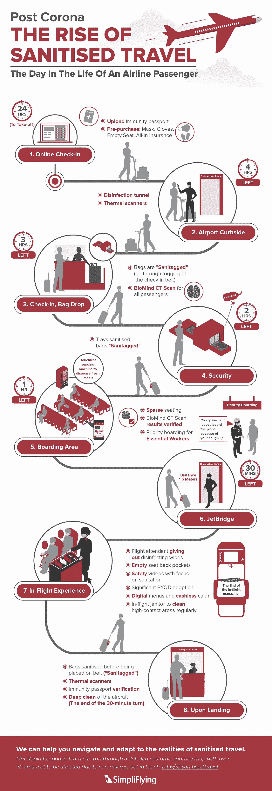
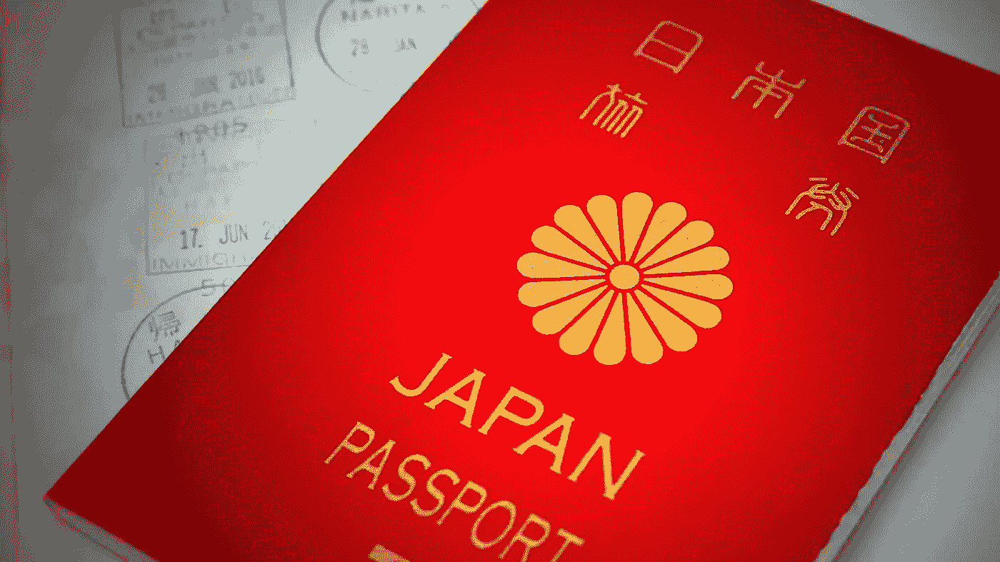
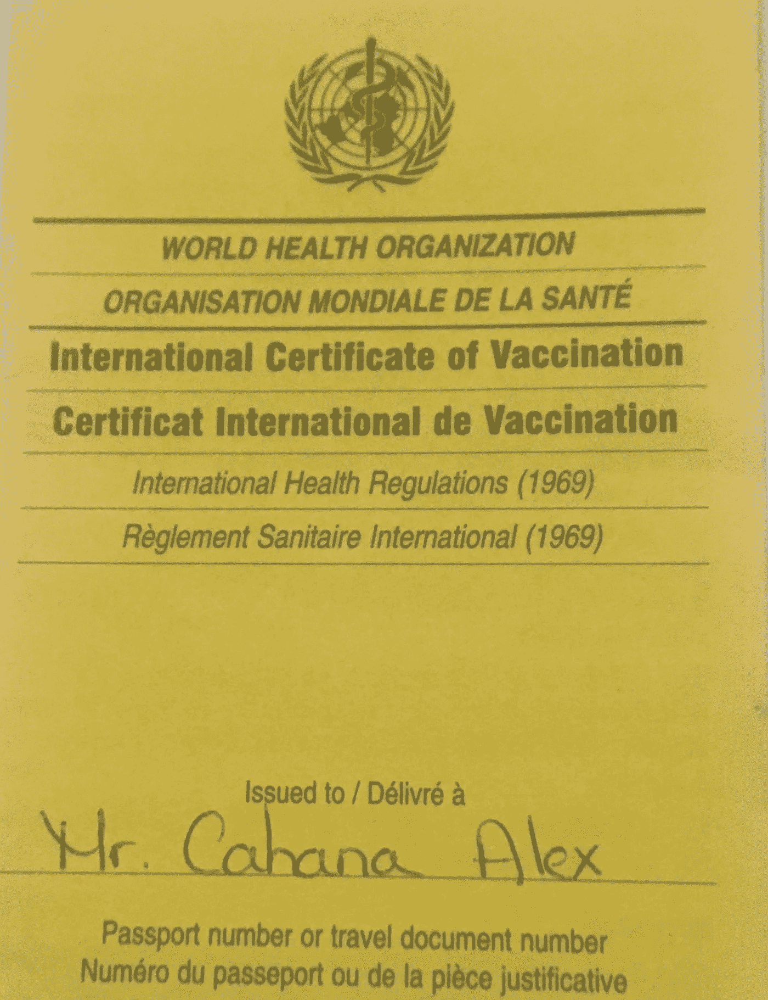
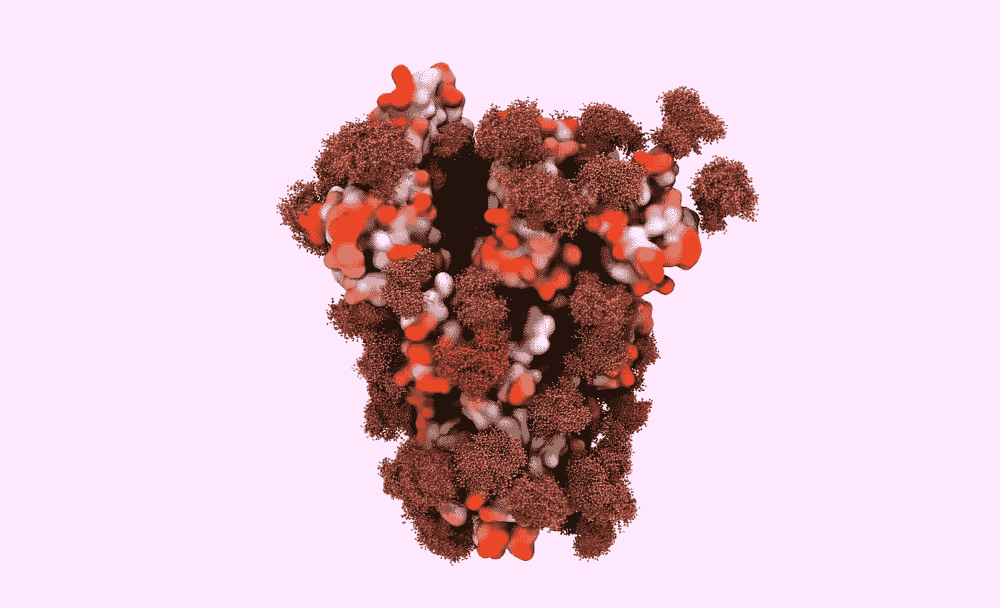
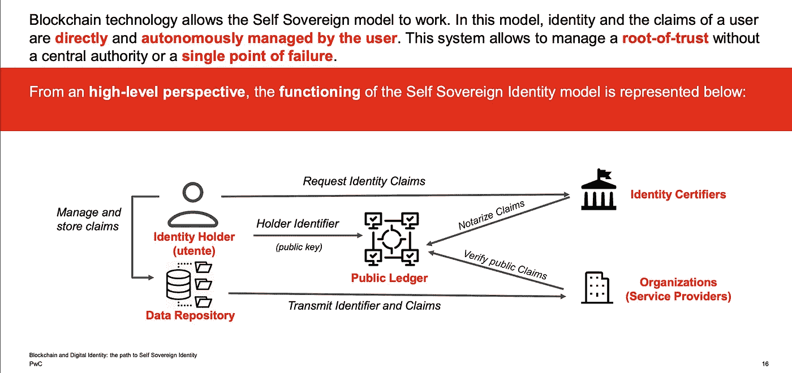
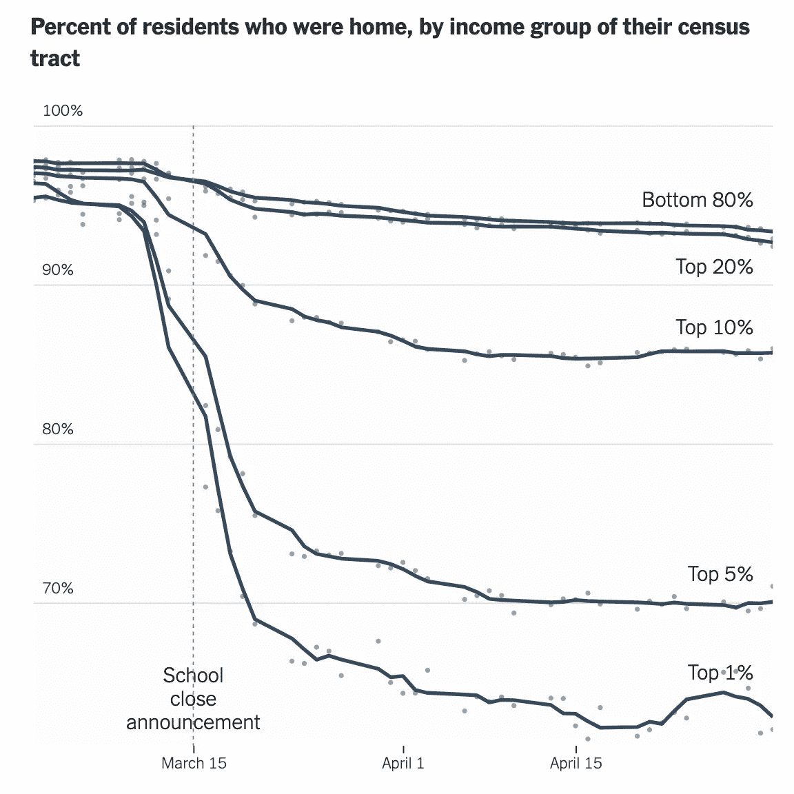
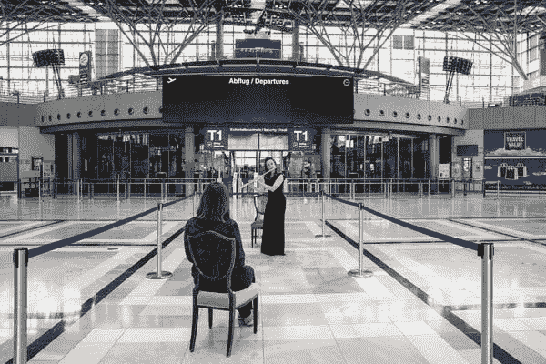

# 消毒旅行:口罩、手套和湿巾可能令人讨厌，但政府签发的豁免护照是个坏主意

> 原文：<https://medium.datadriveninvestor.com/sanitized-travel-mask-gloves-and-wipes-maybe-annoying-but-government-issued-immunity-passports-cc38f7938139?source=collection_archive---------6----------------------->

Like 9/11, COVID-19 will change air-travel forever ([image](https://simpliflying.com/guidance-airlines-covid-19/))

*为什么自我主权身份(SSID)对我们私人和安全的未来至关重要*

新冠肺炎事件后，航空旅行将不再一样。正如自 9/11 以来，除非确信没有武器，否则我们不会登机，我们也将寻求无病毒旅行。虽然[的 TSA](https://www.tsa.gov/coronavirus) 官员将继续检查我们的护照(也许还有[的体温](https://www.wsj.com/articles/tsa-preparing-to-check-passenger-temperatures-11589579570)，我们也可能开始见到运输健康管理局的官员 [THA](https://simpliflying.com/guidance-airlines-covid-19/) ，检查我们的健康状况，最好是在[国际健康检查和卫生标准](https://www.reuters.com/article/us-health-coronavirus-airlines-airports/contact-tracing-temperature-checks-and-masks-airline-industry-outlines-new-norms-idUSKBN22P08L)的基础上，由像 [IATA](https://www.iata.org/) 、 [ACI](https://aci.aero/) 和[世卫组织](https://en.wikipedia.org/wiki/World_Health_Organization)这样的全球实体领导。

 [## 数字货币、区块链和货币的未来|数据驱动的投资者

### “区块链”、“加密货币”、“令牌化”，以及现在的“央行数字货币”已经成为…

www.datadriveninvestor.com](https://www.datadriveninvestor.com/2020/02/18/digital-currencies-blockchain-and-the-future-of-money/) 

然而，除了提前办理消毒通道登机手续的麻烦之外，在保持社交距离的同时，给你的行李贴上*卫生标签*并擦拭你的座位(如上图)，新的“卫生旅行”将需要一个有争议的豁免护照，除非有自我主权，正如我解释的那样，这将是一个坏主意。

# #1:护照是身份证明还是所有权证明？

旅行文件最早是一封来自君主的信(无论是公元前 445 年波斯国王阿尔塔薛西斯准许尼希米安全返回犹大，还是 1414 年国王亨利五世签发“安全通行文件”)，确认乘客的身份，请求安全通过( [pass-a-port](https://en.wikipedia.org/wiki/Passport) )到达目的地。

然而，工业革命和欧洲铁路网的快速发展导致了国际旅行和旅游的普及，导致了 1920 年关于“护照&海关手续和直通车票”的巴黎会议上护照[的正式化，到 1947 年，国际民用航空组织(](https://shorexcapital.com/a-short-history-of-the-passport/) [ICAO](https://www.icao.int/Pages/default.aspx) 接管了为 188 个国家制定护照标准的责任。

被设计成个人"*通行证*(法语意为:让我通过)的护照在第一次世界大战的[余波中从身份证明*促进*旅行，转变成政府颁发的文件*限制*行动自由，(想想 1924 年](https://www.nationalgeographic.com/travel/features/a-history-of-the-passport/)[移民法案](https://history.state.gov/milestones/1921-1936/immigration-act)的国家配额)。Atossa Araxia Abrahamian 在她的书[the cosmopolities](http://atossaaraxia.com/the-cosmopolites/)中说得好:

> “护照是一种挡箭牌:(只有)当你是一个富裕民主国家的公民时。”

The Japanese passport is considered the best passport for 2020, providing visa-free access to 191 countries ([source](https://www.henleypassportindex.com/passport))

不是所有的护照都是平等的。

大多数主权国家都有颁发给外交官及其随行家属的外交护照，通常授予他们法律豁免权；*发给政府雇员的公务护照*可以方便出行；普通旅行护照(授予美国公民[公民身份](https://en.wikipedia.org/wiki/United_States_passport)，除了[美属萨摩亚](https://www.pri.org/stories/2014-10-11/how-weird-law-gives-one-group-american-nationality-not-citizenship))，允许我们无需签证就可以访问大多数国家(为了对比检查[护照索引](https://www.passportindex.org/))。

虽然有“首选”旅行证件，如用于人道主义任务的[联合国护照](https://en.wikipedia.org/wiki/United_Nations_Laissez-Passer)或允许持有者绕过某些签证限制的[国际刑警组织旅行证件](https://en.wikipedia.org/wiki/Interpol_Travel_Document)，但[身份证明](https://en.wikipedia.org/wiki/Certificate_of_identity)(又名外国人护照)[难民旅行证件](https://en.wikipedia.org/wiki/Refugee_travel_document)和[双程证](https://en.wikipedia.org/wiki/People%27s_Republic_of_China_Exit-Entry_Permit_for_Travelling_to_and_from_Hong_Kong_and_Macau)并不总是被认可，可能会受到政治突发奇想的影响(想想[台胞证](https://en.wikipedia.org/wiki/Taiwan_Compatriot_Entry_Permit))。

毫不奇怪，与护照和旅行证件类似，政府签发的[免疫护照](https://onezero.medium.com/immunity-passports-could-create-a-new-category-of-privilege-2f70ce1b905)可能会无意中*创造一种新的特权*，随之而来的是[繁荣的黑市](https://www.comparitech.com/blog/vpn-privacy/passports-on-the-dark-web-how-much-is-yours-worth/)，因为被感染将给予一个人最渴望的自由，自由旅行。

# #2:政府颁发的免疫护照是个坏主意，因为病毒免疫不是一种身份

旅行前接种疫苗并不是什么新鲜事，疾病预防控制中心和国务院都为哪个国家需要哪种疫苗提供了明确的指导方针。这样做不仅是为了保护自己不感染某种地方病(这种疾病很多时候是无症状或轻微的)，也是为了避免通过旅行将疾病传播到其他国家(见下面我的黄热病卡)。

My Yellow Fever card that I show when traveling to endemic countries ([list](https://www.who.int/ith/ITH_country_list.pdf))

根据世卫组织的说法，证明对新冠肺炎的免疫力还没有建立，也不清楚抗体的存在是否真的赋予了对后续感染的免疫力。此外，假阴性率(将已被感染的人错误标记为阴性)可能高达 6%，假阳性率(未被感染但被错误标记为阳性的人)在 4-17%之间。不用说[两次失误](https://www.knowablemagazine.org/article/health-disease/2020/coronavirus-antibody-testing)都有严重后果。

但是除了测试不准确或者不可靠之外，新冠肺炎的免疫力可能只是昙花一现。[抗体依赖性增强](https://reader.elsevier.com/reader/sd/pii/S1286457920300344?token=EAAA5DF9E9854A1CE08DD07BF5530B28816018C65100A3951B04F8F94F820171BEF49A331BE39F3AB15F4028F88E593F) (ADE)由于之前接触过其他冠状病毒，可能会增加我们的免疫反应，导致过多的持续炎症，或者如果抗体粘附在病毒上但没有中和它，它们实际上可以为病毒感染细胞创造第二个进入途径，使感染恶化(下图)。

Sugary camouflage of the Coronavirus may shield it from immunity and make it more dangerous. Understanding its glycobiology is key. (image [source](https://www.quantamagazine.org/sugars-on-coronavirus-spike-protein-offer-vaccine-clues-20200505/?mc_cid=01840acec0&mc_eid=b1c8cce9ed))

即使抗体检测更加准确、可靠，提供持久的免疫(就像黄热病疫苗一样)，签发免疫护照也充满了医疗、伦理、法律问题。例如，雇主会基于豁免权雇佣员工吗？有免疫力算能力吗？或者没有残疾，因此根据 1990 年《美国残疾人法案》受到保护免受歧视？

> 未来的雇佣、获得服务、护理、[回归正常生活](https://coronavirus.medium.com/the-problem-with-immunity-passports-3764d49df7c8)是否依赖于其他受保护的健康信息？滑坡不言而喻。

# #3:自我主权身份是关键

如果政府颁发的豁免护照是提供所需流动性的“*”出狱卡，人们会想要它们，可能会有实验室愿意向出价最高者提供快速和虚假的检测结果。此外，拇指纹、视网膜扫描或其他生物识别技术引发了新的隐私问题(我在这里写了这个)，而集中式数据库继续[丢失我们的数据](https://www.hsj.co.uk/coronavirus/exclusive-test-data-from-commercial-labs-going-into-black-hole/7027619.article)。*

> **分布式账本上的自我主权身份*通过创建经过验证的身份和声明(*可信数据*)而没有丢失的危险(*无信任* *传输*)，同时安全和秘密地共享它(*零知识密码术*)(如下)，减轻了当前集中式医疗保健和护照登记处的技术和后勤漏洞。*

**

*Blockchain and Self Sovereign Identities mitigate the technical and logistic vulnerabilities of centralized registries ([Source](https://www.pwc.com/it/it/publications/assets/docs/blockchain-and-digital-identity.pdf))*

*因此，COVID Credential Initiative([CCI](https://www.covidcreds.com/))作为对许多“豁免护照”呼吁的直接回应，正在设计一个数字证书(使用 [W3C 行业标准](https://www.w3.org/TR/vc-data-model/))，这是极其重要和令人鼓舞的。这将允许个人证明(并要求他人提供证明)他们在阴性测试后康复，或抗体测试阳性，或接种疫苗(当疫苗可用时)。*

*这将证明某种程度的免疫，同时*仍然保持隐私和身份控制*，允许个人开始参与日常生活。*

# *最终想法:*

*强有力的社会距离措施已经大大减少了新冠肺炎病毒的传播，其代价是损失了 2.7 万亿美元的航空旅行，威胁着非艾滋病患者的健康，而我们仍然对这种病毒知之甚少。*

*虽然免疫测试被认为是一个游戏规则的改变者，但它揭示了我们仍然容易受到感染。但它也让我们思考旅行、个人自由以及这场危机对我们的不同影响(见下文)。*

**

*The richest neighborhoods emptied out as COVID-19 hit New York City ([NYT](https://www.nytimes.com/interactive/2020/05/15/upshot/who-left-new-york-coronavirus.html?campaign_id=9&emc=edit_nn_20200515&instance_id=18502&nl=the-morning&regi_id=61116760&segment_id=27919&te=1&user_id=304c85cc8cc3e99ed36059bf944873c5))*

> *因此，当我们重新开放业务时(有人认为[为时过早](https://www.ipsos.com/en-us/news-polls/axios-ipsos-coronavirus-index?utm_source=newsletter&utm_medium=email&utm_campaign=newsletter_axiosspecialreport&stream=top\))，让我们利用这个机会记住，个人行动自由不应仅限于使用政府颁发的豁免护照的富裕、人脉广泛和舒适隔离的人，而是人人都可以使用[自我主权身份识别](https://www.frontiersin.org/articles/10.3389/fbloc.2019.00028/full)。*

*否则，世界旅行将成为一次非常孤独的经历。*

**

*A recital at Stuttgart Airport on May 13, 2020 ([NYT](https://www.nytimes.com/2020/05/13/arts/music/stuttgart-airport-coronavirus-concert.html?referringSource=articleShare))*

**如果你喜欢你所读的内容，* ***继续点击下面的“鼓掌”,这样其他人也会看到(最多允许 50 次鼓掌！)****