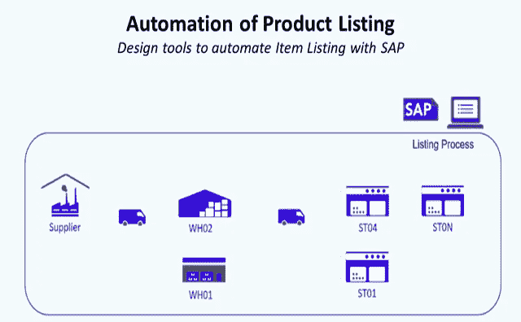
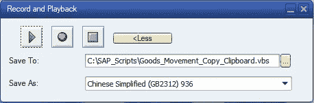
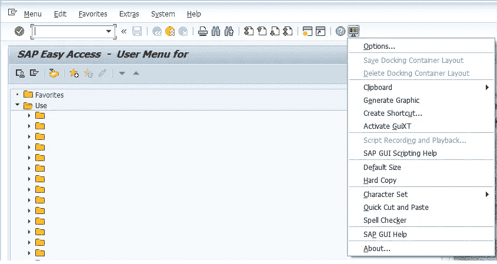
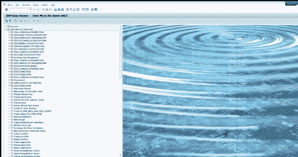
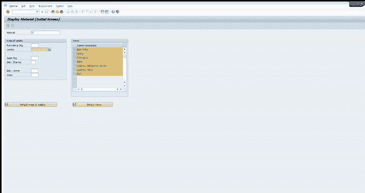

# 面向零售业的 SAP 自动化

> 原文：<https://medium.datadriveninvestor.com/sap-automation-for-retail-using-vb-and-python-part-1-intro-to-sap-gui-scripting-2b065e122c6f?source=collection_archive---------0----------------------->

## 使用通过 SAP GUI 脚本工具构建的 Visual Basic 脚本设计自动化解决方案



SAP Automation for Product Listing — (Image by Author)

SAP 是一个强大的企业软件套件，可以帮助企业简化运营并提高生产率。

然而，许多企业仍然依赖手动流程来完成 SAP 中的任务，这既耗时又容易出错。这就是自动化的用武之地。

通过在 SAP 中实现重复性任务的自动化，企业可以解放员工，让他们专注于更高价值的任务，并提高他们的整体工作效率。

在本文中，我们将探讨 SAP automation 如何让零售业受益，并深入探讨使用 Visual Basic 和 Python 在 SAP 中自动化任务的细节。

# **一、什么是机器人过程自动化？**

管理咨询公司德勤(Deloitte)将**机器人流程自动化** **(RPA)** 定义为使用“通常称为‘机器人’的软件，来捕获和解释现有的 IT 应用程序，以实现跨多个 IT 系统的交易处理、数据操作和通信。”

像许多自动化爱好者(或懒惰的工程师)一样，我将其定义为“找到一种方法来自动化枯燥和耗时的任务，以创造更多的时间来进行分析和设计解决方案，从而为您的项目增加价值。”

# **二。使用 SAP GUI 脚本实现 SAP 自动化**

我需要在有限的时间内完成大量复杂的手工任务。在这一系列文章中，我将分享几个基本手工任务自动化的例子:

*   **1。SKU 列表:**将一个*商品*链接到他的*商品组合*(位置:仓库或商店)
*   **2。采购订单创建:**用于以商定的价格向供应商请求商品或服务的文件
*   **3。货物转移订单提取:**货物转移允许您在一次数据输入交易中映射系统中的转移交货

**我们的工具:SAP GUI 脚本** SAP GUI 包括一个记录工具，像 Microsoft Excel 宏，用来记录任务并将其转换成 Visual Basic 代码。



Record and Playback tool of SAP GUI to record tasks performed — (Image by Author)

您可以在 SAP GUI 主页上找到它



SAP GUI Scripting Tool Menu — (Image by Author)

> ***实验一:发起交易***

为了理解记录工具，我们将执行两个简单的任务并分析记录工具的输出。基于这些例子，我们可以得到它背后的逻辑，并尝试使它适应我们计划自动化的任何任务。

让我们从启动事务的简单任务开始



Launching MM43 Transaction Code (Display Material) from SAP GUI Home Page — (Image by Author)

**输出**

```
#Visual Basic Script Exported by Recording ToolIf Not IsObject(application) Then
   Set SapGuiAuto  = GetObject("SAPGUI")
   Set application = SapGuiAuto.GetScriptingEngine
End IfIf Not IsObject(connection) Then
   Set connection = application.Children(0)
End IfIf Not IsObject(session) Then
   Set session    = connection.Children(0)
End IfIf IsObject(WScript) Then
   WScript.ConnectObject session,     "on"
   WScript.ConnectObject application, "on"
End Ifsession.findById("wnd[0]").maximize
session.findById("wnd[0]/tbar[0]/okcd").text = **"MM43"**
session.findById("wnd[0]").sendVKey 0
```

> ***实验二:填表***

现在让我们来看看如何填表



Form filling example — (Image by Author)

**输出**

```
#Visual Basic Script Exported by Recording ToolIf Not IsObject(application) Then
   Set SapGuiAuto  = GetObject("SAPGUI")
   Set application = SapGuiAuto.GetScriptingEngine
End IfIf Not IsObject(connection) Then
   Set connection = application.Children(0)
End IfIf Not IsObject(session) Then
   Set session    = connection.Children(0)
End IfIf IsObject(WScript) Then
   WScript.ConnectObject session,     "on"
   WScript.ConnectObject application, "on"
End Ifsession.findById("wnd[0]").maximize
session.findById("wnd[0]/usr/ctxtRMMW1-MATNR").text = **"100607255"**
session.findById("wnd[0]/usr/ctxtRMMW1-EKORG").text = **"WXYZ"**
session.findById("wnd[0]/usr/ctxtRMMW1-MATNR").setFocus
session.findById("wnd[0]/usr/ctxtRMMW1-MATNR").caretPosition = 9
session.findById("wnd[0]").sendVKey 0
session.findById("wnd[0]/usr/ctxtRMMW1-MATNR").caretPosition = 9
session.findById("wnd[0]").sendVKey 0
```

> ***结果分析:Visual Basic 代码***

查看这两个输出，我们可以看到代码中的相似之处

1.  **第一部分:**建立与 SAP GUI 的连接

```
#Visual Basic Script Exported by Recording ToolIf Not IsObject(application) Then
   Set SapGuiAuto  = GetObject("SAPGUI")
   Set application = SapGuiAuto.GetScriptingEngine
End IfIf Not IsObject(connection) Then
   Set connection = application.Children(0)
End IfIf Not IsObject(session) Then
   Set session    = connection.Children(0)
End IfIf IsObject(WScript) Then
   WScript.ConnectObject session,     "on"
   WScript.ConnectObject application, "on"
End If
```

看了 SAP GUI 脚本文档后，我们可以理解这部分代码是用来建立与 GUI 的连接的。我们将在下一篇文章中更详细地理解它。

**2。第二部分:**表演动作

```
# Test 1session.findById("wnd[0]").maximize
session.findById("wnd[0]/tbar[0]/okcd").text = **"MM43"**
session.findById("wnd[0]").sendVKey 0
```

第 2 行的**“MM43”**显示该行链接到交易名称字段中输入的内容。

```
# Test 1
session.findById("wnd[0]").maximize
session.findById("wnd[0]/usr/ctxtRMMW1-MATNR").text = **"100607255"**
session.findById("wnd[0]/usr/ctxtRMMW1-EKORG").text = **"WXYZ"**
session.findById("wnd[0]/usr/ctxtRMMW1-MATNR").setFocus
session.findById("wnd[0]/usr/ctxtRMMW1-MATNR").caretPosition = 9
session.findById("wnd[0]").sendVKey 0
session.findById("wnd[0]/usr/ctxtRMMW1-MATNR").caretPosition = 9
session.findById("wnd[0]").sendVKey 0
```

第 3 行中的 **"100607255"** 和第 3 行中的 **"WXYZ"** 向我们展示了这些行链接到“MM43”表单字段中键入的内容。

[](http://samirsaci.com) [## 萨米尔 Samir 供应链组合的数据科学

### 🏭使用高级数学概念的供应链网络优化👨‍🏭仓储的持续改进…

samirsaci.com](http://samirsaci.com) 

# **三。结论和后续步骤**

*关注我的 medium，了解更多与供应链数据科学相关的见解。*

通过这两个简单的例子，我们可以预见 SAP GUI Recording Tool 在设计自动化任务脚本方面的潜力。

在下一部分，我们将了解如何:

1.  **设置与 SAP GUI 的连接:**修改此代码以在 Excel VB 中复制
2.  **执行动作的脚本:**数据输入、将值粘贴到剪贴板和数据导出

在接下来的两部分中，我们将研究如何实现自动化

**SKU 列表** 将商品与其分类关联的操作

[](https://www.samirsaci.com/sap-automation-of-product-listing-for-retail/) [## 零售产品列表的 SAP 自动化

### 自动化和报告使用 Visual Basic 自动化产品，通过 SAP GUI 脚本工具在 SAP 中自动列出产品…

www.samirsaci.com](https://www.samirsaci.com/sap-automation-of-product-listing-for-retail/) 

**采购订单创建:** SAP 零售自动化—采购订单创建

[](https://www.samirsaci.com/sap-automation-of-orders-creation-for-retail/) [## SAP 零售订单创建自动化

### 函数 PO_Function() '(1)声明变量 Dim W_BPNumber，W_SearchTerm，PONDim line items As long Dim Sht _ Name As…

www.samirsaci.com](https://www.samirsaci.com/sap-automation-of-orders-creation-for-retail/) 

如果你对供应链分析感兴趣，可以看看我的网站

[](http://samirsaci.com) [## 萨米尔·萨奇

### 数据科学博客，专注于仓储，运输，数据可视化和机器人流程自动化…

samirsaci.com](http://samirsaci.com)