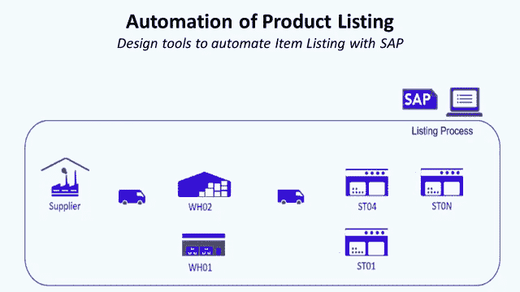
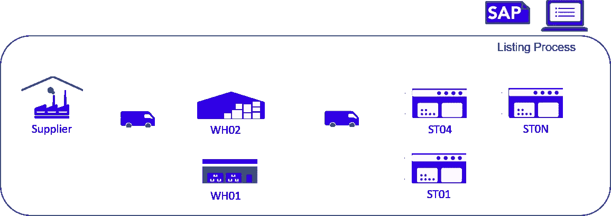
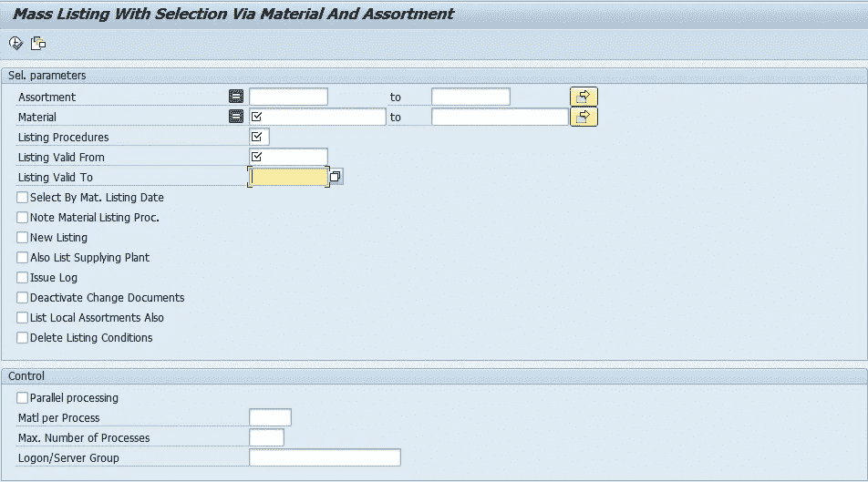
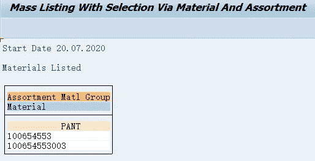
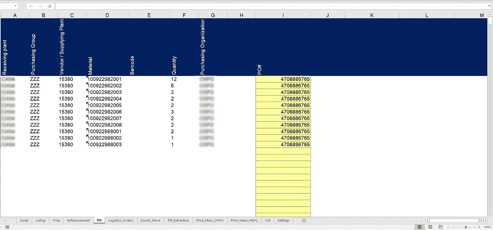
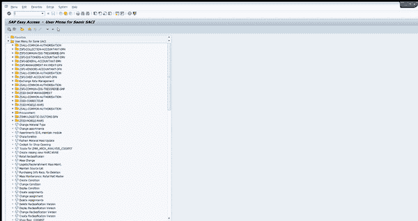
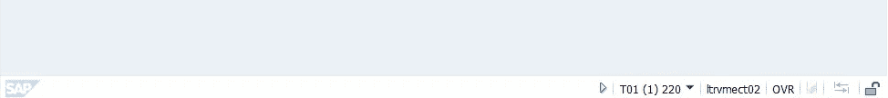

# 零售产品列表的 SAP 自动化

> 原文：<https://medium.datadriveninvestor.com/sap-automation-for-retail-using-vb-and-python-part-2-listing-740c6cb690c1?source=collection_archive---------2----------------------->

## 使用 Visual Basic 通过 SAP GUI 脚本工具在 SAP 中自动列出产品



Product Listing Automation with SAP for Retail Using VB — (Image by Author)

本文是 SAP 零售业自动化系列文章的一部分。( [*第一部分*](https://medium.com/@s.saci95/sap-automation-for-retail-using-vb-and-python-part-1-intro-to-sap-gui-scripting-2b065e122c6f?source=friends_link&sk=8a2708ffb63c2c9fa1ad61055bcab346) *)*

# 一. SAP 中的材料清单

## 1.什么是材料清单？

在 SAP Retail 中,**物料清单**是将一件商品与一个分类联系起来的操作。

*定义:产品组合是一个 SAP 零售对象，材料被分配到该对象(一个称为“列表”的过程)。*

**示例:**您的零售公司使用 SAP，范围包括 20 家名为 *{ST01，ST02，… ST20}* 的商店。这些店铺由卡车从两个名为 *{WH01，WH02}* 的配送中心(DC)发货。



Material Listing Process in SAP Retail — (Image by Author)

> 场景—您想要购买一个新的参考(SAP 代码:145654789)，该参考将由供应商在 WH02 交付，并且仅在 ST04 销售。

**上市流程**

*   **WH02 中的清单 145654789:**此参考可在此 DC 接收
*   **ST04 中的清单 145654789:**此参考可在 ST04 中接收和销售

> *你可以在下面的链接中找到这篇文章的 Youtube 版本和动画，*

## 2.如何进行材料列表？

**WSM3(批量维护)**事务可用于操作特定工厂的批量参考列表，以控制商店可购买或销售的产品组合。

商店不能接收或出售不包含在其产品组合中的商品。

1.  **发起交易 WSM3**



Mass Listing Menu from Tcode “WSM3” — (Image by Author)

要在商店中列出我们的商品，我们需要填写:

*   **分类:** ST04
*   **材质:** 145654789
*   **上市程序:**取决于您的组织
*   **清单有效期自:** *dd.mm.yyyy*
*   **清单有效期至:** *dd.mm.yyyy*
*   **选择选项**

**2。验证和检查**

首先点击页面左上角的绿色按钮*(按钮 1)* 。
SAP 将加载列表报告，在该报告中您可以看到**物料代码** (+变量)以及它们所在的工厂。



Results of Listing of one SAP Code Variant (+ 1 Generic) — (Image by Author)

验证后，我们需要检查记录日期是否正确，这将证明您的列表已成功完成。

[](http://samirsaci.com) [## 萨米尔·萨奇

### 数据科学博客，专注于仓储，运输，数据可视化和机器人流程自动化…

samirsaci.com](http://samirsaci.com) 

**3。手动子任务**

必须运行一组手动子任务来执行列表，它们可以分为两类:

**手动数据输入** 填写表格、点击按钮、上传数据以及任何其他从用户到 SAP GUI 的信息传输动作

**手动数据提取** 检查结果、下载报告、导出表格或任何其他从 SAP GUI 向用户传递信息的动作

对于当前示例，事务表单填写任务可以放在类别 1 中，开始日期检查可以放在类别 2 中。

## 3.如何使用 SAP GUI 脚本自动列出材料？

我们的目标是使用 Excel 文件中的 Visual Basic Bot 脚本完全自动化该过程，其中输入数据将被提取，输出数据将被记录。

1.  目标:建造一个全自动机器人

Excel 电子表格中包含各工厂的文章列表:



Excel Input File with Material Codes and Plants — (Image by Author)

*   **A/B/C 栏:**在交易表格[1]中输入材料代码、工厂代码和列表程序
*   **E 列:**从列表报告[2]中提取的开始日期(以确认列表已正确完成)



Automation Bot performing Listing of Articles Codes listed in the Excel File — (Image by Author)

**2。Excel VBA 脚本**

基于[第 1 部分](https://medium.com/@s.saci95/sap-automation-for-retail-using-vb-and-python-part-1-intro-to-sap-gui-scripting-2b065e122c6f?source=friends_link&sk=8a2708ffb63c2c9fa1ad61055bcab346)中的两个示例，我们必须分三部分构建我们的解决方案:

1.  **设置与 SAP GUI 的连接** 步骤:Create_SAP_Session
2.  **脚本执行动作** 函数:Listing_Function 执行清单
3.  **在 Excel 文件中循环** 过程:Listing_Process 循环所有行

> ***声明公共变量***

```
Option Explicit**'Variables for SAP GUI Tool**
Public SapGuiAuto, WScript, msgcol
Public objGui  As GuiApplication
Public objConn As GuiConnection
Public session As GuiSession
Public objSBar As GuiStatusbar
Public objSheet As Worksheet**'Variables for Functions**
Public Plant, SAP_CODE, Listing_Procedure As String
Dim W_System
Dim iCtr As Integer
```

> ***设置与 SAP GUI 的连接***

```
Function Create_SAP_Session() As Boolean
**'Function to Connect with SAP GUI Sessions****'(1) Variables for Session Creation**
Dim il, it
Dim W_conn, W_Sess, tcode, Transac, Info_System
Dim N_Gui As Integer
Dim A1, A2 As String
tcode = Sheets(1).Range("B3") 'Get Transaction Code**'(2) Get System Name in Cell(2,1) of Sheet1**
If mysystem = "" Then
    W_System = Sheets(1).Cells(2, 2)
Else
    W_System = mysystem
End If**'(3) If we are already connected to a Session we exit this function**
If W_System = "" Then
   Create_SAP_Session = False
   Exit Function
End If**'(4) If Object Session is not null and the system is matching with the one we target: we use this object**
If Not session Is Nothing Then
    If session.Info.SystemName & session.Info.Client = W_System Then
        Create_SAP_Session = True
        Exit Function
    End If
End If**'(5) If we are not connected to anything and GUI Object is Nothing we create one**
If objGui Is Nothing Then
   Set SapGuiAuto = GetObject("SAPGUI")
   Set objGui = SapGuiAuto.GetScriptingEngine
End If'(6) Loop through all SAP GUI Sessions to find the one with the right transaction
For il = 0 To objGui.Children.Count - 1
    Set W_conn = objGui.Children(il + 0)

    For it = 0 To W_conn.Children.Count - 1
        Set W_Sess = W_conn.Children(it + 0)
        Transac = W_Sess.Info.Transaction
        Info_System = W_Sess.Info.SystemName & W_Sess.Info.Client

        'Check if Session Name and Transaction Code are matching then connect to it
        If W_Sess.Info.SystemName & W_Sess.Info.Client = W_System Then
        'If W_Sess.Info.SystemName & W_Sess.Info.Client = W_System And W_Sess.Info.Transaction = tcode Then
            Set objConn = objGui.Children(il + 0)
            Set session = objConn.Children(it + 0)
            Exit For
        End If

    Next

Next**'(7) If we can't find Session with the right System Name and Transaction Code: display error message**
If session Is Nothing Then
   MsgBox "There is no active session found for " + W_System + " with transaction " + tcode + ".", vbCritical + vbOKOnly
   Create_SAP_Session = False
   Exit Function
End If**'(8) Turn on scripting mode**
If IsObject(WScript) Then
   WScript.ConnectObject session, "on"
   WScript.ConnectObject objGui, "on"
End If**'(9) Confirm connection to a session**
Create_SAP_Session = TrueEnd Function
```



System Code: T01220 — (Image by Author)

创建链接到系统和交易代码的 SAP GUI 对象

*   **步骤 1 至 4:** 根据 GUI 窗口中的系统名称连接到 SAP
*   **步骤 5:** 创建 SAP GUI 对象
*   **步骤 6:** 遍历所有 SAP 窗口，并将 GUI 对象链接到与事务 *tcode* 相关的对象
*   **第 7 步:**脚本模式“开”像在 SAP GUI 记录工具中输出

> ***脚本执行动作***

采用工厂代码、SAP_Code 和列表程序填写表格:

*   **步骤 1 到 2:** 连接到 WSM3 事务
*   **步骤 3 到 5:** 填写表单并验证
*   **步骤 6:** 从列表报告中提取开始日期以确认处理
*   第 7 步:把报告留给下一篇文章

```
Function Listing_Function(Plant, SAP_CODE, Listing_Procedure, N)
'Function for Listing**'(1) if you want to maximize the screen**
session.findById("wnd[0]").Maximize:**'(2) call the transaction**
session.findById("wnd[0]/tbar[0]/okcd").Text = "wsm3"
session.findById("wnd[0]").sendVKey 0**'(3) ticking options on listing**
session.findById("wnd[0]/usr/chkLSTFLMAT").Selected = True
session.findById("wnd[0]/usr/chkLIEFWERK").Selected = True**'(4) clear + filling Plant, SAP Code and Listing Procedure**
session.findById("wnd[0]/usr/ctxtASORT-LOW").Text = ""
session.findById("wnd[0]/usr/ctxtASORT-LOW").Text = Plant
session.findById("wnd[0]/usr/ctxtMATNR-LOW").Text = ""
session.findById("wnd[0]/usr/ctxtMATNR-LOW").Text = SAP_CODE
session.findById("wnd[0]/usr/ctxtLSTFL").Text = ""
session.findById("wnd[0]/usr/ctxtLSTFL").Text = Listing_Procedure**'(5) validate**
session.findById("wnd[0]/usr/chkLIEFWERK").SetFocus
session.findById("wnd[0]/tbar[1]/btn[8]").press**'(6) getting start date from window and paste it in column 5**
Sheets("Listing").Cells(N, 5) = session.findById("wnd[0]/usr/lbl[0,0]").Text**'(7) wait 1 second and come back to transaction menu**
Application.Wait (Now + TimeValue("0:00:1"))
session.findById("wnd[0]/tbar[0]/btn[3]").pressEnd Function
```

> ***在 Excel 文件中循环***

循环所有行，获取工厂代码、SAP_Code 和列表程序，以调用 Listing_Function:

*   **步骤 1 到 3:** 创建 SAP GUI 对象
*   **步骤 4 到 6:** 遍历文件并执行输入/提取动作

```
Public Sub Listing_Process()
'Procedure to perform Listing**'(1) Variable for Listing Process**
Dim W_Src_Ord
Dim W_Ret As Boolean
Dim N As Integer
Dim N_max As Integer**'(2) Connect to a system**
Set objSheet = ActiveWorkbook.Sheets(1)
W_Ret = Create_SAP_Session()**'(3) If Create_SAP_Session Return Nothing message**
If Not W_Ret Then
    MsgBox "Not connected to client"
End If**'(4) Loop though all lines**
N = 2
While Not (Sheets("Listing").Cells(N + 1, 1) = "")**'(5) Get Parameters from Excel Sheet**
    SAP_CODE = Sheets("Listing").Cells(N, 1)
    Plant = Sheets("Listing").Cells(N, 2)
    Listing_Procedure = Sheets("Listing").Cells(N, 3)

**'(6) Call the function**
    Call Listing_Function(Plant, SAP_CODE, Listing_Procedure, N)

**'(7) Confirm with a "V"**
    Sheets("Listing").Cells(N, 4) = "V"
    N = N + 1

WendEnd Sub
```

# 二。结论和下一步措施

*关注我的 medium，了解更多与供应链数据科学相关的见解。*

当您在一个工厂中要列出许多商品时，WSM3 事务有助于批量列表。

但是，要列出许多不同工厂的一篇文章，这个机器人会很有帮助。您只需在这个 Excel 文件中列出 VBA 程序/函数所在的不同工厂。

在下一篇文章中，我们将解决

*   **采购订单创建** 采购订单是一种用于以商定的价格向供应商请求项目或服务的文档

[](https://www.samirsaci.com/sap-automation-of-orders-creation-for-retail/) [## SAP 零售订单创建自动化

### 函数 PO_Function() '(1)声明变量 Dim W_BPNumber，W_SearchTerm，PONDim line items As long Dim Sht _ Name As…

www.samirsaci.com](https://www.samirsaci.com/sap-automation-of-orders-creation-for-retail/) 

如果你对供应链分析感兴趣，可以看看我的网站

[](http://samirsaci.com) [## 萨米尔·萨奇

### 数据科学博客，专注于仓储，运输，数据可视化和机器人流程自动化…

samirsaci.com](http://samirsaci.com) 

# 参考

[1] [Samir Saci](https://medium.com/u/bb0f26d52754?source=post_page-----740c6cb690c1--------------------------------) ，SAP Automation for Retail Using VB， [Link](https://s-saci95.medium.com/sap-automation-for-retail-using-vb-and-python-part-1-intro-to-sap-gui-scripting-2b065e122c6f)