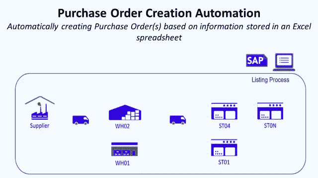
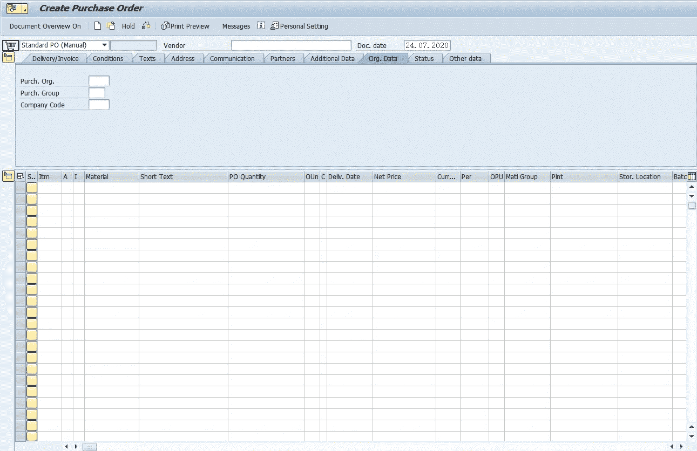
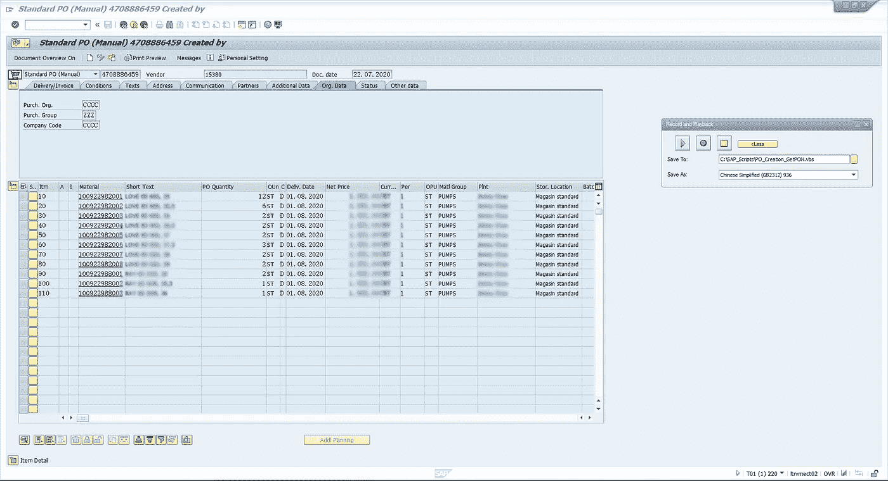
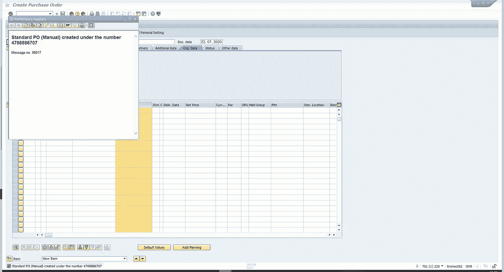
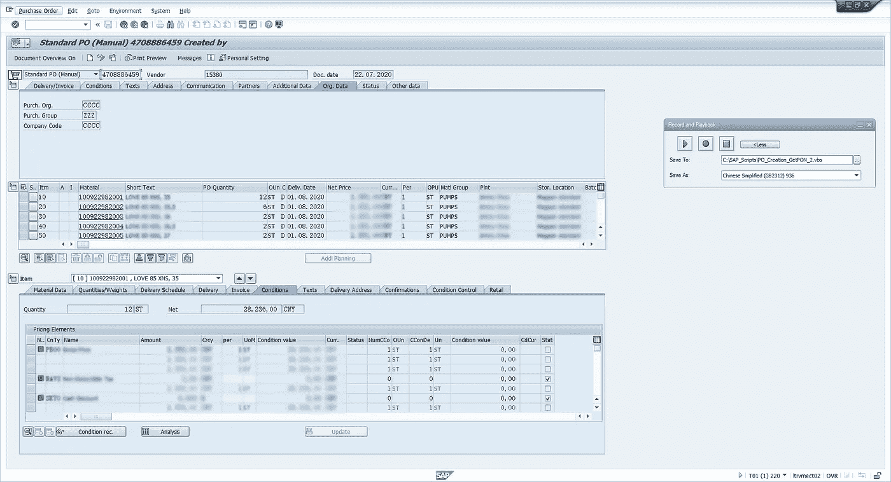
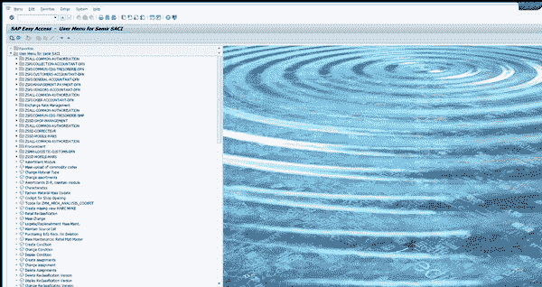

# SAP 零售订单创建自动化

> 原文：<https://medium.datadriveninvestor.com/sap-automation-for-retail-using-vb-and-python-part-3-po-creation-36ae2d1baedb?source=collection_archive---------1----------------------->

## 使用 Visual Basic 通过 SAP GUI 脚本工具在 SAP 中自动创建采购订单



Orders Creation Automation with SAP for Retail Using VB — (Image by Author)

本文是关于面向零售业的 SAP GUI 自动化系列文章的一部分。(可以找到第一部: [*第一部*](https://medium.com/@s.saci95/sap-automation-for-retail-using-vb-and-python-part-1-intro-to-sap-gui-scripting-2b065e122c6f?source=friends_link&sk=8a2708ffb63c2c9fa1ad61055bcab346) *)*

# I .在 SAP 系统中创建采购订单

## 1.什么是采购订单？

在 SAP Retail 中，采购订单是一份商业文件，表明产品或服务的类型、数量、商定价格和交付信息(地点、时间)。

**场景**

作为一名商店经理，你想以**约定价格 200 美元**订购 **10 件商品** *(SAP 代码:145654789 )* ，由**供应商 XXX-XXX** (供应商代码:15487)于 **WH01** 于 2020 年 9 月 20 日**交货。**

你的商店隶属于零售公司(代码:RTCP)的采购组织(代码:PORG)，有一个专门的采购经理(代码:PRGP)。

> 编辑:你可以在下面的链接中找到这篇文章的 Youtube 版本和动画。

## 2.如何在 SAP 中创建采购订单？

ME21N 事务可用于操作采购订单创建

1.  启动交易 ME21N



SAP Transaction ME21N for Purchase Order Creation — (Image by Author)

要创建采购订单，我们需要填写

*   **供应商代码:** 15487
*   **采购组织:** PORG
*   **采购组:** PRGP
*   **公司代码:** RTCP
*   **材质:** 145654789
*   **采购订单数量:** 10
*   **工厂:** WH01
*   交货日期:2020 年 9 月 20 日

2.验证和保存



SAP Transaction ME21N for Purchase Order Creation (Step 2) — (Image by Author)

按下回车键后，SAP 从采购信息记录、链接到 SAP 代码和采购组织的主数据中加载缺失的 PO 信息。然后，我们可以在系统中保存带有采购订单编号的采购订单。



SAP Transaction ME21N for Purchase Order Creation (Step 2) — (Image by Author)

3.入住 ME23N

创建采购订单后，我们可以检查 ME23N 采购订单是否已创建，并提取记录的采购订单编号。



SAP Transaction ME21N for Purchase Order Creation (Step 3) — (Image by Author)

4.手动子任务

要执行此 PO 创建，您需要操作一组手动子任务。我将这些任务分成两类:

*   **1。手动数据输入:**填写表格、点击按钮、上传数据以及任何其他从用户到 SAP GUI 的信息传输动作
*   **2。手动数据提取:**检查结果、下载报告、导出表格或从 SAP GUI 向用户传输信息的任何其他动作

对于当前示例，事务表单填写任务可以放在类别 1 中，而 PO 编号提取可以放在类别 2 中。

## 3.如何使用 SAP GUI 脚本自动创建采购订单？

目标是用 Excel 文件中的 Visual Basic 脚本完全自动化该过程，其中输入数据将被提取，输出数据将被记录。

1.  **目标=全自动机器人**

Excel 电子表格中包含各工厂的文章列表:


Excel Input File with PO Creation Parameters — (Image by Author)

*   **A 栏/../H:** 工厂、采购组、供应商代码、物料代码、条形码、数量、采购组织将被键入采购订单创建表单**【1】**
*   **E 列:**从创建报告 ME23N**【2】**中提取的采购订单编号



Automation Bot performing Purchase Order Creation — (Image by Author)

**2。Excel VBA 脚本**

查看第 1 部分中的两个简单示例，我们知道我们的 VBA 代码需要包括三个部分:

1.  **设置与 SAP GUI 的连接:**过程 Create_SAP_Session
2.  **执行活动的脚本:**名为 PO_Function 的函数执行 PO 创建
3.  **在 Excel 文件中循环:**名为 PO_Process 的过程循环所有行以创建所有列出的 PO

> 你可以在这个 Github 资源库中找到完整的代码:[链接](https://github.com/samirsaci/sap-automation-po)。
> 我与其他项目的投资组合:[萨米尔萨奇](https://samirsaci.com/)

***声明公共变量***

```
Option Explicit**'Variables for SAP GUI Tool**
Public SapGuiAuto, WScript, msgcol
Public objGui  As GuiApplication
Public objConn As GuiConnection
Public session As GuiSession
Public objSBar As GuiStatusbar
Public objSheet As Worksheet**'Variables for Functions**
Public Plant, SAP_CODE, Listing_Procedure As String
Dim W_System
Dim iCtr As Integer
```

> ***设置与 SAP GUI 的连接***

[](http://samirsaci.com) [## 萨米尔·萨奇

### 数据科学博客，专注于仓储，运输，数据可视化和机器人流程自动化…

samirsaci.com](http://samirsaci.com) 

```
Function Create_SAP_Session() As Boolean
**'Function to Connect with SAP GUI Sessions****'(1) Variables for Session Creation**
Dim il, it
Dim W_conn, W_Sess, tcode, Transac, Info_System
Dim N_Gui As Integer
Dim A1, A2 As String
tcode = Sheets(1).Range("B3") 'Get Transaction Code**'(2) Get System Name in Cell(2,1) of Sheet1**
If mysystem = "" Then
    W_System = Sheets(1).Cells(2, 2)
Else
    W_System = mysystem
End If**'(3) If we are already connected to a Session we exit this function**
If W_System = "" Then
   Create_SAP_Session = False
   Exit Function
End If**'(4) If Object Session is not null and the system is matching with the one we target: we use this object**
If Not session Is Nothing Then
    If session.Info.SystemName & session.Info.Client = W_System Then
        Create_SAP_Session = True
        Exit Function
    End If
End If**'(5) If we are not connected to anything and GUI Object is Nothing we create one**
If objGui Is Nothing Then
   Set SapGuiAuto = GetObject("SAPGUI")
   Set objGui = SapGuiAuto.GetScriptingEngine
End If'(6) Loop through all SAP GUI Sessions to find the one with the right transaction
For il = 0 To objGui.Children.Count - 1
    Set W_conn = objGui.Children(il + 0)

    For it = 0 To W_conn.Children.Count - 1
        Set W_Sess = W_conn.Children(it + 0)
        Transac = W_Sess.Info.Transaction
        Info_System = W_Sess.Info.SystemName & W_Sess.Info.Client

        'Check if Session Name and Transaction Code are matching then connect to it
        If W_Sess.Info.SystemName & W_Sess.Info.Client = W_System Then
        'If W_Sess.Info.SystemName & W_Sess.Info.Client = W_System And W_Sess.Info.Transaction = tcode Then
            Set objConn = objGui.Children(il + 0)
            Set session = objConn.Children(it + 0)
            Exit For
        End If

    Next

Next**'(7) If we can't find Session with the right System Name and Transaction Code: display error message**
If session Is Nothing Then
   MsgBox "There is no active session found for " + W_System + " with transaction " + tcode + ".", vbCritical + vbOKOnly
   Create_SAP_Session = False
   Exit Function
End If**'(8) Turn on scripting mode**
If IsObject(WScript) Then
   WScript.ConnectObject session, "on"
   WScript.ConnectObject objGui, "on"
End If**'(9) Confirm connection to a session**
Create_SAP_Session = TrueEnd Function
```


System Code: T01220 — (Image by Author)

创建链接到系统和交易代码的 SAP GUI 对象

*   **第 1 步至第 4 步:**使用 GUI 窗口中的系统名称连接 SAP(如上图)
*   **步骤 5:** 创建 SAP GUI 对象
*   **步骤 6:** 遍历所有 SAP 窗口，并将 GUI 对象链接到与事务 tcode 连接的对象
*   **步骤 7:** 脚本模式“开”像在 SAP GUI 记录工具中输出

> ***脚本执行动作***

通过工厂代码、SAP_Code 和列表程序填写表格:

*   **步骤 1 到 2:** 连接到 ME21N 交易
*   **步骤 3 到 8:** 填写表单并验证
*   **第九步:**保存采购订单
*   **步骤 10 至 12:** 转到 ME23N 查看 PO，获取 PO#并粘贴到 Excel 文件中

```
Function PO_Function()**'(1) Declare Variables**
Dim W_BPNumber, W_SearchTerm, PON
Dim lineitems As Long
Dim Sht_Name As String
Dim N_Lines As Integer
Dim t As Integer
Sht_Name = "PO"**'(2) Launch_Transaction**
session.findById("wnd[0]").Maximize
session.findById("wnd[0]/tbar[0]/okcd").Text = "me21n"
session.findById("wnd[0]").sendVKey 0
Application.Wait (Now + TimeValue("0:00:1"))**'(3) Fill Vendor Code**
session.findById("wnd[0]/usr/subSUB0:SAPLMEGUI:0013/subSUB0:SAPLMEGUI:0030/subSUB1:SAPLMEGUI:1105/ctxtMEPO_TOPLINE-SUPERFIELD").Text = Sheets(Sht_Name).Cells(2, 3)**'(4) PurchOrg Code**
session.findById("wnd[0]/usr/subSUB0:SAPLMEGUI:0013/subSUB1:SAPLMEVIEWS:1100/subSUB2:SAPLMEVIEWS:1200/subSUB1:SAPLMEGUI:1102/tabsHEADER_DETAIL/tabpTABHDT9/ssubTABSTRIPCONTROL2SUB:SAPLMEGUI:1221/ctxtMEPO1222-EKORG").Text = Sheets(Sht_Name).Cells(2, 7)**'(5) Purch Group**
session.findById("wnd[0]/usr/subSUB0:SAPLMEGUI:0013/subSUB1:SAPLMEVIEWS:1100/subSUB2:SAPLMEVIEWS:1200/subSUB1:SAPLMEGUI:1102/tabsHEADER_DETAIL/tabpTABHDT9/ssubTABSTRIPCONTROL2SUB:SAPLMEGUI:1221/ctxtMEPO1222-EKGRP").Text = Sheets(Sht_Name).Cells(2, 8)
session.findById("wnd[0]").sendVKey 0**'(6) Loop for SAP Code**
For t = 0 To N_Lines - 3
    session.findById("wnd[0]/usr/subSUB0:SAPLMEGUI:0013/subSUB2:SAPLMEVIEWS:1100/subSUB2:SAPLMEVIEWS:1200/subSUB1:SAPLMEGUI:1211/tblSAPLMEGUITC_1211/ctxtMEPO1211-EMATN[4," & t & "]").Text = Sheets(Sht_Name).Cells(t + 2, 4)
Next t**'(7) Loop for Quantities**
For t = 0 To N_Lines - 3
    session.findById("wnd[0]/usr/subSUB0:SAPLMEGUI:0013/subSUB2:SAPLMEVIEWS:1100/subSUB2:SAPLMEVIEWS:1200/subSUB1:SAPLMEGUI:1211/tblSAPLMEGUITC_1211/txtMEPO1211-MENGE[" & "6," & t & "]").Text = Sheets(Sht_Name).Cells(t + 2, 6)
Next t**'(8) Loop for  Plants**
For t = 0 To N_Lines - 3
    session.findById("wnd[0]/usr/subSUB0:SAPLMEGUI:0013/subSUB2:SAPLMEVIEWS:1100/subSUB2:SAPLMEVIEWS:1200/subSUB1:SAPLMEGUI:1211/tblSAPLMEGUITC_1211/ctxtMEPO1211-NAME1[15," & t & "]").Text = Sheets(Sht_Name).Cells(t + 2, 1)
Next t**'(9) Click Save Button**
session.findById("wnd[0]/tbar[0]/btn[11]").press
session.findById("wnd[1]/usr/btnSPOP-VAROPTION1").press
session.findById("wnd[0]/sbar").DoubleClick**'(10) Leave and go to Me23n**
session.findById("wnd[0]/tbar[0]/btn[3]").press
session.findById("wnd[0]/tbar[0]/okcd").Text = "me23n"
session.findById("wnd[0]").sendVKey 0
session.findById("wnd[0]/usr/subSUB0:SAPLMEGUI:0020/subSUB3:SAPLMEVIEWS:1100/subSUB1:SAPLMEVIEWS:4002/btnDYN_4000-BUTTON").press
session.findById("wnd[0]/usr/subSUB0:SAPLMEGUI:0013/subSUB0:SAPLMEGUI:0030/subSUB1:SAPLMEGUI:1105/txtMEPO_TOPLINE-EBELN").SetFocus
session.findById("wnd[0]/usr/subSUB0:SAPLMEGUI:0013/subSUB0:SAPLMEGUI:0030/subSUB1:SAPLMEGUI:1105/txtMEPO_TOPLINE-EBELN").caretPosition = 1**'(11) Copy PO# and paste it in Excel File**
session.findById("wnd[0]/usr/subSUB0:SAPLMEGUI:0013/subSUB0:SAPLMEGUI:0030/subSUB1:SAPLMEGUI:1105/txtMEPO_TOPLINE-EBELN").SetFocus
PON = session.findById("wnd[0]/usr/subSUB0:SAPLMEGUI:0013/subSUB0:SAPLMEGUI:0030/subSUB1:SAPLMEGUI:1105/txtMEPO_TOPLINE-EBELN").Text
N_Lines = 1
While Not (Sheets(Sht_Name).Cells(N_Lines, 1) = "")
    N_Lines = N_Lines + 1
    Sheets(Sht_Name).Cells(N_Lines, 9) = PON
Wend**'(12) Leave Ready to go back to Menu**
session.findById("wnd[0]/tbar[0]/btn[3]").pressEnd Function
```

# 二。结论和下一步措施

*关注我的 medium，了解更多与供应链数据科学相关的见解。*

这个例子是一个自动化 PO 创建过程的简单解决方案，稍加定制，它还可以用来修改已经创建的 PO。

在下一部分，我们将了解如何:

*   **3。货物转移订单提取:**货物转移允许您在一次数据输入交易中映射系统中的转移交货

# 参考

[1] [Samir Saci](https://medium.com/u/bb0f26d52754?source=post_page-----36ae2d1baedb--------------------------------) ，使用 VB 的 SAP 零售自动化

[](https://www.samirsaci.com/sap-automation-for-retail/) [## 面向零售业的 SAP 自动化

### 自动化和报告设计 RPA 解决方案使用通过 SAP GUI 脚本工具构建的 Visual Basic 脚本设计 RPA…

www.samirsaci.com](https://www.samirsaci.com/sap-automation-for-retail/) 

[2] [Samir Saci](https://medium.com/u/bb0f26d52754?source=post_page-----36ae2d1baedb--------------------------------) ，使用 VB 实现 SAP 零售产品列表自动化

[](https://www.samirsaci.com/sap-automation-of-product-listing-for-retail/) [## SAP 零售产品列表自动化| Samir Saci

### 自动化和报告使用 Visual Basic 自动化产品，通过 SAP GUI 脚本工具在 SAP 中自动列出产品…

www.samirsaci.com](https://www.samirsaci.com/sap-automation-of-product-listing-for-retail/) 

如果你对供应链分析感兴趣，可以看看我的网站

[](http://samirsaci.com) [## 萨米尔·萨奇

### 数据科学博客，专注于仓储，运输，数据可视化和机器人流程自动化…

samirsaci.com](http://samirsaci.com)