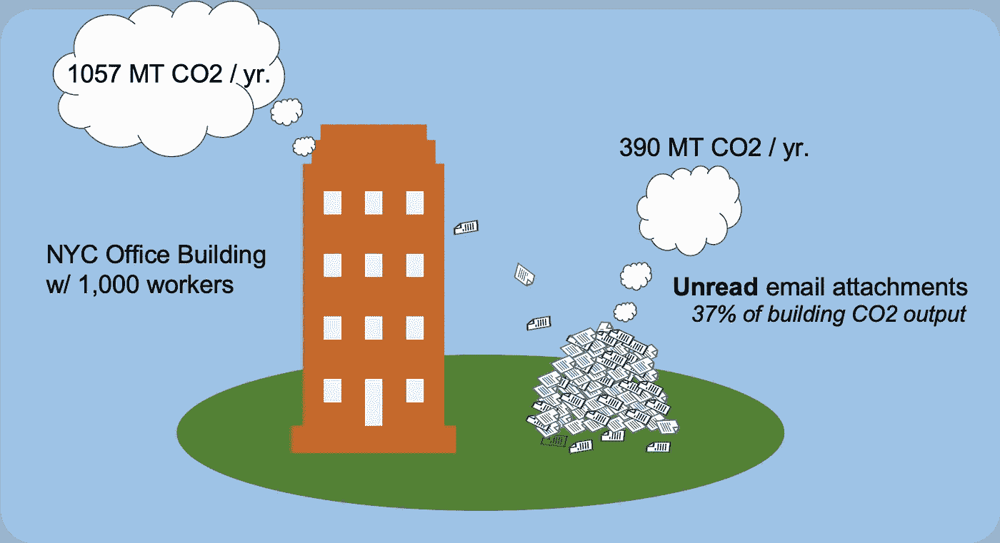

# 拯救地球:用文件共享链接取代电子邮件附件

> 原文：<https://medium.datadriveninvestor.com/save-the-planet-replace-email-attachments-with-file-share-links-1f643e06c0d3?source=collection_archive---------2----------------------->

*批判性地审视我们对已有 40 年历史的电子邮件附件技术的持续依赖的系列文章的第二部分*

就像一个旧的柴油发动机，电子邮件附件技术开发于 70 年代，现在广泛使用，正在向我们的大气中排放数百万吨的二氧化碳。最近的估计认为，每封带有附件的电子邮件会产生大约 50 克的二氧化碳[1]。碳影响主要来自传输和处理信息所需的基础设施，如消耗电力来存储、传输、处理和分析信息内容的数据中心。

 [## 艾预测:“颠覆，然后是生产力”|数据驱动的投资者

### 人们越来越担心，随着机器学习和互联网的普及，所有白领工作都将消失

www.datadriveninvestor.com](https://www.datadriveninvestor.com/2018/08/06/ai-forecast-disruption-then-productivity/) 

虽然 50 克的二氧化碳，比一个进口香蕉(80 克)的二氧化碳还少，本身看起来并不多，但让电子邮件附件最终变得如此有害的是那些不必要发送的数量[1]。在[之前的一篇文章](https://medium.com/datadriveninvestor/email-attachments-generate-nearly-6-000-unnecessary-and-unsecure-files-per-employee-per-year-a38385bec7a4)中，我们估计每个专业人员平均每年忽略 6000 个文件附件。常见的公司做法是复制(抄送、密件抄送)，不必要地共享未读的文件；威胁数据安全、挑战信息治理并降低生产效率。如果我们将这些统计数据与二氧化碳当量(CO2e)排放进行对比，我们会发现一些惊人的发现。

> 一年未读的电子邮件附件相当于每个上班族驾驶汽车 1093 英里的二氧化碳排放量

上班族平均每天会收到大约 144 条不相关的信息，其中 24%带有附件[2，3]。以副本形式发送的电子邮件附件只有 6%的机会被访问[4]。鉴于每个电子邮件附件会导致 46 克的二氧化碳排放，我们可以很容易地计算出**每个员工每天未读的电子邮件附件会产生 1494 克的二氧化碳**【5】。在一年 261 个工作日的过程中，每年不需要的、未读的、被忽略的附件产生的二氧化碳排放量约为 390，000 克，接近半公吨。那是多少钱？嗯，根据美国环保署的数据，美国的乘用车平均每加仑行驶 24.9 英里。每加仑排放 8887 克二氧化碳。这意味着一年的未读邮件附件相当于每个上班族驾驶汽车 1093 英里的二氧化碳量… *(说清楚了，* ***)未读附件*** *)* ！

Yearly CO2 emissions from unread email attachments in the workplace per employee equivalent to driving a passenger car 1093 miles

换句话说，在纽约一栋拥有 1，000 名员工的中型办公楼里，被忽略的电子邮件附件产生的二氧化碳量是整栋大楼的 37%。因此，我们可以花费数十万美元来改善我们的绝缘和安装太阳能电池板，或者干脆开始消除不必要的电子邮件附件可能更生态。

Metric Tons of CO2 compared — NYC Office building vs. Unread emails

你可能会问，我们如何停止发送被忽略的附件？这比你想象的要简单。用户可以用云存储链接替换附件。无论是 [OneDrive](https://products.office.com/en-us/onedrive-for-business/online-cloud-storage) 、 [Google Drive](https://cloud.google.com/drive-enterprise/) 、 [Box](https://www.box.com/home) 、 [Egnyte](https://www.egnyte.com/) 还是其他云内容服务，大多数上班族都可以随时使用云存储。使用这些服务，收件人不会收到附件，而是文件链接。提供链接可确保文件仅分发给真正需要附件的 6%的人，这消除了上述资源消耗和二氧化碳排放，并带来了遏制数据蔓延、支持大型文件传输以及降低安全性和信息治理风险的额外好处。用户采用的麻烦？像 [mxHero](https://www.mxhero.com/) 这样的用户培训或服务可以通过自动将附件转换为云存储链接来提供帮助。

> 电子邮件附件是一种过时的文件共享技术，从一开始就效率低下，被现代的使用模式所破坏

事实证明，电子邮件是一种适应性很强的沟通媒介。然而，它的成功在很大程度上是因为它继承了字母(最古老的通信形式之一)，并且它是一个没有所有者的开放协议。尽管它有惊人的能力适应几十年的技术进步，但它的部分架构，如文件附件，却严重落后。电子邮件附件是一种过时的文件共享技术，从一开始就效率低下，被现代的使用模式所破坏——这种模式对其创造者来说是完全不可想象的。是时候让社会集体“振作起来”，承担起变革的重任了。这里的替代方法是共享文件链接的形式。无所作为的代价是真实的。我们付出了高昂的安全、治理、基础设施和环境成本。是时候向前看了。不再有电子邮件附件。

**2021 年 11 月 5 日编辑**

计算并下载您自己组织中因使用电子邮件而产生的二氧化碳排放量的源电子表格:

mxHERO 计算器
[https://tools.mxhero.com/roi](https://tools.mxhero.com/roi)

来源:

1.  [香蕉到底有多难吃？:一切事物的碳足迹，迈克·伯纳斯·李](https://www.amazon.com/dp/1553658310/)
2.  [福布斯](https://www.forbes.com/sites/annabelacton/2017/07/13/innovators-challenge-how-to-stop-wasting-time-on-emails/)
3.  [激进](http://www.radicati.com/wp/wp-content/uploads/2009/05/email-stats-report-exec-summary.pdf)
4.  [新月电动](https://event.on24.com/eventRegistration/EventLobbyServlet?target=reg20.jsp&partnerref=70132000001D76v_OD&eventid=1130395&sessionid=1&key=1D58D67D3B01E8623E5DD869359C465F&regTag=&sourcepage=register)
5.  *根据 Berners-Lee (1)的数据，一封没有附件的电子邮件产生 4 克二氧化碳，而一封有附件的电子邮件产生 50 克二氧化碳。因此，只有附件的 CO2 是通过减去两者之差或 46g 来估算的。根据此处引用的来源:144(抄送、密件抄送电子邮件)x 24% (%的电子邮件带附件)x 94% (%的收到的副本中未读的附件)x 46g CO2 =每位员工每天未读附件产生的 CO2 克数(1，494g)*
6.  [环保局](https://www.epa.gov/automotive-trends/highlights-automotive-trends-report)
7.  人均办公面积( [TMC](https://mehiganco.com/?p=684) )。纽约市办公楼的二氧化碳中值([城市绿色委员会](https://metered.urbangreencouncil.org/site/explore))