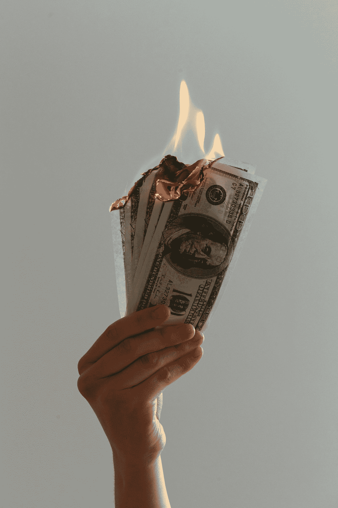

# 省钱是对经济的最大威胁

> 原文：<https://medium.datadriveninvestor.com/saving-money-is-the-biggest-threat-to-the-economy-8c413eb2d144?source=collection_archive---------4----------------------->

## 存钱对你有好处，但是存太多钱对其他人都不好

Photo by [Jp Valery](https://unsplash.com/@jpvalery?utm_source=medium&utm_medium=referral) on [Unsplash](https://unsplash.com?utm_source=medium&utm_medium=referral)

# 所有威胁之母

美国经济目前正在经历非常艰难的时期:新的失业救济人数达到前所未有的 4000 万；联邦债务总额超过 25 万亿美元，而且没有计划在短期内偿还，数千家企业面临破产潮。话虽如此，对我们以消费为基础的经济的重大威胁是，美国人储蓄太多。

# 死亡螺旋

当人们储蓄过多时，企业将无法获得同样多的收入，也不会有同样多的顾客。这反过来意味着他们将放缓招聘工作，这将引发更高的失业率。一些企业将无法生存，这将导致更高的失业率。更多的人将竞争同样的工作，这将压低工资。随着恐惧的蔓延和失业率的上升，人们将会存更多的钱。这种恶性循环会随着时间的推移而加剧，并对经济产生不利影响。

 [## 现金为王，比我们想象的更强大|数据驱动的投资者

### 2020 年 3 月 12 日，在川普总统宣布新冠肺炎进入国家紧急状态的前夕，纽约时报报道…

www.datadriveninvestor.com](https://www.datadriveninvestor.com/2020/03/26/cash-is-king-more-potent-than-we-think/) 

# 储蓄率高达 20 世纪 80 年代

美国人正在囤积现金，以帮助他们度过新冠肺炎风暴。储蓄率从 2 月份的 8%飙升至 3 月份的 13%，达到 1981 年以来的最高水平。贷款和信用卡消费也在崩溃:根据 Visa 的数据，4 月份信用卡支付量收缩了 31%。是的，美国人在经济衰退时会削减开支，但最近储蓄率的飙升非常不寻常。

# 所有人都在关注封锁后的支出

随着经济重新开放，最大的问题仍然是支出方面的新常态是什么。也许许多美国人会意识到他们已经入不敷出，并将继续偿还债务。也许，他们会更多地考虑在家做饭，作为去餐馆吃饭的更便宜和舒适的选择。可以肯定的是，如果美国人决定减少支出，美国经济将不会回到危机前的水平，因为美国三分之二的 GDP 来自消费者支出。