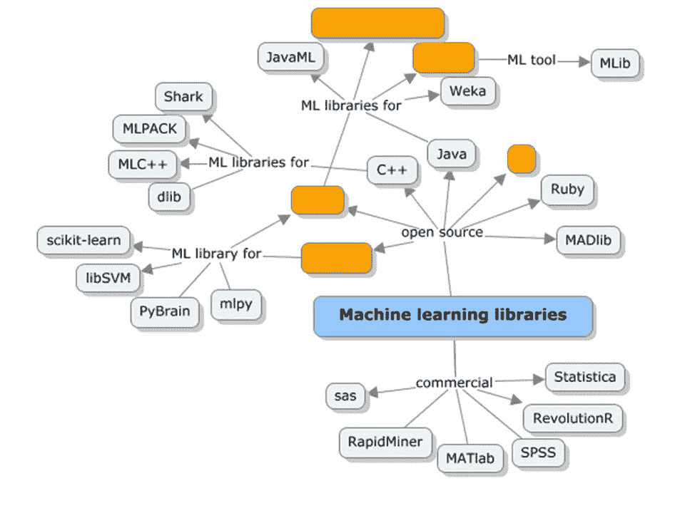

# 使用“Julia”构建 ML & AI 模型

> 原文：<https://medium.datadriveninvestor.com/say-hello-to-julia-21151845655?source=collection_archive---------9----------------------->

我们都被实现 AI/DL/ML 的编程/脚本语言选项淹没了。在这篇博文中，我涵盖了可供选择的前景，特别是给出了一些关于朱莉娅的新手资料。

在过去几十年中，市场上有几个开源和商业机器学习框架和工具已经发展起来。虽然机器学习领域本身正在为不同领域的不同需求构建强大的算法，但我们现在看到大规模机器学习的开源选项激增，这些选项已经达到了相当高的成熟度，并被数据科学和机器学习社区广泛采用。

 [## 成为数据科学家所需的 8 项技能|数据驱动型投资者

### 数字吓不倒你？没有什么比一张漂亮的 excel 表更令人满意的了？你会说几种语言…

www.datadriveninvestor.com](https://www.datadriveninvestor.com/2019/02/07/8-skills-you-need-to-become-a-data-scientist/) 

该模型在最近几年发生了重大变化，研究人员被鼓励在开源模型下发布他们的软件。由于作者在发布他们使用算法实现进行机器学习的工作时会面临一些问题，因此任何通过数据科学社区的使用进行审查和即兴创作的工作都被认为更有价值。

下面的概念图描绘了市场上一些重要的商业和开源机器学习框架和工具。

其中一些库围绕特定的编程语言，如 Java、Python、C++、Scala 等等。其中一些库(如 Julia、Spark 和 Mahout)已经支持分布式并行处理，其他库(如 R 和 Python)可以在 Hadoop 上作为 MapReduce 函数运行。

# 朱莉娅

最近，Julia 作为 Python 的高性能替代品，在机器学习和数据科学领域获得了广泛的欢迎和采用。Julia 是一种动态编程语言，旨在支持分布式和并行计算，因此方便快捷。

Julia 中的性能是 JIT 编译器和类型接口特性的结果。此外，与其他数字编程语言不同，Julia 不强制执行值的矢量化。与 R、MATLAB 和 Python 类似，Julia 为高级数值计算提供了便利和表现力。

以下是 Julia 的一些主要特征:

*   核心的 API 和数学原语操作都是用 Julia 写的
*   它由丰富类型组成，用于构造和描述对象
*   Julia 支持多重分派，这使得可以在多种参数组合中使用函数
*   它有助于为不同的参数类型自动生成专门的代码
*   成熟的性能与 C 等静态编译语言不相上下
*   它是一种免费的开源编程语言(麻省理工学院许可)
*   用户定义的类型和内置类型一样快速紧凑
*   它不强制或要求矢量化代码来提高性能
*   它是为分布式并行计算而设计的
*   Julia 附带了协同例程、轻量级线程
*   Julia 支持直接调用 C 函数的能力
*   用于管理流程的类似 Shell 的功能。
*   它提供了类似 Lisp 的宏

# 陷害朱莉娅

我们将使用 Julia 在写这本书时可用的最新版本-v 0.3.4。Julia 程序可以被构建和执行:

1.  使用 Julia 命令行
2.  使用 Juno——Julia 的 IDE
3.  在[https://juliabox.org/](https://juliabox.org/)使用现成的环境，在这里可以使用浏览器访问 Julia 环境

# 编程语法

Julia 在运行时编译代码，并使用实时(JIT)编译器将每个方法翻译成机器码。在内部，它利用低级虚拟机(LLVM)进行优化和代码生成。LLVM 是一个成熟的项目，是标准编译器技术的集合。这是作为 iOS 的一部分使用的。

从选择的 shell 中，运行以下命令:

*<</path/to/Julia>>/myjuliscript . JL*

或者，从 Julia 命令行安装中打开 Julia 控制台，并运行以下命令:

*朱丽亚>包括("<<path/to/Julia script>>/myjulia script . JL ")*

Julia 附带了几个包，这些包具有内置函数，并且支持许多用于实现机器学习算法的开箱即用功能。以下是列表: *Images.jl，Graphs.jl，DataFrames.jl，DimensionalityReduction.jl，Distributions.jl，NLOpt.jl，ArgParse.jl，Logging.jl，FactCheck.jl，METADATA.jl*

更多关于茱莉亚包的细节可以在[https://github.com/JuliaLang/](http://%20https://github.com/JuliaLang/)获得。

# 互用性

本节涵盖了 Julia 与各种 pother 编程语言的集成方面。

# 与 C 集成

Julia 是灵活的，没有任何包装，支持直接调用 C 函数。下面的示例演示了这是如何实现的:

*茱莉亚> ccall(:clock，Int32，())2292761 茱莉亚> ccall(:getenv，Ptr{Uint8int8}，(Ptr{Uint8}，)，" SHELL ")Ptr { uint 8 } @ 0x 00007 fff 5 fbffc 45 茱莉亚>bytestring(ans)"/bin/bash "*

# 与 Python 集成

与 C 函数调用类似，Julia 支持直接调用 Python 函数。重要的是，我们已经安装了 PyCall 包，能够做到这一点。PyCall.jl 提供了 Julia 和 Python 之间的自动类型转换。例如，Julia 数组被转换为 NumPy 数组。

以下示例演示了如何从 Julia 代码中调用 Python 函数:

*julia >使用随 Pkg.add("PyCall ")安装的 py call # Julia>@ py import math Julia>math . sin(math . pi/4)—sin(pi/4)0.0 Julia>@ py import pylabjulia>x = Lin space(0，2*pi，1000)；y = sin(3 * x+4 * cos(2 * x))；julia > pylab.plot(x，y；color="red "，linewidth=2.0，line style = "—")Julia>pylab . show()*

# 与 MATLAB 集成

以下示例演示了集成 Julia 以调用 MATLAB 函数:

*使用 MATLAB function sample function(bmap::bit matrix)@ mput bmap @ MATLAB bmapthin = bw morph(bmap，" thin "，inf)convert(BitArray，@mget bmapthin)end*

我希望这个博客能帮助你了解 Julia 是什么，以及如何实现它。在接下来的下一篇博客中，将介绍如何使用 Julia 在深度学习中构建和运行监督和非监督学习算法。