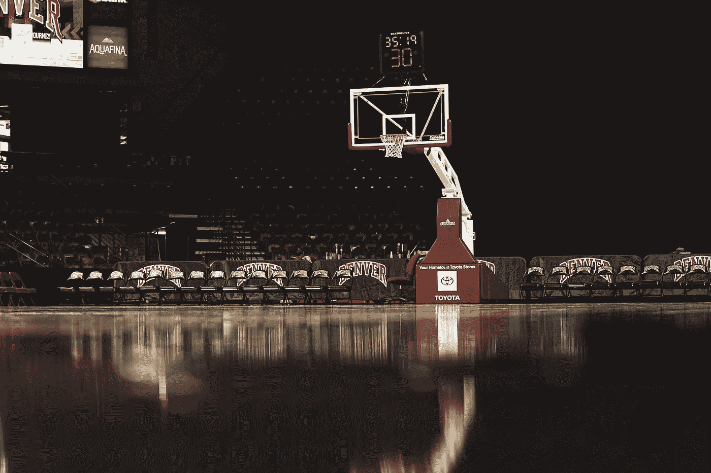

# 再说一遍，“闭嘴运球”。我谅你也不敢！

> 原文：<https://medium.datadriveninvestor.com/say-shut-up-and-dribble-again-i-dare-you-59be7f01c7cb?source=collection_archive---------2----------------------->

## 运动员在种族冲突中显示了自己的实力

Photo by Logan Weaver on Unsplash

2018 年 2 月，勒布朗·詹姆斯和凯文·杜兰特一起，对 ESPN 的 Cari 冠军进行了广泛的采访。在采访中，政治和特朗普总统出现了，詹姆斯说了以下内容:

*“美国的头号工作，被任命的人是不了解人民的人，总统的一些评论是可笑和可怕的。”*

不到一周之后，福克斯新闻频道的劳拉·英格拉姆为总统辩护，贬低詹姆斯及其拥有政治见解的权利。

*“向一个靠拍球获得 1 亿美元年薪的人寻求政治建议总是不明智的。把政治评论留给你们自己。…闭嘴运球。*

显然，传球是不同的，因为她后来为新奥尔良圣徒队的四分卫德鲁·布里斯辩护，当他批评那些在播放国歌时单膝跪地抗议的人时，他是白人。'

*“他被允许有自己的观点，关于跪下和国旗对他意味着什么。我是说，他是个人。我想，他还是有些价值的。”*

德鲁·布里斯面临着来自他的几个队友和新奥尔良社区许多人的强烈反对。他为自己的评论道歉，称这些评论麻木不仁:

*“在试图谈论以美国国旗和国歌为中心的尊重、统一和团结时，我发表了一些麻木不仁的评论，完全没有触及我们国家目前面临的问题。他们缺乏意识和任何类型的同情心或同理心。相反，这些话已经成为分裂和伤害，并误导人们相信，不知何故，我是一个敌人。这与事实相去甚远，也不是我内心或性格的准确反映。”*

然而劳拉·英格拉姆并没有道歉，而是试图为自己的虚伪辩解。

现在的赌注更高了，NBA 季后赛已经暂停，因为在威斯康星州警察鲁斯廷·舍斯基(Rustin Sheskey)被基诺沙(Kenosha)枪杀雅各布·布莱克(Jacob Blake)之后，球员们正在抵制比赛，他是一名有七年警龄的老兵。雅各布·布莱克背部遭到近距离枪击，幸免于难，现已被送往医院。他的父亲说，医生告诉他雅各布很可能腰部以下瘫痪。

当然，这是在布里奥纳·泰勒在家中被肯塔基州路易斯维尔的警察射杀后发生的。明尼苏达州明尼阿波利斯警官谋杀乔治·弗洛伊德，其中一人跪在弗洛伊德的脖子上长达八分四十六秒。在佐治亚州布伦瑞克附近，艾哈迈德·阿贝里在慢跑时被枪杀。佐治亚州亚特兰大的警察在温迪的汽车通道里睡着后枪杀了 Rayshard Brooks，等等。

那些谋杀，尤其是乔治·弗洛伊德的谋杀，在全国范围内引发了抗议，在又一个毫无意义的杀害黑人男性或女性的事件发生之前，抗议是不会平息的。黑人运动员来自明尼阿波利斯、亚特兰大、基诺沙和路易斯维尔等城市。他们在那些社区有家庭。他们自己也不能免于骚扰和对警察拦截的恐惧。密尔沃基雄鹿队后卫斯特林·布朗因非法跨越两个残疾人停车位停车而被逮捕、殴打和电击，当时至少有七名警察与他对峙。如果他没有被其中一名警官认出来，他也可能已经死了。

斯特林·布朗正与雄鹿队一起参加 NBA 季后赛，所有比赛都在佛罗里达州奥兰多的一个地方进行，所有球员和工作人员都因新冠肺炎病毒而被包含在“一个泡沫”中。所有的季后赛球队都住在同一家酒店，并且能够以一种通常不可能的方式面对面地聚在一起。东部联盟的头号种子密尔沃基雄鹿队在距离威斯康星州基诺沙市四十英里的一个城市比赛，雅各布·布莱克就是在那里被枪杀的。他们是第一支抵制季后赛的球队，拒绝在球场上对阵奥兰多魔术队，他们在系列赛中以 3 比 1 领先，并接近淘汰。由于球队投票抵制，原定的下一场比赛也被取消，联盟别无选择，推迟了比赛，直到事情解决。

美国职业棒球大联盟的密尔沃基酿酒人队通过抵制他们预定的比赛来支持雄鹿队。全美橄榄球联盟底特律雄狮队抵制了雅各布·布莱克枪击事件的训练。来自多个联盟的运动员，大部分是黑人，但不是全部，正在发表声明，需要改变。据报道，在勒布朗·詹姆斯和科怀·伦纳德的带领下，NBA 球员一度抵制剩余的 NBA 季后赛，实际上取消了这个赛季。

大多数球员担心自己表明立场会对职业生涯产生影响的日子已经一去不复返了。穆罕默德·阿里因为拒绝参加越南战争而失去了三年的职业生涯。一些玩家确实采取了政治立场，比如:卡里姆·阿布杜尔·贾巴尔、吉姆·布朗和阿瑟·阿什。其他并非不可触及的人被从舞台上抹去，如芝加哥公牛队的克莱格·霍奇斯，田径明星，奥运会银牌得主约翰·卡洛斯和托米·史密斯，以及美国国家足球联盟的科林·卡佩尼克。这一代运动员开始忽视迈克尔·乔丹或老虎·伍兹在种族问题上避免立场的模式，相反，他们带头冲锋陷阵，要求改变。

NBA 季后赛的暂停让美国不得不关注。玩家有希望将他们的愤怒转化为一种策略，并利用他们的影响力和力量来推动真正的变革。否则，这将是一个失去的机会。他们必须想出一个包含可行且可衡量的行动项目的计划。他们必须准备好冒着收入和职业生涯的风险来支持正义。

与此同时，劳拉·英格拉姆(Laura Ingram)或那些认为现在是时候谴责这些球员不闭嘴或拒绝运球的人要小心了。反弹将是严重的。福克斯新闻频道的塔克·卡尔森在直播中为一名 17 岁的白人义务警员辩护，这名警员开枪打死了三名抗议者。他把他描绘成一个受害者，尽管有一段视频显示他在开枪打死第一个受害者之前跑向他。对球员所做的事情有很大的支持，球队老板、广告商和联盟委员们不是在驾驶这辆车，而是球员。错误的声明可能会让他们的注意力回到你身上，因为你散布了充满仇恨的宣传，所以要小心。城市的翻译是，“不要开始没有不会是没有。”

 [## 平权行动——美国对少数民族犯下的最大骗局

### 从来没有像他们说的那样成功过

medium.com](https://medium.com/our-human-family/affirmative-action-the-biggest-hoax-perpetrated-on-minorities-in-america-8f90f2d4eb25)  [## 黑人的命也是命:从运动到革命

### 黑人的命也是命(BLM)成立于 2013 年 7 月 13 日，同一天乔治·齐默曼因谋杀…

medium.com](https://medium.com/our-human-family/black-lives-matter-66a0b02bf6df)