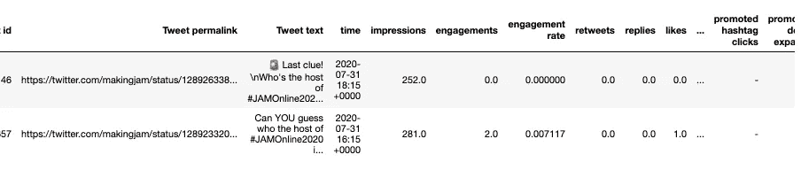
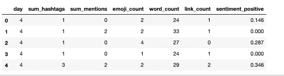
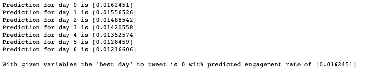

# 😲说什么？！基于文本的朴素贝叶斯推特参与度预测

> 原文：<https://medium.datadriveninvestor.com/say-what-text-based-prediction-of-twitter-engagement-with-naive-bayes-1d03ddc8860f?source=collection_archive---------8----------------------->

## 矢量化和线性回归预测参与率。


Photo by Paul Hanaoka on Unsplash

数据分析只是**一个人** **周末做的好玩的事情**，但更好玩的是玩算命的**方式。就是这种感觉*导致一些*奇怪的*人(嗯，我知道至少有一个)决定自学机器学习。🤷‍♀️**

这些人试图将模型应用于他们遇到的一切。在这篇文章中，一个这样的 ML 新手正在用一组推文来回答这个问题:

> 我们如何利用现有的 Twitter 数据来预测未来的推文参与度？

加入这一激动人心的探索！

**免责声明:**

我是 ML 的自学初学者。关于如何解决下面的问题，我的大多数决定都是基于我*碰巧* *上过*的在线课程和教程。当我试图对我正在学习的**和**在哪里**(对 [DataCamp 团队](https://medium.com/u/e18542fdcc02?source=post_page-----1d03ddc8860f--------------------------------) & Dataquest)做出明智的决定时，在过程和结果的选择上存在很大的误差。如果有一个标准化的、最先进的方法来解决这类问题，或者下面的方法毫无意义，请告诉我！**

> **☝️换句话说，在遵循同样的过程之前，先咨询你的多发性硬化症医生！**

# **⛲️数据源**

**该数据集已从 Twitter Analytics 下载，涵盖时间为 2020 年 4 月至 9 月。尽管我很想拥有更多，但 Twitter 并不存储更早的数据，或者即使存储了，也不会向账户所有者公开。**

**该数据集包括账户@ [makingjam](https://twitter.com/makingjam) 在此期间发送的所有推文，有 **529 行和**40 列，其中大部分我们在接下来的任何事情中都不需要。**

**我会给你一份关于数据清理的报告。出于好奇，所有步骤和对这些数据的完整分析都在本笔记本中。**

**这是数据集开始时的样子。**

****

# **😎使用高冷却系数进行矢量化**

**我想核实一下，我们是否可以根据推文中使用的词语来预测参与度。它可能会告诉我如何调整我们品牌的信息来增加参与度。**

**这个问题可以作为一个简单的分类问题来处理，标签就是“高参与度”(1)或“低参与度”(0)。**

**要做到这一点，我们只需要两件事:包含单词的列、tweets 的**文本**，以及带有**标签的预测列**。**

**高参与度推文被定义为参与度高于平均值的推文。**

**上面已经**透露了我们将要使用的方法**。**

> **抱歉，这个帖子没有悬念！🤷‍♀️**

**我们将比较使用*计数矢量器*和 *TfidfVectorizer* 的结果，每个都与多项式朴素贝叶斯分类器配对，这是一种对文本数据进行预测的常用方法(我听说)。**

**关于**超参数**的几点说明:**

*   ***最小 _df* 和*最大 _df* 。忽略文档频率高于 90%(非常频繁)和低于 5%(非常不频繁)的术语将有助于识别最“有用”的单词。**
*   ***ngram_range* = (1，3)。这意味着矢量器将在单个单词旁边加入二元和三元语法。我认为，这种选择会增加准确性(并且不会使任何事情变得更慢，因为是一个小数据集)。但是，后来我尝试了同样的方法，去掉了这个参数，结果是*字面上的*并没有改变最终结果中的*一个东西*。我把它留在这里是因为冷却系数(**超参数越多，冷却系数就越高**【与模型精度不相关😝]).**
*   ***停用词* =软件。value 的缺省值是 *english* ，但是我使用了一个定制的集合。基于之前的[单词分析](https://medium.com/@krzem_m/how-repetitive-are-you-using-python-to-reveal-word-patterns-in-tweets-7c6107bb72b)的结果，我扩展了从 *nltk.corpus* 导入的英语停用词的标准列表，增加了几个在这个数据集中出现频率很高，但使用频率很高的 ***无用词*** (如“https”或“amp”)。**

> **好了，聊够了，让我们看看这一切是如何进行的！**

**下面，我们使用朴素贝叶斯创建一个模型，并计算准确性分数。**

**输出:**

```
NaiveBayes Tfidf Score: 0.6742857142857143
NaiveBayes Count Score:  0.6457142857142857
```

**获胜者是……准确率为 67%的 tfidf 矢量器**！****

****我相当有信心(87%有信心)我们*可以*做得更好，更重要的是，**更多的数据。******

****[](https://www.datadriveninvestor.com/2020/07/07/introduction-to-time-series-forecasting-of-stock-prices-with-python/) [## 用 Python |数据驱动投资者进行股票价格时间序列预测简介

### 在这个简单的教程中，我们将看看如何将时间序列模型应用于股票价格。更具体地说，一个…

www.datadriveninvestor.com](https://www.datadriveninvestor.com/2020/07/07/introduction-to-time-series-forecasting-of-stock-prices-with-python/) 

# 🤔说什么？使用哪些词来提高参与度

然而，我感兴趣的是，看看哪些**特定词语**更具有高参与度和低参与度推文的特征。

输出:

`Top 10 keywords which have been more likely to elicit higher engagement rate are:['work' 'watch' 'time' 'theremotepm' 'team' 'talk' 'take' 'share' 'remote''product'], and top 10 keywords which were present in the tweets with lower engagement were: ['lessons' 'learn' 'join' 'jamonline2020' 'jamlondon' 'get' 'events' 'event' 'design' '2020']`

看来**人们不想听到太多关于 2020 年**的事件！另一种可能性是，我在*上发了太多关于 2020 年事件的*，这已经成为旧闻，每条推文的参与度更低。

令人失望的是没有表情符号上榜。😭

基于这些结果，我对 self 未来推文内容的建议是:

> 📣使用行动词汇&谈论远程工作。显然【2020 年的话题。

所有这些只适用于 [JAM](https://medium.com/u/1d75936a2cf7?source=post_page-----1d03ddc8860f--------------------------------) 的 twitter feed。但是，当然，如果你想发关于远程工作的微博，我不会阻止你的！

# 单靠语言无法表达这一点

光是文字就可能产生一条推文，但它们只是影响受众参与度的一个因素。

我们可以尝试**使用一组其他推文的特征来预测参与率**。日期、时间、推文中提到的次数都会影响参与度。

为此，我们可以使用线性回归。

我们的初始数据集有 40 列——为了保持酷因子，我们可以称之为*高维度*。大多数都是不需要的，我只是用它们来创建不同的列来表示 tweets 的附加属性。

我添加了哪些列？

*   字数统计。
*   表情符号计数。详情[此处](https://medium.com/swlh/%EF%B8%8Fdoes-emoji-use-correlate-with-twitter-engagement-388775467be)。
*   标签和提及次数。更多关于标签和提及的分析在[这里](https://towardsdatascience.com/how-i-created-a-monster-function-to-discover-our-brands-twitter-best-friend-556f2c90dbb4)。
*   链接计数。

我认为，这些将是就业率的相关预测指标。

让我们创建基表、特性和目标。

表格的前 5 行如下所示:



*日*列是一周中某一天的数字表示(星期一=0，等等)。).我不得不承认，我很想加入时间，但不确定如何执行，因为它是一个日期对象。

一种方法是将 24 小时时间表示为整数，完全跳过分钟。然后我们会有一个值在 0 到 24 之间的列。如果你更精通这些类型的模型，并且知道如何以官方认可的方式来做，请在评论中告诉我。

让我们现在跳过它，只适合和评估我们已经得到的。

输出:

```
Mean Squared Error: 0.0004885146520485771
Root Mean Squared Error: 0.02210236756658836
```

约为 0.022 的 RMSE 对于从 0 到 1 的预测来说相当不错。

让我们看看我们对周一*发送的推文的参与度预测，有 3 个标签，4 个提及，2 个表情符号，30 个单词，1 个链接*和积极情绪的平均值。

```
mean_sent = x_lr['sentiment_positive'].mean()
mon_tweet_1 = lr.predict([[0,3,4,2,30,1,mean_sent]])
```

预测参与度为:0.02307557

我们可以尝试检查和比较一周中每天的预测参与度，保持其他变量不变(3 个标签、2 次提及、2 个表情符号、20 个单词、1 个链接和积极情绪的平均值)。

输出:



第 0 天是星期一，这是用给定变量发推特的最佳日子。

# 后续步骤

将应用于单词的朴素贝叶斯模型和应用于其他变量的线性回归的结果结合起来将是非常好的。

我还想知道如何计算使就业率最大化的变量的值。对我来说，对于精通线性代数的人来说，这听起来像是一个非常基本的计算，但那个人还不是我。😬

会好起来的，我保证！🤞**** 

*   ****好吧，说实话，就是这个 ***和*** 预测的标准工资。****

## ****访问专家视图— [订阅 DDI 英特尔](https://datadriveninvestor.com/ddi-intel)****