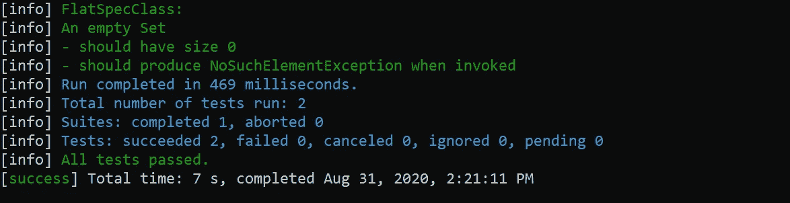
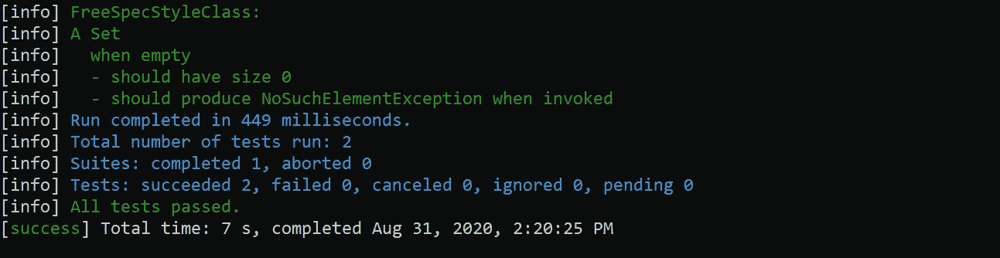
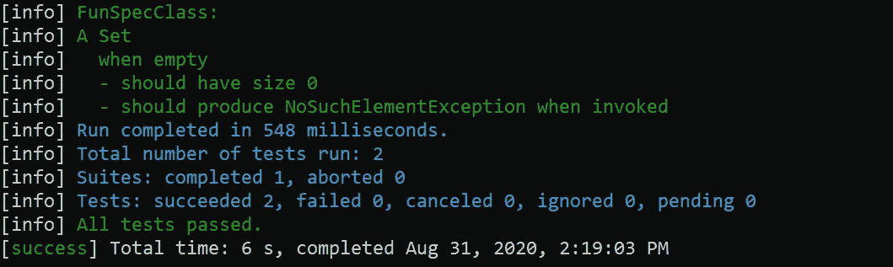
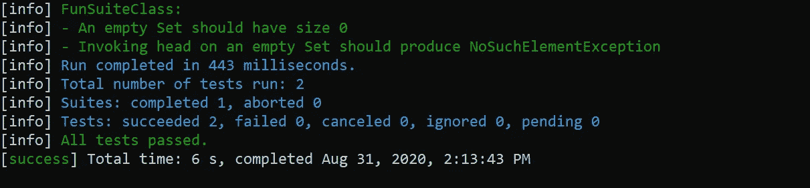
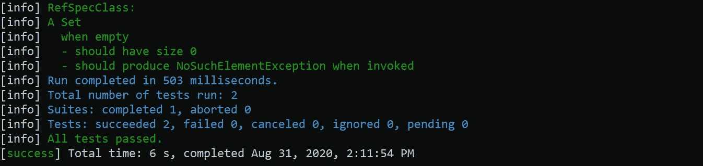
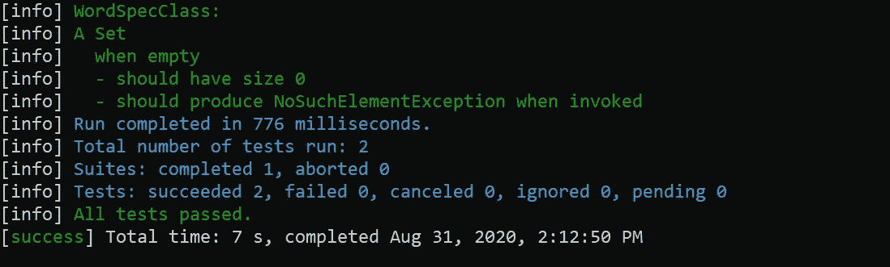

# Scala 测试风格

> 原文：<https://medium.datadriveninvestor.com/scala-testing-styles-523dd0af4c05?source=collection_archive---------1----------------------->

## SCALA 概念

## ScalaTest 支持多种编写测试用例的风格，每种风格都是为解决特定需求而设计的。

本文描述了每个选项的预期用例，以帮助您找到最适合您项目的样式。


# 先决条件

了解如何配置 scala 并运行必要的测试用例

[](https://medium.com/@singhsukhpinder/understanding-the-background-of-scala-d559b8651912) [## 了解 Scala 的背景。

### 生成、修改和执行 scala 程序及其测试用例。

medium.com](https://medium.com/@singhsukhpinder/understanding-the-background-of-scala-d559b8651912) 

# 入门指南

Scalatest 在同一测试框架下支持许多不同的测试风格，例如:

*   **XUnit:** 一种因 JUnit、NUnit 等工具而出名的测试风格。
*   **行为驱动开发(BDD):** 这里关注的是高层次的行为。
*   **基于属性的测试:自动生成测试用例的多种组合。**
*   **基于网络的测试**:使用 Selenium 之类的工具和 Akka-HTTP 之类的特定技术插件进行测试。

本文涵盖了以下测试风格:

*   扁平规格样式
*   自由规格样式
*   趣味规格风格
*   有趣的套房风格
*   参考规格样式
*   Word 规范样式

# 扁平规格样式

FlatSpec 是一种很好理解的风格。它的结构是扁平的，如此熟悉和直白。

FlatSpec 仍然是低级的，但是更加通用。

如果你不确定你想要什么，这可能是最容易开始的测试方式。

## Sbt 构建依赖关系

```
libraryDependencies += "org.scalatest" %% "scalatest-flatspec" % "3.2.0" % "test"
```

## 例子

```
import org.scalatest.flatspec.AnyFlatSpecclass FlatSpecClass extends AnyFlatSpec {"An empty Set" should "have size 0" in {
    assert(Set.empty.size == 0)
  }it should "produce NoSuchElementException when invoked" in {
    assertThrows[NoSuchElementException] {
      Set.empty.head
    }
  }
}
```

## 输出



# 自由规格样式

自由规范风格对于如何编写规范文本给出了绝对的自由(没有指导)。

## Sbt 构建依赖关系

```
libraryDependencies += "org.scalatest" %% "scalatest-freespec" % "3.2.0" % "test"
```

## 例子

```
import org.scalatest.freespec.AnyFreeSpecclass FreeSpecStyleClass extends AnyFreeSpec {"A Set" - {
    "when empty" - {
      "should have size 0" in {
        assert(Set.empty.size == 0)
      }"should produce NoSuchElementException when invoked" in {
        assertThrows[NoSuchElementException] {
          Set.empty.head
        }
      }
    }
  }
}
```

## 输出



# 趣味规格风格

FunSpec 的嵌套和结构化文本指南为编写规范风格的测试提供了一个优秀的通用选择。

[](https://www.datadriveninvestor.com/2019/01/30/getting-into-the-spirit-of-the-programming-paradigms/) [## 了解编程范式的精神|数据驱动的投资者

### 编程范式已经成为当今大数据时代软件工程师不可或缺的镜头。连同一套…

www.datadriveninvestor.com](https://www.datadriveninvestor.com/2019/01/30/getting-into-the-spirit-of-the-programming-paradigms/) 

## Sbt 构建依赖关系

```
libraryDependencies += "org.scalatest" %% "scalatest-funspec" % "3.2.0" % "test"
```

## 例子

```
import org.scalatest.funspec.AnyFunSpecclass FunSpecClass extends AnyFunSpec {describe("A Set") {
    describe("when empty") {
      it("should have size 0") {
        assert(Set.empty.size == 0)
      }it("should produce NoSuchElementException when invoked") {
        assertThrows[NoSuchElementException] {
          Set.empty.head
        }
      }
    }
  }
}
```

## 输出



# 有趣的套房风格

编写测试用例的 FunSuite 风格使得编写详细的测试名称变得毫不费力。对于 XUnit 风格的低级测试来说，这是最简单的风格。

## Sbt 构建依赖关系

```
libraryDependencies += "org.scalatest" %% "scalatest-funsuite" % "3.2.0" % "test"
```

## 例子

```
import org.scalatest.funsuite.AnyFunSuiteclass FunSuiteClass extends AnyFunSuite {test("An empty Set should have size 0") {
    assert(Set.empty.size == 0)
  }test("Invoking head on an empty Set should produce NoSuchElementException") {
    assertThrows[NoSuchElementException] {
      Set.empty.head
    }
  }
}
```

## 输出



# 参考规格样式

RefSpec 样式有助于将测试定义为函数或方法。更少的函数文字转化为更快的编译时间和更少的生成的类文件，这有助于最小化构建时间。

## Sbt 构建依赖关系

```
libraryDependencies += "org.scalatest" %% "scalatest-refspec" % "3.2.0" % "test"
```

## 例子

```
import org.scalatest.refspec.RefSpecclass RefSpecClass extends RefSpec {object `A Set` {
    object `when empty` {
      def `should have size 0` {
        assert(Set.empty.size == 0)
      }def `should produce NoSuchElementException when invoked` {
        assertThrows[NoSuchElementException] {
          Set.empty.head
        }
      }
    }
  }
}
```

## 输出



# Word 规范样式

WordSpec 风格对于如何书写文本有很强的规范性。

## Sbt 构建依赖关系

```
libraryDependencies += "org.scalatest" %% "scalatest-wordspec" % "3.2.0" % "test"
```

## 例子

```
import org.scalatest.wordspec.AnyWordSpecclass WordSpecClass extends AnyWordSpec {"A Set" when {
    "empty" should {
      "have size 0" in {
        assert(Set.empty.size == 0)
      }"produce NoSuchElementException when invoked" in {
        assertThrows[NoSuchElementException] {
          Set.empty.head
        }
      }
    }
  }
}
```

## 输出



# Github 回购

包含下面 Scala 项目中的所有测试风格。

[](https://github.com/ssukhpinder/scala-test-styles) [## ssukhpinder/scala 测试样式

### scala 的测试风格。在 GitHub 上创建一个帐户，为 ssukhpinder/scala-test-styles 开发做贡献。

github.com](https://github.com/ssukhpinder/scala-test-styles) 

感谢您的阅读。请继续访问并在你的网络中分享。请把你的想法和反馈放在评论区。

在[LinkedIn](https://www.linkedin.com/in/sukhpinder-singh-532284a2/)[insta gram](https://www.instagram.com/sukhpindersukh/)[脸书](https://www.facebook.com/sukhpinder.singh.52/) [Twitter](https://twitter.com/sukhsukhpinder) 上关注我。

**访问专家视图—** [**订阅 DDI 英特尔**](https://datadriveninvestor.com/ddi-intel)