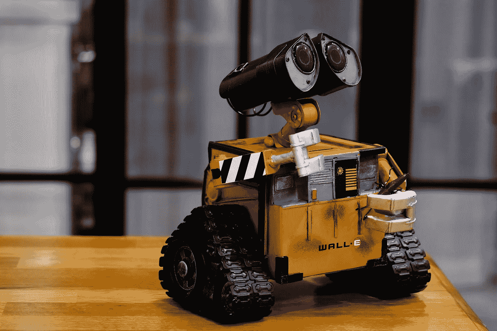

# 科幻影响研究和商业-2020 年

> 原文：<https://medium.datadriveninvestor.com/sci-fi-impacting-research-business-2020-27c196f6bf9f?source=collection_archive---------10----------------------->

为你的下一个**发明**和**商业冒险命名**的酷**数据库？**

Photo by [ray rui](https://unsplash.com/@ray30?utm_source=unsplash&utm_medium=referral&utm_content=creditCopyText) on [Unsplash](https://unsplash.com/?utm_source=unsplash&utm_medium=referral&utm_content=creditCopyText)

# 什么是科幻小说？

科幻小说，通常被称为“sci-fi”，是一种虚构文学类型，其内容富有想象力，但以科学为基础。它在很大程度上依赖科学事实、理论和原则作为其背景、人物、主题和情节主线的支持，这是它不同于幻想的地方。

> 在人工智能技术的黎明，人们无法区分现实和科幻。

因此，虽然科幻故事的故事情节和元素是虚构的，但根据科学，它们通常是可能的——或者至少是可信的。

# 所以科幻有什么大不了的？

> 除了构建一个智能程序来搜索整个搜索引擎和堆栈溢出来调试它自己的错误之外，你还会问什么？

当前的生物医学和工程突破都曾经是科幻小说，科幻不再仅仅局限于娱乐业。它影响和推动创新的程度几乎看起来不现实，以下是我个人最喜欢的一些:

# 1.仿生肢体

想象一下，你的手被你自己的父亲砍掉，然后掉到一座漂浮的建筑物的底部，然后让你失散多年的姐姐来接你。现实中不太可能，但星战电影里不会。失去一只手后，卢克·天行者得到了一只仿生手，拥有正常手的所有功能。这个场景现在比前一个更可行(《星球大战:第五集——帝国反击战》)。

来自亚特兰大佐治亚理工学院的研究人员一直在开发一种方法，让截肢者使用超声波传感器来控制他们的每个假肢手指。在电影中，天行者的假肢使用附着在他肌肉上的肌电图传感器。传感器可以切换到不同的模式，并由他的肌肉的伸缩来控制。然而，佐治亚理工学院研究人员创造的假肢**使用机器学习和超声波信号来检测手指间的细微运动。**

 [## 为什么我们投资 Totient，也就是人工智能如何帮助我们生产抗癌药物和 Covid | Data…

### 9 月 10 日，一家人工智能驱动的药物研发公司宣布与……建立关键合作伙伴关系，从此悄然出现

www.datadriveninvestor.com](https://www.datadriveninvestor.com/2020/09/13/why-we-invested-in-totient-aka-how-ai-can-help-us-produce-drugs-against-cancer-and-covid/) 

# 2.人工智能

《银翼杀手》的故事主要围绕着**合成人的想法，这需要人工智能(AI)** 。一些人可能会担心赋予计算机智能的潜在后果，这在许多科幻作品中造成了灾难性的后果。

但是**人工智能在现实中有一些非常有用的应用**。例如，**天文学家让** [**训练过的机器使用基于计算机的学习技术来寻找系外行星**](https://www.nasa.gov/press-release/artificial-intelligence-nasa-data-used-to-discover-eighth-planet-circling-distant-star) **。**在筛选美国宇航局*开普勒和 TESS* 任务收集的大量数据时， **AI 可以识别隐藏在数据中的系外行星的蛛丝马迹。**

# 3.无人驾驶汽车

在这部 1990 年的电影中，背景设定在 2084 年，《全面回忆》的主角道格拉斯·奎德(由阿诺德·施瓦辛格扮演)发现自己正处于一场科幻小说中的火星对决中。在一个场景中，奎德从坏人手中逃跑，跳进了一辆无人驾驶汽车。前面是“*强尼驾驶室*，这是汽车的车载电脑系统。Johnny 需要的只是一个地址，以便把车开到预定的目的地。

虽然无人驾驶汽车在主角大喊脏话并接管驾驶之前并未投入使用，但拥有一辆使用车载卫星导航带你去目的地的汽车的想法已经变得越来越受欢迎。处于无人驾驶汽车前沿的公司是**[***Waymo***](https://waymo.com/)**，因为他们**希望根除导致危险和致命事故的人为错误和疏忽。******

****2017 年，[美国宇航局表示](https://www.space.com/36319-nasa-helps-create-self-driving-cars.html)其有意帮助生产**无人驾驶汽车**，因为它们将**改进月球或火星等地外表面的机器人车辆技术。******

# ****为什么看科幻电影对每个人都很重要****

********

****Photo by [Tommy van Kessel 🤙](https://unsplash.com/@tommyvkessel?utm_source=unsplash&utm_medium=referral&utm_content=creditCopyText) on [Unsplash](https://unsplash.com/photos/rwfISioESQM?utm_source=unsplash&utm_medium=referral&utm_content=creditCopyText)****

****因为同样的原因，基本上所有的文学对社会都很重要。好书会激发有能力的头脑，这反过来会导致进步，无论是科学、技术、社会、政治还是经济方面的进步。****

****科幻小说向我们展示了(模拟的) ***我们可能的未来*** 的模型，因此，允许我们——作为人类，在社会中——尝试并**影响我们所有人未来的方向。通过现在行动！******

****科幻还可以处理 ***当代社会焦虑*** ，展示一些可能的解决方案(以及——回避解决方案的危险)。****

> ****任何故事的公式(或算法)都是**故事=人物+问题+试图解决的问题(或解脱)。******

****因此，通过看到问题的潜在解决方案，作为读者，我们作为一个社会，可以明智地讨论这一切，并且可以决定我们是否应该实施它们。在某些情况下——它(科幻/科幻)实际上不仅仅试图“预测”或“预言”未来，它甚至为现实生活、现实世界的科学家提供解决问题的技术方案的想法和灵感。****

> ******科幻中的一些*人物*是:厉害！令人惊奇的角色有什么不让人喜欢的？******

******科幻当，它的乌托邦能给你对未来的希望！振作起来，查理(也就是说，如果你注意的话，这几乎是一个令人沮丧的世界。参见热力学第二定律，即“就这样……(变成一团辉煌的乱麻！)".******

****科幻给了我们一个美好的小假期(或者，短暂的精神和情感假期?))从混乱的迷宫也就是:活着，今天。逃避到未来很有趣。看到未来的**总是比过去的**好，所以你的未来会比现在的*好，比现在的*好。所以，如果你真的不能穿越时空到达那里，你至少可以看一看或者读一读。有趣的逃避现实的未来！****

****它可以让你进入(兴奋的)科学领域**，**，这很棒；文学艺术也是，但那又怎样？ ***理科还是牛逼的*** 。****

****感谢您的时间和耐心。****

## ****访问专家视图— [订阅 DDI 英特尔](https://datadriveninvestor.com/ddi-intel)****