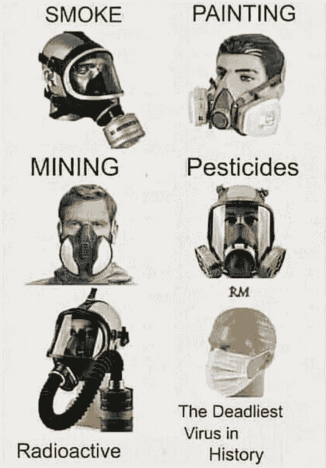

# 科学是一个过程，而不是一种信仰

> 原文：<https://medium.datadriveninvestor.com/science-is-a-process-not-a-belief-c9d1970f1425?source=collection_archive---------30----------------------->

## 科学文盲付出生命的代价

新冠肺炎疫情暴露了社会的深刻分歧，但也许没有什么比关于使用口罩预防疾病的“辩论”更具分裂性了。公众中的许多人一再未能理解口罩的目的，媒体专家经常认为口罩只是一种控制和顺从的措施。这是教育系统传达科学到底是什么的失败:一个过程，而不是一种信仰。

# 不是信仰

科学是一个反复的过程，其结论很少是确定的或绝对的。科学是研究、理论和实验之间持续不断的辩证斗争。是对真理的杂乱追求。这不是一种信念，而是一个过程。

太多的人以绝对的术语看待科学；某物“是”或“不是”，没有细微差别或分歧的余地。他们认为科学家是车库里的怪人，穿着实验服，玩着试管。他们将突破视为好莱坞式的“灵光乍现”时刻。太多的人将科学视为一种可选的“信仰”，人们可以选择相信或拒绝。

但是科学不是这样进行的。科学家通常不单独工作，而是在由来自世界各地的个人组成的团队中工作，**超越政治、宗教、语言和其他社会障碍，追求真理的普遍规律。另外，**灵光乍现的时刻很少见。进步是反复的、缓慢的，并且经常被挫折所困扰。

# 貌似有理的欺骗

对科学过程的无知让反面具者紧紧抓住“证明”他们自己错误观点的研究和医生不放，同时完全忽视了普遍的科学共识。对他们来说，**不是追求真理，而是追求自我验证**。反面具者挑选研究和声明来证实他们先前存在的信念。

举个例子，我注意到许多反口罩社区的人都在分享下面这张图，它旨在给戴口罩预防新冠肺炎的想法泼冷水。图表显示了各种行业中使用的许多不同的口罩，并将它们与相对较薄的外科口罩进行了比较。

这张图表的欺骗很巧妙，因为它提出的论点似是而非。**这里的问题是，这是一个*错误的*比较，说明了对外科口罩目的的完全误解**。在疫情期间，我们被要求佩戴的口罩并不是为了保护佩戴者，而是为了减少(而不是消除)佩戴者感染病毒的传播。

此图中的其他口罩旨在*保护佩戴者*，并且几乎 100%有效。要做到这一点，它们必须用气密密封件密封在脸上，同时仍然为佩戴者提供氧气。这使得这些面罩相对笨重和复杂。

**这些面具的目的是根本不同的，它们之间的比较完全是闹剧……**但对于一个反面具者来说，这无关紧要，相信的事实必须永远符合叙述，其他任何东西都是“假新闻”科学也是可选的。

# 不健康的怀疑

健康的怀疑是一件伟大的事情。许多人没有自动接受他们被告知的是福音，这是很好的。**但是当质疑权威时，一个人必须至少对科学过程有一些了解，并尊重那些为之奉献一生的人。**

**关于风险+进度|**

**风险+进步是一个讨论文明、人类进步和未来风险的地方。我们共同寻求确保人类进步和更美好未来的解决方案。**

**查看** [**思想实验室**](https://www.lianeon.org/p/starthere) **，通过订阅加入讨论，或查看** [**关于页面**](https://www.lianeon.org/about) **了解更多信息。**

*原载于 2020 年 10 月 7 日 https://www.lianeon.org**[*。*](https://www.lianeon.org/p/its-time-to-become-intolerant-of)*

点击订阅 DIntel [。](https://ddintel.datadriveninvestor.com/)

请访问我们的网站:[https://www.datadriveninvestor.com](https://www.datadriveninvestor.com/)

在这里加入我们的网络:[https://datadriveninvestor.com/collaborate](https://datadriveninvestor.com/collaborate)