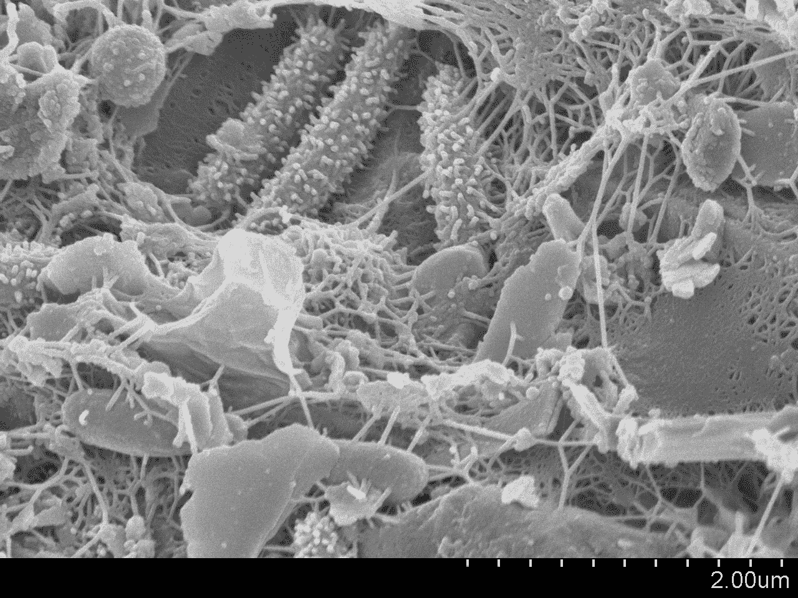
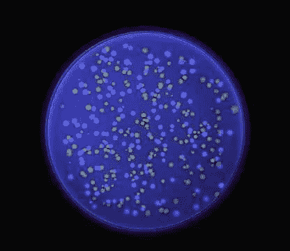

# 微生物被设计成能让喋喋不休的邻居保持沉默

> 原文：<https://medium.datadriveninvestor.com/scientists-program-microbes-to-silence-their-chatty-neighbors-90e8911b74ee?source=collection_archive---------13----------------------->

科学家们创造了一个合成的“多数感应”微生物群落，未来可能在医学上有所应用。

Bacterial microcosm growing on a petri dish. Photo courtesy of [Michael Schiffer](https://unsplash.com/photos/13UugSL9q7A).

W 帽子让一个社区，像曼哈顿的[下东区](https://en.wikipedia.org/wiki/Lower_East_Side)这样充满活力？也许是遍布街道的旁遮普、埃塞俄比亚和日本餐馆，供应美味的菜肴，或者是在 8 英尺高的空中摇摇晃晃地骑着独轮车的中年妇女，或者是聚集在象棋桌旁用浓重的纽约口音嘲笑对手的人群。

在纽约充满活力的社区中发现的同样的主题——多样性、古怪和紧张——也在我们的内脏中发挥作用。事实上，微生物生活在我们身体的各处和内部；大约 [100 万亿](https://www.ncbi.nlm.nih.gov/pmc/articles/PMC5050011/#:~:text=The%20human%20gut%20harbors%20diverse,influence%20the%20development%20of%20disease.)微生物细胞给我们的皮肤披上了一层看不见的盔甲，尽情享用我们牙齿上的糖分，并在我们胃里混乱的搅动中打转。这些微小的微生物群落虽然很有帮助，但也可能与严重的疾病有关。

几十年来，研究证明了我们外在的健康和内在的肠道微生物群之间的关联。服用一剂抗生素或改变我们在*一天中吃的食物，可以以相当戏剧性的方式扭曲我们肠道中不同细菌物种的数量——有时被称为我们的“被遗忘的器官”。[许多研究](https://www.ncbi.nlm.nih.gov/pmc/articles/PMC5933040/)表明，肥胖和二型糖尿病与数量增多的**细菌有关，例如。肠道微生物群的失衡也与许多疾病有关，包括“[自身免疫性和过敏性疾病、肥胖、炎症性肠病(IBD)和糖尿病](https://www.ncbi.nlm.nih.gov/pmc/articles/PMC5050011/)”***

******

***Bacterial communities are everywhere! This image shows one such community, as imaged on a grain of sand collected near Boston, Massachusetts. Image courtesy of the Lewis Lab at Northeastern University. Image [created by](https://www.flickr.com/photos/adonofrio/4477413475) Anthony D’Onofrio, William H. Fowle, Eric J. Stewart and Kim Lewis.***

***将细菌数量恢复到“健康”状态有望用于治疗或避免疾病。研究人员一直在测试粪便移植，即将健康人的粪便注入患者体内，以治疗克罗恩病。但是这种方法有点像使用核弹来关闭气体泄漏。如果科学家和医生有更有针对性的方法来控制这些复杂环境中的微生物物种，就像面包师调制和提炼食谱一样，那将会好得多。***

***莱斯大学生物工程学家 T21 的一项新研究表明，通过改造带有基因电路的细胞，微生物群落的成员可以相互交流，并在分子水平上协调行为。这些结果标志着在微生物群落的综合控制方面取得了有希望的进展，并可能证明在未来修改微生物组的努力中是有用的。***

***首先是细菌传播的速成班。细菌通过产生和感知环境中的化学信号来相互交流。通过感知附近的分子，细菌物种能够躲避敌人，与朋友合作，并与邻居交流。特定细菌物种分泌的分子很像一个电话号码——它帮助细胞识别和被识别。这种“细菌语言”被称为群体感应，主要是由哈佛大学的 [J .伍德兰·黑斯廷斯](https://www.pnas.org/content/104/3/693)的最初工作和普林斯顿大学的[邦妮·巴斯勒](https://scholar.princeton.edu/basslerlab/publications-0)正在进行的工作开创的。***

*** [## 技术的下一个时代|数据驱动的投资者

### 量子计算。这似乎是继人工智能之后最流行的词汇。然而，很多…

www.datadriveninvestor.com](https://www.datadriveninvestor.com/2020/07/14/the-next-era-of-tech/) 

如果细菌通过分泌和感知环境中的化学物质来相互交流，生物工程学家会劫持这些信号来控制细菌群落吗？

发表在《自然通讯》杂志上的一项新研究给出了肯定的答案。

由 Razan Alnahhas 博士领导的这项研究报告了一个“多数感应”财团，其中两株大肠杆菌*(我们肠道中发现的一种特殊类型的细菌)被设计成相互交谈和控制。*

**

*The bacteria on this agar plate have been genetically modified to express a blue or yellow fluorescent protein. When exposed to UV light, the cells glow. Image from [Clontech](http://www.ekac.org/blueyellow.html).*

*受我们手机和笔记本电脑中运行的相同类型电路的启发，阿尔纳哈斯和他的同事建立了“……一个联合体，其中[群体感应]分子用于在单细胞水平上调整基因表达，以响应联合体内的菌株比例。”*

*为了做到这一点，一个菌株被改造成产生蓝色荧光蛋白，而另一个菌株被改造成产生黄色荧光蛋白。然后，每种细菌——蓝色和黄色——都被设计成分泌一种独特的化学信号，可以被其他菌株检测到。当蓝色检测到黄色的信号时(反之亦然)，信号进入细胞，与蛋白质结合，并关闭产生信号所需的分子机器。以这种方式，蓝色抑制黄色，黄色抑制蓝色，在分子比例的共抑制舞蹈中。*

*当研究人员将两种菌株混合在一起时，他们反复展示了“多数获胜”的结果。换句话说，如果实验开始时混合物中有更多的蓝色细胞，那么这些细胞就会产生更多的蓝色信号，并关闭黄色信号，反之亦然。*

*但是为什么健谈的细胞群落首先是有用的呢？*

*通过在一个社区的细胞之间建立“陆地线路”，未来研究人员可能能够调整和纠正我们肠道中失控的细菌。根据 Alnahhas 和他的同事的说法，人们可能通过在每个细胞中编码一种毒素来实现种群控制开关。作者指出，“如果一个菌株开始过度生长并成为大多数，毒素可能会被表达并降低这个菌株的生长速度，直到再次达到平衡。”然而，为了验证这个想法，还需要进行更多的研究。*

*尽管如此，精确控制群落中微生物数量的基因电路对于未来希望改变肠道微生物群的临床医生来说可能是一个福音。将基因工程细胞植入我们体内的想法并不像你想象的那样反乌托邦——科学家已经做到了。*

*总部位于剑桥的一家名为 [SynLogic](https://www.synlogictx.com/) 的衍生公司多年来一直在开发“活体疗法”——通过基因工程治疗疾病的细胞。利用基因工程，该公司已经对细胞进行了编程，以治疗从 IBD 到淋巴瘤和苯丙酮尿症(T3)的一切疾病，苯丙酮尿症是一种遗传疾病，会导致血液和大脑中苯丙氨酸(一种氨基酸)的危险积累。这些“活药”中的一些，包括治疗苯丙酮尿症的药物，已经进入了一期临床试验，其结果发表在 2018 年底的杂志 [*【自然生物技术*](https://www.nature.com/articles/nbt.4222) 上。然而，活体药物距离广泛的临床应用还有很长的路要走。*

*尽管现有的药物对许多疾病都有希望，但这些治疗方法迄今仍局限于个别细菌种类。改造一个细菌比改造整个群落要容易得多。然而，如果科学家和医生真的希望控制住我们内脏中的复杂群体，那么他们必须学会将这些群体作为一个整体来编程，而不是作为一部分来编程。要建立一个充满活力的社区，你必须了解所有的参与者。然后，也许在遥远的未来，医生可以扮演“微生物面包师”，调整成分和完善食谱，创造更健康的肠道。**** 

****参考:****

**Alnahhas R.N .等人合成微生物群落中的多数感应。*自然通讯* **11** ，3659 (2020)。**

****关于微生物群落的更多信息:****

**[我的开放式评论](https://www.cell.com/trends/biotechnology/fulltext/S0167-7799(18)30312-3)，发表在*生物技术趋势*杂志上，关于控制微生物群落的合成生物学方法。**

**一篇关于寻找健康微生物群的*自然*展望文章。**

****更多关于活药:****

**[活药合成学](https://www.synlogictx.com/living-medicines/)。**

**[用于治疗疾病的活体药物的开放审查](https://rupress.org/jem/article/216/5/1005/121029/Microbial-therapeutics-New-opportunities-for-drug)。**

**我的[上一篇文章](https://medium.com/@NikoMcCarty/why-2018-was-the-year-of-living-medicine-af903df27722)是关于开发“活药”的公司。**

****访问专家视图—** [**订阅 DDI 英特尔**](https://datadriveninvestor.com/ddi-intel)**