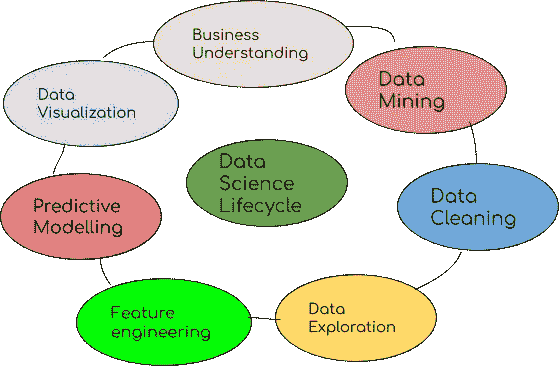
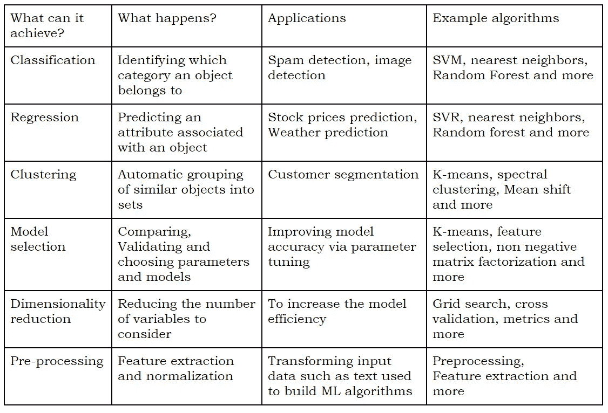

# Scikit.101

> 原文：<https://medium.datadriveninvestor.com/scikit-101-4655d62797d3?source=collection_archive---------17----------------------->

你的数据说明了很多，通过使用这个机器学习库来了解它是什么。



Image by author

数据科学生命周期有许多步骤，从了解业务到可视化数据，每个步骤都必须处理数据。数据必须经历数据科学生命周期中的许多阶段，其中必须收集、清理、形成假设、选择重要特征、训练机器学习模型、评估、预测和可视化数据。为了处理这些步骤，我们需要某些模块。从头开始构建每个流程非常耗时。因此有了图书馆。

有许多库可以处理上述过程，其中 Scikit 因其简单性和通用性而有其特殊之处。让我们探索更多关于机器学习的 Scikit learn 库。

最初它被称为 scikits.learn，由 David Cournapeau 发起的 google 代码之夏项目开始了它的生命。它的名字来源于 scipy 和工具包。当前版本是 0.23.2。从今天开始。



Image by author

上表显示了 Scikit 可以实现的功能。它还展示了 scikit 中可用的示例算法。

**数据分类**提供了所有数据的清晰图像，以及对数据如何影响预测的理解。

**回归**用于建立变量之间的关系，这有助于估计值。

**聚类**对于探索数据很有用。如果有许多案例并且没有明显的分组，可以使用聚类算法来找到自然的分组。聚类也可以作为一个有用的数据预处理步骤，以确定同质组，在此基础上建立监督模型。

**模型选择**是为了决策或优化的目的，从大量计算模型中选择模型的任务。

**降维**指减少训练数据中输入变量数量的技术。当处理高维数据时，通过将数据投影到捕捉数据“本质”的较低维子空间来降低维度通常是有用的。

[**sklearn .预处理**](https://scikit-learn.org/stable/modules/classes.html#module-sklearn.preprocessing) 模块包括缩放、居中、归一化、二值化方法。

Scikit 拥有简单高效的数据挖掘和预测数据分析工具。每个人都可以访问它，并且可以在不同的环境中重用。它建立在 NumPy，SciPy，matplotlib，pandas 上。它有丰富的 ML 所需的工具套件(数据集加载、操作、预处理管道、度量、聚类等等)。它收集了大量的 ML 算法，而代码改动很少。它保养得很好，相当可靠。它也有样本数据集，我们可以在其中尝试执行任务。

Scikit 的优势

*   自由的
*   易于使用(简单、可重复使用)
*   多功能(可访问性、效率)
*   有据可查

让我们看一个 scikit 有多简单的例子。

对于每个模型来说，一个重要的步骤是洗牌和分割数据。为了实现这一点，我们需要下面的代码(没有 scikit)

```
data = data.sample(frac=1).reset_index(drop=True) 
data_total_len = data[data.columns[0]].size data_train_frac = 0.9 
split_index = math.floor(data_total_len*data_train_frac) train_data = data.iloc[:split_index] 
eval_data = data.iloc[split_index:]
```

使用 scikit，可以使用以下代码实现洗牌和拆分:

```
from sklearn.model_selection import train_test_split 
X_train, X_test, y_train, y_test = train_test_split(all_X, all_y)
```

用 scikit 分割数据是一个简单的单行代码。上面的例子显示了 scikit 的简单性，同样，Scikit 中还有许多这样简单而强大的功能，可以实现从分析到可视化的所有数据科学计算需求，在这里可以引用[到](https://scikit-learn.org/stable/)。

**结论:**

在现实世界中，医疗诊断、语音识别、图像识别、统计套利、学习关联、分类、回归、提取、预测、金融服务等领域更需要这些技术。Sci 工具包库是数据专业人员的一个非常好的工具，因为它有许多可以简单使用的机器学习算法。

*原载于 2020 年 12 月 10 日*[](https://www.numpyninja.com/post/scikit-101)**。**