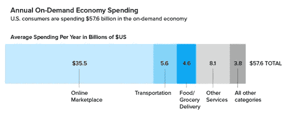
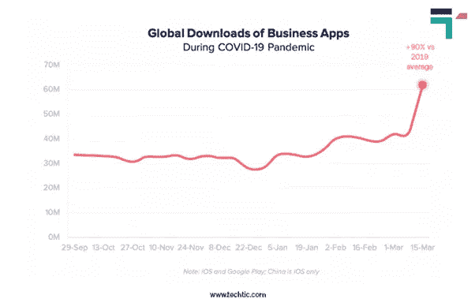
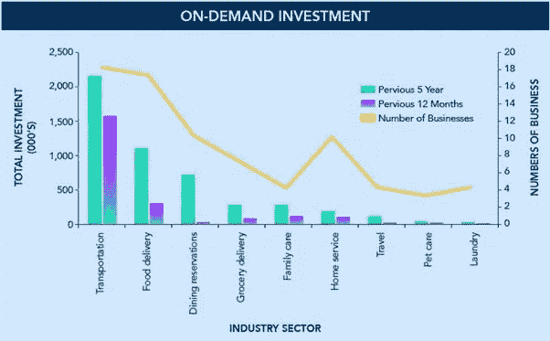

# 按需服务应用的范围及其市场趋势

> 原文：<https://medium.datadriveninvestor.com/scope-of-on-demand-service-apps-and-its-market-trends-6a9abce92211?source=collection_archive---------34----------------------->

Scope of On-Demand Service Apps

你是不是经常很忙，没有时间完成家务？

如果是，那么你并不孤单，这发生在我们所有人身上，因为我们生活在一个现代世界，生活方式忙碌，有时我们不知道如何找到时间吃饭和睡觉。然而，不断的进化、创新，以及我们寻找应对繁忙生活方式的解决方案的意愿，将我们带到了一个一切都可以在一个水龙头上完成的地方。是的，我们正在谈论按需服务应用。

我们知道这对你来说可能不容易理解，但我们的智能手机已经成为一根魔杖，我们只需点击特定的应用程序就可以完成任务。例如，你可能已经厌倦了每天打扫房间，然后赶去办公室。但是，想象一下，有一天你来到这里，看到周围一切都整洁干净。

这看起来很神奇，所有这一切都可以通过按需服务应用实现。这也是企业与移动应用开发公司合作以提升客户体验的原因。

Annual On-Demand Economy Spending

据《哈佛商业评论》报道，按需经济正在崛起，超过 2240 万消费者的支出约为 576 亿美元。此外，还可以看到在线市场充斥着大多数消费消费者，占 1630 万人，他们每年的平均消费能力为 360 亿美元。

另一个惊人的事实是，约 49%的点播消费者是千禧一代，这表明富裕阶层在这些应用上的支出更多。

# 按需服务应用风靡一时？

按需服务应用是人们的福音，帮助他们处理不同的家务。真正的重要性可以在需要的时候被认识到，因为人们可以很容易地接触到它们。现在，这些服务正迅速赶上市场趋势，因为它们被认为是其他服务中的更好选择。它们受欢迎的最大原因是专用的功能和对资源的方便访问。

今天，我们通过智能手机点击一个按钮就可以雇佣无数的服务，比如发型设计、活动策划、治疗、电工、管道工等等。行业专家已经认识到了这种需求。此外，他们都在努力弥合消费者和卖家之间的差距。

**另请阅读:** [创业公司在 COVID](https://graffersid.com/mobile-app-development-ideas-for-startups-to-thrive-amid-covid/) 中茁壮成长的移动应用开发思路

在 2020 年，按需服务应用程序，包括带来在家工作浪潮的视频通话应用程序，由于疫情而蓬勃发展。因此，你可以看到许多按需商业应用程序在使用方面名列前茅，如 Houseparty、Hangouts、Zoom 和 Microsoft。所有这些导致了 iOS 和谷歌应用程序的 6200 万次下载。

Global Download of Business Apps

此外，其他应用程序在疫情期间需求量很大；根据使用目的，从食物到清洁服务。如果你分析一下按需应用的突然崛起，它们以不同的方式帮助企业家和消费者。

对于创业者来说，即使预算很低，他们也可以在按需应用程序的帮助下尽早开始创业。它带有定制功能，可以让企业家在短期内创收。

除此之外，导致这一最大转变的三个主要因素是:

1.  为客户提供相对较低的产品和服务价格
2.  必需品的即时可用性
3.  客户和供应商之间容易沟通。

除了视频通话应用，优步和 Airbnb 也是吸引了大量投资者的点播服务应用的典范。你会惊讶地发现，Airbnb 已经获得了 24 亿美元的资金，这产生了巨大的影响。

**阅读:** [这里有一个详细的指南来创建一个像 AIRBNB 这样的应用](https://graffersid.com/detailed-guide-to-create-an-app-like-airbnb/)

在审视了人们日益增长的需求、他们的行为和认知，以及公司获得的巨额利润后，我们可以看到一场最大的经济革命正在向我们走来。以下是表明这一巨大变化的一些重要数据和事实:

1.  超过 51%的按需经济用户承认他们的利润增加了。
2.  美国人的份额更大，因为他们在按需经济中投资了 4500 万美元。
3.  按需经济正在破坏传统的制度和工人的收入。
4.  根据普华永道的报告，到 2025 年，对点播应用和网站的投资将增加到 3350 亿美元。

# 4 个市场趋势行业

On-Demand Investment

如果我们仔细观察工业部门的分歧，交通运输名列榜首，其次是食品配送和其他服务。因此，让我们详细讨论一下按需服务应用的市场趋势

按需交通的市场规模预计将在 CAGR 增长 19.8%。从 2018 年到 2025 年。

这说明了什么？交通运输业将成为风险资本家的投资来源。我们已经可以看到，像优步、Lyft 和 Ola 这样的出租车预订应用程序都将在未来提供出色的服务。

在按需服务领域，食品配送是另一个突飞猛进的行业。在疫情之后，该行业出现了巨大的增长，像 Uber Eats、Seamless、GrubHub 和 Doordash 这样的食品交付应用正在向上攀升。

除此之外，杂货递送服务在市场上也占有很大份额。在这里，一家食品交付移动应用程序开发公司必须探索机会，因为人们对这些服务应用程序的轻松体验肯定会在未来几年增加需求。

疫情之后，医疗保健一直在蓬勃发展，按需医疗保健移动应用程序已经注意到了明显的增长。当预约看起来很困难时，人们发现与医疗保健专业人员沟通很容易。

我们可以看到，风险投资家现在正在识别医疗保健行业中隐藏的机会，并正在将他们的份额发送给一家医疗保健移动应用程序开发公司。

**阅读另:** [如何创建一个在市场上蓬勃发展的健身应用](https://graffersid.com/how-to-create-a-fitness-app-that-thrives-in-the-market/)

说到家政服务，可以是任何事情，从清洁服务到雇佣美容师。随着便利的到来，对家庭服务的需求也在增加。此外，智能手机使用的增加也做出了很大贡献，你会看到一个满足你所有需求的应用程序。

正因如此，你可以看到互联网上充斥着家庭服务的移动应用创意。到 2024 年，全球在线家庭服务市场预计将增长 15748.6 亿美元。

 [## 如何用 Python |数据驱动投资者构建 Twitter 抓取应用

### 每秒发出约 6000 条推文，每天发布 5 亿条推文，普通人甚至不能…

www.datadriveninvestor.com](https://www.datadriveninvestor.com/2020/12/01/how-to-build-a-twitter-scraping-app-with-python/) 

# 一些广受欢迎的按需服务应用程序，人们为之疯狂

## 1.优步

“优步”已经成为年轻人，尤其是旅行者群体和日常通勤者中的流行词汇。即使任何人还没有使用这些服务，也知道优步是什么，从优步应用程序订购出租车意味着什么。

优步的巨大成功归功于它的可负担性、独创性、速度和便利性。它可以避免你在乘车时超支，而且速度保证了快速的接送设施。

**重要 App 功能**

*安全支付模式
*访问显示图像和其他汽车详细信息的驾驶员信息
*支持客户反馈

## 2.德里兹利

Drizly 是另一款专注于酒水配送的按需服务 app 尤其是在聚会上，人们需要几瓶冰镇啤酒。无论是派对套餐还是几瓶饮料配披萨，Drizly 都能满足您的需求。

除此之外，你还会得到各种菜肴和各种场合的饮酒套餐。这是另一个最大的因素有助于它的易用性和方便性。

**重要 App 功能**

*各种饮料，包括烈酒、啤酒和葡萄酒
* 1 小时送货时间
*比较您所在地区的价格
*提供信用卡支付

## 3.我的医疗应用

Medicash 也是一个按需服务应用程序，具有用户友好的界面和目前医疗保健行业中最好的按需服务。然而，当考虑到每次访问的费用时，它并不完全适合口袋，但它提供了一个很好的性价比。

您可以发送一个请求，只需轻点几下，就可以联系到合格的专家，并在 15 分钟内获得专家咨询。

**重要 App 功能**

*通过应用程序
帮助快速索赔*您可以注册电子邮件更新
*快速访问其他福利和健康计划
*添加受抚养子女的设施

## 4.城市鼓掌

Urban clap 或 Urban Company 是印度最大的点播服务 app。您可以预订从美容到房屋维护的上门服务。该应用程序有 50 多种服务，可以以预先批准的价格预订。

**重要 App 功能**

*方便瑜伽教练、水管工、电工、木匠
*服务包括家庭清洁、油漆、修理等家务
*专门的客户支持部门
*预先批准的价格

## 5.任务兔

TaskRabbit 是一款出色的按需服务应用程序，可以帮助您完成清洁、家具、修理和维护等家务服务。你可以联系你附近的人来帮你完成这项工作。你所需要做的就是在完成每项任务后，在应用程序中查看你的待办事项。

您还可以获得无现金支付功能来订购您想要的任何服务。在这里，你会得到高质量的服务，最大限度的安全。

**重要 App 功能**

*将您与邻居联系起来以完成工作
*允许密切监控任务
*无现金设施

## 6.安慰

不仅是食物或出租车请求，按需服务 app 也涵盖了美学目的。抚慰；顾名思义，旨在通过六种不同类型的按摩服务为您提供按需按摩服务。

然而，您将在美国的少数几个城市获得其服务，但是，您将在家中、办公室或酒店舒适地获得终极按摩服务。

您将获得专业认证的按摩师携带整个按摩套件，包括表，油，音乐，亚麻，以及更多，使您的会议值得。

**重要 App 功能**

*个人定制水疗
*联系经验丰富、技术娴熟的按摩治疗师
*全天候客户支持
*支持审查和反馈

## 7.流浪者

Rover 是另一个按需服务应用程序，众所周知，它可以提供狗狗日托和看家设施。该应用程序专注于增加便利性，它通过帮助你照顾你的宠物来让你摆脱麻烦。你将体验到处理请求的轻松和工作的伟大。

**重要 App 功能**

*全天候客户支持服务
*简单安全的支付
*推送通知

# 按需应用的范围

现在我们已经看到了未来将推动按需服务应用行业的行业，我们可以意识到消费者趋势正在发生变化。此外，按需移动应用程序开发公司有着巨大的潜力。

如果你是一个专注于这个特定领域的企业家，那么机会是巨大的。所有的机会都带来了巨大的好处，包括管理业务的经济性、安全性、可扩展性、易于跟踪的设施和灵活性。

这就是为什么几乎每个企业都计划投资一家按需定制的[移动应用开发公司](https://graffersid.com/)。

最后，我们可以说，如果您希望只需点击几下鼠标就能为您的客户提供高效的服务，那么按需应用是您的完美解决方案。

消费者倾向于通过在手机上点击来选择服务的易用性和便利性，这表明这种趋势在未来仍将存在。

如果你想享受高度可扩展的应用程序，那么你需要雇佣合适的移动应用程序开发公司。GraffersID 是著名的移动应用程序开发公司之一，为您提供满足您需求的按需应用程序解决方案。

如果您对自己的企业有一个应用程序想法，[请联系我们](https://graffersid.com/contact/)寻求专家指导！

*原载于 2020 年 12 月 23 日 https://graffersid.com***。**

## *访问专家视图— [订阅 DDI 英特尔](https://datadriveninvestor.com/ddi-intel)*