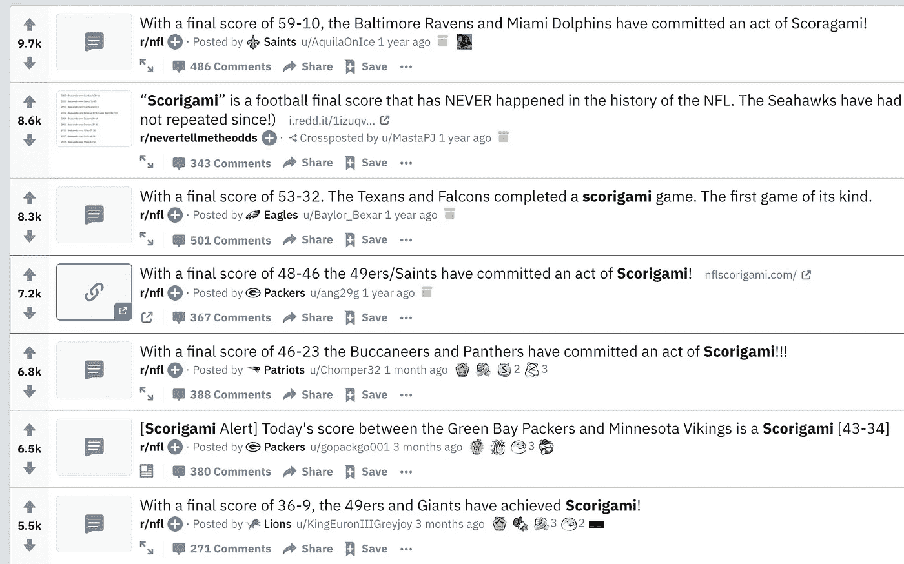
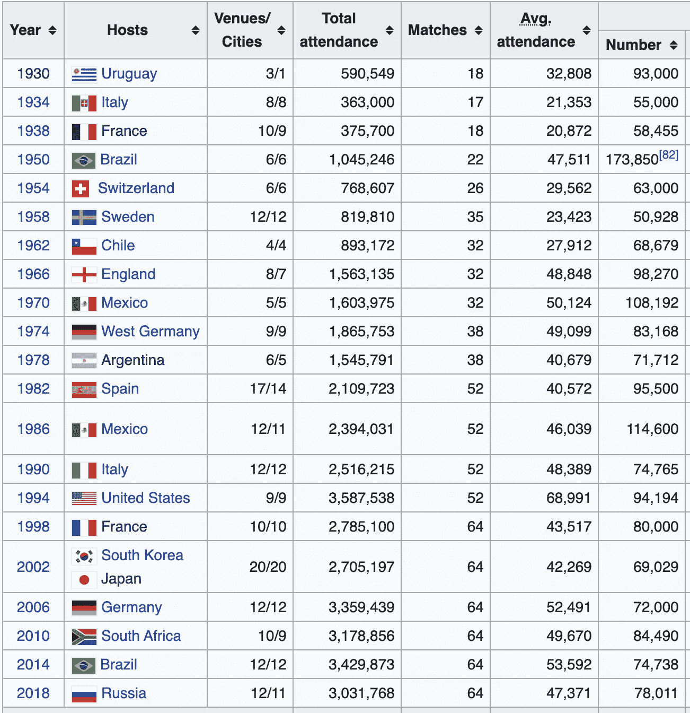
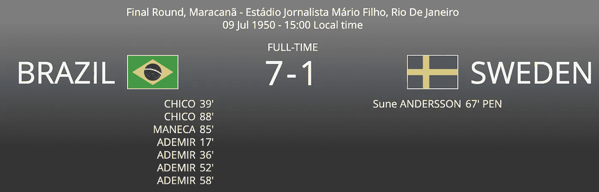
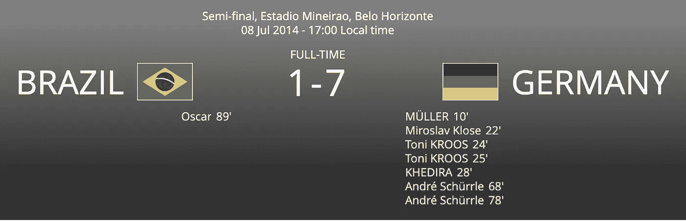

# 斯科拉里:国际足联世界杯结果的历史

> 原文：<https://medium.datadriveninvestor.com/scorigami-a-history-of-fifa-world-cup-results-c21d7cb2806f?source=collection_archive---------2----------------------->

## 巴西 1-7 负于德国是世界杯历史上最不平衡的一场比赛吗？

# Scorigami 是什么？

Scorigami 是乔恩·博伊斯想出来的一个概念。这是在 NFL 历史上从未有过的建立最终比分的**艺术**。由于美式足球得分方式的独特性，有很多得分是可能的，但从未发生过。

当 Scorigami 发生时总是令人兴奋的——超过 180，000 人关注一个专门为此目的建立的 Twitter 账户。

Source: Twitter

当你浏览 [r/NFL](https://www.reddit.com/r/nfl/) 时，你也可以看到 Scorigami 的帖子获得了很多支持票:

Source: reddit.com/r/nfl

话虽如此，我还是好奇的回答:

> Scorigami 应用到普通足球(英式足球)上是什么样子的？

因为世界上有这么多不同级别的足球联赛，所以我想把重点放在其中的精华部分，世界杯。

# **世界杯简史**

世界杯是世界上最受欢迎的体育赛事，吸引了来自世界各地超过 10 亿的观众。第一版于 1930 年发行，从那以后每四年发行一次，唯一的间断发生在第二次世界大战前后。

Source: [https://en.wikipedia.org/wiki/FIFA_World_Cup](https://en.wikipedia.org/wiki/FIFA_World_Cup)

随着时间的推移，世界杯的结构也发生了变化。这些变化分为两大类:

*   **参赛队伍数量:**随着时间的推移，参赛队伍数量逐渐增加。目前，有 32 支球队参加世界杯。

*   **游戏结构:**这些年来，锦标赛的结构发生了一些变化。目前的赛制从 1998 年开始实行，包括 48 场小组赛(每队 3 场)和 16 场淘汰赛。

# 世界杯足球赛

***图表 1:所有游戏***

大多数比赛都是低分，最受欢迎的两个比分是 1–0*(19%的比赛)*和 2–1*(16%的比赛)*。

***图表 2:分组突围 vs 淘汰赛。*** 淘汰赛阶段竞争更加激烈，队伍更加势均力敌。你可以看到比赛在淘汰赛阶段一般都比较接近，井喷较少。

回答我们最初的一个问题—***2014 年巴西以 1 比 7 输给德国，这样的惨败有过吗？*** 统计上，是的。在淘汰赛阶段有四场比赛，一个队输了 6 分或更多。

 [## 一瞬间学会数据科学！？数据驱动的投资者

### 在我之前的职业生涯中，我是一名训练有素的古典钢琴家。还记得那些声称你可以…

www.datadriveninvestor.com](https://www.datadriveninvestor.com/2020/07/23/learn-data-science-in-a-flash/) 

**然而，巴西 2014 年的失利可以被认为是国际足联历史上最糟糕的一次:**

*   **巴西是东道主。在主场观众面前以 1-7 输掉半决赛是一个巨大的打击。**
*   **这是最重要的。这场比赛是半决赛，赌注极高。**
*   这是一个现代游戏。这意味着有更多的观众见证了这场井喷。之前的一边倒的胜利发生在电视时代之前。巴西 1 比 7 的失利通过高清电视向全世界转播。

[https://www.fifa.com/worldcup/archive/france1938/matches/match/1158/#match-lineups](https://www.fifa.com/worldcup/archive/france1938/matches/match/1158/#match-lineups)

[https://www.fifa.com/worldcup/archive/france1938/matches/match/1173/#match-lineups](https://www.fifa.com/worldcup/archive/france1938/matches/match/1173/#match-lineups)

[https://www.fifa.com/worldcup/archive/brazil1950/matches/match/1189/#match-lineups](https://www.fifa.com/worldcup/archive/brazil1950/matches/match/1189/#match-lineups)

[https://www.fifa.com/worldcup/archive/brazil2014/matches/match/300186474/#match-summary](https://www.fifa.com/worldcup/archive/brazil2014/matches/match/300186474/#match-summary)

# 结论

对于 NFL 来说，Scorigami 是一个有趣的概念，在这里许多最终得分都是可能的。不仅如此，每年还有数百场比赛。

虽然足球的最终得分范围更窄，比赛也更少(每 4 年 64 场世界杯比赛)，但我认为这将是一个有趣的练习，因为在撰写本文时，谷歌没有这方面的分析结果。

# 关于数据的一个注记

这项分析的所有数据都是通过搜集国际足联的档案汇编而成的。在该分析中总共使用了 874 个匹配:

获得专家视图— [**订阅 DDI 英特尔**](https://datadriveninvestor.com/ddi-intel)