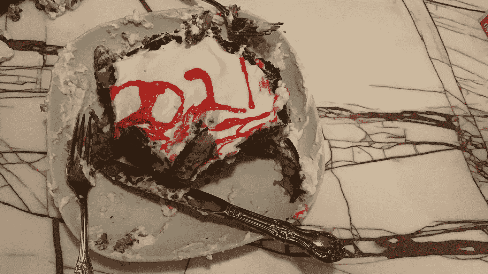
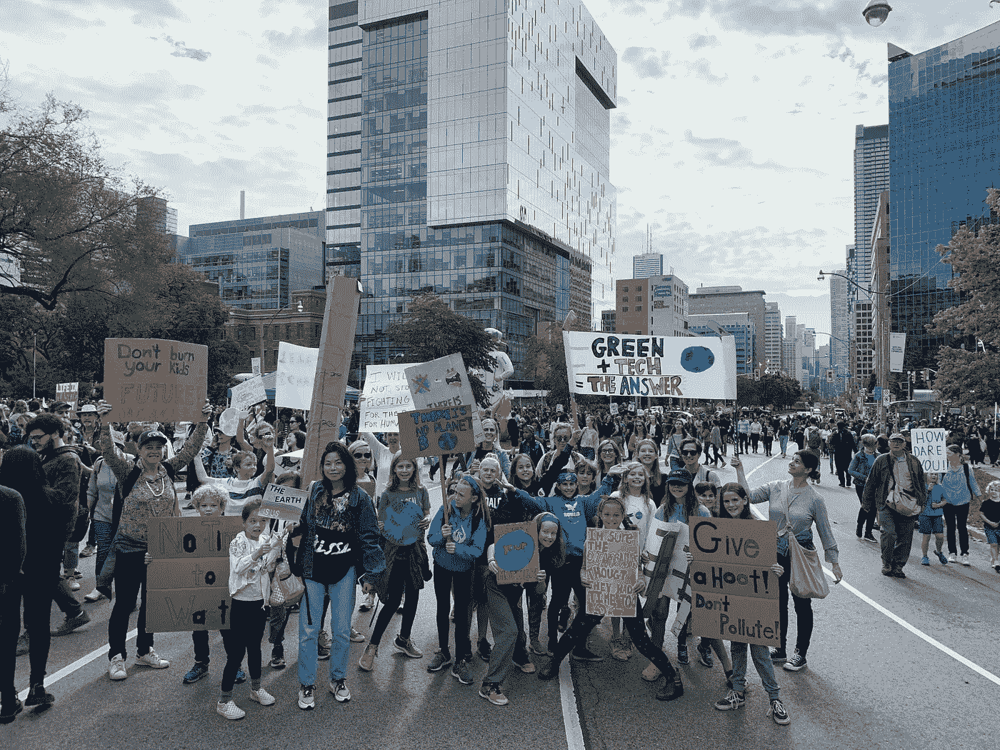

# 为了目标放弃你的决心

> 原文：<https://medium.datadriveninvestor.com/scrap-your-resolutions-for-intentions-13d4839a4892?source=collection_archive---------30----------------------->

## 以下是为什么它们更适合你的 5 个理由

今年，我自己都感到惊讶，当钟敲 12 点的时候，我居然醒了。我和女儿在厨房里……她决定做一个煎饼蛋糕，对于外行人来说，这是煎饼面糊，加一些糖和香草，在锅里烹制，然后一个叠一个。更有趣的是，你可以加入食用色素，然后裹上搅打奶油糖霜。出奇的好吃。

Yummy. You should try it sometime

当我们站在厨房里吃蛋糕时，我对即将到来的一年充满了复杂的感情。说“新年快乐”是不对的，因为我很清楚快乐不是我周围人的主导情绪——尤其是我青春期的孩子。这些都很难，但是在这个疫情期间做一个孩子是非常具有挑战性的。我们在一个新的禁闭区，只会变得更加严格。我对一月份学校停课的预测已经实现了，是的，我有健康和家人在我身边，但死亡和伤害正在我周围发生。

## 快乐不是我现在的主要情绪。

也许也是因为我仍然感觉有点被去年的事情烧焦了，所有那些我放在自己面前的重大决定。随着 2020 年新年的到来，我用一长串的决心给自己壮胆。毕竟，从理论上讲，2020 年不应该是清晰的一年，是看清事物的一年，是世界最终理清头绪并开始看清事物的一年吗？

这感觉像是很久以前的事了，但让你暂时回想一下 2019 年，这一年，一位年轻的瑞典活动家偷走了世界的心。当 Greta 于 2019 年 1 月 25 日出席在瑞士[达沃斯举行的世界经济论坛时，她向一群首席执行官和世界领导人发表了讲话，现在回想起来，她觉得自己有着惊人的先见之明:](https://www.environmentshow.com/greta-thunberg-quotes/#:~:text=But%20I%20don't%20want,fire%2C%20because%20it%20is.%E2%80%9D)

> 我不要你的希望，我不要你抱有希望。我要你恐慌，我要你感受我每天感受到的恐惧。然后我要你表现出来，我要你表现得像在危机中一样。我要你假装房子着火了，因为它确实着火了。

她的势头越来越大，到了秋天，数百万人开始关注格里塔·图恩伯格的行动，最终她赢得了《时代》杂志 2019 年年度人物的奖项。Greta 于 2019 年 9 月参加了 COP 25 Madrid，随后她登上一艘帆船前往纽约市，在联合国发表了一场激烈的演讲，在纽约[她提醒世界领导人](https://www.theguardian.com/environment/2019/sep/23/greta-thunberg-speech-un-2019-address)他们将年轻人遗弃在了一个失败的星球上。随着她的#FridaysForFuture，世界各地的主要城市爆发了大规模的抗议活动，并在 2019 年 9 月 20 日达到高潮，当时世界各地有 400 万人参加了全球气候罢工，这是历史上关注我们星球的最大规模的示威活动。

对我来说，当我看着那年秋天发生的事情，并在我的城市多伦多参加气候罢工时，感觉人们已经稍微醒来了。当我展望下一年时，2020 这个严肃的数字，它所代表的意义，吸引着我，它给了我一种轻松的感觉，我们也许，只是也许，正处于变革的风口浪尖。

Climate Strike in Toronto, September 20, 2019

## 结果证明我既错又对。

是的，在 2020 年，世界会变得更大，但不会朝着我们所想的方向发展。所以今年，我决定采取不同的方式。我不打算用*决议*这个词来标志新的一年*的开始。我需要一个更灵活的词。我需要一个愿意做这项工作，但当它没有发生时不会失望的词。我需要一些触手可及、不费吹灰之力的东西。*

这就是为什么今年我要从*意图*开始。

立意来源于一种修行。这是一个古老的讨论，最初由柏拉图严肃地讨论过。最近，它被引入到围绕冥想工作的讨论和实践中，并被现代老师如狄巴克·乔布拉推广开来。

但是对于我们面前的这一年，我们应该认识到我们什么都不知道，一切都不确定，如果说我们从去年学到了什么，那就是我们应该谦虚地面对变化...这一年，如果说我们学到了一件事，那就是在这个宇宙中有比我们强大得多的力量在起作用。所以我将不再假装我能控制这一切的某些方面。而且，我会做出对自己来说更容易的选择，因为我不知道今年会比去年更加艰难和漫长。就这样…

## 以下是我今年为你制定目标而不是决心的 5 个原因:

1.  意图只需要是想法……它是一个出现在你内心深处的想法，希望有点清晰。这不是“减掉 10 磅或者节省一分钟时间”意图只是想法，或者思想，对你有帮助。
    ***好办事，少办事。***
2.  你不会抓住意图不放……整个想法是你思考它们，然后在你创造了它们之后，把它们释放到宇宙中去。
    ***了不起，东西少。***
3.  理想情况下，意图来自美好和满足的地方，而不是缺乏的地方。试试这个开关…从“我需要少喝酒，多睡觉，”转移到更像这样的话:“我需要关注我自己的需求”，或者，“我已经拥有了丰富生活所需的一切。”
    ***如此。很多。更开心。***
4.  一旦你下定决心，放下它，走开。它们是思想，想法，只占很小的空间。所以不要把它放在一个堆满旧决心的大行李车里，随它去吧。
    ***有没有感觉到负荷变轻了？***
5.  放弃你的意图的整个想法是让宇宙为你工作。你的想法，放弃了，可以回到你身边。这不再是你的工作，而是宇宙的工作。
    ***我的日程上少了一项。决心需要时间和努力。***

那不是感觉更好吗？抛弃那份沉重的“该做什么”和“该做什么”的决心清单。释放你自己。

意图是为了帮助你自己，从内到外。一旦它们浮出水面，它们就不再是你的了。我确实对未来的一年感到乐观，但我也是一个现实主义者…我们前面还有很多路要走。新常态是模糊的、未定义的，也还没有真正出现。如果我们要从过去的一年中吸取教训，我会选择少学一些东西，多听听宇宙的声音，在攀登下一座山峰时放松自己。希望格里塔会在山顶那里。

我经常这样做。[加入我这里的](https://app.convertkit.com/forms/designers/1877461/edit)。