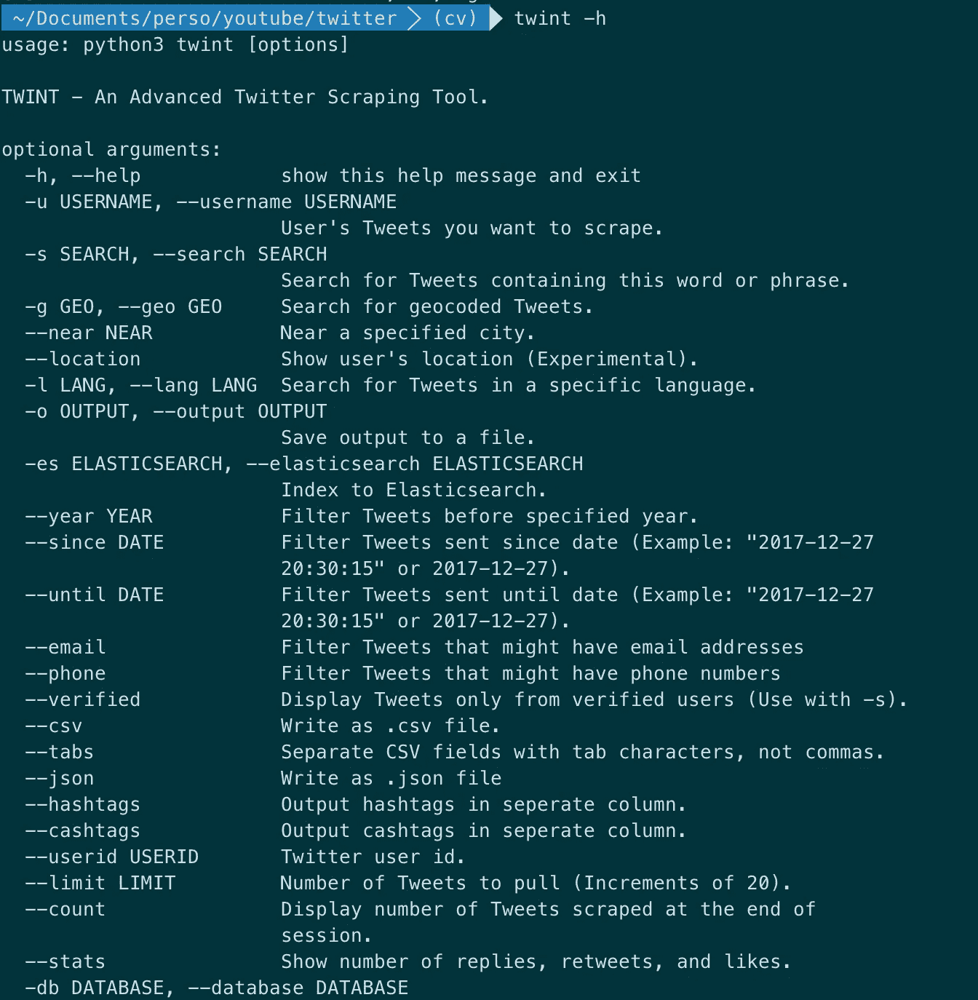
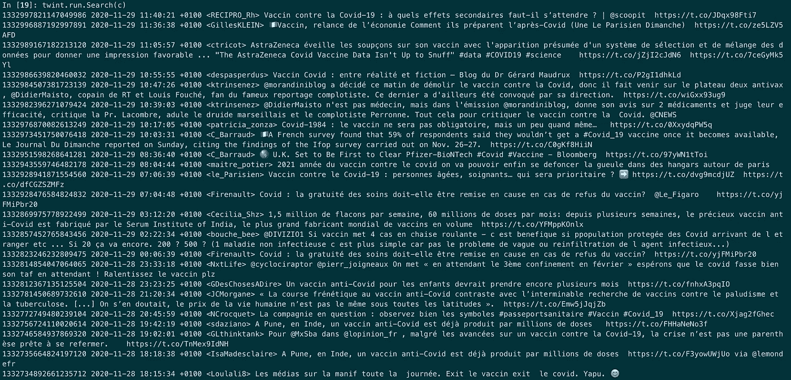
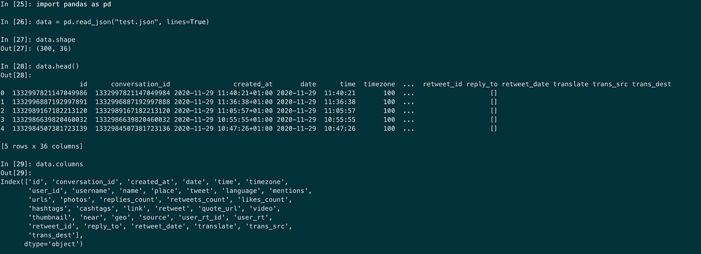

# 使用 Twint 无限制地抓取 Twitter

> 原文：<https://medium.datadriveninvestor.com/scrape-twitter-without-limits-using-twint-92509f2503cd?source=collection_archive---------1----------------------->

## 忘记 Tweepy 和 Twitter API 吧…

我一直在使用 [Tweepy](http://tweepy.readthedocs.io/) ，这是一个很棒的 Python 库，允许你连接到 Twitter API 并使用不同的服务，比如搜索或流媒体。如果您以前使用过这个库，您可能知道它很快就达到了一个极限，使您的数据收集工作大打折扣。

如果你访问 Twitter 开发者门户，你可以了解这些[费率限制](https://developer.twitter.com/en/docs/twitter-api/v1/rate-limits)。它们适用于 POST 和 GET 请求。过去困扰我个人的还有每个用户 3200 条推文的限制和每个给定搜索的 7 天历史限制。但是现在已经是旧时代了，因为镇上来了一个新玩家。

# Twint: Twitter 智能工具


Image by the author

[Twint](https://github.com/twintproject/twint/) 是一个用 Python 开发的抓取工具，用于提取和抓取特定用户的推文以及关于特定话题、标签、地理位置、语言等的推文。Twint 还能更容易获得用户的关注、喜欢和转发。

最重要的是，Twint 具有以下**主要优势:**

*   **没有费率限制。它可以获取几乎所有的推文。当我对收集关于新冠肺炎的推文感兴趣时，我设法在很长一段时间内(也许 3 或 5 个月)收集了大约 150 万条推文。这是在短短几个小时内收集的**
*   **Twint 不需要任何预先设置**。与使用 Tweepy 不同，您不需要创建一个 Twitter 应用程序(并等待 Twitter 的批准)
*   Twint 可以匿名使用**,因为它不会要求你连接到你的账户或者输入你的 API 证书**

**如果您有兴趣了解更多关于 Twint 的内容，并观看代码的现场演示，请查看我的视频教程。**

**Scraping Twitter with Twint — video by the author**

# **如何在 Python 中使用 Twint**

**首先，通过克隆 repo 并使用 master 分支来安装它。到目前为止，安装带有 PIP 的 Twint 会导致运行搜索时出现问题。**

```
git clone --depth=1 https://github.com/twintproject/twint.git
cd twint
pip3 install . -r requirements.txt
```

**有两种方法可以使用 Twint:**

****1 —从命令行(CLI)** Twint 可通过不同选项从终端调用:**

****

**Twint parameters — screenshot by the user**

**最重要的(至少对我来说，当我使用它的时候)是**

*   **`u`或`username`:你抓取的账户的用户名**
*   **`s`或`search`:你正在追踪的搜索关键词或短语**
*   **`l`或`lang`:推文的语言(“en”翻译成英语，“fr”翻译成法语，等等)**
*   **`json`:将导出设置为 JSON 格式**
*   **`csv`:将导出设置为 CSV 格式**
*   **`limit`:推文的数量**

**文档是不言自明的，您可以组合这些过滤器并发挥创造力💡。**

**以下是我在收集关于新冠肺炎和疫苗的推文时运行的一些例子。**

**我对讨论新冠肺炎疫苗的法国推特感兴趣，更准确地说，是发生在巴黎的推特。在这种情况下，使用 **lang** 和 **geo** 选项非常有用。**

```
**twint -s "covid vaccin" --lang fr --json --output data/tweets.json****twint -s "covid vaccin" -g="48.880048,2.385939,5km" --json**
```

****- g="48.880048，2.385939，5km"** 过滤巴黎周围 5km 半径范围内的推文。**

## ****2 —在 python 脚本中****

**Twint 也可以从 python 脚本中调用。您只需要将在终端中传递的参数定义为配置对象的属性。**

**这是如何做到的:**

**很简单，对吧？**

**一旦你启动这个脚本，你将会看到被拉的 tweets 在屏幕上滚动。**

****

**Pulled tweets — screenshot by the author**

**几秒钟后脚本运行完毕，您可以通过将下载的文件加载到 pandas dataframe 中来检查它。因此，您可以先检查它的形状，以及刮刀拖动的不同列(或元数据)。**

****

**Inspecting the pulled tweets — screenshot by the author**

**我们收到了 300 条推文，这就是我们所要求的。**

**通过检查数据，我们还注意到，我们不仅获得了每条推文的文本，还获得了额外的元数据，如推文的 **use_id、**language**和**creation _ date 等**

**我们通常会从 API 中获得相同的信息，尽管我们在这里没有使用它。很神奇，对吧？**

# **将 Twint 用于数据科学项目的最佳方式**

**像任何其他数据科学项目一样，成功伴随着伟大的工作流。我通常是这样做的。欢迎在评论中分享你的最佳实践:**

## **1-定义搜索范围**

**如果你在关注某个特定市场的新闻或趋势，Twint 会很有帮助。通过正确定义搜索参数(关键词、标签、日期范围、语言和地理范围),您可以立即设置搜索参数以满足您的搜索需求。**

## ****2 —将数据存储在全文搜索数据库中****

**您可以安排 Twint 定期运行——每天或每周，并更新数据库。您可以手动创建这个数据库，或者调用`elasticsearch`选项为您的数据创建一个特定的 [Elasticsearch](https://www.elastic.co/fr/downloads/elasticsearch) 索引。**

**创建一个 Elasticsearch 数据库是存储文本数据最有效的方式，因为它使全文查询运行得非常快。**

## **3-添加分析图层**

**这一部分通常与前一部分同时进行。**

**从 Twitter 中提取原始数据而不进行任何转换很少会产生可操作的结果。以下是我推荐的建立额外见解的方法。**

*   **对推文执行**文本分类:例如，这可以是情感分析，坦白地说，这是任何人在抓取推文时都能想到的自动任务。但你不必局限于此。你可以训练自己的分类器(假新闻检测器、话题检测器、讽刺识别器)并将其应用到你的推文中****
*   **应用**主题抽取技术** s:从 LDA 或 NMF 作为基线开始。在第二阶段探索文档嵌入和聚类方法**
*   ****从推文中提取命名实体**。这可能是有帮助的:想想人们的名字、组织或位置。将这些实体与推文或其主题的情感联系起来是很有趣的**
*   ****翻译推文**:作为预处理步骤，这很有帮助**
*   ****找出发微博最多的账户**。这些会给你的数据带来偏差。分别处理它们，或者在分析中忽略它们。这些帐户的典型例子可能是共享公共关系通信或广告的公司帐户**
*   **提取推文的**地理位置**并进行聚类**

## **4 —可视化数据**

**处理和存储数据后的自然步骤是可视化。**

**如果你正在使用 Elasticsearch 作为一个数据库，那你就再幸运不过了:Elasticsearch 与一个名为 Kibana 的可视化工具无缝集成，可以让你轻松构建许多图表。**

## ****5 —刷新并监控输入结果****

**在构建了一个抓取和数据处理管道并设置了 Kibana 来可视化结果之后，您的项目现在可以以半自治的方式运行了。**

**我将 semi 放在 autonomous 之前，因为您仍然需要监控结果，比如您的分类器或主题检测器的性能:这些人工制品通常需要随着时间的推移进行再培训。**

# **结论**

**Twint 是一个很好的软件包，可以构建社交媒体监控应用程序，而不会受到 Twitter API 及其速率限制的阻碍。**

**结合自然语言处理技术和可视化，Twint 也可以成为您下一个数据科学项目的解决方案。为什么不试一试呢？😉**

**黑客快乐！**